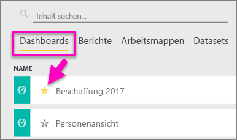
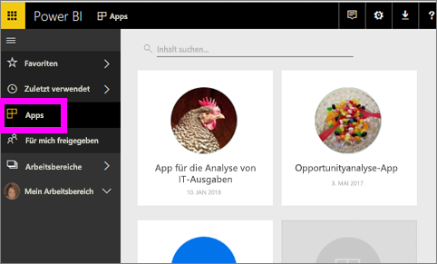
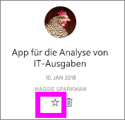
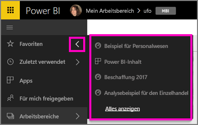
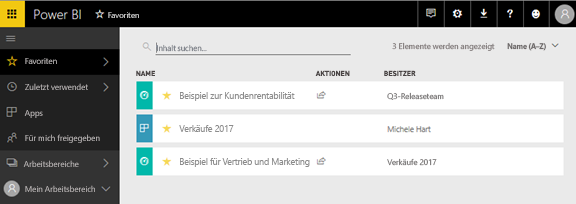
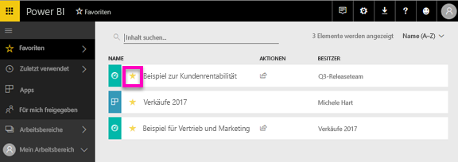

# Bevorzugte Dashboards, Berichte und Apps im Power BI-Dienst
Wenn Sie einen Inhalt als *Favorit* speichern, können Sie von jedem Arbeitsbereich aus darauf zugreifen.  Favoriten sind üblicherweise die am häufigsten aufgerufenen Inhalte.

> [!NOTE]
> Dieses Thema bezieht sich auf den Power BI-Dienst und nicht auf Power BI Desktop.
> 
> 

Sie können im Power BI-Dienst auch ein einzelnes Dashboard als [ausgewähltes Dashboard](service-dashboard-featured.md) auswählen.

## Hinzufügen eines Dashboards oder Berichts als *Favorit*
Sehen Sie sich an, wie Amanda ihrem Arbeitsbereich Favoriten hinzufügt, und befolgen Sie dann die detaillierten Anweisungen unter dem Video, um es selbst ausprobieren.

<iframe width="560" height="315" src="https://www.youtube.com/embed/G26dr2PsEpk" frameborder="0" allowfullscreen></iframe>

1. Öffnen Sie ein Dashboard oder einen Bericht, das bzw. den Sie häufig verwenden. Auch Inhalte, die für Sie freigegeben wurden, können als *Favorit* festgelegt werden.
2. Klicken Sie in der oberen rechten Ecke des Power BI-Diensts auf **Favorit** oder auf das Sternsymbol .
   
   
   
   Sie können ebenfalls ein Dashboard oder einen Bericht aus dem Arbeitsbereich **Dashboards** oder aus der Registerkarte **Berichte** der Inhaltsansicht als Favorit speichern.
   
   

## Hinzufügen einer App als *Favorit*

1. Klicken Sie im linken Navigationsbereich auf **Apps**.

  

2. Zeigen Sie auf eine App, um weitere Details anzuzeigen.  Klicken Sie auf das Sternsymbol , um diese als Favorit festzulegen.
   
   

## Arbeiten mit *Favoriten*
1. Um auf die Favoriten zuzugreifen, wählen Sie in einem beliebigen Arbeitsbereich den Flyoutpfeil rechts neben **Favoriten** aus.  Hier können Sie einen Favoriten auswählen, um diesen zu öffnen. Es werden nur fünf Favoriten aufgeführt (in alphabetischer Reihenfolge). Wenn Sie mehr als fünf Favoriten gespeichert haben, klicken Sie auf **Alle anzeigen**, um den Bildschirm „Favoriten“ zu öffnen (siehe Schritt 2). 
   
   
2. Klicken Sie zum Anzeigen **aller** als Favoriten hinzugefügten Inhalte im linken Navigationsbereich auf **Favoriten** oder auf das Symbol für Favoriten .  
   
    
   
   Von hier aus können Sie diese öffnen, die Besitzer ermitteln und Ihre Favoriten sogar für Ihre Kollegen freigeben.

## Löschen eines Inhalts als Favorit
Sie verwenden einen Bericht nicht mehr so oft wie früher?  Sie können es aus den Favoriten entfernen. Wenn Sie einen Inhalt als Favorit löschen, wird dieser aus der Favoritenliste, aber nicht aus Power BI entfernt.

1. Wählen Sie im linken Navigationsbereich **Favoriten**, um den Bildschirm **Favoriten** zu öffnen.
   
   
2. Klicken Sie auf den gelben Stern neben dem Inhalt, um diesen als Favorit zu löschen.

> **HINWEIS:** Sie können ebenfalls ein Dashboard, einen Bericht oder eine App als Favorit löschen. Öffnen Sie einfach den jeweiligen Inhalt, und klicken Sie auf das gelbe Symbol.   
> 
> 

## Nächste Schritte
[Erste Schritte mit Power BI](service-get-started.md)

[Power BI – Grundkonzepte](service-basic-concepts.md)

Weitere Fragen? [Wenden Sie sich an die Power BI-Community](http://community.powerbi.com/)

