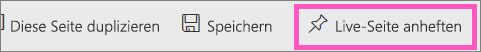
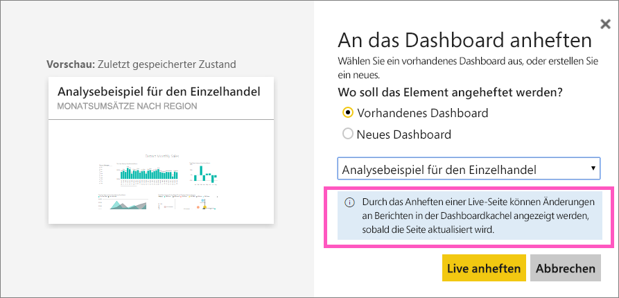

# Heften Sie eine gesamte Berichtsseite als Live-Kachel an ein Power BI-Dashboard an
Eine weitere Möglichkeit, eine neue [Dashboardkachel](service-dashboard-tiles.md) hinzuzufügen, besteht im Anheften einer ganzen Berichtsseite. Dies ist eine einfache Möglichkeit, mehr als eine Visualisierung gleichzeitig anzuheften.  Wenn Sie eine gesamte Seite anheften, werden Ihre Kacheln zudem *live* geschaltet. Sie können dann damit direkt auf dem Dashboard interagieren. Änderungen, die Sie im Berichts-Editor an Visualisierungen vornehmen, z. B. Hinzufügen eines Filters oder Ändern der im Diagramm verwendeten Felder, werden von der Dashboardkachel übernommen.  

Das Anheften von Livekacheln aus Berichten an Dashboards ist nur im Power BI-Dienst (app.powerbi.com) möglich.

> [!NOTE]
> Sie können keine Kacheln aus Berichten anheften, die mit Ihnen geteilt wurden.
> 
> 

## Anheften einer Berichtsseite
Sehen Sie, wie eine Liveberichtsseite an ein Dashboard angeheftet wird, und befolgen Sie dann die Schritte unter dem Video, um es selbst zu probieren.

<iframe width="560" height="315" src="https://www.youtube.com/embed/EzhfBpPboPA" frameborder="0" allowfullscreen></iframe>

1. Öffnen Sie einen Bericht in der [Bearbeitungsansicht](service-interact-with-a-report-in-editing-view.md).
2. Wählen Sie auf der Menüleiste **Live-Seite anheften** aus, ohne eine Visualisierung auszuwählen.
   
    
3. Heften Sie die Kachel an ein vorhandenes oder neues Dashboard an. Beachten Sie den hervorgehobenen Text: *Durch das Anheften einer Live-Seite können Änderungen an Berichten in der Dashboardkachel angezeigt werden, sobald die Seite aktualisiert wird.*
   
   * Vorhandenes Dashboard: Wählen Sie den Namen des Dashboards aus der Dropdownliste aus. Dashboards, die für Sie freigegeben wurden, werden nicht in der Dropdownliste angezeigt.
   * Neues Dashboard: Geben Sie den Namen des neuen Dashboards ein.
     
     
4. Wählen Sie **Live anheften**aus. Eine Erfolgsmeldung (in der Nähe der oberen rechten Ecke) weist Sie darauf hin, dass die Seite Ihrem Dashboard als Kachel hinzugefügt wurde.

## Öffnen Sie das Dashboard, um die angeheftete Livekachel anzuzeigen.
1. Wählen Sie im Navigationsbereich das Dashboard mit der neuen Live-Kachel aus. Hier können Sie die angeheftete Berichtsseite beispielsweise [umbenennen, verknüpfen, verschieben und in der Größe ändern](service-dashboard-edit-tile.md).  
2. Interagieren Sie mit der Live-Kachel.  Im nachstehenden Screenshot erfolgte durch Auswählen eines Balkens im Säulendiagramm eine Kreuzfilterung und Kreuzhervorhebung in den anderen Visualisierungen auf der Kachel.
   
    

## Nächste Schritte
[Dashboards in Power BI](service-dashboards.md)

Weitere Fragen? [Wenden Sie sich an die Power BI-Community](http://community.powerbi.com/)

