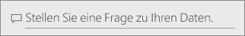
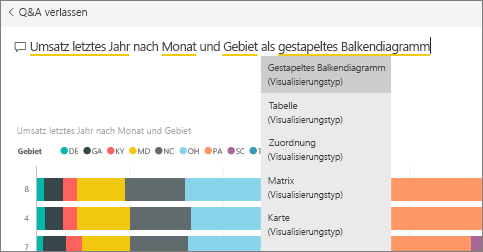
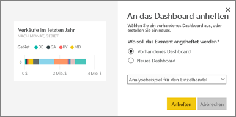
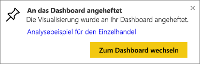
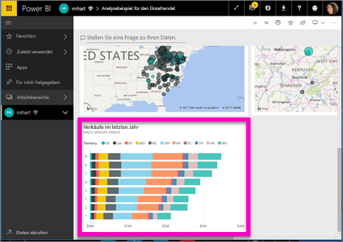
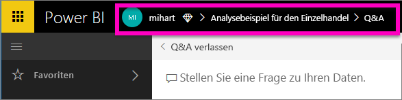

# Anheften einer Kachel an ein Dashboard aus Q&A
## Anheften einer Kachel aus Q&A
F&A ist das Power BI-Tool zur Ad-hoc-Berichterstellung. Sie möchten bestimmte Erkenntnisse gewinnen? Stellen Sie eine Frage zu den Daten und erhalten Sie eine Antwort in Form einer Visualisierung.

In dieser Vorgehensweise verwenden wir den Power BI-Dienst (app.powerbi.com), um ein Dashboard zu öffnen, eine Frage in natürlicher Sprache zu stellen, damit eine Visualisierung erstellt wird, und diese Visualisierung an ein Dashboard anzuheften. Dashboards sind in Power BI Desktop nicht verfügbar. Informationen zum Verwenden von Q&A mit anderen Power BI-Tools und -Inhalten finden Sie in der [Übersicht über Power BI Q&A](power-bi-q-and-a.md). 

Um die Schritte selbst nachzuvollziehen, öffnen Sie das [Dashboard zum Analysebeispiel für Einzelhandel](sample-retail-analysis.md).

1. Öffnen Sie ein [Dashboard](service-dashboards.md), an das mindestens eine Kachel aus einem Bericht angeheftet wurde. Wenn Sie eine Frage stellen, sucht Power BI in jedem Dataset nach der Antwort, in dem an dieses Dashboard eine Kachel angeheftet ist.  Weitere Informationen finden Sie unter [Abrufen von Daten](service-get-data.md).
2. Geben Sie oben auf Ihrem Dashboard im Fragefeld ein, was Sie über Ihre Daten wissen möchten.  
   
3. Während Sie beispielsweise „Umsatz letztes Jahr nach Monat und Gebiet“ eingeben ...  
   

   werden im Fragefeld Vorschläge angezeigt.
4. Um das Diagramm als Kachel zu Ihrem Dashboard hinzuzufügen, wählen Sie das Anheftsymbol  oben rechts im Zeichenbereich. Wenn das Dashboard für Sie freigegeben wurde, können Sie keine Visualisierungen anheften.

5. Heften Sie die Kachel an ein vorhandenes oder neues Dashboard an.

   

   * Vorhandenes Dashboard: Wählen Sie den Namen des Dashboards aus der Dropdownliste aus. Sie können nur die Dashboards innerhalb des aktuellen Arbeitsbereichs auswählen.
   * Neues Dashboard: Geben Sie den Namen des neuen Dashboards ein. Dieses wird anschließend dem aktuellen Arbeitsbereich hinzugefügt.

6. Wählen Sie **Anheften**aus.

   Eine Erfolgsmeldung (in der Nähe der oberen rechten Ecke) weist darauf hin, dass die Visualisierung als Kachel zu Ihrem Dashboard hinzugefügt wurde.  

   
7. Wählen Sie **Zum Dashboard wechseln**, um die neue Kachel anzuzeigen. Dort können Sie u.a. [die Kachel umbenennen, ihre Größe ändern, einen Link hinzufügen und sie auf dem Dashboard verschieben](service-dashboard-edit-tile.md).

   

## Zu beachtende Aspekte und Problembehandlung
* Wenn Sie anfangen, eine Frage einzugeben, sucht F&A sofort nach der besten Antwort aus allen Datasets, die mit dem aktuellen Dashboard verknüpft sind.  Das „aktuelle Dashboard“ ist das Dashboard, das in der oberen Navigationsleiste aufgeführt wird. Diese Frage wird beispielsweise im Dashboard **Analysebeispiel für den Einzelhandel** gestellt, das Teil des App-Arbeitsbereichs **mihart** ist.

  
* **Woher weiß F&A, welche Datasets verwendet werden sollen**?  Q&A hat Zugriff auf alle Datasets, die über mindestens eine an das Dashboard angeheftete Visualisierung verfügen.

* **Wird das Fragefeld nicht angezeigt**? Wenden Sie sich an den Power BI-Administrator. Der Administrator kann Q&A deaktivieren.

## Nächste Schritte
[Umbenennen, Ändern der Größe und Position, Hinzufügen eines Hyperlinks und mehr](service-dashboard-edit-tile.md)    
[Anzeigen einer Dashboardkachel im Fokusmodus](service-focus-mode.md)     
[Zurück zu Q&A in Power BI](power-bi-q-and-a.md)  
Weitere Fragen? [Wenden Sie sich an die Power BI-Community](http://community.powerbi.com/)
