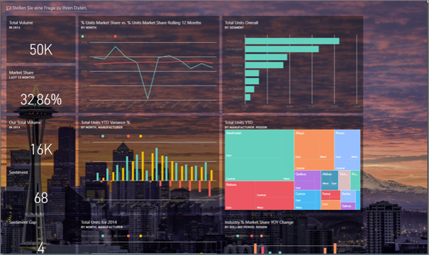
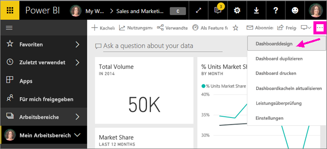
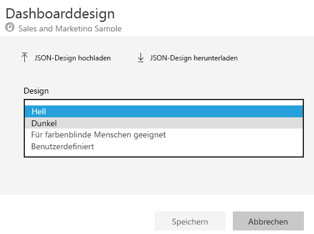
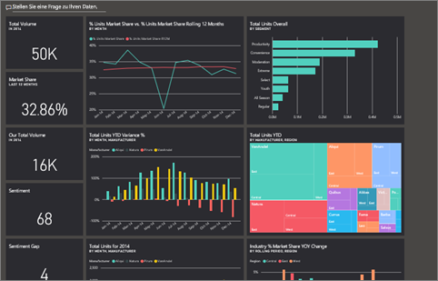
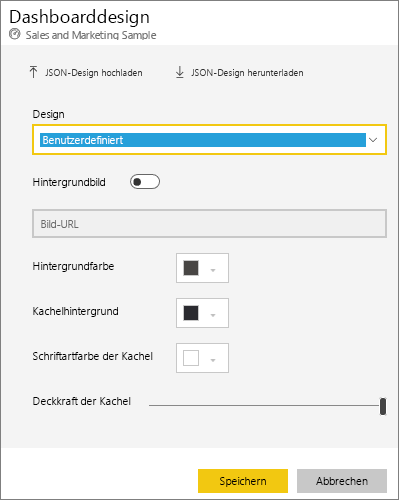
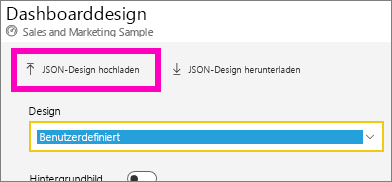
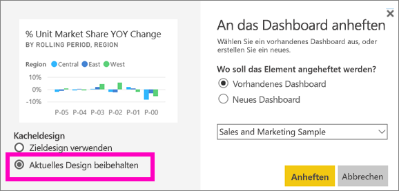
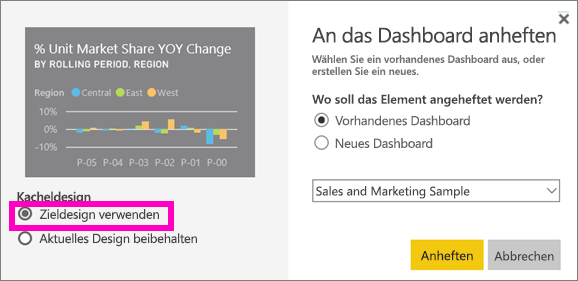

# Verwenden von Dashboarddesigns im Power BI-Dienst
Mit **Dashboarddesigns** können Sie einem Dashboard ein Farbschema zuweisen (Unternehmensfarben, Farben der Jahreszeit oder beliebige andere Farben). Wenn Sie ein **Dashboarddesigns** zuweisen, verwenden alle Visualisierungen des Dashboards die Farben des gewünschten Farbschemas (mit wenigen Ausnahmen, siehe unten).

Wenn Sie die Farben der Berichtsvisuals auf dem Dashboard ändern, wirkt sich das nicht auf die Visuals im Bericht aus. Wenn Sie Kacheln eines Berichts anheften, [auf die bereits ein Berichtsdesign angewendet wurde](desktop-report-themes.md), können Sie sich entscheiden, ob Sie das aktuelle Design beibehalten oder das Dashboarddesign verwenden möchten.

## Voraussetzungen
* Um die Schritte selbst nachzuvollziehen, öffnen Sie das [Dashboard zum Sales and Marketing sample](sample-datasets.md).

## Funktionsweise von Dashboarddesigns
Öffnen Sie zunächst ein Dashboard, das Sie erstellt haben (oder das Sie bearbeiten dürfen) und das Sie anpassen möchten. Klicken Sie auf die Auslassungspunkte („...“) und dann auf **Dashboarddesign**. 

Wählen Sie im sich öffnenden Dashboardbereich ein vordefiniertes Design aus.  Im Beispiel unten wurde **Dunkel** ausgewählt.

## Erstellen eines benutzerdefinierten Designs

Das Standarddesign für Power BI-Dashboards ist **Hell**. Wenn Sie die Farben anpassen oder Ihr eigenes Design erstellen möchten, klicken Sie im Dropdownmenü auf **Benutzerdefiniert**. 

Erstellen Sie anhand der benutzerdefinierten Optionen Ihr eigenes Dashboarddesign. Wenn Sie ein Hintergrundbild hinzufügen möchten, wird empfohlen, dass dieses mindestens eine Auflösung von 1920×1080 aufweist. Um ein Bild als Hintergrund zu verwenden, laden Sie das Bild auf eine öffentliche Website hoch, kopieren die URL und fügen sie in das Feld **Bild-URL** ein. 

### Verwenden von JSON-Designs
Alternativ können Sie ein benutzerdefiniertes Design erstellen, indem Sie eine JSON-Datei hochladen, in der die Einstellungen für alle Farben, die Sie auf Ihrem Dashboard verwenden möchten, enthalten sind. In Power BI Desktop verwenden Berichtsersteller JSON-Dateien, um [Designs für Berichte zu erstellen](desktop-report-themes.md). Die gleichen JSON-Dateien können für Dashboards hochgeladen werden, oder Sie können den [Designkatalog](https://community.powerbi.com/t5/Themes-Gallery/bd-p/ThemesGallery) in der Power BI-Community durchsuchen und JSON-Dateien von dort hochladen. 

Sie können Ihr benutzerdefiniertes Design auch als JSON-Datei speichern und mit anderen Dashboarderstellern teilen. 

### Verwenden eines Designs aus dem Designkatalog

Genauso wie bei den benutzerdefinierten und integrierten Optionen werden die Farben automatisch auf alle Kacheln auf dem Dashboard angewendet, wenn ein Design hochgeladen wird. 

1. Zeigen Sie auf ein Design, und klicken Sie auf **Bericht anzeigen**.

    

2. Scrollen Sie nach unten, und suchen Sie den Link zur JSON-Datei.  Klicken Sie auf das Downloadsymbol, und speichern Sie die Datei.

    

3. Kehren Sie zum Power BI-Dienst zurück, und wählen Sie im Fenster „Dashboarddesign“ **JSON-Schema hochladen** aus.

    

4. Navigieren Sie zum Speicherort der gespeicherten JSON-Designdatei, und klicken Sie auf **Öffnen**.

5. Klicken Sie auf der Seite „Dashboarddesign“ auf **Speichern**. Das neue Design wird auf Ihr Dashboard angewendet.

    

## Überlegungen und Einschränkungen

* Wenn das Design Ihres Berichts vom Dashboarddesign abweicht, können Sie auswählen, ob für die Visualisierung das aktuelle Design oder das Dashboarddesign verwendet werden soll, um trotz verschiedener Quellen einheitliche Visualisierungen zu erzielen. Wenn Sie eine Kachel auf einem Dashboard anheften, wählen Sie **Aktuelles Design beibehalten** aus, um das Berichtsdesign beizubehalten. Das Visual auf dem Dashboard behält das Berichtsdesign mit Einstellung für die Transparenz bei. 

    Sie sehen Optionen für das **Kacheldesign** nur dann, wenn Sie einen Bericht in Power BI Desktop erstellt, [ein Berichtsdesign hinzugefügt](desktop-report-themes.md), und dann den Bericht im Power BI-Dienst veröffentlicht haben. 

    

    Heften Sie die Kachel erneut an, und wählen Sie **Use dashboard theme** (Dashboarddesign verwenden) aus.

    

* Dashboarddesigns können nicht auf angeheftete Live-Berichtsseiten, iframe-Kacheln, SSRS-Kacheln oder Bilder angewendet werden.
* Dashboarddesigns können auf mobilen Geräten angezeigt werden. Ein Dashboarddesign können Sie allerdings nur im Power BI-Dienst erstellen. 
* Benutzerdefinierte Dashboarddesigns können nur auf angeheftete Kacheln aus Berichten angewendet werden. 

