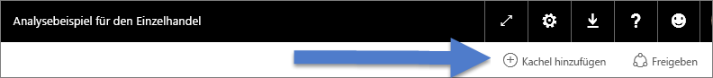
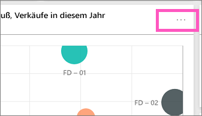
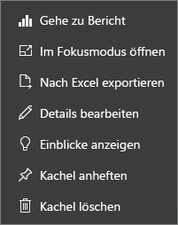

# Einführung in Dashboardkacheln für Power BI-Designer

Eine Kachel ist eine Momentaufnahme Ihrer Daten, die an das Dashboard geheftet ist. Eine Kachel kann u.a. aus einem Bericht, einem Dataset, einem Dashboard, dem Q&A-Feld, Excel-Berichten und SSRS-Berichten (SQL Server Reporting Services) erstellt werden.  Der Screenshot zeigt viele verschiedene Kacheln, die an ein Dashboard angeheftet sind.

Dashboards und Dashboardkacheln sind ein Feature des Power BI-Diensts und nicht von Power BI Desktop. Auf mobilen Geräten können Sie keine Dashboards erstellen, aber Sie können sie [anzeigen und freigeben](mobile-apps-view-dashboard.md).

Über das Anheften hinaus können mithilfe der Option [Kachel hinzufügen](service-dashboard-add-widget.md) eigenständige Kacheln direkt auf dem Dashboard erstellt werden. Eigenständige Kacheln können Textfelder, Bilder, Videos, Streamingdaten und Webinhalte enthalten.

Benötigen Sie Hilfe, um die Grundkomponenten zu verstehen, aus denen Power BI besteht?  Weitere Informationen finden Sie unter [Power BI – Grundkonzepte](service-basic-concepts.md).

> [!NOTE]
> Wenn sich die ursprüngliche Visualisierung ändert, die zum Erstellen der Kachel verwendet wurde, ändert sich die Kachel nicht.  Wenn Sie beispielsweise ein Liniendiagramm aus einem Bericht angeheftet haben und dann das Liniendiagramm in ein Balkendiagramm ändern, wird auf der Dashboardkachel weiterhin ein Liniendiagramm angezeigt. Die Daten werden aktualisiert, der Visualisierungstyp hingegen nicht.
> 
> 

## Anheften einer Kachel aus...
Es gibt viele verschiedene Möglichkeiten, eine Kachel zu Ihrem Dashboard hinzuzufügen (anzuheften). Kacheln können angeheftet werden aus:

* [Power BI Q&A](service-dashboard-pin-tile-from-q-and-a.md)
* [einem Bericht](service-dashboard-pin-tile-from-report.md)
* [einem anderen Dashboard](service-pin-tile-to-another-dashboard.md)
* [einer Excel-Arbeitsmappe auf OneDrive for Business](service-dashboard-pin-tile-from-excel.md)
* [Power BI Publisher für Excel](publisher-for-excel.md)
* [Schnelle Einblicke](service-insights.md)
* [Reporting Services](https://docs.microsoft.com/sql/reporting-services/pin-reporting-services-items-to-power-bi-dashboards)

Eigenständige Kacheln für Bilder, Textfelder, Videos, Streamingdaten und Webinhalte können mit [Kachel hinzufügen](service-dashboard-add-widget.md) direkt auf dem Dashboard erstellt werden.

  

## Interagieren mit Kacheln in einem Dashboard
### Verschieben und Ändern der Größe einer Kachel
Wählen Sie eine Kachel aus, und [verschieben Sie sie auf dem Dashboard](service-dashboard-edit-tile.md). Zeigen Sie auf eine Kachel, und wählen Sie den Ziehpunkt  aus, um ihre Größe zu ändern.

### Zeigen Sie auf eine Kachel, um Aussehen und Verhalten zu ändern.
1. Zeigen Sie auf die Kachel, um die Auslassungspunkte anzuzeigen.
   
    
2. Wählen Sie die Auslassungspunkte (...) aus, um das Aktionsmenü zu öffnen.
   
    
   
    Hier können Sie Folgendes tun:
   
   * [Den Bericht öffnen, mit dem diese Kachel erstellt wurde ](service-reports.md)   
   
   * [Das Arbeitsblatt öffnen, mit dem diese Kachel erstellt wurde ](service-reports.md)   
     
    * [Im Fokusmodus anzeigen ](service-focus-mode.md)   
     * [Die auf der Kachel verwendeten Daten exportieren](visuals/power-bi-visualization-export-data.md) 
     * [Titel und Untertitel bearbeiten, Link hinzufügen](service-dashboard-edit-tile.md) 
     * [Einblicke ausführen ](service-insights.md) 
     * [Anheften der Kachel an ein anderes Dashboard](service-pin-tile-to-another-dashboard.md)
       
     * [Kachel entfernen](service-dashboard-edit-tile.md)
     
3. Wählen Sie zum Schließen des Aktionsmenüs eine leere Fläche im Zeichenbereich aus.

### Auswählen einer Kachel
Wenn Sie eine Kachel auswählen, hängt das, was anschließend geschieht, davon ab, wie die Kachel erstellt wurde. Wenn sie einen [benutzerdefinierten Link](service-dashboard-edit-tile.md) aufweist, werden Sie an das Ziel des Links weitergeleitet, wenn Sie auf die Kachel klicken. Andernfalls gelangen Sie nach Auswählen der Kachel zu dem Bericht, der Excel Online-Arbeitsmappe, dem lokalen Reporting Services-Bericht oder der Q&A-Frage, die zum Erstellen der Kachel verwendet wurden.

> [!NOTE]
> Eine Ausnahme sind Videokacheln, die direkt auf dem Dashboard mit **Kachel hinzufügen** erstellt wurden. Bei Auswählen einer Videokachel (die auf diese Weise erstellt wurde) wird das Video direkt auf dem Dashboard wiedergegeben.   
> 
> 

## Zu beachtende Aspekte und Problembehandlung

* Wenn der Bericht, der zum Erstellen der Visualisierung verwendet wurde, nicht gespeichert wurde, löst das Auswählen der Kachel keine Aktion aus.
* Wenn die Kachel über eine Arbeitsmappe in Excel Online erstellt wurde, benötigen Sie mindestens Leseberechtigungen für die Arbeitsmappe. Andernfalls können Sie durch Auswählen der Kachel die Arbeitsmappe in Excel Online nicht öffnen.
* Angenommen, Sie erstellen eine Kachel mit **Kachel hinzufügen** direkt auf dem Dashboard und legen einen benutzerdefinierten Hyperlink für diese fest. Wenn dies der Fall ist, wird die jeweilige URL geöffnet, wenn Sie den Titel, den Untertitel oder die Kachel auswählen. Standardmäßig erfolgt ansonsten bei Auswahl einer Kachel, die direkt auf dem Dashboard für ein Bild, einen Webcode oder ein Textfeld erstellt wurde, keine weitere Aktion.
* Wenn Sie über keine Berechtigungen für den Bericht in Reporting Services verfügen, wird eine Seite angezeigt, die Sie darauf hinweist, dass Sie keine Zugriffsberechtigung haben, wenn Sie auf eine Kachel klicken, die über einen Reporting Services-Bericht erstellt wurde (rsAccessDenied).
* Wenn Sie keinen Zugriff auf das Netzwerk mit dem Reporting Services-Server haben, wird eine Seite angezeigt, die Sie darauf hinweist, dass der Server nicht gefunden wurde, wenn Sie auf eine Kachel klicken, die über einen Reporting Services-Bericht erstellt wurde (HTTP 404). Ihr Gerät muss Netzwerkzugriff auf den Berichtsserver besitzen, um den Bericht anzeigen zu können.
* Wenn sich die ursprüngliche Visualisierung ändert, die zum Erstellen der Kachel verwendet wurde, ändert sich die Kachel nicht.  Wenn Sie beispielsweise ein Liniendiagramm aus einem Bericht anheften und dann das Liniendiagramm in ein Balkendiagramm ändern, wird auf der Dashboardkachel weiterhin ein Liniendiagramm angezeigt. Die Daten werden aktualisiert, der Visualisierungstyp hingegen nicht.

## Nächste Schritte
[Erstellen einer Karte (Kachel für große Zahlen) für das Dashboard](power-bi-visualization-card.md)

[Dashboards in Power BI](service-dashboards.md)  

[Datenaktualisierung](refresh-data.md)

[Power BI – Grundkonzepte](service-basic-concepts.md)

[Exportieren einer Kachel nach PowerPoint](http://blogs.msdn.com/b/powerbidev/archive/2015/09/28/integrating-power-bi-tiles-into-office-documents.aspx)

[Anheften von Reporting Services-Elementen an Power BI-Dashboards](https://msdn.microsoft.com/library/mt604784.aspx)

Weitere Fragen? [Wenden Sie sich an die Power BI-Community](http://community.powerbi.com/)

