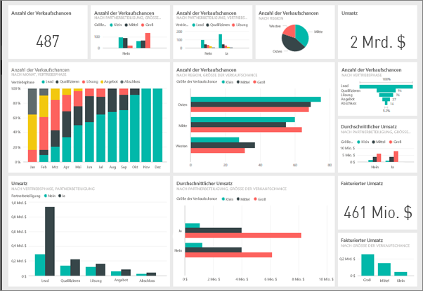
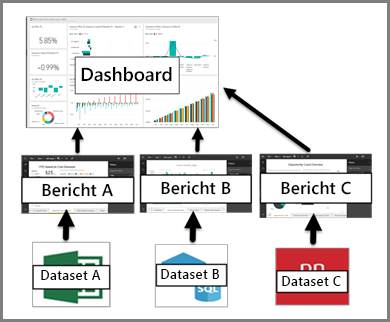

# Einführung in Dashboards für Power BI-Designer

Ein Power BI-***Dashboard*** ist eine einzelne Seite (häufig als Canvas bezeichnet), auf der mithilfe von Visualisierungen Informationen veranschaulicht werden. Wegen der Beschränkung auf eine Seite erkennen Sie ein gut gestaltetes Dashboard daran, dass die Informationsdarstellung auf ihre wichtigsten Punkte verdichtet ist. Leser können verwandte Berichte anzeigen, um Details zu erfahren.

Dashboards sind ein Feature des Power BI-Diensts. Sie sind in Power BI Desktop nicht verfügbar. Auf mobilen Geräten können Sie keine Dashboards erstellen, aber Sie können sie [anzeigen und freigeben](mobile-apps-view-dashboard.md).

## Dashboard-Grundlagen 

Die Visualisierungen auf dem Dashboard heißen *Kacheln*. Kacheln werden aus Berichten an ein Dashboard *angeheftet*. Wenn Sie mit Power BI noch nicht vertraut sind, lesen Sie den Artikel [Grundkonzepte des Power BI-Diensts](service-basic-concepts.md).

> [!IMPORTANT]
> Sie benötigen eine [Power BI Pro](service-free-vs-pro.md)-Lizenz, um Dashboards zu erstellen.

Die Visualisierungen eines Dashboards stammen aus Berichten. Jeder Bericht basiert auf einem Dataset. Sie können sich ein Dashboard als Fenster zu den zugrunde liegenden Berichten und Datasets vorstellen. Wenn Sie eine Visualisierung auswählen, gelangen Sie zu dem Bericht (und damit dem Dataset), auf dem sie basiert.

## Vorteile von Dashboards
Mit Dashboards können Sie die Entwicklung Ihres Geschäfts verfolgen und die wichtigsten Metriken immer im Auge behalten. Jede Visualisierung eines Dashboards kann auf einem oder vielen Datasets, auf einem einzelnen Bericht oder zahllosen Berichten basieren. Ein Dashboard fasst lokale und Clouddaten zusammen und bietet eine konsolidierte Ansicht – unabhängig vom Speicherort der Daten.

Ein Dashboard ist nicht nur schön anzusehen. Es ist ausgesprochen interaktiv, und die Kacheln aktualisieren sich automatisch, wenn sich die zugrunde liegenden Daten ändern.

## Vergleich: Dashboards und Berichte
[Berichte](service-reports.md) und Dashboards sehen ähnlich aus, da sie beide Canvases sind, die mit Visualisierungen gefüllt sind. Es gibt aber wichtige Unterschiede.

| **Eigenschaften** | **Dashboards** | **Berichte** |
| --- | --- | --- |
| Pages |Eine Seite |Eine oder mehrere Seiten |
| Datenquellen |Ein oder mehrere Berichte und ein oder mehrere Datasets pro Dashboard |Ein Dataset pro Bericht |
| In Power BI Desktop verfügbar |Nein | Berichte können in Power BI Desktop erstellt und angezeigt werden |
| Abonnieren |Dashboards können abonniert werden. |Berichtsseiten können abonniert werden. |
| Filter |Keine Filter, keine Slices |Viele Filter, Hervorhebungen und Slices |
| Empfohlen |Ein Dashboard kann als „ausgewähltes“ Dashboard festgelegt werden. |Ein ausgewählter Bericht kann nicht erstellt werden. |
| Favorit | Dashboards können als *Favoriten* festgelegt werden. | Berichte können als *Favoriten* festgelegt werden.
| Benachrichtigungen festlegen |Unter bestimmten Umständen für Dashboardkacheln verfügbar |Über Berichte nicht verfügbar |
| Abfragen in natürlicher Sprache (Q&A) |In Dashboards verfügbar | In Berichten verfügbar |
| Zugrunde liegende Dataset-Tabellen und Felder sichtbar |Nein. Exportieren von Daten, aber Tabellen und Felder im Dashboard nicht sichtbar |Ja. Tabellen, Felder und Werte des Datasets sichtbar |

## Nächste Schritte
* Machen Sie sich mit Dashboards vertraut, indem Sie sich eine Tour durch eines unserer [Beispiel-Dashboards](sample-tutorial-connect-to-the-samples.md) ansehen.
* Wichtige Informationen über [Dashboardkacheln](service-dashboard-tiles.md)
* Sie möchten eine bestimmte Dashboardkachel im Auge behalten und eine E-Mail erhalten, wenn ein bestimmter Grenzwert erreicht wird? [Erstellen Sie Datenwarnungen auf Kacheln](service-set-data-alerts.md).
* Mit [Power BI Q&A](power-bi-tutorial-q-and-a.md) können Sie Fragen zu Ihren Daten stellen und erhalten eine Antwort in Form einer Visualisierung.
