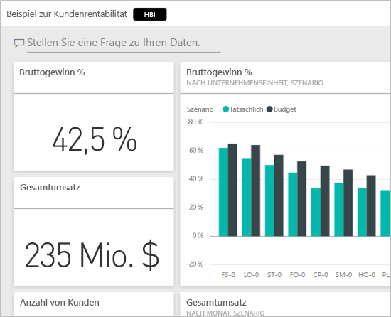
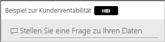
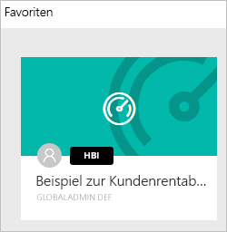
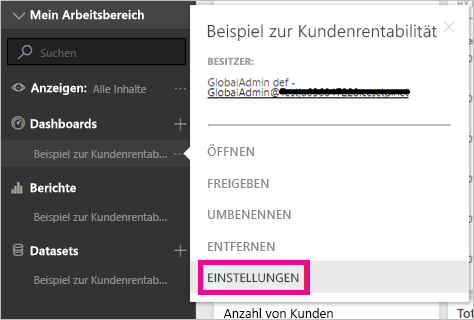
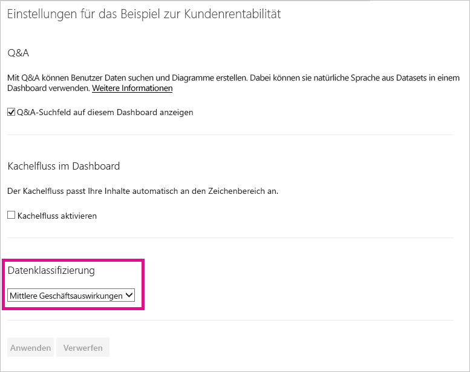
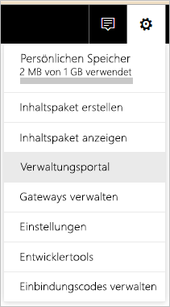
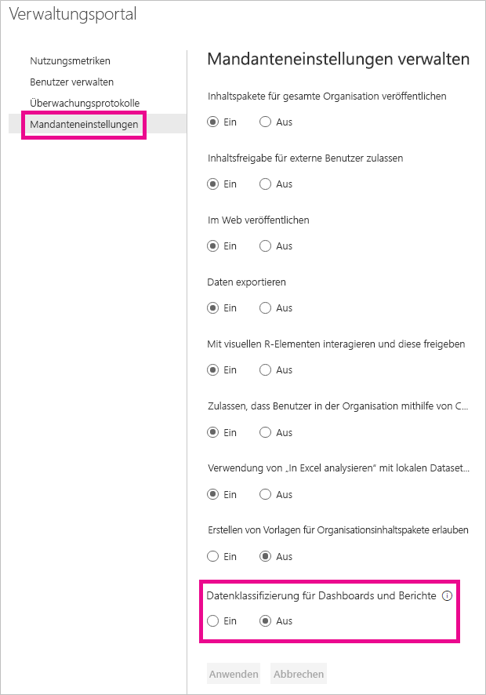
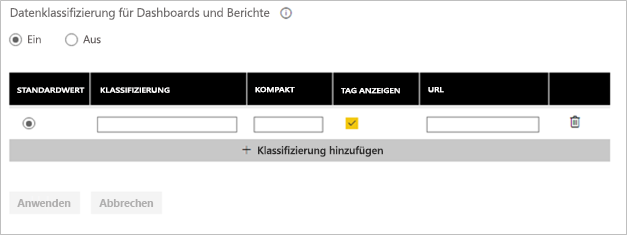
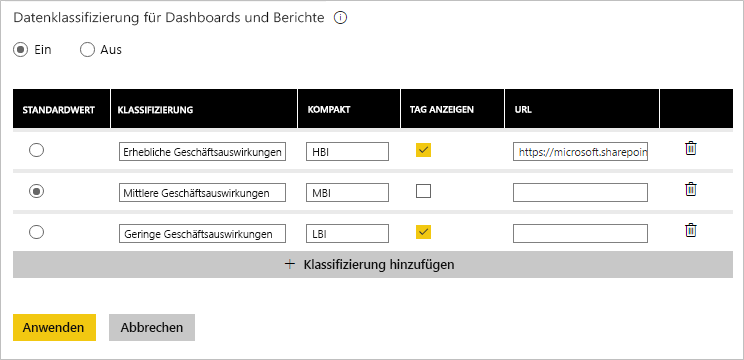

# Datenklassifizierung für Dashboards
Für jedes Dashboard bestehen andere Anforderungen. Je nach der Datenquelle, mit der Sie eine Verbindung herstellen, werden Sie wahrscheinlich feststellen, dass Sie und die Kollegen, für die Sie das Dashboard freigeben, abhängig von der Vertraulichkeit der Daten verschiedene Vorsichtsmaßnahmen treffen müssen. Einige Dashboards sollten niemals außerhalb Ihres Unternehmens freigegeben oder gedruckt werden, während andere ohne Bedenken freigegeben werden können. Mithilfe der Datenklassifizierung für Dashboards können Sie den Personen, von denen die Dashboards angezeigt werden, die Bestimmung der zu verwendenden Sicherheitsstufe erleichtern. Sie können die Dashboards mit Klassifizierungstags versehen, die von der IT-Abteilung Ihres Unternehmens definiert wurden, damit jede Person, die den Inhalt anzeigt, den gleichen Kenntnisstand hinsichtlich der Vertraulichkeit der Daten hat.

## Datenklassifizierungstags
Datenklassifizierungstags werden neben dem Namen des Dashboards angezeigt, sodass jede Person, die das Dashboard anzeigt, die auf das Dashboard anzuwendende Sicherheitsstufe kennt und weiß, welche Daten es enthält.

Sie werden auch neben der Dashboardkachel in der Favoritenliste angezeigt.

Wenn Sie auf das Tag zeigen, wird der vollständige Name der Klassifizierung angezeigt.

Administratoren können auch eine URL für ein Tag festlegen, um zusätzliche Informationen bereitzustellen.

> [!NOTE]
> Je nach den vom Administrator festgelegten Klassifizierungseinstellungen werden möglicherweise einige Klassifizierungstypen nicht als Tag auf dem Dashboard angezeigt. Wenn Sie Eigentümer eines Dashboards sind, können Sie immer unter den Dashboardeinstellungen den Dashboardklassifizierungstyp überprüfen.
> 
> 

## Festlegen der Klassifizierung eines Dashboards
Wenn Datenklassifizierung für Ihr Unternehmen aktiviert ist, verfügen alle Dashboards zunächst über einen Standardklassifizierungstyp. Als Eigentümer eines Dashboards können Sie jedoch die Klassifizierung ändern, damit sie mit der Sicherheitsstufe des Dashboards übereinstimmt.

Gehen Sie wie folgt vor, um den Klassifizierungstyp zu ändern.

1. Klicken Sie auf die **Auslassungspunkte** neben dem Dashboardnamen, und wählen Sie **Einstellungen** aus, um die Dashboardeinstellungen zu öffnen.
   
    
2. Unter den Dashboardeinstellungen wird die aktuelle Klassifizierung für das Dashboard angezeigt, und Sie können mithilfe der Dropdownliste den Klassifizierungstyp ändern.
   
    
3. Wählen Sie **Anwenden** aus, wenn Sie den Vorgang abgeschlossen haben.

Nachdem Sie die Änderung angewendet haben, wird die Aktualisierung für jede Person, für die Sie das Dashboard freigegeben haben, beim nächsten Laden des Dashboards angezeigt.

## Arbeiten als Administrator mit Datenklassifizierungstags
Die Datenklassifizierung wird vom globalen Administrator für die Organisation eingerichtet. Gehen Sie wie folgt vor, um die Datenklassifizierung zu aktivieren.

1. Klicke Sie auf das Zahnradsymbol für die Einstellungen, und wählen Sie **Verwaltungsportal** aus.
   
    
2. Legen Sie auf der Registerkarte **Mandanteneinstellungen** die Option **Datenklassifizierung für Dashboards und Berichte** auf *Ein* fest.
   
    

Wenn die Option aktiviert ist, wird ein Formular zum Erstellen der verschiedenen Klassifizierungen in der Organisation angezeigt.

Jede Klassifizierung verfügt über einen **Namen** und ein **Kompakttag**, das auf dem Dashboard angezeigt wird. Sie können für jede Klassifizierung durch Auswählen von **Tag anzeigen** festlegen, ob das Kompakttag auf dem Dashboard angezeigt wird. Wenn Sie festlegen, dass der Klassifizierungstyp nicht auf dem Dashboard angezeigt wird, kann der Eigentümer dennoch durch Überprüfen der Dashboardeinstellungen den Typ anzeigen. Optional können Sie zudem eine **URL** hinzufügen, die weitere Informationen über die Klassifizierungsrichtlinien und Verwendungsanforderungen der Organisation enthält.  

Als Letztes müssen Sie festlegen, welcher Klassifizierungstyp der Standardtyp ist.  

Nachdem Sie im Formular die Klassifizierungstypen festgelegt haben, wählen Sie **Anwenden** aus, um die Änderungen zu speichern.

Jetzt wird allen Dashboards die Standardklassifizierung zugewiesen, und Eigentümer von Dashboards können den Klassifizierungstyp auf den für den Inhalt geeigneten Klassifizierungstyp aktualisieren. Sie können in Zukunft an diese Stelle zurückkehren, um Klassifizierungstypen hinzuzufügen oder zu entfernen oder den Standardtyp zu ändern.  

> [!NOTE]
> Wenn Sie zurückkehren, um Änderungen vorzunehmen, sind einige wichtige Punkte zu beachten:
> 
> * Wenn Sie die Datenklassifizierung deaktivieren, wird keines der Tags gespeichert. Sie müssen von vorne beginnen, wenn Sie sie später wieder aktivieren möchten.  
> * Wenn Sie einen Klassifizierungstyp entfernen, werden alle Dashboards, die dem entfernten Klassifizierungstyp zugewiesen sind, wieder dem Standardklassifizierungstyp zugewiesen, bis der Klassifizierungstyp wieder vom Eigentümer festgelegt wird.  
> * Wenn Sie den Standardklassifizierungstyp ändern, wird allen Dashboards, denen vom Eigentümer noch kein Klassifizierungstyp zugewiesen wurde, der neue Standardklassifizierungstyp zugewiesen.
> 
> 

