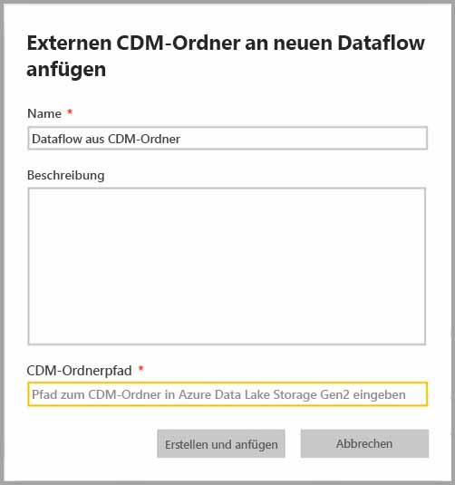
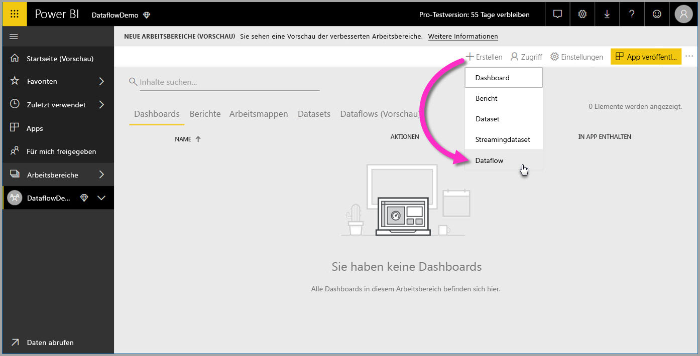
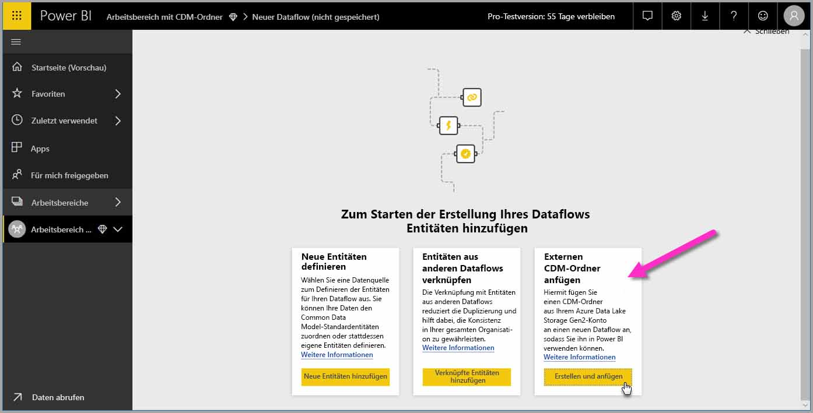

# Hinzufügen eines CDM-Ordners als Dataflow in Power BI (Vorschauversion)

In Power BI können Sie CDM-Ordner (Common Data Model) hinzufügen, die als Dataflows im Azure Data Lake Store Gen2-Speicher Ihres Unternehmens gespeichert werden. Wenn Sie einen Dataflow über einen CDM-Ordner erstellt haben, können Sie mit **Power BI Desktop** und dem **Power BI-Dienst** Datasets, Berichte, Dashboards und Apps erstellen, die auf den Daten basieren, die Sie in die CDM-Ordner eingefügt haben.

Das Erstellen von Dataflows aus CDM-Ordnern unterliegt einigen wenigen Anforderungen, die in der folgenden Liste beschrieben werden:

* Das Erstellen von Dataflows aus CDM-Ordnern ist *nur* in den [neuen Arbeitsbereichen](service-create-the-new-workspaces.md) verfügbar. 
* Zum Hinzufügen eines CDM-Ordners zu Power BI muss der Benutzer, der den Ordner hinzufügen möchte, [für den CDM-Ordner und die darin enthaltenen Dateien autorisiert sein](https://go.microsoft.com/fwlink/?linkid=2029121).
* Sie müssen über die Berechtigungen zum Lesen und Ausführen für alle Dateien und Ordner im CDM-Ordner verfügen, um sie in Power BI einzufügen.

In den folgenden Abschnitten wird beschrieben, wie Sie einen Dataflow aus einem CDM-Ordner erstellen können.

> [!NOTE]
> Die Dataflowfunktionalität befindet sich in der Vorschau und unterliegt vor der allgemeinen Verfügbarkeit Änderungen und Updates.

## Erstellen eines Dataflows aus einem CDM-Ordner

Starten Sie den **Power BI-Dienst**, und wählen Sie einen **App-Arbeitsbereich** aus dem linken Navigationsbereich aus, um mit dem Erstellen eines Dataflows aus einem CDM-Ordner zu beginnen. Sie können auch einen neuen Arbeitsbereich zum Erstellen Ihres neuen Dataflows erstellen.

Klicken Sie wie im folgenden Bild gezeigt im angezeigten Bildschirm auf **Erstellen und anfügen**.

Auf dem angezeigten Bildschirm können Sie einen Namen und eine Beschreibung für den Dataflow sowie den Pfad zum CDM-Ordner im Azure Data Lake Gen2-Konto Ihres Unternehmens angeben. Lesen Sie den Abschnitt im Artikel zum [Abrufen des CDM-Ordnerpfads](service-dataflows-configure-workspace-storage-settings.md#get-the-uri-of-stored-dataflow-files). 

Sobald Sie die Informationen angegeben haben, klicken Sie auf **Erstellen und anfügen**, um den Dataflow zu erstellen.

Dataflows aus CDM-Ordnern werden mit dem Symbol für *externe* Ressourcen gekennzeichnet, wenn sie in Power BI angezeigt werden. Im nächsten Abschnitt werden die Unterschiede zwischen herkömmlichen Dataflows und Dataflows aus CDM-Ordnern beschrieben.

Sobald die Berechtigungen wie zuvor beschrieben ordnungsgemäß festgelegt wurden, können Sie **Power BI Desktop** eine Verbindung mit Ihrem Dataflow in herstellen.

## Überlegungen und Einschränkungen

Die Arbeit mit Berechtigungen für einen Dataflow, der aus einem CDM-Ordner erstellt wurde, ähnelt der Arbeit mit externen Datenquellen in Power BI. Berechtigungen werden in der Datenquelle verwaltet und nicht in Power BI. Die Berechtigungen müssen in der Datenquelle selbst, z. B. ein Dataflow aus einem CDM-Ordner, entsprechend festgelegt werden, damit sie in Power BI funktionieren.

In den folgenden Listen wird erläutert, wie Dataflows aus CDM-Ordnern mit Power BI interagieren.

Arbeitsbereiche in Power BI Pro, Premium und Embedded:
* Dataflows aus CDM-Ordnern können nicht bearbeitet werden
* Die Berechtigungen zum Lesen eines Dataflows, der aus einem CDM-Ordner erstellt wurde, werden vom Besitzer des CDM-Ordners verwaltet, nicht von Power BI

Power BI Desktop:
* Nur Benutzer, die sowohl für den Arbeitsbereich, in dem der Dataflow erstellt wurde, als auch für den CDM-Ordner autorisiert sind, können auf die Daten des Power BI-Dataflowconnectors zugreifen

Beachten Sie außerdem die Hinweise in der folgenden Liste:

* Das Erstellen von Dataflows aus CDM-Ordnern ist *nur* in den [neuen Arbeitsbereichen](service-create-the-new-workspaces.md) verfügbar.
* Verknüpfte Entitäten sind nicht für Dataflows aus CDM-Ordnern verfügbar

Benutzer von **Power BI Desktop** können nur auf Dataflows zugreifen, die in einem Azure Data Lake Storage Gen2-Konto gespeichert sind, wenn sie der Besitzer des jeweiligen Dataflows oder explizit für den CDM-Ordner des jeweiligen Dataflows autorisiert sind. Sehen Sie sich das folgende Beispiel an:

1.  Anna erstellt einen neuen App-Arbeitsbereich und konfiguriert ihn so, dass Dataflows aus einem CDM-Ordner gespeichert werden.
2.  Ben ist ebenfalls Mitglied des Arbeitsbereichs, den Anna erstellt hat, und möchte Power BI Desktop und den Dataflowconnector verwenden, um Daten aus Annas Dataflow zu erhalten.
3.  Da Ben im Data Lake-Konto nicht als autorisierter Benutzer des CDM-Ordners des Dataflows hinzugefügt wurde, erhält er eine Fehlermeldung.

    

Ben müssen Leseberechtigungen für den CDM-Ordner und die darin enthaltenen Dateien gewährt werden, um dieses Problem zu beheben. Weitere Informationen zum Gewähren des Zugriffs auf den CDM-Ordner finden Sie in [diesem Artikel](https://go.microsoft.com/fwlink/?linkid=2029121).

## Nächste Schritte

In diesem Artikel haben Sie eine Anleitung dafür erhalten, wie Sie den Speicher eines Arbeitsbereichs für Dataflows konfigurieren können. Weitere Informationen finden Sie in den folgenden Artikeln:

Weitere Informationen zu Dataflows, CDM und Azure Data Lake Storage Gen2 finden Sie in den folgenden Artikeln:

* [Dataflows und Integration in Azure Data Lake (Vorschauversion)](service-dataflows-azure-data-lake-integration.md)
* [Configure workspace dataflow settings (Preview) (Konfigurieren von Datafloweinstellungen im Arbeitsbereich (Vorschauversion))](service-dataflows-configure-workspace-storage-settings.md)
* [Verbinden von Azure Data Lake Storage Gen2 für die Dataflowspeicherung (Vorschauversion)](service-dataflows-connect-azure-data-lake-storage-gen2.md)

Allgemeine Informationen zu Dataflows finden Sie in den folgenden Artikeln:

* [Erstellen und Verwenden von Dataflows in Power BI](service-dataflows-create-use.md)
* [Verwenden berechneter Entitäten in Power BI Premium (Vorschau)](service-dataflows-computed-entities-premium.md)
* [Verwenden von Dataflows mit lokalen Datenquellen (Vorschau)](service-dataflows-on-premises-gateways.md)
* [Entwicklerressourcen für Power BI-Dataflows (Vorschau)](service-dataflows-developer-resources.md)

Weitere Informationen zu Azure Storage finden Sie in den folgenden Artikeln:
* [Azure Storage-Sicherheitsleitfaden](https://docs.microsoft.com/azure/storage/common/storage-security-guide)
* [Konfigurieren geplanter Aktualisierungen](refresh-scheduled-refresh.md)
* [Erste Schritte mit GitHub-Beispielen aus Azure Data Services](https://aka.ms/cdmadstutorial)

Weitere Informationen zum Common Data Model finden Sie im folgenden Übersichtsartikel:
* [Was ist das Common Data Model?](https://docs.microsoft.com/powerapps/common-data-model/overview)
* [CDM folders (CDM-Ordner)](https://go.microsoft.com/fwlink/?linkid=2045304)
* [The metadata file (model.json) for the Common Data Model (Die Metadatendatei (model.json) des CDM)](https://go.microsoft.com/fwlink/?linkid=2045521)

Natürlich können Sie auch jederzeit [Fragen in der Power BI-Community stellen](http://community.powerbi.com/).

