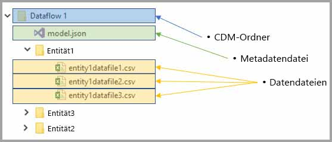

# Dataflows und Azure Data Lake-Integration (Vorschauversion)

Mit Power BI verwendete Daten werden standardmäßig im internen Speicher von Power BI gespeichert. Mit der Integration von Dataflows und Azure Data Lake Storage Gen2 (ADLS Gen2) können Sie Ihre Dataflows im Azure Data Lake Storage Gen2-Konto Ihrer Organisation speichern. 

> [!NOTE]
> Die Dataflowfunktionalität befindet sich in der Vorschau und unterliegt vor der allgemeinen Verfügbarkeit Änderungen und Updates.

## Beziehung zwischen CDM-Ordnern und Dataflows

Mit **Dataflows** können Benutzer und Organisationen Daten aus verschiedenen Quellen vereinheitlichen und zur Modellierung aufbereiten. Mit CDM (Common Data Model) können Organisationen ein Datenformat verwenden, das semantische Konsistenz zwischen Anwendungen und Bereitstellungen bereitstellt. Mit ADLS Gen2 steht präzisere Zugriffs- und Autorisierungskontrolle für Data Lakes in Azure zur Verfügung. Zusammen stellen diese Elemente überzeugende zentralisierte Daten, strukturierte Daten, präzise Zugriffssteuerung und semantische Konsistenz für Apps im ganzen Unternehmen bereit.

Im CDM-Format gespeicherte Daten stellen semantische Konsistenz für Anwendungen und Bereitstellungen innerhalb einer Organisation bereit. Mithilfe der CDM-Integration mit ADLS Gen2 kann durch Verwendung von CDM-Ordnern, die schematisierte Daten im CDM-Standardformat enthalten, die gleiche strukturelle Konsistenz und semantische Bedeutung auf in ADLS Gen2 gespeicherte Daten angewendet werden. Die standardisierten Metadaten und selbstbeschreibenden Daten in einer Azure Data Lake-Instanz vereinfachen die Ermittlung von Metadaten und ermöglichen die Zusammenarbeit zwischen Datenerzeugern und Verbrauchern wie Power BI, Azure Data Factory, Azure Data Lake, Databricks und Azure Machine Learning. 

Die Definition und Daten von Dataflows werden in folgenden Formaten in CDM-Ordnern gespeichert:

**Model.json**
* Die Metadatenbeschreibungsdatei **Model.json** enthält semantische Informationen zu Entitätsdatensätzen und Attributen sowie Links zu zugrunde liegenden Datendateien. Das Vorhandensein der Datei „Model.json“ impliziert Konformität mit dem CDM-Format für Metadaten, das heißt auch, dass Standardentitäten enthalten sein können, die zusätzliche, umfangreiche und sofort verfügbare semantische Metadaten für Anwendungen enthalten sein können.
* Die Informationen zu jeder Datenquelle werden außerdem mit den **Abfragen und Transformationen** gespeichert, die mithilfe des Dataflow-Editors des Power BI-Dienst generiert werden. Kennwörter für Datenquellen werden nicht in der Modelldatei gespeichert.

**Datendateien**
* Die Struktur und das Format der im CDM-Ordner enthaltenen Datendateien sind klar definiert (Unterordner sind wie später in diesem Artikel beschrieben optional), und die Datei „Model.json“ verweist auf sie. Derzeit ist das CSV-Format für die Datendateien erforderlich, aber weitere Formate werden möglicherweise in zukünftigen Updates unterstützt. 

Im folgenden Diagramm wird ein CDM-Beispielordner gezeigt, der mit einem Power BI-Dataflow erstellt wurde und drei Entitäten enthält:

Die Metadatendatei „Model.json“ im obigen Bild würde Zeiger auf die Entitätsdatendateien im gesamten CDM-Ordner bereitstellen.

## Power BI sortiert CDM-Ordner im Data Lake

Mit Power BI-Dataflows und deren Integration in ADLS Gen2 kann Power BI Daten in einem Data Lake erstellen. Als Datenproduzent muss Power BI einen CDM-Ordner für jeden Dataflow erstellen, der die Datei „Model.json“ und die zugehörigen Datendateien enthält. Power BI speichert die Daten isoliert von anderen Datenproduzenten mithilfe von *Dateisystemen* im Data Lake. Weitere Informationen zum Azure Data Lake Storage Gen2-Dateisystem und dem hierarchischen Namespace finden Sie im [zugehörigen Artikel](https://docs.microsoft.com/azure/storage/data-lake-storage/namespace).

Power BI verwendet Unterordner zur Mehrdeutigkeitsvermeidung und zum Bereitstellen verbesserter Organisation von Daten bei der Darstellung im **Power BI-Dienst**. Die Benennung und Struktur des Ordners stellen Arbeitsbereiche (Ordner) und Dataflows (CDM-Ordner) dar. Im folgenden Diagramm wird veranschaulicht, wie ein von Power BI und anderen Datenproduzenten freigegebener Data Lake strukturiert werden kann. Jeder Dienst, in diesem Fall Dynamics 365, Dynamics for Finance and Operation sowie Power BI, erstellt und verwaltet ein eigenes Dateisystem. Je nach Funktion der einzelnen Dienste werden Unterordner erstellt, um die CDM-Ordner im Dateisystem besser zu ordnen. 

## Power BI schützt Daten im Data Lake

Power BI nutzt die *Active Directory-OAuth-Bearertoken* und Funktionalität für *POSIX-Zugriffssteuerungslisten* von Azure Data Lake Storage Gen2. Diese Features ermöglichen die Bereichsdefinition für den Zugriff von Power BI auf das Dateisystem, das es im Data Lake verwaltet, sowie die Bereichsdefinition des Zugriffs von Benutzern auf lediglich Dataflows oder CDM-Ordner, die sie selbst erstellen. 

Zum Erstellen und Verwalten von CDM-Ordnern im Power BI-Dateisystem sind Berechtigungen zum Lesen, Schreiben und Ausführen erforderlich. Jeder in Power BI erstellte Dataflow wird in einem eigenen CDM-Ordner gespeichert. Dem Besitzer des Dataflows wird schreibgeschützter Zugriff auf den CDM-Ordner und dessen Inhalte gewährt. Mit diesem Ansatz wird die Datenintegrität der von Power BI erstellten Daten geschützt, und Administratoren können mithilfe von Überwachungsprotokollen überwachen, welche Benutzer auf den CDM-Ordner zugegriffen haben. 

### Autorisieren von Benutzern und Diensten für CDM-Ordner

Das Freigeben von CDM-Ordnern für Verbraucher, z. B. Benutzer oder Dienste, die diese Daten lesen müssen, wird mit Active Directory-OAuth-Bearertoken und POSIX-Zugriffssteuerungslisten vereinfacht. Auf diese Weise können Administratoren überwachen, wer auf den CDM-Ordner zugreift. Die einzige erforderliche Aktion ist es, einem Active Directory-Objekt Ihrer Wahl (z. B. eine Benutzergruppe oder ein Dienst) Zugriff auf den CDM-Ordner zu gewähren. Es wird empfohlen, dass jeglicher Zugriff auf den CDM-Ordner für jede Identität abgesehen vom Datenproduzenten schreibgeschützt gewährt wird. Damit wird die Datenintegrität der Daten geschützt, die vom Produzenten generiert werden.

Benutzer, die einen CDM-Ordner in Power BI hinzufügen möchten, sollten über Zugriffssteuerungslisten für den *Lesezugriff* für den CDM-Ordner und die darin enthaltenen Dateien und Ordner verfügen. Darüber hinaus sind Zugriffssteuerungslisten für den *Ausführungszugriff* für den CDM-Ordner und die darin enthaltenen Ordner erforderlich. Es wird empfohlen, dass Sie sich weitere Informationen verschaffen, indem Sie die Artikel [Access control lists on files and directory (Zugriffssteuerungslisten für Dateien und Verzeichnisse)](https://docs.microsoft.com/azure/storage/blobs/data-lake-storage-access-control#access-control-lists-on-files-and-directories) und [Best practices for using Azure Data Lake Storage Gen2 (Bewährte Methoden für die Verwendung von Azure Data Lake Storage Gen2)](https://docs.microsoft.com/azure/storage/blobs/data-lake-storage-best-practices) lesen.

### Alternative Autorisierungsmethoden

Benutzer und Dienste außerhalb von Power BI können ebenfalls alternative Autorisierungsmethoden nutzen. Mit diesen Alternativen können Besitzer des Schlüssels auf *alle* Ressourcen im Konto zugreifen, außerdem verfügen sie über Vollzugriff auf alle Ressourcen im Data Lake. Der Zugriff auf Dateisysteme oder CDM-Ordner kann dabei nicht eingeschränkt werden. Diese Alternativen stellen zwar eine einfache Möglichkeit zum Gewähren des Zugriffs dar, aber sie schränken die Möglichkeit ein, spezifische Ressourcen im Data Lake freizugeben, und bieten keine Überwachung für den Zugriff auf den Speicher. Ausführliche Informationen zu den verfügbaren Autorisierungsschemas finden Sie im [Artikel zur Zugriffssteuerung in Azure Data Lake Storage Gen2](https://docs.microsoft.com/azure/storage/blobs/data-lake-storage-access-control
).

## Nächste Schritte

In diesem Artikel haben Sie eine Übersicht über die Integration von Power BI-Dataflows, CDM-Ordner und Azure Data Lake Storage Gen2 erhalten. Weitere Informationen finden Sie in den folgenden Artikeln:

Weitere Informationen zu Dataflows, CDM und Azure Data Lake Storage Gen2 finden Sie in den folgenden Artikeln:

* [Configure workspace dataflow settings (Preview) (Konfigurieren von Datafloweinstellungen im Arbeitsbereich (Vorschauversion))](service-dataflows-configure-workspace-storage-settings.md)
* [Hinzufügen eines CDM-Ordners als Dataflow in Power BI (Vorschauversion)](service-dataflows-add-cdm-folder.md)
* [Verbinden von Azure Data Lake Storage Gen2 für die Dataflowspeicherung (Vorschauversion)](service-dataflows-connect-azure-data-lake-storage-gen2.md)

Allgemeine Informationen zu Dataflows finden Sie in den folgenden Artikeln:

* [Erstellen und Verwenden von Dataflows in Power BI](service-dataflows-create-use.md)
* [Verwenden berechneter Entitäten in Power BI Premium (Vorschau)](service-dataflows-computed-entities-premium.md)
* [Verwenden von Dataflows mit lokalen Datenquellen (Vorschau)](service-dataflows-on-premises-gateways.md)
* [Entwicklerressourcen für Power BI-Dataflows (Vorschau)](service-dataflows-developer-resources.md)

Weitere Informationen zu Azure Storage finden Sie in den folgenden Artikeln:
* [Azure Storage-Sicherheitsleitfaden](https://docs.microsoft.com/azure/storage/common/storage-security-guide)
* [Erste Schritte mit GitHub-Beispielen aus Azure Data Services](https://aka.ms/cdmadstutorial)

Weitere Informationen zum Common Data Model finden Sie im folgenden Übersichtsartikel:
* [Was ist das Common Data Model?](https://docs.microsoft.com/powerapps/common-data-model/overview)
* [CDM folders (CDM-Ordner)](https://go.microsoft.com/fwlink/?linkid=2045304)
* [The metadata file (model.json) for the Common Data Model (Die Metadatendatei (model.json) des CDM)](https://go.microsoft.com/fwlink/?linkid=2045521)

Natürlich können Sie auch jederzeit [Fragen in der Power BI-Community stellen](http://community.powerbi.com/).
