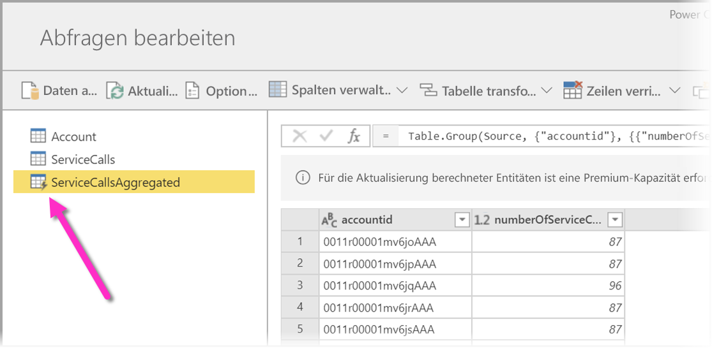
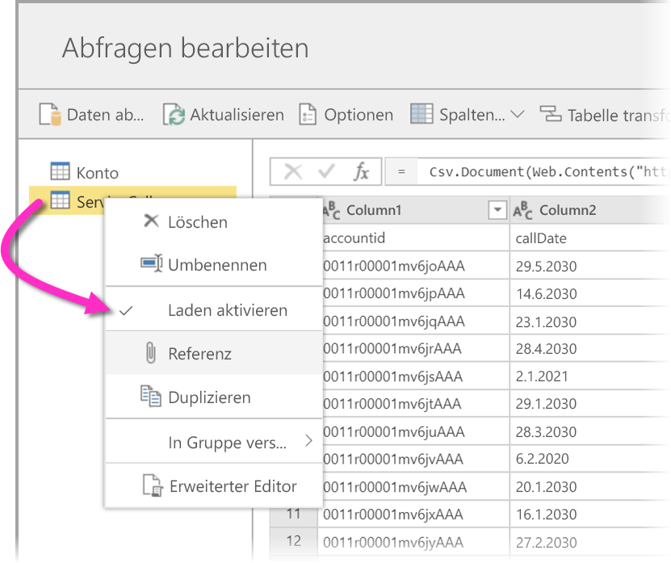
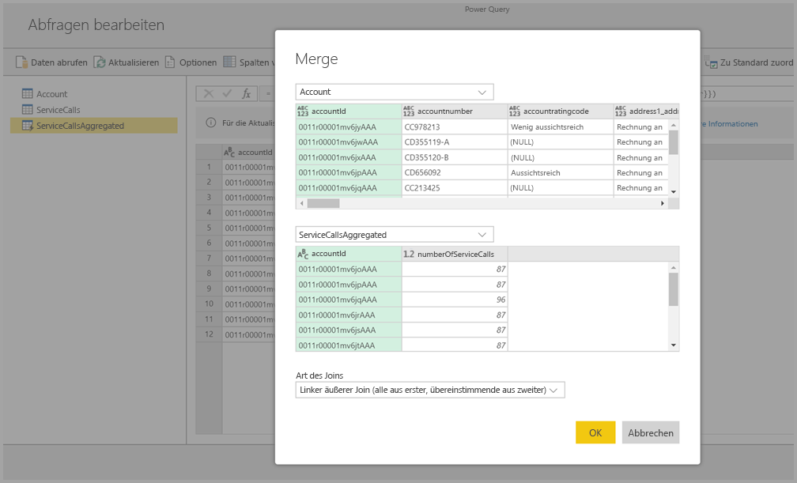
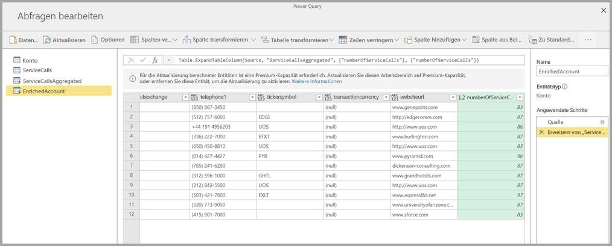

# Verwenden berechneter Entitäten in Power BI Premium (Vorschau)

Sie haben die Möglichkeit, **Berechnungen im Speicher** auszuführen, wenn Sie **Dataflows** mit einem Power BI Premium-Abonnement verwenden. So können Sie Berechnungen mit Ihren vorhandenen Dataflows ausführen und Ergebnisse zurückgeben, mit denen Sie sich auf die Berichtserstellung und Analysen konzentrieren können. 

Um **Berechnungen im Speicher** auszuführen, müssen Sie zunächst den Dataflow erstellen und Daten in diesem Power BI-Dataflowspeicher aufnehmen. Wenn Sie einen Dataflow haben, der Daten enthält, können Sie **Berechnete Entitäten** erstellen. Dabei handelt es sich um Entitäten, die Berechnungen innerhalb des Speichers ausführen. 

Sie haben zwei Optionen, Dataflowdaten mit Power BI zu verbinden:

* [Mit der Self-Service-Erstellung eines Dataflows](service-dataflows-create-use.md)
* Mit einem externen Dataflow

Die folgenden Abschnitte beschreiben, wie Sie berechnete Entitäten mit Ihren Dataflowdaten erstellen.

> [!NOTE]
> Die Dataflowfunktionalität befindet sich in der Vorschau und unterliegt vor der allgemeinen Verfügbarkeit Änderungen und Updates.

## Erstellen von berechneten Entitäten 

Wenn Sie über einen Dataflow mit einer Liste von Entitäten verfügen, können Sie diese Entitäten berechnen.

Wählen Sie im Power BI-Dienst im Dataflow-Erstellungstool **Entitäten bearbeiten** aus, und klicken Sie mit der rechten Maustaste auf die Entität, die Sie als Grundlage für Ihre berechnete Entität verwenden und berechnen möchten. Wählen Sie im Kontextmenü **Verweis** aus.

Damit die Entität als berechnete Entität verwendet werden kann, muss die Auswahl **Laden aktivieren** aktiviert sein (s. Abbildung). Klicken Sie mit der rechten Maustaste auf die Entität, um dieses Kontextmenü anzuzeigen.

Durch Auswählen von **Laden aktivieren** erstellen Sie eine neue Entität, deren Quelle die referenzierte Entität ist. Das Symbol ändert sich und zeigt das Symbol **Berechnet** an (s. Abbildung).

Jede Transformation, die Sie für diese neu erstellte Entität vornehmen, wird mit den Daten ausgeführt, die sich bereits im Power BI-Dataflowspeicher befinden. Das bedeutet, dass die Abfrage nicht für die externe Datenquelle ausgeführt wird, aus der die Daten importiert wurden (z.B. die SQL-Datenbank), sondern für die Daten, die sich im Dataflowspeicher befinden.

### Beispielhafte Anwendungsfälle
Welche Transformationen lassen sich mit berechneten Entitäten ausführen? Beim Berechnen im Speicher wird jede Transformationsart unterstützt, die Sie i.d.R. über die Transformationsbenutzeroberfläche in Power BI oder den M-Editor angeben. 

Ein Beispiel: Sie haben eine Entität *Account*, die die Rohdaten für alle Kunden in Ihrem Dynamics 365-Abonnement enthält. Außerdem verfügen Sie über *ServiceCalls*-Rohdaten vom Kundendienst, mit Daten aus den Supportanrufen, die von unterschiedlichen Konten an jedem Tag des Jahres gemacht wurden.

Angenommen, Sie möchten die Entität *Account* mit Daten aus *ServiceCalls* anreichern. 

Zuerst müssen Sie die Daten aus „ServiceCalls“ aggregieren, um die Anzahl von Supportanrufen zu berechnen, die im letzten Jahr für jedes Konto ausgeführt wurden. 

Als nächstes müssen Sie die Entität *Account* mit der Entität *ServiceCallsAggregated* zusammenführen, um die Tabelle **Account** zu berechnen.

Anschließend werden die Ergebnisse angezeigt, in der folgenden Abbildung *EnrichedAccount*.

Das war‘s auch schon. Die Transformation erfolgt basierend auf den Daten im Dataflow, der sich in Ihrem Power BI Premium-Abonnement befindet – nicht basierend auf den Quelldaten.

## Überlegungen und Einschränkungen

Beachten Sie, dass beim Entfernen des Arbeitsbereichs aus der Power BI Premium-Kapazität der zugehörige Dataflow nicht mehr aktualisiert wird. 

## Nächste Schritte

Dieser Artikel beschreibt berechnete Entitäten und Dataflows, die im Power BI-Dienst zur Verfügung stehen. Diese Artikel können ebenfalls hilfreich sein:

* [Self-Service-Datenaufbereitung mit Dataflows](service-dataflows-overview.md)
* [Erstellen und Verwenden von Dataflows in Power BI](service-dataflows-create-use.md)
* [Verwenden von Dataflows mit lokalen Datenquellen (Vorschau)](service-dataflows-on-premises-gateways.md)
* [Entwicklerressourcen für Power BI-Dataflows (Vorschau)](service-dataflows-developer-resources.md)

Weitere Informationen zu Power Query und zur geplanten Aktualisierung finden Sie in den folgenden Artikeln:
* [Abfrageübersicht in Power BI Desktop](desktop-query-overview.md)
* [Konfigurieren geplanter Aktualisierungen](refresh-scheduled-refresh.md)

Weitere Informationen zum Common Data Model finden Sie im Übersichtsartikel:
* [Common Data Model – Übersicht](https://docs.microsoft.com/powerapps/common-data-model/overview)

