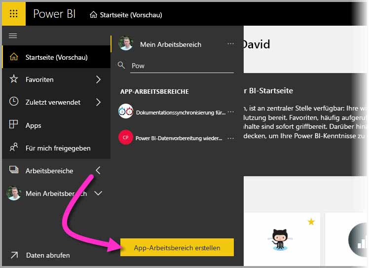
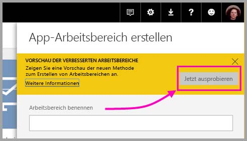
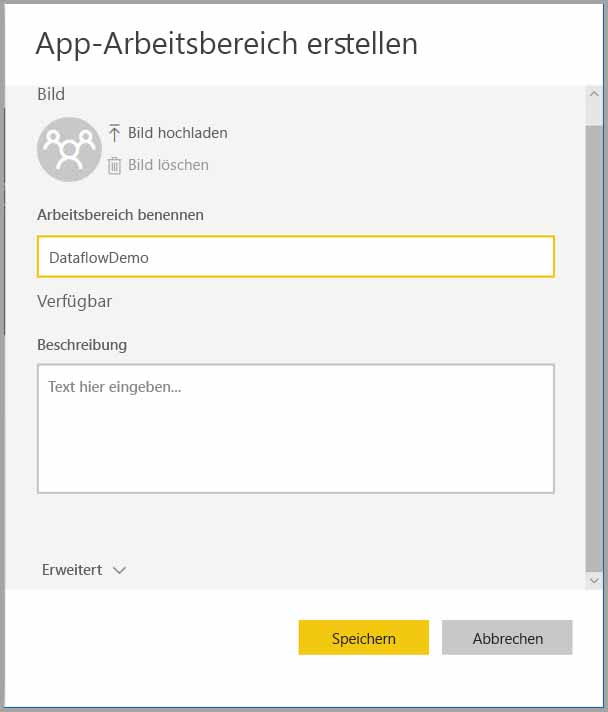
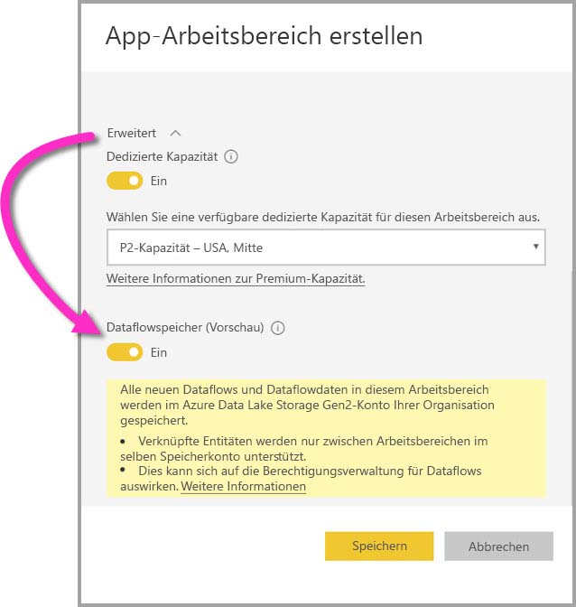
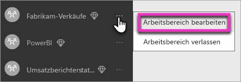
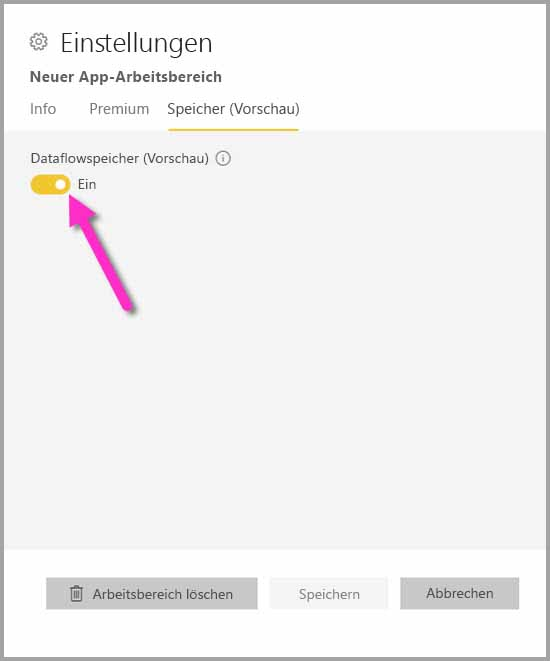
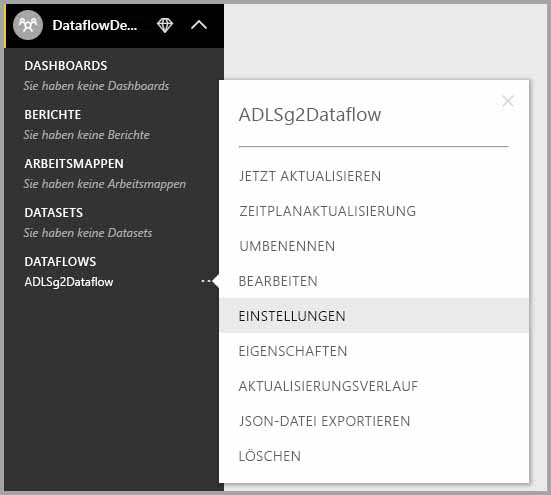

# Konfigurieren von Datafloweinstellungen im Arbeitsbereich (Vorschauversion)

Mithilfe von Power BI und Dataflows können Sie die Dataflowdefinitionsdatei eines Arbeitsbereichs sowie dessen Datendateien in Ihrem Azure Data Lake Storage Gen2-Konto speichern. Administratoren von Arbeitsbereichen können Power BI entsprechend konfigurieren. In diesem Artikel erhalten Sie die dafür notwendigen Informationen. 

Bevor Sie den Dataflowspeicherort eines Arbeitsbereichs konfigurieren können, muss der globale Administrator Ihres Unternehmens das Speicherkonto Ihrer Organisation mit Power BI verbinden und die Speicherzuweisungsberechtigungen für dieses Speicherkonto aktivieren. *[Verbinden von Azure Data Lake Storage Gen2 zur Dataflowspeicherung (Vorschauversion)](service-dataflows-connect-azure-data-lake-storage-gen2.md)* 

Es gibt zwei Möglichkeiten, die Einstellungen für den Dataflowspeicher Ihres Arbeitsbereichs zu konfigurieren: 

* Während der Erstellung des Arbeitsbereichs.
* Durch Bearbeiten eines vorhandenen Arbeitsbereichs.

In den folgenden Abschnitten sehen wir uns diese beiden Möglichkeiten genauer an. 

> [!IMPORTANT]
> Die Einstellungen für den Dataflowspeicher Ihres Arbeitsbereichs können nur geändert werden, wenn der Arbeitsbereich keine Dataflows enthält. Dieses Feature ist außerdem nur auf der Benutzeroberfläche des neuen Arbeitsbereichs verfügbar. Weitere Informationen zum neuen Arbeitsbereich erhalten Sie im Artikel [Erstellen der neuen Arbeitsbereiche (Vorschauversion) in Power BI](service-create-the-new-workspaces.md).

## Erstellen eines neuen Arbeitsbereichs und Konfigurieren des Dataflowspeichers eines neuen Arbeitsbereichs

Wenn Sie im Power BI-Dienst einen neuen App-Arbeitsbereich erstellen möchten, wählen Sie **Arbeitsbereiche > App-Arbeitsbereich erstellen** aus.

Im Dialogfeld „App-Arbeitsbereich erstellen“ wird möglicherweise ein gelbes Feld mit dem Titel **Vorschau der verbesserten Arbeitsbereiche** angezeigt. Wählen Sie in diesem Bereich **Jetzt testen** aus.

Im Dialogfeld, das angezeigt wird, können Sie Ihrem Arbeitsbereich einen eindeutigen Namen geben. Klicken Sie allerdings noch nicht auf **Speichern**, da Sie zuerst noch Änderungen in den erweiterten Einstellungen vornehmen müssen.

Erweitern Sie als nächsten Schritt im Dialogfeld **App-Arbeitsbereich erstellen** den Bereich **Erweitert**. Dort können Sie die Einstellung **Dataflowspeicher (Vorschauversion)** aktivieren.

Klicken Sie auf **Speichern**, um den neuen Arbeitsbereich zu erstellen. Sobald nun ein neuer Dataflow in diesem Arbeitsbereich erstellt wird, werden automatisch auch dessen Definitionsdatei (Datei des Typs „model.json“) und Daten im Azure Data Lake Storage Gen2-Konto Ihrer Organisation gespeichert. 

> [!NOTE]
> Die Dataflowfunktionalität befindet sich in der Vorschau und unterliegt vor der allgemeinen Verfügbarkeit Änderungen und Updates.

## Aktualisieren eines Dataflowspeichers in einem vorhandenen Arbeitsbereich

Als Alternative zum Erstellen eines neuen Arbeitsbereichs können Sie auch einen vorhandenen Arbeitsbereich aktualisieren, sodass die Definitionsdatei und die Daten im Azure Data Lake Storage Gen2-Konto Ihrer Organisation gespeichert werden. Die Einstellungen für den Dataflowspeicher Ihres Arbeitsbereichs können nur geändert werden, wenn der Arbeitsbereich keine Dataflows enthält.

Sie können einen App-Arbeitsbereich bearbeiten, indem Sie auf die Auslassungspunkte **(…)** und dann auf **Arbeitsbereich bearbeiten** klicken. 

Erweitern Sie **Erweitert** im Fenster **Arbeitsbereich bearbeiten**, und ändern Sie die Einstellung für **Dataflowspeicher (Vorschauversion)** in **Ein**. 

Klicken Sie dann auf **Speichern**. Sobald nun ein neuer Dataflow in diesem Arbeitsbereich erstellt wird, werden automatisch auch dessen Definitionsdatei und Daten im Azure Data Lake Storage Gen2-Konto Ihrer Organisation gespeichert.

## Abrufen des URI gespeicherter Dataflowdateien

Sobald Sie einen Dataflow in einem Arbeitsbereich erstellen, der dem Azure Data Lake-Konto Ihrer Organisation zugewiesen ist, haben Sie direkt Zugriff auf dessen Definition und Datendateien. Den Speicherort finden Sie auf der Seite **Datafloweinstellungen**. Führen Sie die folgenden Schritte aus, um diese Seite aufzurufen:

Klicken Sie auf die Auslassungspunkte **(…)** neben einem Dataflow, der im Arbeitsbereich unter **Dataflows** aufgeführt ist. Klicken Sie im dann angezeigten Menü auf **Einstellungen**.

In den aufgeführten Informationen finden Sie den Speicherort des CDM-Ordners für den jeweiligen Dataflow im Bereich **Dataflowspeicherort** (siehe folgendes Bild).

> [!NOTE]
> Power BI konfiguriert den Besitzer eines Dataflows so, dass dieser Leseberechtigungen für den CDM-Ordner hat, in dem Dataflowdateien gespeichert sind. Wenn der Besitzer eines Speicherkontos anderen Personen oder Diensten den Zugriff auf den Speicherort eines Dataflows gewähren möchte, kann er dies in Azure tun.

## Überlegungen und Einschränkungen

Einige Dataflowfeatures werden nicht unterstützt, wenn sich der Dataflowspeicher in Azure Data Lake Storage Gen2 befindet: 

Arbeitsbereiche in Power BI Pro, Premium und Embedded:
* Das Feature **Verknüpfte Entitäten** wird nur für Arbeitsbereiche im selben Speicherkonto unterstützt.
* Arbeitsbereichsberechtigungen gelten nicht für Dataflows, die in Azure Data Lake Storage Gen2 gespeichert sind. Nur der Besitzer des Dataflows hat eine Zugriffsberechtigung.
* Ansonsten haben alle Dataflows, die im Power BI-Speicher gespeichert sind, dieselben Datenvorbereitungsfeatures.

Beachten Sie außerdem die Hinweise in der folgenden Liste:

* Sobald der Speicherort eines Dataflows einmal konfiguriert wurde, kann er nicht mehr geändert werden.
* Nur der Besitzer eines Dataflows, der in Azure Data Lake Storage Gen2 gespeichert ist, hat Zugriff auf die Daten.
* Lokale Datenquellen und gemeinsam in Power BI genutzte Kapazitäten werden für Dataflows, die im Azure Data Lake Storage Gen2 Ihrer Organisation gespeichert sind, nicht unterstützt.

Benutzer von **Power BI Desktop** haben nur Zugriff auf Dataflows, die in einem Azure Data Lake Storage Gen2-Konto gespeichert sind, wenn sie der Besitzer des jeweiligen Dataflows sind. Sehen Sie sich das folgende Beispiel an:

1.  Anna erstellt einen neuen App-Arbeitsbereich und konfiguriert ihn so, dass Dataflows im Data Lake Ihrer Organisation gespeichert werden.
2.  Ben ist ebenfalls Mitglied des Arbeitsbereichs, den Anna erstellt hat, und möchte Power BI Desktop und den Dataflowconnector verwenden, um Daten aus Annas Dataflow zu erhalten.
3.  Da Ben im Data Lake-Konto nicht als autorisierter Benutzer des CDM-Ordners des Dataflows hinzugefügt wurde, erhält er eine Fehlermeldung.

    

## Nächste Schritte

In diesem Artikel haben Sie eine Anleitung dafür erhalten, wie Sie den Speicher eines Arbeitsbereichs für Dataflows konfigurieren können. Weitere Informationen finden Sie in den folgenden Artikeln:

Weitere Informationen zu Dataflows, CDM und Azure Data Lake Storage Gen2 finden Sie in den folgenden Artikeln:

* [Dataflows und Integration in Azure Data Lake (Vorschauversion)](service-dataflows-azure-data-lake-integration.md)
* [Hinzufügen eines CDM-Ordners als Dataflow in Power BI (Vorschauversion)](service-dataflows-add-cdm-folder.md)
* [Verbinden von Azure Data Lake Storage Gen2 für die Dataflowspeicherung (Vorschauversion)](service-dataflows-connect-azure-data-lake-storage-gen2.md)

Allgemeine Informationen zu Dataflows finden Sie in den folgenden Artikeln:

* [Erstellen und Verwenden von Dataflows in Power BI](service-dataflows-create-use.md)
* [Verwenden berechneter Entitäten in Power BI Premium (Vorschau)](service-dataflows-computed-entities-premium.md)
* [Verwenden von Dataflows mit lokalen Datenquellen (Vorschau)](service-dataflows-on-premises-gateways.md)
* [Entwicklerressourcen für Power BI-Dataflows (Vorschau)](service-dataflows-developer-resources.md)

Weitere Informationen zu Azure Storage finden Sie in den folgenden Artikeln:

* [Azure Storage-Sicherheitsleitfaden](https://docs.microsoft.com/azure/storage/common/storage-security-guide)
* [Erste Schritte mit GitHub-Beispielen aus Azure Data Services](https://aka.ms/cdmadstutorial)

Weitere Informationen zum Common Data Model finden Sie im folgenden Übersichtsartikel:

* [Was ist das Common Data Model?](https://docs.microsoft.com/powerapps/common-data-model/overview)
* [CDM folders (CDM-Ordner)](https://go.microsoft.com/fwlink/?linkid=2045304)
* [The metadata file (model.json) for the Common Data Model (Die Metadatendatei (model.json) des CDM)](https://go.microsoft.com/fwlink/?linkid=2045521)

Natürlich können Sie auch jederzeit [Fragen in der Power BI-Community stellen](http://community.powerbi.com/).
