# Verbinden von Azure Data Lake Storage Gen2 zur Dataflowspeicherung (Vorschauversion)

Sie können Power BI-Arbeitsbereiche konfigurieren, um Dataflows im Azure Data Lake Storage Gen2-Konto Ihrer Organisation zu speichern. Die hierzu notwendigen Schritte werden in diesem Artikel erläutert. Der Artikel enthält auch bewährte Methoden zu diesem Thema und kann Ihnen als Leitfaden dienen. Das Konfigurieren von Arbeitsbereichen zum Speichern von Dataflowdefinitionen und Datendateien in Ihrem Data Lake-Konto bietet einige Vorteile, beispielsweise:

* Azure Data Lake Storage Gen2 bietet einen enorm skalierbaren Datenspeicher.
* Daten und Definition DataFlow-Dateien genutzt werden, von Ihrer IT-Abteilung von Entwicklern, Daten in Azure zu nutzen und künstliche Intelligenz (KI) zu Diensten, wie in der [GitHub-Beispiele von Azure Data Services](https://aka.ms/cdmadstutorial)
* Ermöglicht es Entwicklern, die in Ihrer Organisation, die Datenfluss-Daten in die internen Anwendungen und Line-of-Business-Lösungen, mit den Ressourcen für Entwickler für Datenflüsse und Azure zu integrieren

Um Azure Data Lake Storage Gen2 für Dataflows nutzen zu können, benötigen Sie Folgendes:

* **Power BI-Mandant:** Mindestens ein Konto in Ihrem Azure Active Directory-Mandanten muss für Power BI registriert sein.
* **Globales Administratorkonto:** Dieses Konto benötigen Sie zum Verbinden und Konfigurieren von Power BI, damit die Dataflowdefinitionen und -daten in Ihrem Azure Data Lake Storage Gen2-Konto gespeichert werden können.
* **Azure-Abonnement:** Sie benötigen ein Azure-Abonnement, um Azure Data Lake Storage Gen2 verwenden zu können.
* **Ressourcengruppe:** Verwenden Sie eine bereits vorhandene Ressourcengruppe, oder erstellen Sie eine neue.
* **Azure Storage-Konto mit aktivierter Data Lake-Speicher Gen2-Funktion** 

> [!TIP]
> Wenn Sie kein Azure-Abonnement haben, erstellen Sie ein [kostenloses Konto](https://azure.microsoft.com/free/), bevor Sie beginnen.

> [!WARNING]
> Sobald der Speicherort eines Dataflows einmal konfiguriert wurde, kann er nicht mehr geändert werden. Finden Sie unter den [Überlegungen und Einschränkungen](#considerations-and-limitations) Abschnitt am Ende dieses Artikels, für andere wichtige Aspekte zu berücksichtigen.

## Einrichten Ihres Azure Data Lake Storage Gen2-Kontos für Power BI

Bevor Sie Power BI mit einem Azure Data Lake Storage Gen2-Konto konfigurieren können, müssen Sie ein Speicherkonto erstellen und konfigurieren. Werfen wir einen Blick auf die Anforderungen für Power BI:

1. Das Speicherkonto muss in demselben Azure Active Directory-Mandanten erstellt werden, in dem sich auch Ihr Power BI-Mandant befindet.
2. Das Speicherkonto muss in derselben Region erstellt werden, in der sich auch Ihr Power BI-Mandant befindet. Im Artikel [Wo befindet sich mein Power BI-Mandant?](service-admin-where-is-my-tenant-located.md) erfahren Sie, wie Sie ermitteln, in welcher Region sich Ihr Power BI-Mandant befindet.
3. Im Speicherkonto muss die Funktion *Hierarchical Name Space* (Hierarchischer Namespace) aktiviert sein.
4. Dem Power BI-Dienst muss die Rolle *Leser* (Reader) im Speicherkonto gewährt werden.
5. Ein Dateisystem mit dem Namen **powerbi** muss erstellt werden.
6. Der Power BI-Dienst muss für das von Ihnen erstellte Dateisystem **powerbi** autorisiert sein.

In den folgenden Abschnitten erfahren Sie detailliert, welche Schritte zum Konfigurieren Ihres Azure Data Lake Storage Gen2-Kontos notwendig sind.

### Erstellen des Speicherkontos

Führen Sie die in dem Artikel [Create an Azure Data Lake Storage Gen2 storage account (Erstellen eines für Azure Data Lake Storage Gen2 geeigneten Speicherkontos)](https://docs.microsoft.com/azure/storage/blobs/data-lake-storage-quickstart-create-account) genannten Schritte aus.

1. Stellen Sie sicher, dass Sie denselben Speicherort auswählen, in dem sich auch Ihr Power BI-Mandant befindet, und legen Sie Ihren Speicher als **StorageV2 (general purpose v2)** (SpeicherV2 (Allgemein v2)) fest.
2. Stellen Sie sicher, dass die Funktion „Hierarchischer Namespace“ aktiviert ist.
3. Es wird empfohlen die Replikationseinstellung auf **Read-access geo-redundant storage (RA-GRS)** (Georedundante Speicher mit Lesezugriff (RA-GRS)) festzulegen.

### Dem Power BI-Dienst eine Leserrolle gewähren

Als nächstes müssen Sie dem Power BI-Dienst eine Leserrolle in Ihrem erstellten Speicherkonto gewähren. Da es sich um eine integrierte Rolle handelt, ist dies sehr einfach. 

Führen Sie die Schritte in [Zuweisen einer auf einen Container oder eine Warteschlange begrenzten Rolle im Azure-Portal](https://docs.microsoft.com/azure/storage/common/storage-auth-aad-rbac#assign-a-built-in-rbac-role) aus.

Wählen Sie im Fenster **Add role assignment** (Rollenzuweisung hinzufügen) die **Leserrolle** (Reader) aus, um sie dem Power BI-Dienst zuzuweisen. Verwenden Sie dann die Suche, um den **Power BI-Dienst** zu finden. Die folgende Abbildung zeigt die dem Power BI-Dienst zugewiesene **Leserrolle**.

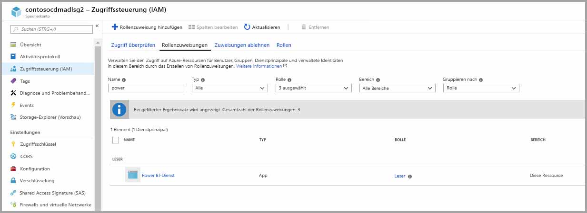

> [!NOTE]
> Können Sie mindestens 30 Minuten über die Berechtigung für Power BI über das Portal weitergegeben werden. Können Sie jedes Mal, die Sie Berechtigungen im Portal ändern, 30 Minuten dauern, bis diese Berechtigungen im Power BI berücksichtigt werden. 

### Erstellen eines Dateisystems für Power BI

Bevor Ihr Speicherkonto Power BI hinzugefügt werden kann, müssen Sie ein Dateisystem mit dem Namen *powerbi* erstellen. Es gibt viele Möglichkeiten für das Erstellen eines solchen Dateisystems, beispielsweise mithilfe von Azure Databricks, HDInsight, AZCopy oder dem Azure Storage-Explorer. In diesem Abschnitt sehen Sie einen einfachen Weg zum Erstellen eines Dateisystems mithilfe des Azure Storage-Explorers.

Für diesen Schritt müssen Sie Azure Storage Explorer, Version 1.6.2 oder höher, installieren. Erfahren Sie unter [Azure Storage-Explorer](https://azure.microsoft.com/features/storage-explorer/), wie Sie den Azure Storage-Explorer unter Windows, Mac oder Linux installieren.

1. Wenn Sie den Azure Storage-Explorer erfolgreich installiert haben, wird beim ersten Start das Fenster „Microsoft Azure Storage-Explorer – Verbinden“ angezeigt. Während der Storage-Explorer mehrere Möglichkeiten zum Verbinden mit Speicherkonten bietet, wird derzeit nur eine für die erforderliche Einrichtung unterstützt. 

2. Ermitteln und erweitern Sie das zuvor erstellte Speicherkonto im linken Bereich.

3. Klicken Sie mit der rechten Maustaste auf „Blob Containers“ (Blobcontainer), und wählen Sie im Kontextmenü die Option „Create Blob Container“ (Blobcontainer erstellen) aus.

   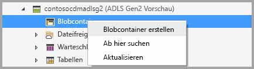

4. Unter dem Ordner „Blob Containers“ (Blobcontainer) erscheint ein Textfeld. Geben Sie den Namen *powerbi* ein. 

   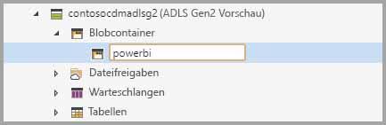

5. Drücken Sie anschließend die EINGABETASTE zum Erstellen des Blobcontainers.

   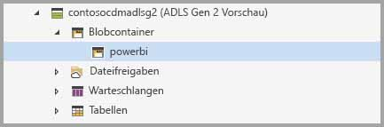

Im nächsten Abschnitt gewähren Sie allen Power BI-Diensten vollen Zugriff auf das von Ihnen erstellte Dateisystem. 

### Gewähren von Power BI-Berechtigungen für das Dateisystem

Um Berechtigungen für das Dateisystem zu gewähren, wenden Sie die Einstellungen für die Zugriffssteuerungsliste (ACL) an, welche Power BI den Zugriff erlauben. Hierzu muss im ersten Schritt die Identität der Power BI-Dienste in Ihrem Mandanten abgerufen werden. Sie können Ihre Azure Active Directory-Anwendungen im Abschnitt **Unternehmensanwendungen** im Azure-Portal anzeigen lassen.

Führen Sie die folgenden Schritte aus, um Anwendungen in Ihrem Mandanten zu finden:

1. Wählen Sie im [Azure-Portal](https://portal.azure.com/) im linken Navigationsbereich den Eintrag **Azure Active Directory** aus.
2. Klicken Sie im Blatt **Active Directory** auf **Unternehmensanwendungen**.
3. Wählen Sie im Dropdownmenü **Anwendungstyp** die Option **Alle Anwendungen** aus, und klicken Sie dann auf **Übernehmen**. Ein Beispiel Ihrer Mandantenanwendungen wird angezeigt, ähnlich der folgenden Abbildung.

    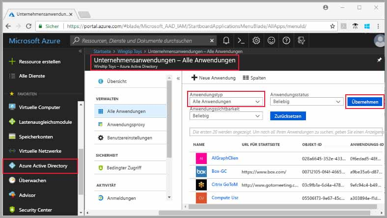

4. Geben Sie in der Suchleiste *Power* ein, und eine Auflistung von Objekt-IDs für Power BI und Power Query-Anwendungen wird angezeigt. Sie benötigen alle drei Werte in den nachfolgenden Schritten.  

    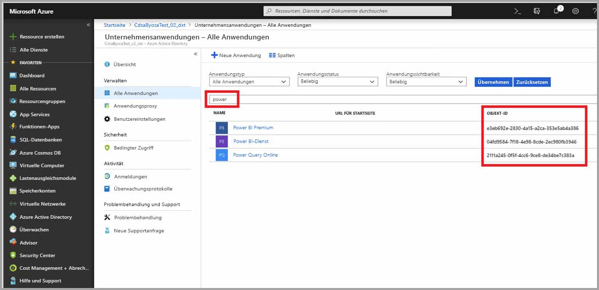

5. Wählen Sie aus, und kopieren Sie sowohl Objekt-IDs für Power BI-Dienst und Power Query online aus den Ergebnissen der Suche. Halten Sie sich für das Einfügen dieser Werte in den nachfolgenden Schritten bereit.

7. Navigieren Sie als nächstes mithilfe des **Azure Storage-Explorers** zum *powerbi*-Dateisystem, das Sie im vorherigen Abschnitt erstellt haben. Führen Sie die Anweisungen im Abschnitt [Managing access (Verwalten des Zugriffs)](https://docs.microsoft.com/azure/storage/blobs/data-lake-storage-how-to-set-permissions-storage-explorer#managing-access) des Artikels [Set file and directory level permissions using Azure Storage explorer (Festlegen von Datei- und Verzeichnisebenenberechtigungen mithilfe des Azure Storage-Explorers)](https://docs.microsoft.com/azure/storage/blobs/data-lake-storage-how-to-set-permissions-storage-explorer) aus.

8. Weisen Sie für jede der beiden in Schritt fünf gesammelten Power BI-Objekt-IDs Ihrem *powerbi*-Dateisystem Zugriff für **Read** (Lesen), **Write** (Schreiben), **Execute** (Ausführen) und Standard-ACLs zu.

   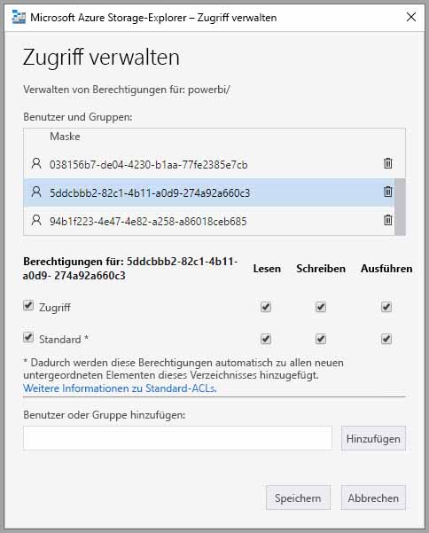

9. Weisen Sie für die in Schritt vier gesammelte Objekt-ID von Power Query Online Ihrem *powerbi*-Dateisystem Zugriff für **Write** (Schreiben) und **Execute** (Ausführen) sowie Standard-ACLs zu.

   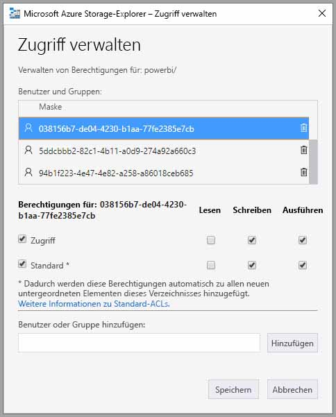

10. Weisen Sie außerdem auch für **Other** (Andere) Zugriff für **Execute** (Ausführen) und Standard-ACLs zu.

    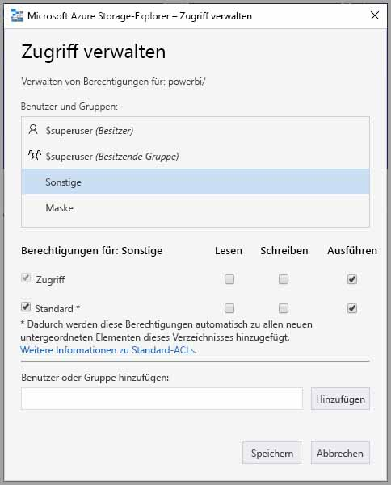

## Verbinden Ihres Azure Data Lake Storage Gen2 mit Power BI

Nachdem Sie Ihr Azure Data Lake-Speicher Gen2-Konto im Azure-Portal eingerichtet haben, verbinden Sie es mit Power BI in der **Power BI-Verwaltungsportal**. Sie verwalten auch Dataflow-Speicher in Power BI die **Datenfluss Storage** Einstellungsabschnitt im Power BI-Verwaltungsportal. Ausführliche Anleitungen zum Start und Informationen zur grundlegenden Verwendung finden Sie unter [Vorgehensweise: Anzeigen des Verwaltungsportals](service-admin-portal.md).

Mit den folgenden Schritten verbinden Sie Ihr **Azure Data Lake Storage Gen2**-Konto:

1. Navigieren Sie zu der **Datenfluss Einstellungen** Registerkarte die **Power BI-Verwaltungsportal**

    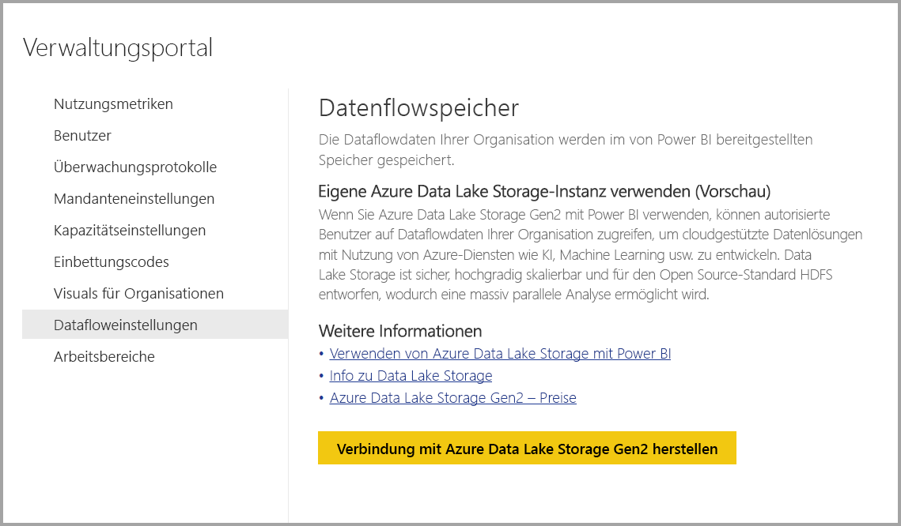 

2. Wählen Sie die **verbinden Sie Ihre Azure Data Lake-Speicher-Gen2** Schaltfläche. Das folgende Fenster wird angezeigt.

    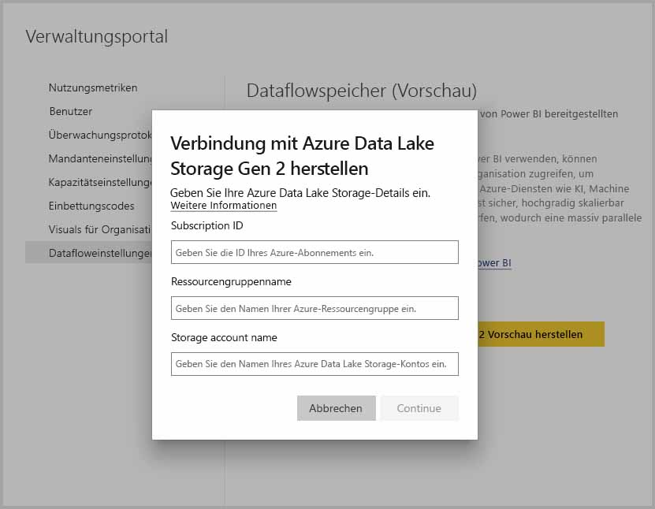 

3. Geben Sie die **Abonnement-ID** des Speicherkontos an.
4. Geben Sie den **Ressourcengruppennamen** an, unter dem das Speicherkonto erstellt wurde.
5. Geben Sie den **Namen des Speicherkontos** an.
6. Wählen Sie **Verbinden** aus.

Nachdem Sie diese Schritte ausgeführt haben, ist Ihr Azure Data Lake Storage Gen2-Konto mit Power BI verbunden. 

> [!NOTE]
> Um eine Verbindung mit Azure Data Lake Storage Gen2 im Power BI-Verwaltungsportal konfigurieren zu können, müssen Sie über globale Administratorrechte verfügen. Globale Administratoren können jedoch keine Verbindung mit externem Speicher im Verwaltungsportal herstellen.  

Als nächstes müssen Sie Personen in Ihrer Organisation das Konfigurieren ihrer Arbeitsbereiche ermöglichen. Erst dann können sie dieses Speicherkonto für Dataflowdefinitionen und Datenspeicherung verwenden. Dies werden wir im nächsten Abschnitt machen. 

## Zuweisen von Arbeitsbereichen durch Administratoren zulassen

Standardmäßig werden Dataflowdefinitionen und Datendateien in dem Speicher, der von Power BI bereitgestellt wird, gespeichert. Um auf Dataflowdateien in Ihrem eigenen Speicherkonto zuzugreifen, müssen Arbeitsbereichadministratoren zuerst den Arbeitsbereich konfigurieren, damit Dataflows in dem neuen Speicherkonto zugewiesen und gespeichert werden können. Bevor ein Arbeitsbereichsadministrator Dataflowspeichereinstellungen konfigurieren kann, müssen ihm Berechtigungen zum Zuweisen von Speicher im **Power BI-Verwaltungsportal** gewährt werden.

Wechseln Sie zu, um Berechtigungen für die Zuweisung von Speicher zu gewähren, die **Datenfluss Einstellungen** Registerkarte die **Power BI-Verwaltungsportal**. Stellen Sie dort das Optionsfeld *Allow workspace admins to assign workspaces to this storage account* (Zuweisen von Arbeitsbereichen für dieses Speicherkonto durch Arbeitsbereichadministratoren zulassen) auf **Allow** (Zulassen) ein. Wenn Sie den Regler des Optionsfelds eingestellt haben, klicken Sie anschließend auf die Schaltfläche **Übernehmen**, damit die Änderung erfolgt. 

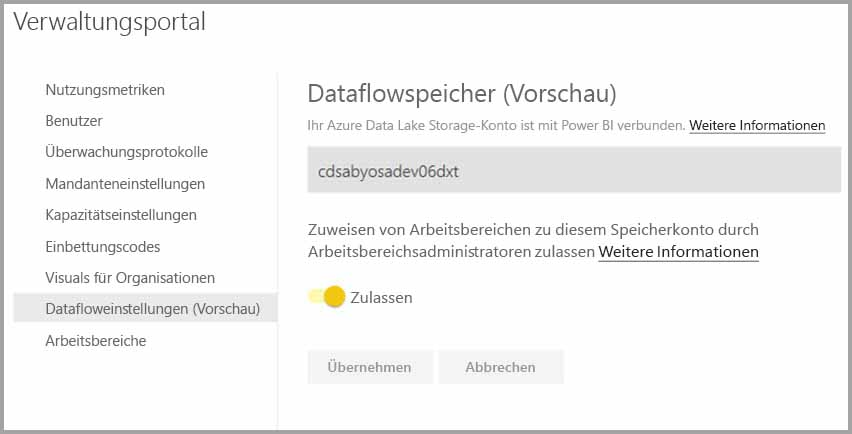 

Fertig! Die Power BI-Arbeitsbereichadministratoren können nun dem von Ihnen erstellten Dateisystem Workflows zuweisen.

## Überlegungen und Einschränkungen

Diese Funktion ist eine Previewfunktion, die bis zur Veröffentlichung noch verändert werden kann. Einige Überlegungen und Einschränkungen sind bei der Arbeit mit Ihrem Dataflowspeicher zu beachten:

* Sobald der Speicherort eines Dataflows einmal konfiguriert wurde, kann er nicht mehr geändert werden.
* Nur Besitzer eines Dataflows, der in Azure Data Lake Storage Gen2 gespeichert ist, haben standardmäßig Zugriff auf ihre Daten. Um weitere Personen für die in Azure gespeicherten Dataflows zu autorisieren, müssen diese dem CDM-Ordner des relevanten Dataflows hinzugefügt werden. 
* Dataflows mit verknüpften Entitäten können nur erstellt werden, wenn sie in demselben Speicherkonto gespeichert sind.
* Lokale Datenquellen, gemeinsam in Power BI genutzte Kapazitäten, werden für Dataflows, die im Data Lake Ihrer Organisation gespeichert sind, nicht unterstützt.

Es gibt auch einige bekannte Probleme, was in diesem Abschnitt thematisiert wird.

Benutzer von **Power BI Desktop** können nur auf Dataflows zugreifen, die in einem Azure Data Lake Storage-Konto gespeichert sind, wenn sie der Besitzer des jeweiligen Dataflows sind, oder wenn sie für den CDM-Ordner im Data Lake autorisiert sind. Das Szenario sieht folgendermaßen aus:

1. Anna hat einen neuen App-Arbeitsbereich erstellt und diesen so konfiguriert, dass Dataflows im Data Lake Ihrer Organisation gespeichert werden. 
2. Ben ist ebenfalls Mitglied des Arbeitsbereichs, den Anna erstellt hat, und möchte Power BI Desktop und den Dataflowconnector verwenden, um Daten aus Annas Dataflow zu erhalten.
3. Ben erhält eine Fehlermeldung ähnlich, da er nicht in den Datenfluss CDM-Ordner in den Lake autorisiert wurde.

Häufig gestellte Fragen und Antworten zu diesem Thema:

**Frage:** Wie kann ich vorgehen, wenn ich bereits Dataflows in einem Arbeitsbereich erstellt habe und nun deren Speicherort ändern möchte?

**Antwort:** Für einen bereits erstellten Dataflow kann der Speicherort nicht mehr geändert werden. 

**Frage:** Wann kann ich den Speicherort eines Dataflows für einen Arbeitsbereich ändern?

**Antwort:** Der Speicherort eines Dataflows für einen bestimmten Arbeitsbereich darf nur geändert werden, wenn der Arbeitsbereich keine Dataflows enthält.

## Nächste Schritte

Dieser Artikel sollte Ihnen als Leitfaden für das Verbinden von Azure Data Lake Gen2 zur Dataflowspeicherung dienen. Weitere Informationen finden Sie in den folgenden Artikeln:

Weitere Informationen zu Dataflows, CDM und Azure Data Lake Storage Gen2 finden Sie in den folgenden Artikeln:

* [Dataflows und Integration in Azure Data Lake (Vorschauversion)](service-dataflows-azure-data-lake-integration.md)
* [Configure workspace dataflow settings (Preview) (Konfigurieren von Datafloweinstellungen im Arbeitsbereich (Vorschauversion))](service-dataflows-configure-workspace-storage-settings.md)
* [Add a CDM folder to Power BI as a dataflow (Preview) (Hinzufügen eines CDM-Ordners als Dataflow in Power BI (Vorschauversion))](service-dataflows-add-cdm-folder.md)

Allgemeine Informationen zu Dataflows finden Sie in den folgenden Artikeln:

* [Erstellen und Verwenden von Dataflows in Power BI](service-dataflows-create-use.md)
* [Verwenden berechnete Elemente in Power BI Premium](service-dataflows-computed-entities-premium.md)
* [Verwenden Datenflüsse mit lokalen Datenquellen](service-dataflows-on-premises-gateways.md)
* [Entwicklerressourcen für Power BI-Datenflüsse](service-dataflows-developer-resources.md)

Weitere Informationen zu Azure Storage finden Sie in den folgenden Artikeln:
* [Azure Storage security guide (Azure Storage Sicherheitsleitfaden)](https://docs.microsoft.com/azure/storage/common/storage-security-guide)

Weitere Informationen zum Common Data Model finden Sie im folgenden Übersichtsartikel:
* [Was ist das Common Data Model?](https://docs.microsoft.com/powerapps/common-data-model/overview)
* [CDM folders (CDM-Ordner)](https://go.microsoft.com/fwlink/?linkid=2045304)
* [The metadata file (model.json) for the Common Data Model (Die Metadatendatei (model.json) des CDM)](https://go.microsoft.com/fwlink/?linkid=2045521)

Natürlich können Sie auch jederzeit [Fragen in der Power BI-Community stellen](http://community.powerbi.com/).
