# Herstellen einer Verbindung mit Datenquellen über Power BI-Dataflows (Vorschauversion)

Mit Power BI-Dataflows können Sie eine Verbindung mit vielen unterschiedlichen Datenquellen herstellen, um neue Dataflows zu erstellen oder neue Entitäten zu einem vorhandenen Dataflow hinzuzufügen.

In diesem Artikel werden die vielen verfügbaren Datenquellen zum Erstellen oder Hinzufügen von Dataflows aufgeführt. Ferner wird erläutert, wie diese Dataflows mithilfe dieser Datenquellen erstellt werden.

Eine Übersicht über das Erstellen und Verwenden von Dataflows finden Sie unter [Erstellen und Verwenden von Dataflows in Power BI (Vorschauversion)](service-dataflows-create-use.md).

## Erstellen eines Dataflows aus einer Datenquelle

Wählen Sie zum Verbinden von Daten aus dem **Power BI-Dienst** das Menüelement **+ Erstellen**aus, und wählen Sie anschließend aus dem angezeigten Menü den Eintrag **Dataflow** aus. Nach Auswahl dieser Option erscheint im Zeichenbereich des Power BI-Diensts die folgende Abbildung. 

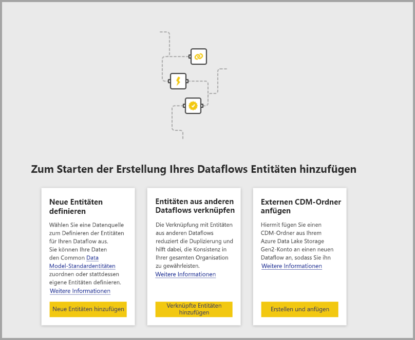

Wenn Ihr Dataflow bereits vorhanden ist, können Sie neue Entitäten zu Ihrem Dataflow hinzufügen, indem Sie die Option **Entitäten hinzufügen** (siehe folgende Abbildung) auswählen oder im Erstellungstool für Dataflows die Option **Daten abrufen** auswählen.

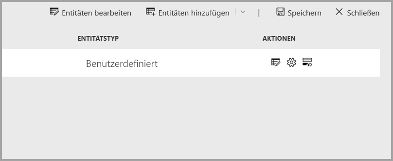

Die folgende Abbildung zeigt die Schaltfläche **Daten abrufen** im Erstellungstool für Dataflows. 

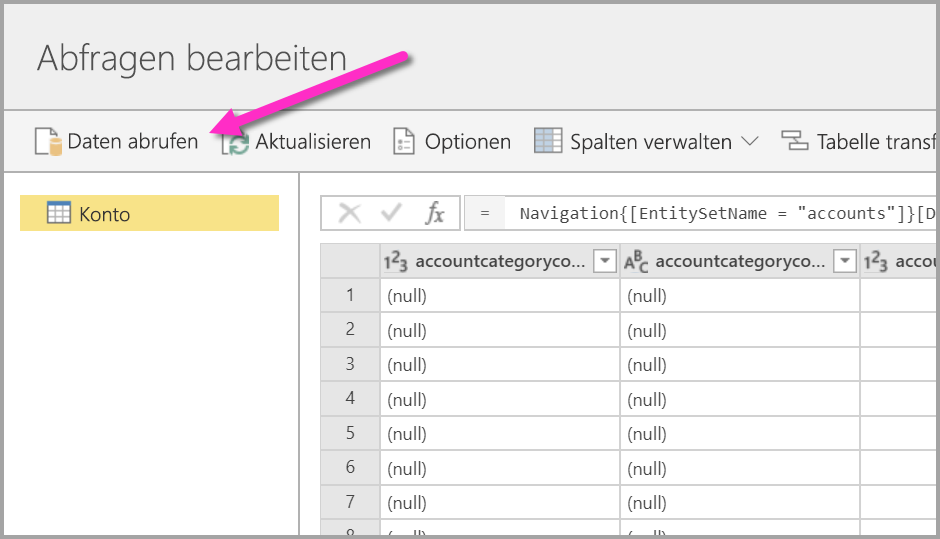

## Datenquellen für Dataflows

Sie können die verfügbaren Datenquellen anzeigen, indem Sie über das Erstellungstool für Dataflows die Option **Daten abrufen** auswählen, in dem anschließend ein Dialogfeld für die Auswahl der Kategorien und der einzelnen Datenquellen angezeigt wird (siehe folgende Abbildung).

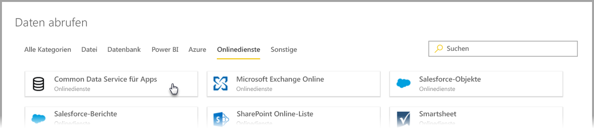

Datenquellen für Dataflows werden in den folgenden Kategorien organisiert, die im oberen Bereich des Dialogfelds **Daten abrufen** angezeigt werden:

* Alle Kategorien
* Datei
* Datenbank
* Power BI
* Azure
* Online-Dienste
* Sonstige

Die Kategorie **Alle Kategorien** enthält alle Datenquellen, aus allen Kategorien. 

Die Kategorie **Datei** enthält die folgenden verfügbaren Datenverbindungen für Dataflows:

* Zugriff
* Excel
* JSON
* Text/CSV
* XML

Die Kategorie **Datenbank** enthält die folgenden verfügbaren Datenverbindungen für Dataflows:

* IBM DB2-Datenbank
* MySQL-Datenbank
* Oracle-Datenbank
* PostgreSQL-Datenbank
* SQL Server-Datenbank
* Sybase-Datenbank
* Teradata-Datenbank

Die Kategorie **Power BI** enthält die folgenden verfügbaren Datenverbindungen für Dataflows:

* Power BI-Dataflows

Die Kategorie **Azure** enthält die folgenden verfügbaren Datenverbindungen für Dataflows:

* Azure-Blobs
* Azure Data Explorer
* Azure SQL Data Warehouse
* Azure SQL-Datenbank
* Azure-Tabellen

Die Kategorie **Onlinedienste** enthält die folgenden verfügbaren Datenverbindungen für Dataflows:

* Common Data Service für Apps
* Microsoft Exchange Online
* Salesforce-Objekte
* Salesforce-Berichte
* SharePoint-Online-Liste
* Smartsheet

Die Kategorie **Sonstige** enthält die folgenden verfügbaren Datenverbindungen für Dataflows:

* Active Directory
* OData
* SharePoint-Liste
* Web-API
* Webseite
* Leere Tabelle
* Leere Abfrage

## Herstellen einer Verbindung mit einer Datenquelle

Wählen Sie zum Herstellen einer Verbindung mit einer Datenquelle die Datenquelle aus. Wir möchten Ihnen anhand eines Beispiels den Prozessablauf verdeutlichen, der jedoch bei allen Datenverbindungen für Dataflows ähnlich ist. Unterschiedliche Connectors machen möglicherweise bestimmte Anmeldeinformationen oder andere Informationen erforderlich, der Ablauf ist jedoch ähnlich. In unserem Beispiel können Sie in der folgenden Abbildung sehen, dass aus der Datenverbindungskategorie **Onlinedienste** der Eintrag **Common Data Service für Apps** ausgewählt wurde.

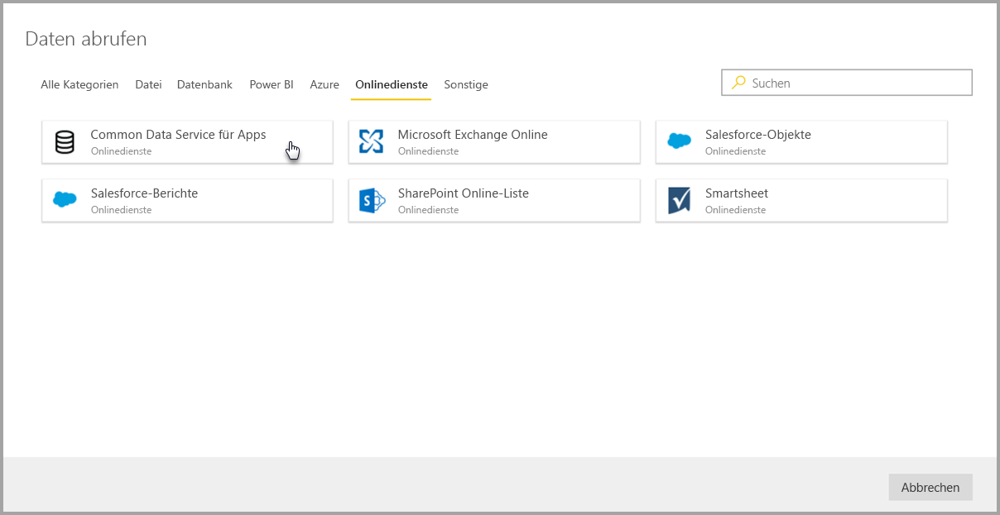

Ein Verbindungsfenster für die ausgewählte Datenverbindung wird angezeigt. Wenn Anmeldeinformationen erforderlich sind, werden Sie aufgefordert, diese bereitzustellen. In der folgenden Abbildung wird gezeigt, wie eine Server-URL eingegeben wird, die mit einem Common Data Service für Apps-Server verbunden werden soll.

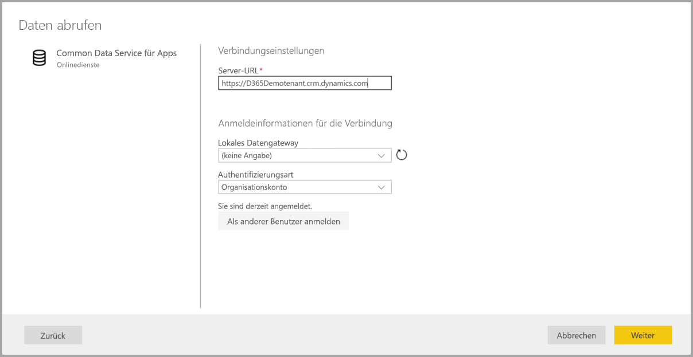

Wählen Sie nach der Bereitstellung der Server-URL bzw. der Verbindungsinformationen der Ressource die Option **Anmelden** aus, um die Anmeldeinformationen für den Datenzugriff einzugeben, und klicken sie anschließend auf **Weiter**.

Die Verbindung mit der Datenquelle wird über **Power Query Online** initiiert und hergestellt. Anschließend werden im Fenster **Navigator** die verfügbaren Tabellen aus dieser Datenquelle angezeigt (siehe folgende Abbildung).

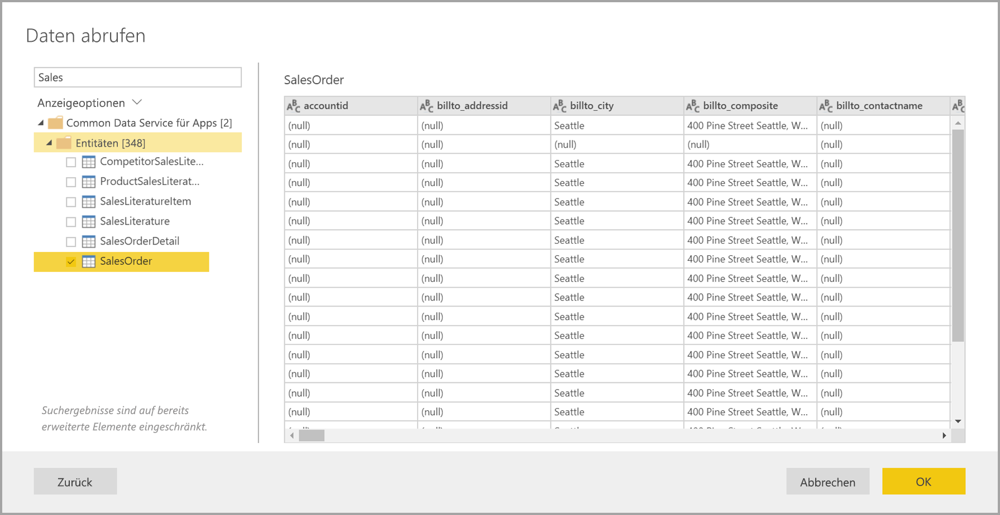

Sie können Tabellen und Daten auswählen, die geladen werden sollen, indem Sie im linken Bereich das jeweilige Kontrollkästchen aktivieren. Klicken Sie zum Laden der Daten unten im Bereich des **Navigators** auf **OK**. Ein Power Query Online-Dialogfeld wird angezeigt. Darin können Sie Abfragen bearbeiten und eine beliebige andere Transformation für die ausgewählten Daten ausführen.

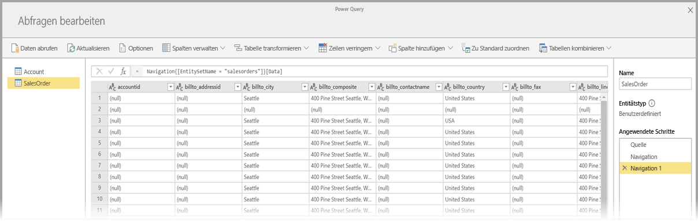

Das war schon alles. Andere Daten weisen ähnliche Flows auf und verwenden Power Query Online zum Bearbeiten und Transformieren der Daten, die Sie in Ihren Dataflow einfügen.

## Herstellen einer Verbindung mit zusätzlichen Datenquellen

Es gibt zusätzliche Datenconnectors, die nicht auf der Benutzeroberfläche der Power BI-Dataflows angezeigt werden, jedoch durch Ausführung nur weniger weiterer Schritte unterstützt werden. 

Sie können die folgenden Schritte ausführen, um eine Verbindung mit einem Connector zu erstellen, der nicht auf der Benutzeroberfläche angezeigt wird:

1. Öffnen Sie **Power BI Desktop**, und wählen Sie **Daten abrufen** aus.
2. Öffnen Sie in Power BI Desktop den **Power Query-Editor**, klicken Sie anschließend mit der rechten Maustaste auf die entsprechende Abfrage, und öffnen Sie den **Erweiterten Editor** (siehe folgende Abbildung). Von dort aus können Sie das M-Skript kopieren, das im Erweiterten Editor angezeigt wird.

    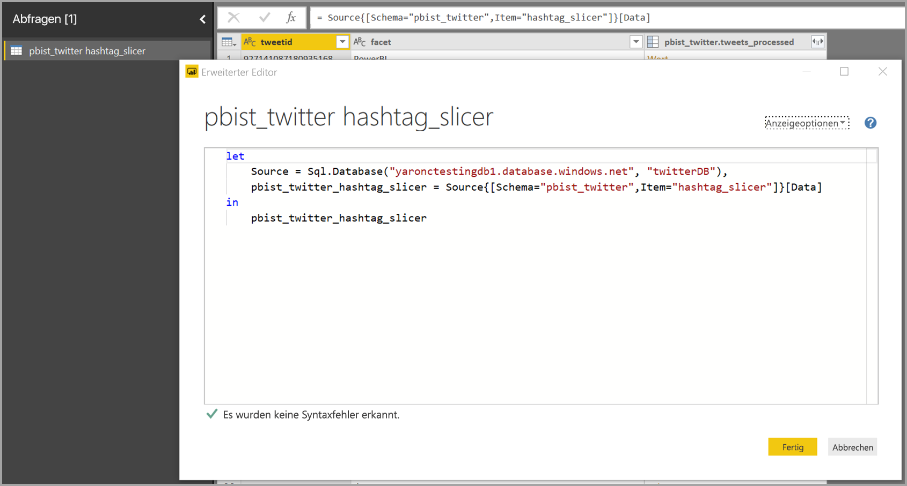 

3. Öffnen Sie den Power BI-Dataflow, und wählen Sie bei einer leeren Abfrage die Option **Daten abrufen** aus (siehe folgende Abbildung).

    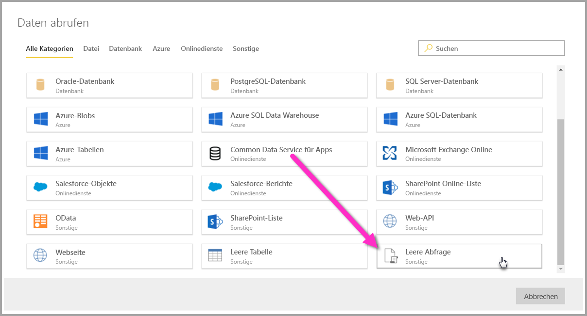 

4. Fügen Sie die kopierte Abfrage in die leere Abfrage für den Dataflow ein.

    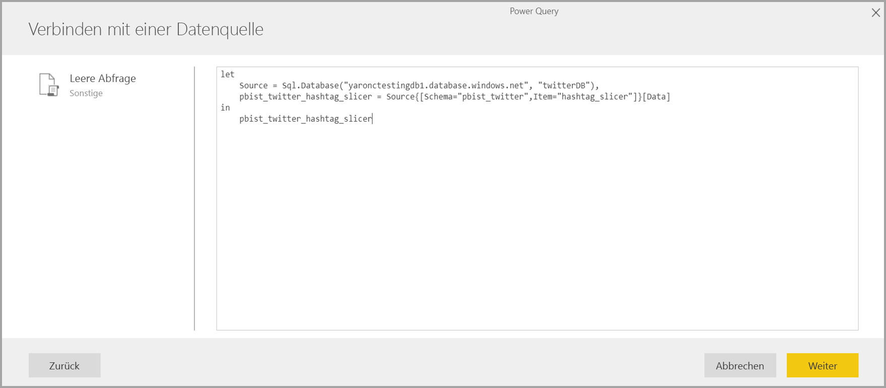 

Anschließend stellt Ihr Skript eine Verbindung mit der von Ihnen angegebenen Datenquelle her. 

In der folgenden Liste können Sie sehen, welche Connectors Sie aktuell durch Kopieren und Einfügen der M-Abfrage in eine leere Abfrage verwenden können:

* Amazon Redshift
* SAP Business Warehouse 
* SAP HANA
* Analysis Services
* Azure Analysis Services
* Google Analytics
* Adobe Analytics
* ODBC
* OLE DB
* Ordner
* SharePoint Online-Ordner
* SharePoint-Ordner
* Hadoop (HDFS)
* Azure HDInsight (HDFS)
* Hadoop-Datei (HDFS)
* Informix (Beta)
* Vertica

Mehr ist zum Herstellen einer Verbindung mit Datenquellen in Power BI-Dataflows nicht erforderlich.

## Nächste Schritte

In diesem Artikel wurde erläutert, mit welchen Datenquellen Sie für Dataflows Verbindungen herstellen können. Die folgenden Artikel gehen näher auf gängige Anwendungsszenarien für Dataflows ein. 

* [Self-Service-Datenaufbereitung in Power BI (Vorschau)](service-dataflows-overview.md)
* [Erstellen und Verwenden von Dataflows in Power BI (Vorschau)](service-dataflows-create-use.md)
* [Verwenden berechneter Entitäten in Power BI Premium (Vorschau)](service-dataflows-computed-entities-premium.md)
* [Verwenden von Dataflows mit lokalen Datenquellen (Vorschau)](service-dataflows-on-premises-gateways.md)
* [Entwicklerressourcen für Power BI-Dataflows (Vorschau)](service-dataflows-developer-resources.md)
* [Dataflows und Integration in Azure Data Lake (Vorschauversion)](service-dataflows-azure-data-lake-integration.md)

Weitere Informationen zu Power Query und zur geplanten Aktualisierung finden Sie in den folgenden Artikeln:
* [Abfrageübersicht in Power BI Desktop](desktop-query-overview.md)
* [Konfigurieren geplanter Aktualisierungen](refresh-scheduled-refresh.md)

Weitere Informationen zum Common Data Model finden Sie im folgenden Übersichtsartikel:
* [Was ist das Common Data Model?](https://docs.microsoft.com/powerapps/common-data-model/overview)

