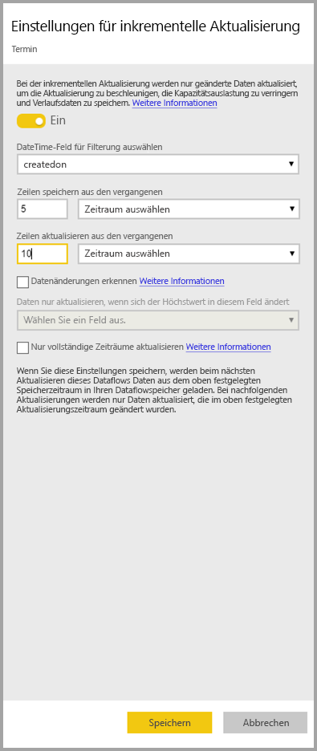
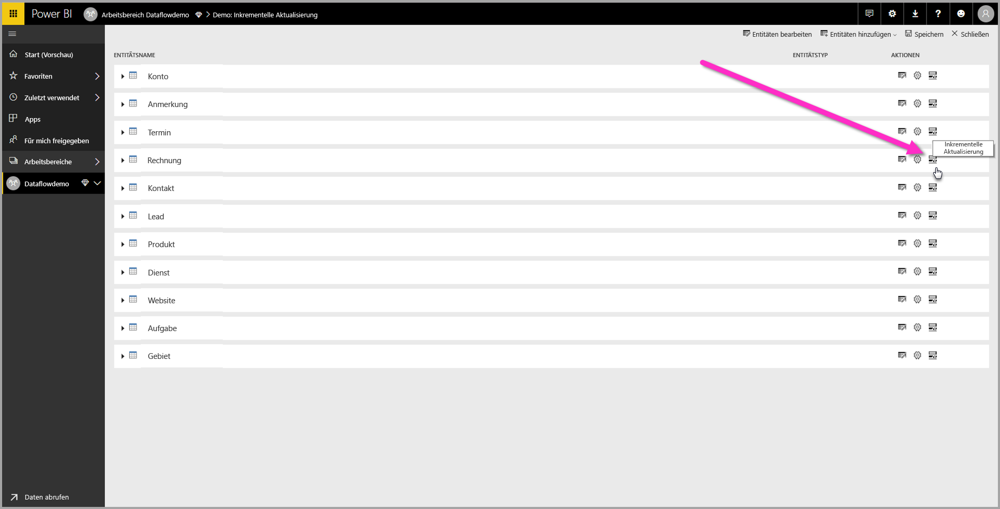
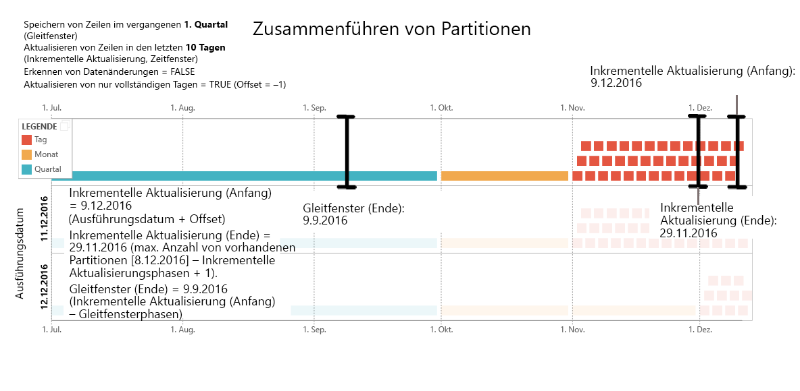
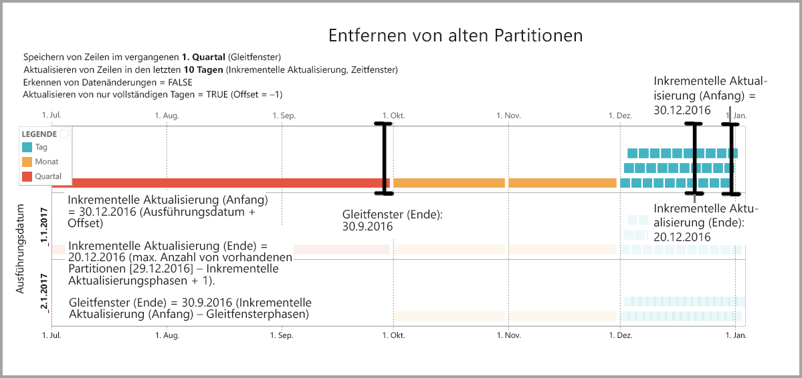
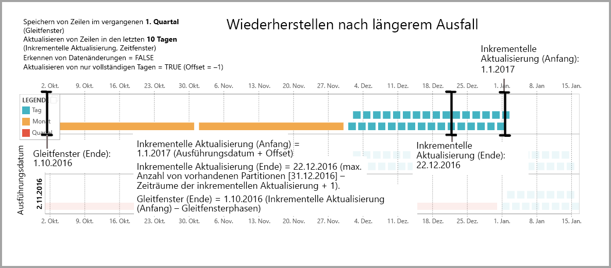

# Verwenden der inkrementellen Aktualisierung mit Power BI-Dataflows (Vorschau)

Mit Dataflows können Sie große Datenmengen zu Power BI migrieren, um ansprechende Berichte und Analysen zu erstellen. In einigen Fällen ist es jedoch nicht praktikabel, eine vollständige Kopie der Quelldaten bei jedem Aktualisierungsvorgang zu aktualisieren. Eine gute Alternative ist die **inkrementelle Aktualisierung**, die folgende Vorteile für Dataflows bietet:

* **Aktualisierung erfolgt schneller**: Nur Daten, die geändert wurden, müssen aktualisiert werden. Aktualisieren Sie beispielsweise nur die letzten fünf Tage eines 10 Jahre alten Dataflows.
* **Aktualisierung ist zuverlässiger**: Es ist beispielsweise nicht notwendig, Verbindungen mit langer Ausführungsdauer mit flüchtigen Quellsystemen herzustellen.
* **Ressourcenverbrauch ist reduziert**: Dank weniger zu aktualisierender Daten wird der Gesamtbedarf an Arbeitsspeicher und anderen Ressourcen reduziert.

Für die inkrementelle Aktualisierung für Power BI-Dataflows muss der Arbeitsbereich, in dem sich der Dataflow befindet, zur Ausführung in der [Premium-Kapazität](service-premium.md) enthalten sein, und die Datenquelle, die im Dataflow erfasst wird, muss ein *datetime*-Feld enthalten, auf das bei der inkrementellen Aktualisierung gefiltert werden kann. 

## Konfigurieren der inkrementellen Aktualisierung für Dataflows

Ein Dataflow kann viele Entitäten enthalten. Die inkrementelle Aktualisierung wird auf Entitätsebene eingerichtet, sodass ein Dataflow vollständig und inkrementell aktualisierte Entitäten enthalten kann.

Um eine inkrementell aktualisierte Entität einzurichten, konfigurieren Sie Ihre Entität zunächst wie jede andere Entität. Weitere Informationen zur Datafloweinrichtung finden Sie unter [Self-Service-Datenaufbereitung in Power BI (Vorschau)](service-dataflows-overview.md).

Nachdem Sie den Dataflow erstellt und gespeichert haben, klicken Sie auf das Symbol **Inkrementelle Aktualisierung** in der Entitätsansicht, wie in der folgenden Abbildung gezeigt wird:

Wenn Sie auf das Symbol klicken, wird das Fenster **Einstellungen für inkrementelle Aktualisierung** angezeigt. Wenn Sie die inkrementelle Aktualisierung auf **Ein** umschalten, können Sie Ihre inkrementelle Aktualisierung konfigurieren.

In der folgende Liste werden die Einstellungen im Fenster **Einstellungen für inkrementelle Aktualisierung** erläutert. 

1. **Inkrementelle Aktualisierung aktivieren/deaktivieren**: Dieser Schieberegler aktiviert bzw. deaktiviert die Richtlinie für die inkrementelle Aktualisierung für die Entität.
2. **Filterfeld-Dropdownliste**: Mit dieser Option wird das Abfragefeld ausgewählt, auf das die Entität für Inkremente gefiltert werden soll. Dieses Feld enthält nur *datetime*-Felder. Sie können die inkrementelle Aktualisierung nicht verwenden, wenn Ihre Entität kein *datetime*-Feld enthält.
3. **Zeilen aus der Vergangenheit speichern**: Im folgenden Beispiel werden die nächsten Einstellungen erläutert.

    Für dieses Beispiel wird eine Aktualisierungsrichtlinie definiert, gemäß der Daten der letzten 5 Jahre gespeichert und Daten der letzten 10 Tage inkrementell aktualisiert werden. Wenn die Entität täglich aktualisiert wird, werden die folgenden Schritte beim jedem Aktualisierungsvorgang durchgeführt:

    * Die Daten eines neuen Tages werden hinzugefügt.
    * Daten der letzten 10 Tage bis zum aktuellen Datum werden aktualisiert.
    * Kalenderjahre, die bezogen auf das aktuelle Datum älter als fünf Jahre sind, werden entfernt. Wenn das aktuelle Datum der 1. Januar 2019 ist, wird z.B. das Jahr 2013 entfernt.

    Bei der ersten Dataflowaktualisierung kann es eine Weile dauern, bis die Daten von allen fünf Jahren importiert wurden, aber bei nachfolgenden Aktualisierungen wird dies wahrscheinlich in einem Bruchteil der Zeit der ersten Aktualisierung abgeschlossen.

4. **Datenänderungen erkennen**: Die inkrementelle Aktualisierung von 10 Tagen ist wesentlich effizienter als die vollständige Aktualisierung von 5 Jahren, aber diese können wir eventuell noch verbessern. Wenn Sie das Kontrollkästchen **Datenänderungen erkennen** aktivieren, können Sie eine Datum/Uhrzeit-Spalte auswählen, um nur die Tage zu bestimmen und zu aktualisieren, an denen sich die Daten geändert haben. Dies setzt voraus, dass eine solche Spalte im Quellsystem vorhanden ist, die typischerweise zu Prüfzwecken dient. Der Maximalwert dieser Spalte wird für jeden der Zeiträume im Inkrementbereich ausgewertet. Wenn sich diese Daten seit der letzten Aktualisierung nicht geändert haben, muss der Zeitraum nicht aktualisiert werden. Im Beispiel kann dies die Anzahl der Tage, die inkrementell aktualisiert werden, von 10 auf vielleicht 2 weiter verringern.

> [!TIP]
> Der aktuelle Entwurf erfordert, dass die Spalte zur Erkennung von Datenänderungen beibehalten und im Arbeitsspeicher zwischengespeichert wird. Sie können eine der folgenden Methoden in Betracht ziehen, um die Kardinalität und den Arbeitsspeicherbedarf zu reduzieren:
>
>    * Behalten Sie nur den Maximalwert dieser Spalte zum Zeitpunkt der Aktualisierung bei, eventuell mithilfe einer Power Query-Funktion.
>    * Reduzieren Sie die Genauigkeit auf ein Niveau, das angesichts Ihrer Anforderungen an die Aktualisierungsfrequenz vertretbar ist.

5. **Nur vollständige Zeiträume aktualisieren**: Stellen Sie sich vor, Ihre Aktualisierung ist für die Ausführung jeden Morgen um 4:00 Uhr geplant. Wenn während dieser ersten 4 Stunden dieses Tages Daten im Quellsystem auftauchen, möchten Sie diese möglicherweise nicht berücksichtigen. Bei einigen Geschäftsmetriken wie etwa Fässern pro Tag in der Öl- und Gasindustrie ist es weder zweckmäßig noch sinnvoll, angefangene Tage zu berücksichtigen.

    Ein weiteres Beispiel, bei dem die Berücksichtigung von ausschließlich vollständigen Zeiträumen geeignet ist, ist die Aktualisierung von Daten aus einem Finanzsystem. Stellen Sie sich vor, in einem Finanzsystem werden die Daten des Vormonats am 12. Kalendertag des Monats freigegeben. Legen Sie in diesem Fall den Inkrementbereich auf 1 Monat fest, und planen Sie die Aktualisierung für den 12. Tag des Monats. Ist diese Option aktiviert, würden die Daten von Januar (dem letzten vollständigen Monatszeitraum) am 12. Februar aktualisiert werden.

> [!NOTE]
> Die inkrementelle Aktualisierung von Dataflows bestimmt die Daten gemäß der folgenden Logik: Wenn eine Aktualisierung geplant ist, wird bei der inkrementellen Aktualisierung für Dataflows die Zeitzone verwendet, die in der Richtlinie für die Aktualisierung definiert ist. Wenn kein Zeitplan zum Aktualisieren vorhanden ist, wird bei der inkrementellen Aktualisierung die Zeit auf dem Computer verwendet, auf dem die Aktualisierung ausgeführt wird.

## Abfrage der inkrementellen Aktualisierung

Nachdem die inkrementelle Aktualisierung konfiguriert wurde, ändert der Dataflow Ihre Abfrage automatisch dahingehend, dass der Filter nach Datum eingeschlossen wird. Sie können die automatisch generierte Abfrage mithilfe des **erweiterten Power Query-Editors** bearbeiten, um Ihre Aktualisierung zu optimieren oder anzupassen. Im folgenden Abschnitt erfahren Sie mehr über die inkrementelle Aktualisierung und ihre Funktionsweise.

## Inkrementelle Aktualisierung und verknüpfte Entitäten im Vergleich zu berechneten Entitäten

Bei *verknüpften* Entitäten aktualisiert die inkrementelle Aktualisierung die Quellentität. Da verknüpfte Entitäten lediglich ein Zeiger auf die ursprüngliche Entität sind, hat die inkrementelle Aktualisierung keine Auswirkungen auf die verknüpfte Entität. Wenn die Quellentität gemäß der definierten Aktualisierungsrichtlinie aktualisiert wird, sollte eine verknüpfte Entität davon ausgehen, dass die Daten in der Quelle aktualisiert sind.

*Berechnete* Entitäten basieren auf Abfragen, die über einen Datenspeicher ausgeführt werden, der möglicherweise ein anderer Dataflow sein kann. Daher verhalten sich berechnete Entitäten wie verknüpfte Entitäten.

Da sich berechnete und verknüpfte Entitäten ähnlich verhalten, sind die Anforderungen und Konfigurationsschritte für beide identisch. Der einzige Unterschied ist, dass die inkrementelle Aktualisierung für berechnete Entitäten in bestimmten Konfigurationen nicht optimal ausgeführt werden kann, was der Art und Weise geschuldet ist, wie die Partitionen erstellt wurden. 

## Wechseln zwischen inkrementellen und vollständigen Aktualisierungen

Dataflows unterstützen den Wechsel der Aktualisierungsrichtlinie zwischen der inkrementellen und vollständigen Aktualisierung. Bei einer Änderung in beiden Richtungen (von der vollständigen zur inkrementellen Aktualisierung oder von der inkrementellen zur vollständigen Aktualisierung) wird die Änderung nach der nächsten Aktualisierung auf den Dataflow angewendet.

Beim Verschieben eines Dataflows von der vollständigen zur inkrementellen Aktualisierung aktualisiert die neue Aktualisierungslogik den Dataflow gemäß dem Aktualisierungszeitfenster und dem Inkrement, die in den Einstellungen für die inkrementelle Aktualisierung definiert sind.

Beim Verschieben eines Dataflows von einer inkrementellen zu einer vollständigen Aktualisierung werden alle Daten, die in der inkrementellen Aktualisierung gesammelt wurden, von der in der vollständigen Aktualisierung definierten Richtlinie überschrieben. Diese Aktion müssen Sie genehmigen.

## Inkrementelle Aktualisierung von Dataflows und Datasets

Die inkrementelle Aktualisierung von Dataflows und Datasets sind für die Verwendung in Kombination ausgelegt. So kann eine inkrementell aktualisierende Entität in einem Dataflow verwendet und vollständig in ein Dataset geladen oder eine vollständig geladene Entität im Dataflow verwendet werden, die inkrementell in ein Dataset geladen wird. 

Beide Methoden entsprechen Ihren angegebenen Definitionen in den Einstellungen für die Aktualisierung.
Unter [Inkrementelle Aktualisierung in Power BI Premium](service-premium-incremental-refresh.md) erfahren Sie mehr über die inkrementelle Aktualisierung.

## Zeitzonenunterstützung in der inkrementellen Aktualisierung

Die inkrementelle Aktualisierung von Dataflows hängt von der Zeitzone ab, in der diese ausgeführt wird. Das Filtern der Abfrage hängt von dem Tag ab, an dem sie ausgeführt wird.

Um diese Abhängigkeiten zu berücksichtigen und Datenkonsistenz sicherzustellen, implementiert die inkrementelle Aktualisierung für Dataflows die folgende Heuristik für Szenarien mit *Jetzt aktualisieren*:

* Falls eine geplante Aktualisierung im System definiert ist, werden bei der inkrementellen Aktualisierung die Zeitzoneneinstellungen von der Zeitplanaktualisierung verwendet. Dadurch wird sichergestellt, dass die Zeitzone, in der sich die Person, die den Dataflow aktualisiert, befindet, immer mit der Systemdefinition konsistent ist.

* Wenn keine Zeitplanaktualisierung definiert ist, verwenden die Dataflows die Zeitzone des aktualisierenden Computers des Benutzers.

Die inkrementelle Aktualisierung kann auch mithilfe von APIs aufgerufen werden. In diesem Fall kann der API-Aufruf eine Zeitzoneneinstellung enthalten, die in der Aktualisierung verwendet wird. APIs können für Test- und Überprüfungszwecke hilfreich sein.

## Details zur Implementierung der inkrementellen Aktualisierung

Dataflows nutzen die Partitionierung für die inkrementelle Aktualisierung. Sobald XMLA-Endpunkte für Power BI Premium verfügbar sind, werden die Partitionen angezeigt. Bei der inkrementellen Aktualisierung in Dataflows wird die Mindestanzahl von Partitionen entsprechend der Anforderungen der Richtlinie für die Aktualisierung beibehalten. Alte Partitionen außerhalb des Bereichs werden gelöscht, sodass ein Gleitfenster angezeigt wird. Partitionen werden ggf. zusammengeführt, wodurch die Gesamtanzahl der erforderlichen Partitionen verringert wird. Hierdurch werden die Komprimierung und in einigen Fällen die Abfrageleistung verbessert.

In den Beispielen in diesem Abschnitt wird die folgende Richtlinie für die Aktualisierung freigegeben:

* Speichern von Zeilen im letzten Quartal
* Aktualisieren von Zeilen in den letzten 10 Tagen
* Erkennen von Datenänderungen = False
* Aktualisieren von nur vollständigen Tagen = True

### Zusammenführen von Partitionen

In diesem Beispiel werden Tagespartitionen automatisch auf Monatsebene zusammengeführt, sobald sie außerhalb des inkrementellen Bereichs liegen. Partitionen im inkrementellen Bereich müssen auf Tagesebene verwaltet werden, damit sie nur an diesen Tagen aktualisiert werden.
Beim Aktualisierungsvorgang mit dem *Ausführungsdatum 11.12.2016* werden die Tage im November zusammengeführt, da sie außerhalb des inkrementellen Bereichs liegen.

### Löschen von alten Partitionen

Alte Partitionen, die außerhalb des gesamten Bereichs liegen, werden entfernt. Beim Aktualisierungsvorgang mit dem *Ausführungsdatum 02.01.2017* wird die Partition für Q3 2016 gelöscht, da sie außerhalb des gesamten Bereichs liegt.

### Wiederherstellen nach einem längeren Ausfall

In diesem Beispiel wird simuliert, wie das System nach einem längeren Ausfall ordnungsgemäß wiederhergestellt wird. Nehmen wir an, dass die Aktualisierung nicht erfolgreich ausgeführt wird, da die Datenquellen-Anmeldeinformationen abgelaufen sind, und dass die Behebung des Problems 13 Tage dauert. Der inkrementelle Bereich beträgt nur 10 Tage.

Beim nächsten erfolgreichen Aktualisierungsvorgang mit dem *Ausführungsdatum 15.01.2017* müssen die fehlenden 13 Tage abgeglichen werden, und die Aktualisierung muss ausgeführt werden. Darüber hinaus müssen auch die letzten 9 Tagen aktualisiert werden, da sie nicht im Rahmen des gewöhnlichen Zeitplans aktualisiert wurden. Dies bedeutet, dass der inkrementelle Bereich von 10 auf 22 Tage erhöht wird.

Beim nächsten Aktualisierungsvorgang mit dem *Ausführungsdatum 16.01.2017* wird die Möglichkeit genutzt, die Tage im Dezember und die Monate im Q4 2016 zusammenzuführen.

## Nächste Schritte

In diesem Artikel wird die inkrementelle Aktualisierung für Dataflows beschrieben. Im Folgenden werden weitere Artikel aufgeführt, die hilfreich sein könnten:

* [Self-Service-Datenaufbereitung in Power BI (Vorschau)](service-dataflows-overview.md)
* [Erstellen und Verwenden von Dataflows in Power BI (Vorschau)](service-dataflows-create-use.md)
* [Verwenden von Dataflows mit lokalen Datenquellen (Vorschau)](service-dataflows-on-premises-gateways.md)
* [Entwicklerressourcen für Power BI-Dataflows (Vorschau)](service-dataflows-developer-resources.md)

Weitere Informationen zu Power Query und zur geplanten Aktualisierung finden Sie in den folgenden Artikeln:
* [Abfrageübersicht in Power BI Desktop](desktop-query-overview.md)
* [Konfigurieren geplanter Aktualisierungen](refresh-scheduled-refresh.md)

Weitere Informationen zum Common Data Model finden Sie im folgenden Übersichtsartikel:
* [Was ist das Common Data Model?](https://docs.microsoft.com/powerapps/common-data-model/overview)

