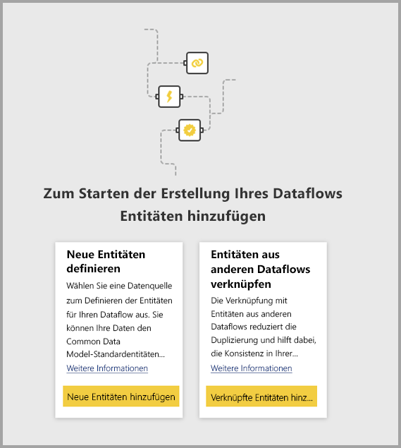
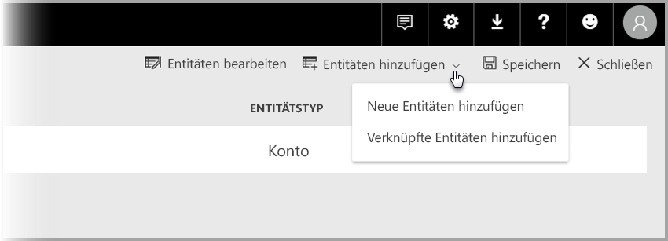

# Verknüpfen von Entitäten zwischen Dataflows in Power BI (Vorschau)

Mit Dataflows in Power BI können Sie eine einzelne Datenspeicherquelle einer Organisation unterhalten, mit der Business Analysten Daten einmal aufbereiten und verwalten und dann zwischen verschiedenen Analyse-Apps in der Organisation wiederverwenden können. 

Wenn Sie Entitäten zwischen Dataflows verknüpfen, können Sie Entitäten wiederverwenden, die bereits von anderen Dataflows, die andere Benutzer besitzen, erfasst, bereinigt und transformiert wurden, ohne diese Daten verwalten zu müssen. Die verknüpften Entitäten verweisen lediglich auf die Entitäten in anderen Dataflows, und führen *keine* Kopier- oder Duplizierungsvorgänge für die Daten durch.

Verknüpfte Entitäten sind **schreibgeschützt**. Wenn Sie Transformationen für eine verknüpfte Entität erstellen möchten, müssen Sie eine neue berechnete Entität mit einem Verweis auf die verknüpfte Entität erstellen.

## Verfügbarkeit verknüpfter Entitäten

Für verknüpfte Entitäten ist zur Aktualisierung ein [Power BI Premium](service-premium.md)-Abonnement erforderlich. Verknüpfte Entitäten sind in jedem Dataflow in einem Arbeitsbereich verfügbar, der in der Power BI Premium-Kapazität gehostet wird. Es gibt keine Einschränkungen hinsichtlich des Quelldataflows.

Verknüpfte Entitäten werden nur in neuen Power BI-Arbeitsbereichen ordnungsgemäß ausgeführt. Weitere Informationen finden Sie unter [Erstellen der neuen Arbeitsbereiche (Vorschau) in Power BI](service-create-the-new-workspaces.md). Alle verknüpften Dataflows müssen sich in neuen Arbeitsbereichen befinden, damit sie ordnungsgemäß ausgeführt werden können.

> [!NOTE]
> Entitäten unterscheiden sich je nachdem, ob es sich dabei um Standardentitäten oder berechnete Entitäten handelt. Standardentitäten (oft einfach als Entitäten bezeichnet) fragen eine externe Datenquelle ab wie z.B. eine SQL-Datenbank. Berechnete Entitäten erfordern Premium-Kapazität auf Power BI und führen ihre Transformationen mit Daten durch, die sich bereits im Power BI-Speicher befinden. 
>
>Wenn sich Ihr Dataflow nicht in einem Arbeitsbereich mit Premium-Kapazität befindet, können Sie dennoch auf eine einzelne Abfrage verweisen oder zwei oder mehr Abfragen kombinieren, solange die Transformationen nicht als Transformationen innerhalb des Speichers definiert werden. Solche Verweise werden als Standardentitäten betrachtet. Deaktivieren Sie dazu die Option **Laden aktivieren** für die Abfragen, auf die verwiesen wird, um zu verhindern, dass die Daten materialisiert und im Speicher erfasst werden. Dann können Sie auf diese Abfragen mit **Laden aktivieren = FALSE** verweisen und **Laden aktivieren** nur für die resultierenden Abfragen, die Sie materialisieren möchten, auf **Ein** festlegen.

## Verknüpfen von Entitäten zwischen Dataflows

Es gibt verschiedene Möglichkeiten, um Entitäten zwischen Dataflows in Power BI zu verknüpfen. Sie können im Erstellungstool für Dataflows auf **Verknüpfte Entitäten hinzufügen** klicken, wie in der folgenden Abbildung dargestellt wird. 

Sie können auch im Power BI-Dienst über das Menüelement **Entitäten hinzufügen** auf **Verknüpfte Entitäten hinzufügen** klicken.

Um Entitäten zu verknüpfen, müssen Sie sich mit Ihren Power BI-Anmeldeinformationen anmelden.

Ein **Navigator**-Fenster wird geöffnet und ermöglicht Ihnen, eine Gruppe von Entitäten auszuwählen, mit denen Sie eine Verbindung herstellen können. Bei den angezeigten Entitäten handelt es sich um Entitäten, für die Sie Berechtigungen in allen Arbeitsbereiche in Power BI-Mandanten besitzen. 

Wenn Ihre verknüpften Entitäten ausgewählt sind, werden sie in der Liste der Entitäten für Ihren Dataflow im Erstellungstool angezeigt, wobei sie durch ein spezielles Symbol als verknüpfte Entitäten identifiziert werden.

Sie können auch den Quelldataflow über die Datafloweinstellungen Ihrer verknüpften Entität anzeigen.

## Aktualisierungslogik von verknüpften Entitäten
Die Standardaktualisierungslogik der verknüpften Entitäten ändern sich, je nachdem, ob sich der Dataflow im selben Arbeitsbereich wie der Zieldataflow befindet. In den folgenden Abschnitten wird das Verhalten der Dataflows beschrieben.

### Verknüpfungen zwischen Arbeitsbereichen

Aktualisierung für Verknüpfungen von Entitäten in unterschiedlichen Arbeitsbereichen ähnelt dem Verhalten einer externen Datenquelle. Wenn der Dataflow aktualisiert wird, werden die neuesten Daten für die Entität aus dem Quelldataflow verwendet. Wenn der Quelldataflow aktualisiert wird, wirkt sich dies nicht automatisch auf die Daten im Zieldataflow aus.

### Verknüpfungen im selben Arbeitsbereich

Bei einer Aktualisierung der Daten für einen Quelldataflow löst dieses Ereignis automatisch einen Aktualisierungsvorgang für abhängige Entitäten in allen Zieldataflows im gleichen Arbeitsbereich aus, einschließlich der berechneten Entitäten, die darauf basieren. Alle anderen Entitäten im Zieldataflow werden nach dem Dataflowzeitplan aktualisiert. Entitäten, die von mehr als einer Datenquelle abhängig sind, aktualisieren ihre Daten, wenn ihre Quellen erfolgreich aktualisiert wurden.

Sie sollten beachten, dass der gesamte Aktualisierungsvorgang auf einmal ein Commit ausführt. Wenn bei der Zieldataflowaktualisierung ein Fehler auftritt, tritt auch bei der Aktualisierung des Quelldataflows ein Fehler auf.

## Berechtigungen beim Anzeigen von Berichten aus Dataflows

Beim Erstellen eines Power BI-Berichts, der Daten basierend auf einem Dataflow enthält, können Benutzer nur verknüpfte Entitäten sehen, wenn der Benutzer Zugriff auf den Quelldataflow hat.

## Einschränkungen und Überlegungen

Es gibt einige Einschränkungen, die es bei der Arbeit mit verknüpften Entitäten zu bedenken gilt:

* Es gibt maximal fünf verweisende Hops.
* Zyklische Abhängigkeiten von verknüpften Entitäten sind nicht zulässig.
* Der Dataflow muss sich in einem [neuen Power BI-Arbeitsbereich](service-create-the-new-workspaces.md) befinden.

## Nächste Schritte

Die folgenden Artikeln können für das Erstellen oder Arbeiten mit Dataflows nützlich sein: 

* [Self-Service-Datenaufbereitung in Power BI (Vorschau)](service-dataflows-overview.md)
* [Erstellen und Verwenden von Dataflows in Power BI (Vorschau)](service-dataflows-create-use.md)
* [Verwenden berechneter Entitäten in Power BI Premium (Vorschau)](service-dataflows-computed-entities-premium.md)
* [Verwenden von Dataflows mit lokalen Datenquellen (Vorschau)](service-dataflows-on-premises-gateways.md)
* [Entwicklerressourcen für Power BI-Dataflows (Vorschau)](service-dataflows-developer-resources.md)

Weitere Informationen zu Power Query und zur geplanten Aktualisierung finden Sie in den folgenden Artikeln:
* [Abfrageübersicht in Power BI Desktop](desktop-query-overview.md)
* [Konfigurieren geplanter Aktualisierungen](refresh-scheduled-refresh.md)

Weitere Informationen zum Common Data Model finden Sie im folgenden Übersichtsartikel:
* [Was ist das Common Data Model?](https://docs.microsoft.com/powerapps/common-data-model/overview)

