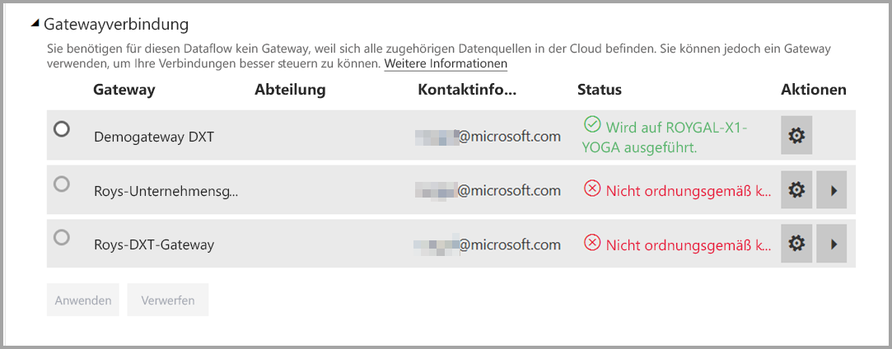
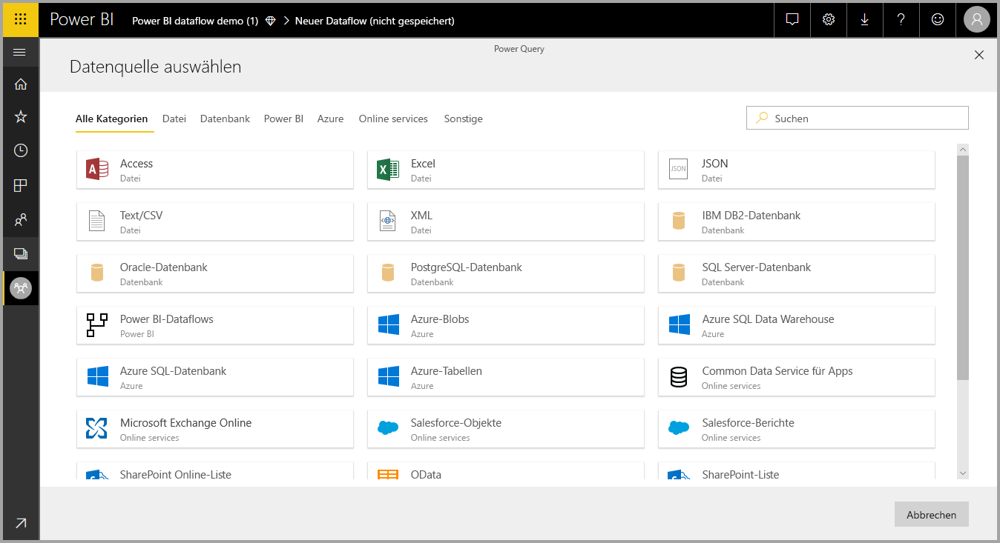
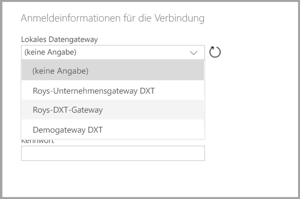

# Verwenden von Dataflows mit lokalen Datenquellen (Vorschau)

Mit **Dataflows** können Sie eine Sammlung von Daten aus verschiedenen Quellen erstellen, bereinigen, transformieren und anschließend im Power BI-Speicher laden. Beim Erstellen von Dataflows sollten Sie lokale Datenquellen verwenden. In diesem Artikel werden die Anforderung zum Erstellen von Dataflows und die Erfordernis erläutert, dass Ihr **Enterprise-Gateway** konfiguriert werden muss, um diese Verbindungen zu aktivieren.

> [!NOTE]
> Die Dataflowfunktionalität befindet sich in der Vorschau und unterliegt vor der allgemeinen Verfügbarkeit Änderungen und Updates.
 
## Konfigurieren eines Enterprise-Gateways für die Verwendung mit Dataflows

Um eine lokale Datenquelle in einem Datenfluss verwenden zu können, müssen Benutzer, die den Dataflow erstellen, ein **Enterprise-Gateway** installiert und konfiguriert haben. Der Benutzer, der den Dataflow erstellt, muss auch der Enterprise-Gateway-Administrator sein, um dieses Gateway für einen Dataflow verwenden zu können.

> [!NOTE]
> Dataflows werden nur unter Verwendung von Enterprise-Gateways unterstützt.

## Verwendung einer lokalen Datenquelle in einem Dataflow

Wenn Sie einen Dataflow erstellen, wählen Sie eine lokale Datenquelle aus der Liste der Datenquellen aus, wie in der folgenden Abbildung dargestellt wird.

Nachdem Sie Ihre Auswahl getroffen haben, werden Sie aufgefordert, die Verbindungsdetails für das Enterprise-Gateway bereitzustellen, die für den Zugriff auf die lokalen Daten verwendet werden. Sie müssen das Gateway selbst auswählen und Anmeldeinformationen für das ausgewählte Gateway angeben. Nur Gateways, bei denen der Benutzer ein Administrator ist, werden in der Dropdownliste angezeigt.

## Überwachen des Gateways

Sie können Ihr Enterprise-Gateway für einen Dataflow auf die gleiche Weise überwachen, auf die Sie Gateways für ein Dataset überwachen.

Auf dem Bildschirm der Datafloweinstellungen in Power BI können Sie den Gatewaystatus eines Dataflows überwachen und dem Dataflow ein Gateway zuweisen, wie in der folgenden Abbildung dargestellt wird.

## Ändern eines Gateways

Sie können das Enterprise-Gateway, das für einen bestimmten Dataflow verwendet wird, auf zwei Arten ändern:

1. **Über das Erstellungstool**: Sie können mit dem Erstellungstool für Dataflows das Gateway ändern, das all Ihren Abfragen zugewiesen ist.

    > [!NOTE]
    > Der Dataflow sucht über das neue Gateway nach den erforderlichen Datenquellen oder erstellt diese. Falls dies nicht möglich ist, können Sie das Gateway erst ändern, wenn alle benötigten Dataflows über das ausgewählte Gateway verfügbar sind.

2. **Über den Einstellungsbildschirm**: Sie können das zugewiesene Gateway mit dem Einstellungsbildschirm für den Dataflow im Power BI-Dienst ändern.

Weitere Informationen zu Enterprise-Gateways finden Sie unter [Lokales Datengateway](service-gateway-onprem.md).

## Überlegungen und Einschränkungen

Es gibt einige bekannte Einschränkungen zur Verwendung von Enterprise-Gateways und Dataflows:

* Jeder Dataflow kann nur ein Gateway verwenden. Daher sollten alle Abfragen über das gleiche Gateway konfiguriert werden.
* Eine Änderung des Gateways wirkt sich auf den gesamten Dataflow aus.
* Wenn mehrere Gateways erforderlich sind, wird empfohlen, mehrere Dataflows zu erstellen (eines für jedes Gateway) und die Compute- oder Entitätsverweisfunktionen zur Datenvereinheitlichung zu verwenden.
* Dataflows werden nur unter Verwendung von Enterprise-Gateways unterstützt. Persönliche Gateways stehen nicht in Dropdownlisten oder auf Einstellungsbildschirmen zur Auswahl zur Verfügung.

## Nächste Schritte

Dieser Artikel enthält Informationen zur Verwendung einer lokalen Datenquelle für Dataflows und zur Verwendung und Konfiguration von Gateways, um auf diese Daten zuzugreifen. Die folgenden Artikel können ebenfalls hilfreich sein:

* [Self-Service-Datenaufbereitung in Power BI (Vorschau)](service-dataflows-overview.md)
* [Erstellen und Verwenden von Dataflows in Power BI (Vorschau)](service-dataflows-create-use.md)
* [Verwenden berechneter Entitäten in Power BI Premium (Vorschau)](service-dataflows-computed-entities-premium.md)
* [Entwicklerressourcen für Power BI-Dataflows (Vorschau)](service-dataflows-developer-resources.md)

Weitere Informationen zu Power Query und zur geplanten Aktualisierung finden Sie in den folgenden Artikeln:
* [Abfrageübersicht in Power BI Desktop](desktop-query-overview.md)
* [Konfigurieren geplanter Aktualisierungen](refresh-scheduled-refresh.md)

Weitere Informationen zum Common Data Model finden Sie im folgenden Übersichtsartikel:
* [Was ist das Common Data Model?](https://docs.microsoft.com/powerapps/common-data-model/overview)

