# Löschen beliebiger Elemente aus dem Power BI-Dienst
In diesem Artikel wird erläutert, wie Sie ein Dashboard, einen Bericht, eine Arbeitsmappe, ein Dataset, eine App, eine Visualisierung oder einen Arbeitsbereich im Power BI-Dienst löschen.

## Löschen eines Dashboards
Dashboards können entfernt werden. Beim Entfernen des Dashboards werden nicht das zugrunde liegende Dataset und keine mit diesem Dashboard verknüpften Berichte gelöscht.

* Wenn Sie der Besitzer des Dashboards sind, können Sie es entfernen. Wenn Sie das Dashboard für Kollegen freigegeben haben und es aus Ihrem Power BI-Arbeitsbereich entfernen, wird es auch aus dem Power BI-Arbeitsbereich der Kollegen entfernt.
* Wenn ein Dashboard für Sie freigegeben ist und Sie es nicht mehr länger anzeigen möchten, können Sie es entfernen.  Das Entfernen eines Dashboards entfernt es nicht aus dem Power BI-Arbeitsbereich aller anderen Personen.
* Wenn ein Dashboard zu einem [organisationsbezogenen Inhaltspaket](service-organizational-content-pack-disconnect.md) gehört, ist die einzige Möglichkeit zum Entfernen das Entfernen des verknüpften Datasets.

### So löschen Sie ein Dashboard
1. Wählen Sie im Arbeitsbereich die Registerkarte **Dashboards** aus.
2. Suchen Sie das zu löschende Dashboard, und klicken Sie auf „Löschen“. .

    

## Löschen eines Berichts
Keine Sorge, das Löschen eines Berichts löscht nicht das Dataset, auf dem der Bericht basiert.  Und alle Visualisierungen, die Sie aus dem Bericht angeheftet haben, sind auch sicher – sie bleiben auf dem Dashboard, bis Sie sie einzeln löschen.

### So löschen Sie einen Bericht
1. Wählen Sie in Ihrem Arbeitsbereich die Registerkarte **Berichte** aus.
2. Suchen Sie den zu löschenden Bericht, und wählen Sie das Symbol „Löschen“ aus.   .   

    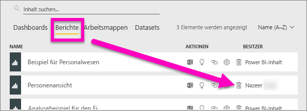
3. Bestätigen Sie den Löschvorgang.

   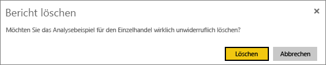

   > [!NOTE]
   > Ist der Bericht Teil eines [Inhaltspakets](service-organizational-content-pack-introduction.md), können Sie ihn mit dieser Methode nicht löschen.  Siehe [Entfernen der Verbindung mit einem organisationsbezogenen Inhaltspaket in Power BI](service-organizational-content-pack-disconnect.md).
   >
   >

## Löschen einer Arbeitsmappe
Arbeitsmappen können entfernt werden. Durch das Entfernen einer Arbeitsmappe werden jedoch auch alle Berichte und Dashboardkacheln, die Daten aus dieser Arbeitsmappe enthalten, entfernt.

Wenn die Arbeitsmappe auf OneDrive for Business gespeichert ist, wird Sie durch das Löschen aus Power BI nicht aus OneDrive gelöscht.

### So löschen Sie eine Arbeitsmappe
1. Wählen Sie in Ihrem Arbeitsbereich die Registerkarte **Arbeitsmappen** aus.
2. Suchen Sie die zu löschende Arbeitsmappe, und wählen Sie das Symbol zum Löschen   aus.

    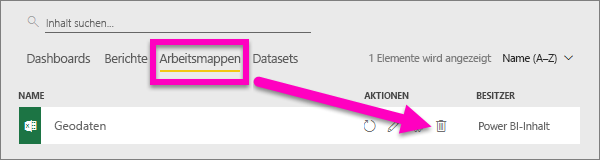
3. Bestätigen Sie den Löschvorgang.

   

## Löschen eines Datasets
Datasets können gelöscht werden. Durch das Löschen eines Datasets werden jedoch auch alle Berichte und Dashboardkacheln, die Daten aus diesem Dataset enthalten, gelöscht.

Wenn ein Dataset einem oder mehreren [organisationsbezogenen Inhaltspaketen](service-organizational-content-pack-disconnect.md) angehört, kann es nur gelöscht werden, indem Sie es aus den Inhaltspaketen, in denen es verwendet wird, entfernen, warten, bis es verarbeitet wurde, und dann erneut versuchen, es zu löschen.

### So löschen Sie ein Dataset
1. Wählen Sie in Ihrem Arbeitsbereich die Registerkarte **Datasets** aus.
2. Suchen Sie das zu löschende Dataset, und wählen Sie die Auslassungspunkte (...) aus.  

    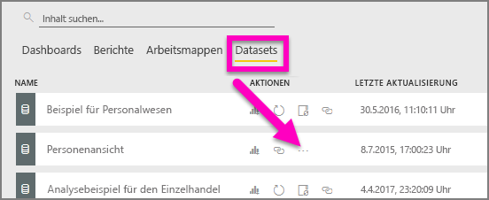
3. Wählen Sie in der Dropdownliste **Löschen** aus.

   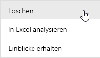
4. Bestätigen Sie den Löschvorgang.

   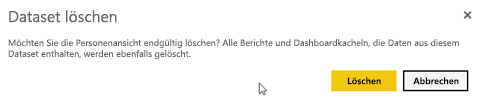

## Löschen eines App-Arbeitsbereichs
> [!WARNING]
> Wenn Sie einen App-Arbeitsbereich erstellen, erstellen Sie eine Office 365-Gruppe. Und wenn Sie einen App-Arbeitsbereich löschen, löschen Sie die entsprechende Office 365-Gruppe. Dies bedeutet, dass die Gruppe auch aus anderen Office 365-Produkten, z.B. SharePoint und Microsoft-Teams, gelöscht wird.
>
>

Wenn Sie der Ersteller eines App-Arbeitsbereichs sind, können Sie ihn löschen. Beim Löschen des App-Arbeitsbereichs wird auch die zugeordnete App für alle Gruppenmitglieder gelöscht und aus AppSource entfernt, sofern Sie die App für die gesamte Organisation veröffentlicht haben. Das Löschen eines App-Arbeitsbereichs unterscheidet sich vom Verlassen eines App-Arbeitsbereichs.

### So löschen Sie als Administrator einen App-Arbeitsbereich
1. Wählen Sie im linken Navigationsbereich **Arbeitsbereiche** aus.

    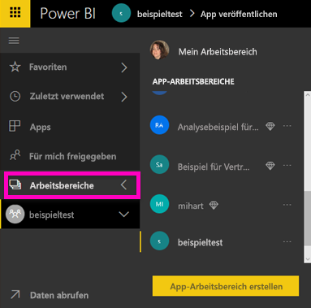
2. Wählen Sie die Auslassungspunkte (...) rechts neben dem zu löschenden Arbeitsbereich und dann **Arbeitsbereich bearbeiten** aus.

   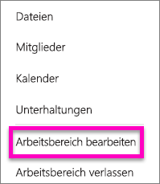
3. Wählen Sie im Fenster **Arbeitsbereich bearbeiten** die Option **Arbeitsbereich löschen** > **Löschen** aus.

    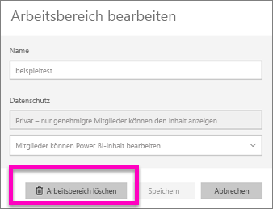

### So entfernen Sie einen App-Arbeitsbereich aus der Liste
Wenn Sie einem App-Arbeitsbereich nicht mehr als Mitglied angehören möchten, können Sie ihn ***verlassen***. Er wird dann aus der Liste entfernt. Wenn Sie einen Arbeitsbereich verlassen, bleibt er für alle anderen Mitglieder des Arbeitsbereichs erhalten.  

> [!IMPORTANT]
> Wenn Sie der einzige Administrator des App-Arbeitsbereichs sind, können Sie ihn in Power BI nicht verlassen.
>
>

1. Wechseln Sie zu dem App-Arbeitsbereich, den Sie entfernen möchten.
2. Wählen Sie in der rechten oberen Ecke die Auslassungspunkte (...) und dann **Leave workspace** (Arbeitsbereich verlassen) > **Verlassen** aus.

      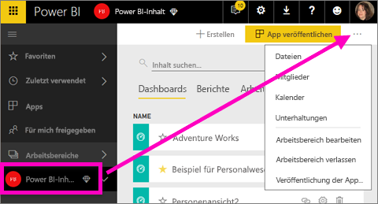

   > [!NOTE]
   > Die in der Dropdownliste angezeigten Optionen hängen davon ab, ob Sie Administrator oder Mitglied des App-Arbeitsbereichs sind.
   >
   >

## Löschen oder Entfernen einer App
Apps können problemlos von der Seite mit der Liste der Apps entfernt werden. Jedoch kann nur ein App-Administrator eine App endgültig löschen.

### Entfernen einer App von der Seite mit der Liste der Apps
Wenn Sie eine App von der Seite mit der Liste der Apps löschen, wird sie nicht für andere Mitglieder gelöscht.

1. Wählen Sie im linken Navigationsbereich **Apps** aus, um die Seite mit der Liste der Apps zu öffnen.
2. Zeigen Sie auf die zu löschende App, und wählen Sie das Symbol „Löschen“  aus.

   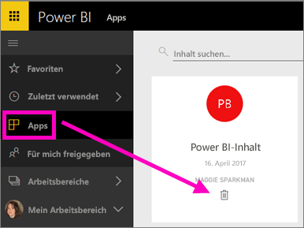

   Wenn Sie eine App versehentlich entfernen, stehen Ihnen mehrere Optionen zur Verfügung, um sie wieder zu erhalten.  Sie können den Ersteller der App bitten, sie erneut zu senden, Sie können die ursprüngliche E-Mail mit dem Link zur App suchen, Sie können in der [Mitteilungszentrale](service-notification-center.md) überprüfen, ob die Benachrichtigung für die App noch aufgeführt ist, oder Sie können [AppSource](consumer/end-user-apps.md) für Ihre Organisation überprüfen.

## Zu beachtende Aspekte und Problembehandlung
In diesem Artikel wird das Löschen der Grundkomponenten des Power BI-Diensts beschrieben. Es gibt jedoch noch weitere Komponenten in Power BI, die Sie löschen können.  

* [Entfernen eines ausgewählten Dashboards](service-dashboard-featured.md)
* [Entfernen eines Dashboards aus den Favoriten](service-dashboard-favorite.md)
* [Löschen einer Berichtsseite](service-delete.md)
* [Löschen einer Dashboardkachel](service-dashboard-edit-tile.md)
* [Löschen einer Berichtsvisualisierung](service-delete.md)

Weitere Fragen? [Wenden Sie sich an die Power BI-Community](http://community.powerbi.com/)
