# Einbetten mit dem Berichts-Webpart in SharePoint Online

Jetzt in Power BI: Mit dem neuen Berichts-Webpart für SharePoint Online können Sie interaktive Power BI-Berichte einfach in SharePoint Online-Seiten einbetten.

Der neuen **in SharePoint Online einbetten** Option die eingebettete Berichte vollständig sicher sind, damit einfach sichere interne Portale zu erstellen.

## Anforderungen

Für **in SharePoint Online einbetten** Berichte funktionieren, ist Folgendes erforderlich:

* Eine Power BI Pro-Lizenz oder eine [Power BI Premium-Kapazität (EM oder P-SKU)](service-premium-what-is.md) mit einer Power BI-Lizenz.
* Das Power BI-Webpart für SharePoint Online erfordert [Moderne Seiten](https://support.office.com/article/Allow-or-prevent-creation-of-modern-site-pages-by-end-users-c41d9cc8-c5c0-46b4-8b87-ea66abc6e63b).

## Einbetten des Berichts
Um den Bericht in SharePoint Online einzubetten, müssen Sie die Berichts-URL zu erhalten, und Ihre Verwendung mit SharePoint Online die neuen Power BI-Webpart.

### Abrufen einer Berichts-URL

1. Zeigen Sie den Bericht in Power BI.

2. Wählen Sie die **Datei** im Dropdownmenü wählen Sie dann **in SharePoint Online einbetten**.

    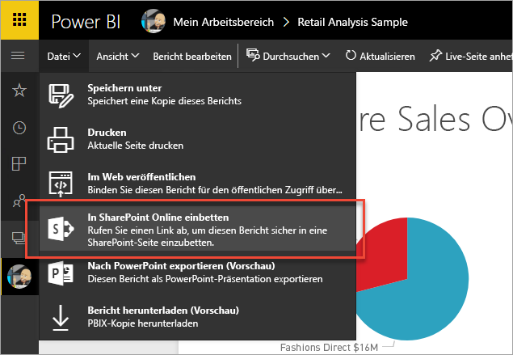

3. Kopieren Sie die Berichts-URL aus dem Dialogfeld an.

    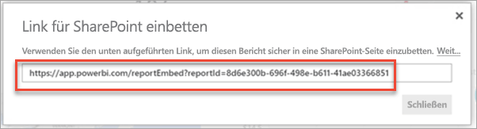

### Hinzufügen des Power BI-Berichts zu einer SharePoint Online-Seite

1. Öffnen Sie die Seite "Ziel" in SharePoint Online, und wählen Sie **bearbeiten**.

    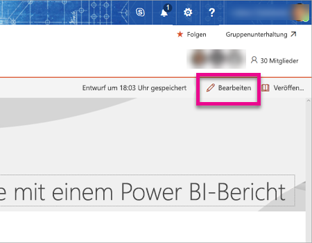

    Oder wählen Sie in Sharepoint Online **+ neu** um eine neue moderne Websiteseite erstellen.

    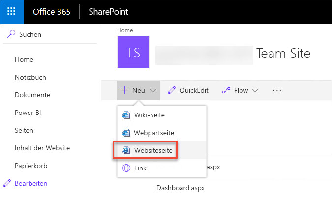

2. Wählen Sie die **+** Dropdownliste und wählen Sie dann die **Power BI**.

    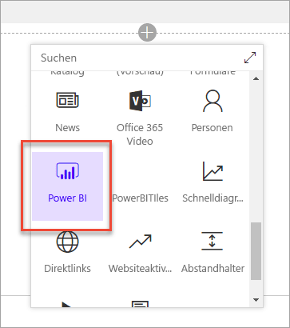

3. Wählen Sie **Bericht hinzufügen** aus.

    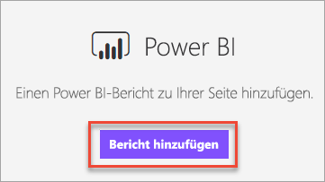  

4. Fügen Sie den Bericht zuvor kopierte URL in die **Power BI-Berichtslink** Bereich. Der Bericht wird automatisch geladen.

    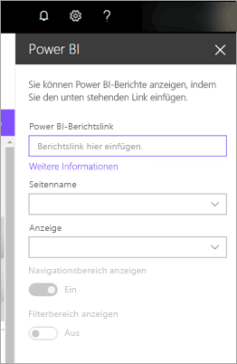

5. Wählen Sie **Veröffentlichen** aus, damit Ihre SharePoint Online-Benutzer die Änderung sehen können.

    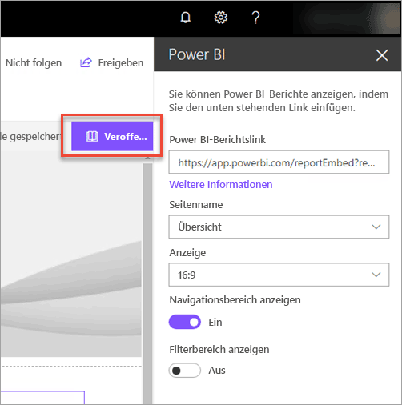

## Gewähren des Zugriffs auf Berichte

Einbetten eines Berichts in SharePoint Online nicht automatisch Vergabe von Benutzerberechtigungen zum Anzeigen des Berichts – müssen Sie Anzeigeberechtigungen in Power BI festlegen.

> [!IMPORTANT]
> Überprüfen Sie im Power BI-Dienst, wer den Bericht sehen kann, und stellen Sie sicher, dass nicht aufgeführte, berechtigte Benutzer Zugriff erhalten.

Es gibt zwei Möglichkeiten, den Zugriff auf Berichte in Power BI bereitzustellen. Die erste Möglichkeit, wenn Sie eine Office 365-Gruppe verwenden, erstellen Sie Ihre SharePoint Online-Teamwebsite ist den Benutzer als Mitglied der Liste der **app-Arbeitsbereich in Power BI-Dienst** und **SharePoint-Seite**. Weitere Informationen finden Sie unter [Verwalten eines App-Arbeitsbereichs](service-manage-app-workspace-in-power-bi-and-office-365.md).

Die zweite Möglichkeit ist das Einbetten eines Berichts in eine app, und es direkt mit Benutzern Teilen:  

1. Der Autor (eine Pro-Benutzer sein muss) erstellt einen Bericht in einem app-Arbeitsbereich. Mitteilen **Benutzer der kostenlosen Power BI**, der app-Arbeitsbereich festzulegen, muss ein **Premium-Arbeitsbereich**.

2. Der Autor der app veröffentlicht und installiert es. Der Autor muss sicherstellen, installieren die app, um auf der Berichts-URL zugreifen, die in SharePoint Online einbetten verwendet wird.

3. Nun müssen auch alle Endbenutzer die App installieren. Sie können auch die **app automatisch installieren** -Funktion, die Sie, in aktivieren können der [Power BI-Verwaltungsportal](service-admin-portal.md), um die app für Endbenutzer bereits installiert haben.

   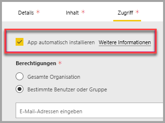

4. Der Ersteller öffnet die App und ruft den Bericht auf.

5. Der Autor kopiert die einbettungs-Berichts-URL aus dem Bericht die app installiert. **Verwenden Sie die ursprüngliche URL für den Bericht nicht aus dem app-Arbeitsbereich aus.**

6. Erstellen Sie in SharePoint Online eine neue Teamwebsite.

7. Fügen Sie die zuvor kopierte Berichts-URL mit dem Power BI-Webpart hinzu.

8. Fügen Sie alle Endbenutzer und/oder Gruppen hinzu, die die Daten auf der SharePoint Online-Seite und in der von Ihnen erstellten Power BI-App verwenden werden.

    > [!NOTE]
    > **Benutzer bzw. Gruppen benötigen Zugriff sowohl auf die SharePoint Online-Seite als auch auf den Bericht in der Power BI-App, um den Bericht auf der SharePoint-Seite anzuzeigen.**

Jetzt kann der Endbenutzer die Teamseite in SharePoint Online aufrufen und die Berichte auf der Seite anzeigen.

## Multi-Factor Authentication

Wenn Ihre Power BI-Umgebung die Anmeldung mit mehrstufiger Authentifizierung (MFA) erfordert, können Sie aufgefordert werden, Ihre Identität mithilfe eines Sicherheitsgeräts zu bestätigen. Dies tritt auf, wenn Sie nicht auf SharePoint Online, die Multi-Factor Authentication anmelden, aber Ihre Power BI-Umgebung ein Sicherheitsgerät erfordert, um ein Konto zu überprüfen.

> [!NOTE]
> Azure Active Directory 2.0 unterstützt keine Multi-Factor Authentication - Benutzer sehen eine Fehlermeldung angezeigt. Der Benutzer kann sich mithilfe eines Sicherheitsgeräts erneut bei SharePoint Online anmelden, um Zugriff auf den Bericht zu erhalten.

## Webpart-Einstellungen

Im folgenden finden Sie die Einstellungen, die Sie für den Power BI-Webpart für SharePoint Online anpassen können.

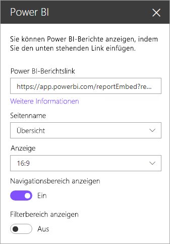

| Eigenschaft | Beschreibung |
| --- | --- |
| Seitenname |Legt fest, das Webpart-Standardseite. Wählen Sie einen Wert aus der Dropdownliste aus. Wenn keine Seiten angezeigt werden, verfügt der Bericht entweder nur über eine Seite, oder die eingefügte URL enthält den Seitennamen. Entfernen Sie den Berichtsabschnitt aus der URL, um eine bestimmte Seite auswählen zu können. |
| Anzeige |Passt Sie an, wie der Bericht in SharePoint Online-Seite passt. |
| Navigationsbereich anzeigen |Anzeigen oder Ausblenden des Navigationsbereichs der Seite. |
| Filterbereich anzeigen |Anzeigen oder Ausblenden des Filterbereichs. |

## Nicht geladene Berichte

Wenn Sie der Bericht in der Power BI-Webpart nicht geladen wird, können Sie die folgende Meldung angezeigt:

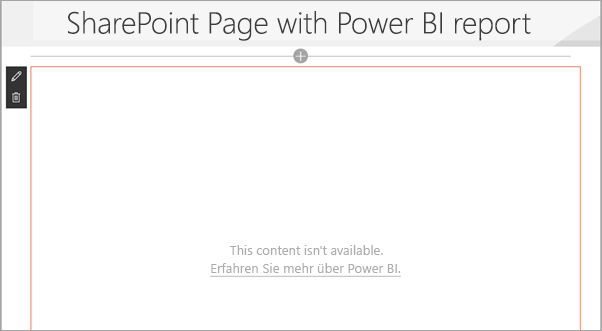

Dies kann vor allem zwei Gründe haben.

1. Sie müssen nicht den Zugriff auf Berichte.
2. Der Bericht wurde gelöscht.

Wenden Sie sich an den Besitzer der SharePoint Online Seite um das Problem zu beheben.

## Lizenzierung

Benutzer, die einen Bericht in SharePoint anzeigen, benötigen entweder eine **Power BI Pro-Lizenz**, oder der Inhalt muss sich in einem Arbeitsbereich integriert sein, der sich in einer **[Power BI Premium-Kapazität (EM oder P SKU)](service-admin-premium-purchase.md)** befindet.

## Bekannte Probleme und Einschränkungen

* Fehler: „Es ist ein Fehler aufgetreten, melden Sie sich ab und wieder an und öffnen Sie diese Seite dann erneut. Korrelations-ID: nicht definiert, HTTP-Antwortstatus: 400, Serverfehlercode 10001, Meldung: Fehlendes Aktualisierungstoken“
  
  Wenn Sie diesen Fehler erhalten, versuchen Sie einen der folgenden Schritte zur Fehlerbehebung.
  
  1. Melden Sie sich bei SharePoint ab und anschließend wieder an. Achten Sie darauf, alle Browserfenster zu schließen, bevor Sie sich erneut anmelden.

  2. Wenn Ihr Benutzerkonto die Multi-Factor Authentication (MFA) erforderlich ist, melden Sie sich bei SharePoint mit Ihrem MFA-Gerät (Smartphone-app, Smartcard usw.).
  
  3. Azure B2B-Gastbenutzerkonten werden nicht unterstützt. Den Benutzern wird das Power BI-Logo angezeigt, das anzeigt, dass der Teil geladen wird, jedoch wird der Bericht nicht angezeigt.

* Power BI unterstützt nicht die gleichen lokalisierte Sprachen wie SharePoint Online. Daher wird im eingebetteten Bericht möglicherweise nicht die ordnungsgemäße Lokalisierung angezeigt.

* Bei Verwendung von Internet Explorer 10 können Probleme auftreten. Informieren Sie sich über die [Browserunterstützung für Power BI](consumer/end-user-browsers.md) und für [Office 365](https://products.office.com/office-system-requirements#Browsers-section).

* Das Power BI-Webpart ist für [nationale Clouds](https://powerbi.microsoft.com/clouds/) nicht verfügbar.

* Der klassische Server von SharePoint Server wird mit diesem Webpart nicht unterstützt.

* [URL-Filter](service-url-filters.md) werden mit dem SPO-Webpart nicht unterstützt.

## Nächste Schritte

* [Erstellen moderner Websiteseiten durch Endbenutzer zulassen oder verhindern](https://support.office.com/article/Allow-or-prevent-creation-of-modern-site-pages-by-end-users-c41d9cc8-c5c0-46b4-8b87-ea66abc6e63b)  
* [Erstellen und Verteilen einer App in Power BI](service-create-distribute-apps.md)  
* [Freigeben eines Dashboards für Kollegen und andere](service-share-dashboards.md)  
* [Was ist Power BI Premium?](service-premium-what-is.md)
* [Einbetten eines Berichts in ein sicheres Portal oder eine sichere Website](service-embed-secure.md)

Weitere Fragen? [Stellen Sie Ihre Frage in der Power BI-Community.](http://community.powerbi.com/)