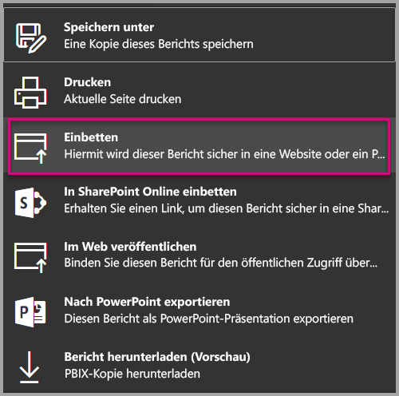
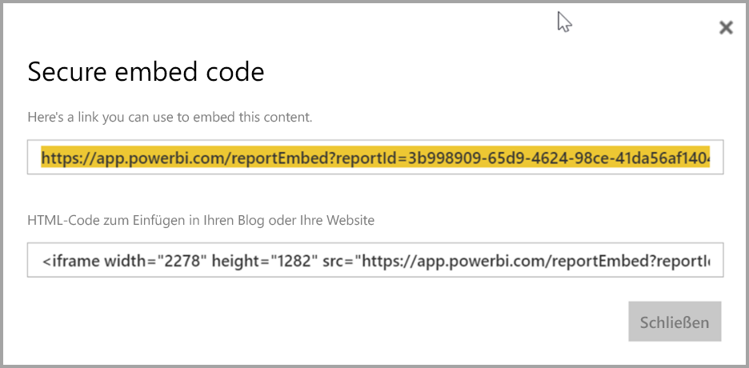
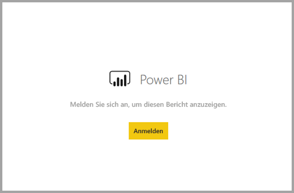
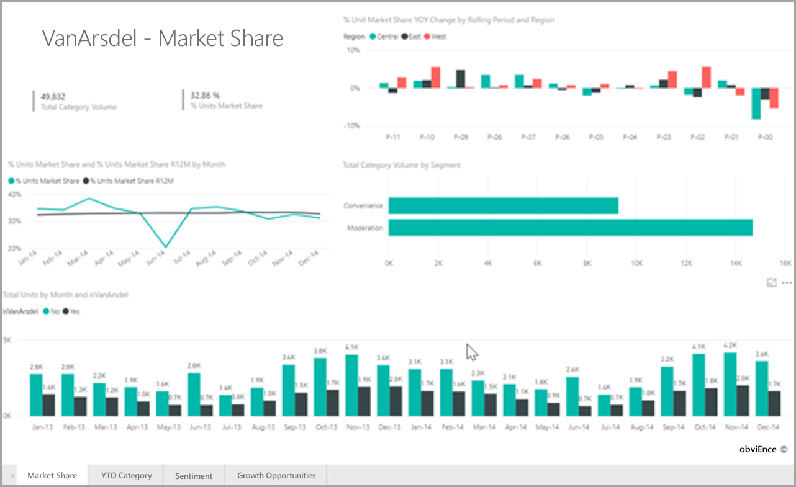

# <a name="embed-a-report-in-a-secure-portal-or-website"></a>Einbetten eines Berichts in ein sicheres Portal oder eine sichere Website

Mit der neuen sicheren Power BI-Option **Einbetten** für Berichte können Benutzer Berichte sicher und einfach in interne Webportale einbetten. Diese können **cloudbasiert** oder wie bei SharePoint 2019 **lokal gehostet** sein. Bei Berichten, die auf diese Weise eingebettet werden, werden alle Elementberechtigungen und Anforderungen an die Datensicherheit über Sicherheit auf Zeilenebene berücksichtigt. Die Funktion wurde so entwickelt, dass ein Einbetten ohne Programmieraufwand in ein beliebiges Portal möglich ist, das das Einbetten einer URL oder eines iFrame gestattet.

Die Option **Einbetten** unterstützt außerdem [URL-Filter](service-url-filters.md) und URL-Einstellungen. Die Option **Einbetten** ermöglicht eine Integration in Portale mit geringem Programmieraufwand, für die grundlegende HTML- und JavaScript-Kenntnisse benötigt werden.

## <a name="how-to-embed-power-bi-reports-into-portals"></a>**Einbetten** von Power BI-Berichten in Portale

1. Sie finden die neue Option **Einbetten** im Power BI-Dienst im Menü **Datei** für Berichte.

    

2. Wählen Sie die Option „Einbetten“ aus, um ein Dialogfeld mit einem Link und einem iFrame zu öffnen, die zum sicheren Einbetten des Berichts benötigt werden.

    

3. Nachdem Sie die URL in Ihr Webportal eingebettet haben oder wenn Sie die URL direkt öffnen, wird der Benutzer authentifiziert, bevor er Zugriff auf den Bericht erhält. Im folgenden Beispiel hat sich der Benutzer in der Browsersitzung nicht bei Power BI angemeldet. Wenn er auf **Anmelden** klickt, wird ggf. ein neues Browserfenster oder eine neue Registerkarte geöffnet. Wenn Sie nicht aufgefordert werden, sich anzumelden, überprüfen Sie, ob Popupblocker aktiv sind.

    

4. Nachdem sich der Benutzer angemeldet hat, wird der Bericht mit den Daten geöffnet. Anschließend kann er zwischen den Seiten navigieren und Filter festlegen. Der Bericht wird nur Benutzern angezeigt, die die Berechtigung zum Anzeigen des Berichts in Power BI besitzen. Alle Regeln der Sicherheit auf Zeilenebene werden ebenfalls angewendet. Schließlich muss der Benutzer ordnungsgemäß lizenziert sein, d.h., er benötigt eine Power BI Pro-Lizenz oder der Bericht muss sich in einem Arbeitsbereich in einer Power BI Premium-Kapazität befinden. Der Benutzer muss sich jedes Mal erneut anmelden, wenn er ein neues Browserfenster öffnet. Sobald er sich jedoch einmal angemeldet hat, werden Berichte automatisch geladen.

    

5. Wenn Sie die iFrame-Option verwenden, sollten Sie den bereitgestellten HTML-Code so ändern, dass die gewünschte Höhe und Breite auf der Webseite des Portals angegeben wird.

    

## <a name="granting-access-to-reports"></a>Zugriff gewähren auf Berichte

Wenn Sie die Option „Einbetten“ verwenden, erhalten Benutzer nicht automatisch die Berechtigung zum Anzeigen des Berichts. Die Berechtigungen zum Anzeigen des Berichts werden im Power BI-Dienst festgelegt.

Um im Power BI-Dienst Zugriff auf den Bericht zu gewähren, können Sie den Bericht für die Benutzer freigeben, die auf den eingebetteten Bericht zugreifen werden. Wenn Sie eine Office 365-Gruppe verwenden, können Sie den Benutzer als Mitglied des App-Arbeitsbereichs im Power BI-Dienst aufführen. Weitere Informationen finden Sie unter [Verwalten eines App-Arbeitsbereichs](service-manage-app-workspace-in-power-bi-and-office-365.md).

## <a name="licensing"></a>Lizenzierung

Benutzer, die den eingebetteten Bericht anzeigen möchten, benötigen entweder eine Power BI Pro-Lizenz, oder der Inhalt muss sich in einem Arbeitsbereich in einer [Power BI Premium-Kapazität (EM oder P SKU)](service-admin-premium-purchase.md) befinden.

## <a name="customize-your-embed-experience-using-url-settings"></a>Anpassen der Darstellung des eingebetteten Berichts über URL-Einstellungen

Die Einbettungs-URL unterstützt mehrere Eingabeeinstellungen zum Anpassen der Darstellung. Wenn Sie den bereitgestellten iFrame verwenden, stellen Sie sicher, dass Sie die URL in den src-Einstellungen des iFrame aktualisiert haben.

| Eigenschaft  | Beschreibung  |  |  |  |
|--------------|-----------------------------------------------------------------------------------------------------------------------------------------------------------------------------------------------------------------------|---|---|---|
| pageName  | Mit dem Parameter **pageName** der Abfragezeichenfolge können Sie festlegen, welche Seite des Berichts geöffnet werden soll. Der Wert von **pageName** entspricht dem Ende der Berichts-URL, wenn ein Bericht im Power BI-Dienst angezeigt wird. Dies ist in der folgenden Abbildung dargestellt. |  |  |  |
| URL-Filter  | Sie können [URL-Filter](service-url-filters.md) in der Einbettungs-URL verwenden, die Sie aus der Benutzeroberfläche von Power BI abgerufen haben, um die Inhalte der Einbettung zu filtern. Auf diese Weise lassen sich Integrationen mit geringem Programmieraufwand erstellen, für die nur grundlegende Kenntnisse in HTML und JavaScript erforderlich sind.  |  |  |  |

## <a name="set-which-page-opens-when-the-report-is-embedded"></a>Festlegen der zu öffnenden Seite im eingebetteten Bericht

Der für die Einstellung *pageName* festgelegte Wert entspricht dem Ende der Berichts-URL, wenn ein Bericht im Power BI-Dienst angezeigt wird.

1. Öffnen Sie den Bericht aus dem Power BI-Dienst in Ihrem Webbrowser, und kopieren Sie dann die URL aus der Adressleiste.

    

2. Hängen Sie die Einstellung *pageName* an die URL an.

    

## <a name="filter-report-content-using-url-filters"></a>Filtern der Berichtsinhalte mit URL-Filtern

Dank [URL-Filtern](service-url-filters.md) können Sie auch erweiterte Funktionen bei der Darstellung des Berichts verwenden. Beispielsweise wird der Bericht mit der unten aufgeführten URL so gefiltert, dass Daten für die Energiebranche angezeigt werden.

Die Kombination von **pageName** und [URL-Filter](service-url-filters.md) erlaubt besonders ausgefeilte Funktionen. Mit einfachem HTML und JavaScript lassen sich verschiedene Benutzeroberflächen gestalten.

Beispielsweise sehen Sie hier, wie Sie einer HTML-Seite eine Schaltfläche hinzufügen können:

```html
<button class="textLarge" onclick='show("ReportSection", "Energy");' style="display: inline-block;">Show Energy</button>
```

Beim Klicken auf die Schaltfläche wird eine Funktion aufgerufen, in der der iFrame mit einer neuen URL aktualisiert wird, die den Filter für die Energiebranche enthält.

```javascript
function show(pageName, filterValue)

{

var newUrl = baseUrl + "&pageName=" + pageName;

if(null != filterValue && "" != filterValue)

{

newUrl += "&$filter=Industries/Industry eq '" + filterValue + "'";

}

//Assumes there’s an iFrame on the page with id=”iFrame”

var report = document.getElementById("iFrame")

report.src = newUrl;

}
```


Sie können beliebig viele Schaltflächen hinzufügen, um mit geringem Programmieraufwand eine individuelle Benutzeroberfläche zu erstellen. 

## <a name="considerations-and-limitations"></a>Überlegungen und Einschränkungen

* Externe Gastbenutzer mit Azure B2B (Business-to-Business) werden nicht unterstützt.

* Das sichere Einbetten kann für Berichte verwendet werden, die im Power BI-Dienst veröffentlicht wurden.

* Der Benutzer muss sich anmelden, um den Bericht anzuzeigen, wenn er ein neues Browserfenster öffnet.

* Bei einigen Browsern müssen Sie die Seite nach der Anmeldung aktualisieren, insbesondere bei Verwendung des InPrivate- oder Inkognitomodus.

* Einmaliges Anmelden wird unterstützt, wenn Sie die Option „Einbetten“ in SharePoint Online verwenden oder über die Methode [Benutzer ist Besitzer der Daten](developer/embed-sample-for-your-organization.md) eine benutzerdefinierte Integration erstellen. Weitere Informationen zu [Benutzer ist Besitzer der Daten](developer/embed-sample-for-your-organization.md)

* Die Funktion zur automatischen Authentifizierung, die von der Option **Einbetten** unterstützt wird, kann nicht mit der Power BI-JavaScript-API verwendet werden. Verwenden Sie zum Einbetten mit der Power BI-JavaScript-API die Methode [Benutzer ist Besitzer der Daten](developer/embed-sample-for-your-organization.md). Weitere Informationen zu [Benutzer ist Besitzer der Daten](developer/embed-sample-for-your-organization.md)

## <a name="next-steps"></a>Nächste Schritte

* [Freigeben Ihrer Arbeit](service-how-to-collaborate-distribute-dashboards-reports.md)

* [URL-Filter](service-url-filters.md)

* [SharePoint Online-Berichts-Webpart](service-embed-report-spo.md)

* [Webveröffentlichung](service-publish-to-web.md)