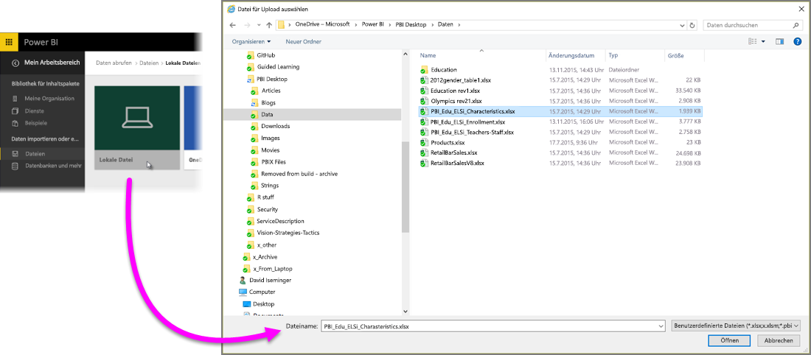
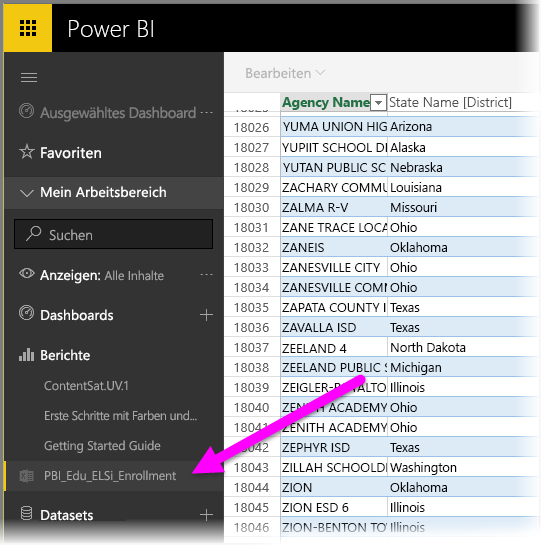

# Abrufen von Daten aus Excel-Arbeitsmappendateien

Microsoft Excel ist eine der am häufigsten verwendeten Geschäftsanwendungen. Es ist außerdem eine der üblichsten Methoden, um Daten in Power BI abzurufen.

## Welche Arten von Arbeitsmappen unterstützt Power BI?
Power BI unterstützt Importe aus und Verknüpfungen mit Arbeitsmappen, die in Excel 2007 oder höher erstellt wurden. Arbeitsmappen müssen im XLSX- oder XLSM-Dateiformat gespeichert sein und dürfen nicht größer als 1 GB sein. Einige der in diesem Artikel beschriebenen Funktionen sind nur in höheren Versionen von Excel verfügbar.

### Arbeitsmappen mit Bereichen oder Datentabellen
Wenn Ihre Arbeitsmappe einfache Arbeitsblätter mit Datenbereichen enthält, müssen Sie diese Bereiche als Tabellen formatieren, um Ihre Daten in Power BI optimal auszuwerten. Daraufhin werden Ihnen benannte Tabellen und Spalten im Felderbereich angezeigt, wenn Sie Berichte in Power BI erstellen. So wird es sehr viel einfacher, Ihre Daten zu visualisieren.

### Arbeitsmappen mit Datenmodellen
Arbeitsmappen können ein Datenmodell mit einer oder mehreren Tabellen enthalten, die mithilfe von verknüpften Tabellen, Power Query (Abrufen und Transformieren in Excel 2016) oder Power Pivot geladen wurden. Power BI unterstützt alle Datenmodelleigenschaften wie z.B. Beziehungen, Measures, Hierarchien und KPIs.

> [!NOTE]
> Arbeitsmappen mit Datenmodellen können nicht zwischen verschiedenen Power BI-Mandanten freigegeben werden. Beispielsweise kann ein Benutzer, der sich mit einem *contoso.com*-Konto anmeldet, eine Excel-Arbeitsmappe nicht für einen Benutzer freigeben, der sich mit einem Power BI-Anmeldungskonto von *woodgrovebank.com* aus anmeldet.
> 
> 

### Arbeitsmappen mit Verknüpfungen zu externen Datenquellen
Wenn Sie Excel verwenden, um Ihre Arbeitsmappe, sobald diese in Power BI zur Verfügung steht, mit einer externen Datenquelle zu verknüpfen, können Sie Berichte und Dashboards auf Grundlage der Daten aus der verknüpften Datenquelle erstellen. Sie können ebenfalls die Geplante Aktualisierung einrichten, um automatisch richtig mit der Datenquelle zu verknüpfen und Aktualisierungen zu beziehen. So müssen Sie niemals wieder manuell in der Registerkarte „Datei“ in Excel aktualisieren. Alle Visualisierungen in Berichten und Kacheln in Dashboards, die auf Daten aus dieser Datenquelle basieren, werden automatisch aktualisiert. Weitere Informationen finden Sie unter [Aktualisieren von Daten in Power BI](refresh-data.md).

### Arbeitsmappen mit Power View, PivotTables und Diagrammen
Wie Ihre Power View-Visualisierungen, PivotTables und Diagramme in Power BI angezeigt werden, oder eben nicht, hängt von dem Speicherort Ihrer Arbeitsmappe und der Importmethode in Power BI ab. Wir werden weiter unten näher darauf eingehen.

## Datentypen
Power BI unterstützt die folgenden Datentypen: ganze Zahl, Dezimalzahl, Währung, Datum, TRUE/FALSE und Text. Das Kennzeichnen von Daten als bestimmte Datentypen in Excel steigert die Benutzerfreundlichkeit von Power BI.

## Vorbereiten Ihrer Arbeitsmappe in Power BI
In diesem nützlichen Video erfahren Sie mehr darüber, wie Sie sicherstellen, dass Ihre Excel-Arbeitsmappen für Power BI bereit sind.

<iframe width="500" height="281" src="https://www.youtube.com/embed/l2wy4XgQIu0" frameborder="0" allowfullscreen></iframe>

## Der Speicherort Ihrer Arbeitsmappendatei ist entscheidend
**Lokal** – Wenn Sie Ihre Arbeitsmappe auf einem lokalen Laufwerk auf Ihrem Computer oder an einem anderen Speicherort in Ihrer Organisation speichern, können Sie Ihre Datei über Power BI in Power BI laden. In Wahrheit verbleibt Ihre Datei aber auf Ihrem lokalen Laufwerk. Die Datei wird also eigentlich gar nicht in Power BI importiert. Tatsächlich wird ein neues Dataset in Power BI erstellt, und die Daten und das Datenmodell aus der Arbeitsmappe werden in das Dataset geladen. Wenn Ihre Arbeitsmappe Visualisierungen mit Power View enthält, werden diese auf Ihrer Power BI-Website unter „Berichte“ angezeigt. Excel 2016 verfügt auch über die Funktion **Veröffentlichen** (im Menü **Datei**). Die Funktion **Veröffentlichen** ist identisch mit **Daten abrufen > Dateien > Lokale Datei** aus Power BI. Wenn Sie regelmäßig Änderungen in der Arbeitsmappe vornehmen, ist es jedoch meist leichter, das Dataset in Power BI damit zu aktualisieren.

**OneDrive - Geschäftlich** – Wenn Sie OneDrive for Business haben und Sie sich mit dem gleichen Konto dort anmelden wie bei Power BI, ist dies der bei weitem effektivste Weg, Ihre Arbeit in Excel und die Datasets, Berichte und Dashboards mit Power BI zu synchronisieren. Da sowohl Power BI als auch OneDrive in der Cloud ausgeführt werden, *verknüpft sich* Power BI etwa stündlich mit Ihrer Arbeitsmappe in OneDrive. Wenn Änderungen gefunden werden, werden Ihre Dataset, Berichte und Dashboards in Power BI automatisch aktualisiert. Sie können „Veröffentlichen“ auch dazu verwenden, Ihre Datasets und Berichte in Power BI umgehend zu aktualisieren, so als hätten Sie Ihre Arbeitsmappe auf einem lokalen Laufwerk gespeichert. Andernfalls wird Power BI eine automatische Synchronisierung durchführen, normalerweise innerhalb einer Stunde.

**OneDrive - Persönlich** – Wenn Sie Ihre Arbeitsmappendateien in Ihrem eigenen OneDrive-Konto speichern, erhalten Sie viele der Vorteile, die Ihnen auch OneDrive for Business bietet. Der Hauptunterschied besteht darin, dass Sie sich beim ersten Verknüpfen mit Ihrer Datei, mit Ihrem Microsoft-Konto bei OneDrive anmelden müssen (mit „Daten abrufen“ > „Dateien“ > „OneDrive – Persönlich“). Normalerweise sind Ihr Microsoft- und Ihr Power BI-Konto nicht identisch. Stellen Sie bei der OneDrive-Anmeldung mithilfe Ihres Microsoft Kontos sicher, dass Sie die Option „Angemeldet bleiben“ aktiviert haben. Auf diese Weise ist Power BI in der Lage, sich etwa einmal die Stunde mit Ihrer Arbeitsmappendatei zu verbinden und sicherzustellen, dass Ihr Dataset und Berichte in Power BI synchronisiert werden.

**SharePoint-Teamwebsites** – Ihre Power BI Desktop-Dateien in SharePoint-Teamwebsites zu speichern funktioniert ähnlich wie das Speichern in OneDrive for Business. Der größte Unterschied besteht im Herstellen der Verknüpfung zur Datei aus Power BI. Sie können eine URL angeben oder eine Verknüpfung mit einem Stammordner erstellen.

## Eine Excel-Arbeitsmappe – zwei Arten sie zu verwenden
Wenn Sie Ihre Arbeitsmappendateien in **OneDrive** speichern, verfügen Sie über mehrere Möglichkeiten, Ihre Daten in Power BI auszuwerten.

### Importieren von Excel-Daten in Power BI
Wenn Sie **Importieren** wählen, werden alle unterstützten Daten in Tabellen und/oder Datenmodellen in ein neues Dataset in Power BI importiert. Wenn Sie über Blätter mit Power View-Visualisierungen verfügen, werden diese in Power BI als Berichte neu erstellt.

Sie können Ihre Arbeitsmappe weiterhin bearbeiten. Wenn Sie die Änderungen speichern, werden sie für gewöhnlich innerhalb einer Stunde mit dem Dataset in Power BI synchronisiert. Wenn Sie unmittelbarere Ergebnisse benötigen, können Sie erneut auf „Veröffentlichen“ klicken, und Ihre Änderungen werden sofort exportiert. Alle Visualisierungen in Ihren Berichten und Dashboards werden ebenfalls aktualisiert.

Wählen Sie diese Option, wenn Sie „Abrufen und Transformieren von Daten“ oder Power Pivot zum Laden von Daten in ein Datenmodell verwendet haben oder wenn Ihre Arbeitsmappe über Power View-Visualisierungen verfügt, die in Power BI angezeigt werden sollen.

In Excel 2016 können Sie auch „Veröffentlichen > Exportieren“ verwenden. Beide Wege sind nahezu identisch. Weitere Informationen finden Sie unter [Veröffentlichen in Power BI aus Excel 2016](service-publish-from-excel.md).

### Verknüpfen, Verwalten und Anzeigen von Excel in Power BI
Wenn Sie **Verknüpfen** wählen, wird die Arbeitsmappe in Power BI genauso angezeigt wie in Excel Online. Allerdings haben Sie im Gegensatz zu Excel Online einige hervorragende Funktionen zur Hand, mit denen Sie Elemente aus Arbeitsblättern direkt an Ihre Dashboards anheften können.

Sie können Ihre Arbeitsmappe in Power BI nicht bearbeiten. Wenn Sie aber Änderungen vornehmen müssen, können Sie auf „Bearbeiten“ klicken und die Arbeitsmappe in Excel online oder lokal bearbeiten. Alle vorgenommenen Änderungen werden in der Arbeitsmappe in OneDrive gespeichert.

Wenn Sie sich für diese Methode entscheiden, erstellt Power BI für die verbundene Arbeitsmappe ein entsprechendes Dataset. Bei Bedarf können Sie dieses Dataset verwenden, um einen Power BI-Bericht zu erstellen. Ihre Arbeitsmappe wird auch im Navigationsbereich Ihres Power BI-Arbeitsbereichs unter „Berichte“ angezeigt. Verknüpfte Arbeitsmappen verfügen über ein besonderes Excel-Symbol.

Wählen Sie diese Option, wenn Ihre Daten ausschließlich in Arbeitsblättern angelegt sind oder Sie Bereiche, PivotTables und Diagramme an Dashboards anheften möchten.

In Excel 2016 können Sie auch „Veröffentlichen > Hochladen“ verwenden. Beide Wege sind nahezu identisch. Weitere Informationen finden Sie unter [Veröffentlichen in Power BI aus Excel 2016](service-publish-from-excel.md).

## Importieren oder Verknüpfen einer Excel-Arbeitsmappe aus Power BI
1. Klicken Sie im Navigationsbereich von Power BI auf **Daten abrufen**.
   
   
2. Klicken Sie in „Dateien“ auf **Abrufen**.
   
   
3. Suchen Sie Ihre Datei.
   
   
4. Wenn Ihre Arbeitsmappendatei in OneDrive oder einer SharePoint-Teamwebsites gespeichert ist, wählen Sie **Importieren** oder **Verknüpfen**.

## Lokale Excel-Arbeitsmappen
Sie können auch eine lokale Excel-Datei verwenden und in Power BI hochladen. Wählen Sie einfach im bereits erwähnten Menü **Lokale Datei** aus, und gehen Sie zu Ihren Excel-Arbeitsmappen.

Nachdem Sie die gewünschte Datei ausgewählt haben, laden Sie sie in Power BI hoch.

Nachdem die Arbeitsmappe hochgeladen wurde, erhalten Sie eine Benachrichtigung, dass die Arbeitsmappe bereit ist.

Wenn die Arbeitsmappe bereit ist, finden Sie sie in Power BI im Abschnitt **Berichte**.

## Aus Excel 2016 auf Ihrer Power BI-Website veröffentlichen
Das Feature **In Power BI veröffentlichen** in Excel 2016 ist mit dem Power BI-Feature **Daten abrufen** identisch, das dazu dient, Ihre Datei zu importieren oder zu verbinden. Wir werden an dieser Stelle nicht weiter ins Detail gehen. Weitere Informationen finden Sie unter [Veröffentlichen in Power BI aus Excel 2016](service-publish-from-excel.md).

## Problembehandlung
Ist die Arbeitsmappendatei zu groß? Lesen Sie den Artikel [Reduzieren der Größe einer Excel-Arbeitsmappe für die Anzeige in Power BI](reduce-the-size-of-an-excel-workbook.md).

Wenn Sie derzeit auf „Importieren“ klicken, importiert Power BI lediglich die Daten, die Teil einer benannten Tabelle oder eines benannten Datenmodells sind. Wenn eine Arbeitsmappe keine benannten Tabellen, Power View-Blätter oder Excel-Datenmodelle enthält, wird daher möglicherweise folgender Fehler angezeigt: **Wir haben in Ihrer Excel-Arbeitsmappe keine Daten gefunden**. [Dieser Artikel](service-admin-troubleshoot-excel-workbook-data.md) erläutert, wie Sie die Arbeitsmappe korrigieren und erneut importieren.

## Nächste Schritte
**Werten Sie Ihre Daten aus** – Sobald Sie Ihre Daten und Berichte aus Ihrer Datei in Power BI geladen haben, können Sie sie auswerten. Klicken Sie einfach mit der rechten Maustaste auf das neue Dataset, und klicken Sie dann auf „Durchsuchen“. Wenn Sie sich in Schritt 4 dazu entscheiden, eine Arbeitsmappendatei in OneDrive zu verknüpfen, wird Ihre Arbeitsmappe unter „Berichte“ angezeigt. Wenn Sie darauf klicken, wird es in Power BI genauso geöffnet, wie es in Excel Online geöffnet werden würde.

**Geplante Aktualisierung** – Wenn Ihre Excel-Arbeitsmappendatei mit einer externen Datenquelle verknüpft wird oder Sie von einem lokalen Laufwerk importieren, können Sie die Geplante Aktualisierung einrichten, um sicherzustellen, dass Ihr Dataset oder Bericht immer auf dem neuesten Stand ist. In den meisten Fällen ist das Einrichten einer geplanten Aktualisierung recht einfach. Eine detaillierte Beschreibung übersteigt aber den Rahmen dieses Artikels. Weitere Informationen finden Sie unter [Aktualisieren von Daten in Power BI](refresh-data.md).

[Veröffentlichen in Power BI aus Excel 2016](service-publish-from-excel.md)

[Power BI Publisher für Excel](publisher-for-excel.md)

[Aktualisieren von Daten in Power BI](refresh-data.md)

