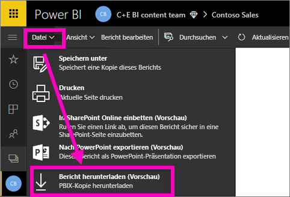
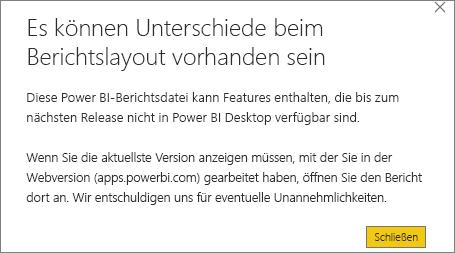

# Exportieren eines Berichts aus dem Power BI-Dienst nach Power BI Desktop (Vorschau)
In Power BI Desktop können Sie einen Bericht in den Power BI-Dienst exportieren (dieser Vorgang wird auch als *Herunterladen* bezeichnet), indem Sie den Bericht speichern und **Veröffentlichen** auswählen. Es ist auch ein Export in die andere Richtung möglich, und Sie können einen Bericht aus dem Power BI-Dienst in die Desktopversion herunterladen. Die Dateierweiterung für in beide Richtungen exportierte Dateien lautet *.pbix*.

Es sind einige Einschränkungen und Überlegungen zu berücksichtigen, die weiter unten in diesem Artikel erläutert werden.

## Herunterladen des Berichts als PBIX-Datei
Gehen Sie zum Herunterladen der PBIX-Datei folgendermaßen vor:

1. Öffnen Sie im **Power BI-Dienst** den Bericht, den Sie herunterladen möchten, in der [Bearbeitungsansicht](service-reading-view-and-editing-view.md).
2. Wählen Sie auf der Menüleiste **Datei > Bericht herunterladen** aus.
   
   > [!NOTE]
   > Der Bericht kann nur heruntergeladen werden, wenn er [mithilfe von Power BI Desktop](guided-learning/publishingandsharing.yml#step-2) nach dem 23. November 2016 erstellt oder nach diesem Zeitpunkt aktualisiert wurde. Andernfalls ist die Menüoption *Bericht herunterladen* im Power BI-Dienst abgeblendet.
   > 
   > 
3. Der Status der PBIX-Dateierstellung wird in einem Statusbanner angezeigt. Wenn die PBIX-Datei bereit ist, werden Sie zum Öffnen oder Speichern der Datei aufgefordert. Der Name der Datei stimmt mit dem Titel des Berichts überein.
   
    
   
    Sie haben jetzt die Möglichkeit, die PBIX-Datei im Power BI-Dienst („app.powerbi.com“) oder in Power BI Desktop zu öffnen.     
4. Um den Bericht sofort in Power BI Desktop zu öffnen, wählen Sie **Öffnen** aus.  Wenn nicht bereits geschehen, [installieren Sie Power BI Desktop](desktop-get-the-desktop.md).
   
    Wenn Sie den Bericht in Power BI Desktop öffnen, werden Sie möglicherweise in einer Warnmeldung darauf hingewiesen, dass einige im Power BI-Dienst-Bericht verfügbare Features in der Desktopversion eventuell nicht verfügbar sind.
   
    
5. Wählen Sie zum Öffnen des Berichts im Power BI-Dienst **Speichern** aus, und verwenden Sie dann **Daten abrufen**, um zum Speicherort der PBIX-Datei zu navigieren.
   
    

## Zu beachtende Aspekte und Problembehandlung
Beim Herunterladen (Exportieren) einer *PBIX*-Datei aus dem Power BI-Dienst sind einige wichtige Aspekte zu beachten:

* Zum Herunterladen der Datei müssen Sie über Bearbeitungszugriff auf den Bericht verfügen.
* Der Bericht muss aus **Power BI Desktop** stammen und für den **Power BI-Dienst** *veröffentlicht* worden sein, oder die *PBIX*-Datei muss in den Dienst hochgeladen worden sein.
* Die Berichte müssen nach dem 23. November 2016 veröffentlicht oder aktualisiert worden sein. Vor diesem Datum veröffentlichte Berichte können nicht heruntergeladen werden.
* Dieses Feature kann nicht für Berichte und Inhaltspakete genutzt werden, die ursprünglich im **Power BI-Dienst** erstellt wurden.
* Sie sollten immer die neueste Version von **Power BI Desktop** verwenden, wenn Sie heruntergeladene Dateien öffnen. Heruntergeladene *PBIX*-Dateien werden in nicht aktuellen Versionen von **Power BI Desktop** möglicherweise nicht geöffnet.
* Wenn Ihr Administrator die Fähigkeit zum Exportieren von Daten deaktiviert hat, wird dieses Feature im **Power BI-Dienst** nicht angezeigt.

## Nächste Schritte
Sehen Sie sich das **Guy in a Cube**-Kurzvideo (in englischer Sprache) zu diesem Feature an:

<iframe width="560" height="315" src="https://www.youtube.com/embed/ymWqU5jiUl0" frameborder="0" allowfullscreen></iframe>

Weitere Informationen zur Verwendung des **Power BI-Diensts** finden Sie in den folgenden Artikeln:

* [Berichte in Power BI](service-reports.md)
* [Power BI – Grundkonzepte](service-basic-concepts.md)

Nachdem Sie **Power BI Desktop** installiert haben, erhalten Sie in den folgenden Artikeln die nötigen Informationen für einen schnellen Einstieg:

* [Erste Schritte mit Power BI Desktop](desktop-getting-started.md)

Weitere Fragen? [Wenden Sie sich an die Power BI-Community](http://community.powerbi.com/)   

