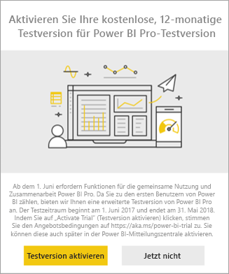
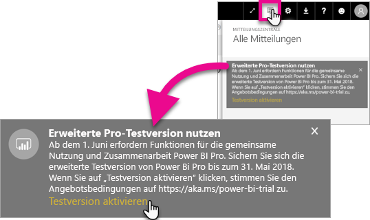
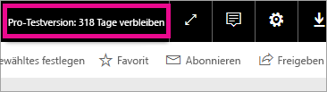

# Aktivierung der erweiterten Pro-Testversion
Ab 1. Juni 2017 können sich alle berechtigten Benutzer für die erweiterte Pro-Testversion für den Power BI-Dienst anmelden.

<iframe width="640" height="360" src="https://www.youtube.com/embed/tPsNoPyY9aA?showinfo=0" frameborder="0" allowfullscreen></iframe>

Als Teil der [Ankündigung vom 3. Mai 2017 von Power BI Premium ](https://powerbi.microsoft.com/blog/microsoft-accelerates-modern-bi-adoption-with-power-bi-premium/) hat Microsoft Änderungen am kostenlosen Power BI-Dienst bekanntgegeben, die ab 1. Juni 2017 wirksam werden. Hierzu gehören z.B. der Zugriff auf alle Datenquellen, höhere Arbeitsbereichspeicherbegrenzungen und höhere Aktualisierungs- und Streamingraten beim kostenlosen Dienst, sodass es mit Power BI Pro übereinstimmt.

Es wurde auch angekündigt, dass Freigabe- und Zusammenarbeitsfunktionen ausschließlich für Benutzer von Power BI Pro verfügbar sein werden, einschließlich der Peer-zu-Peer-Dashboardfreigabe, Gruppenarbeitsbereiche (jetzt als „App-Arbeitsbereiche“ bezeichnet), Export zu PowerPoint und Analyse in Excel mit Power BI-Apps. Exportieren in CSV/Excel und PowerPoint wurde in der Ankündigung am 3. Mai als Funktion festgelegt, die ausschließlich für Power BI Pro verfügbar sein wird. Als Reaktion auf Benutzerfeedback wurde die Strategie allerdings weiterentwickelt, sodass die Funktionen auch für Benutzer des kostenlosen Diensts verfügbar sein werden.

Ab dem 1. Juni 2017 werden vorhandene Benutzer des kostenlosen Diensts, die innerhalb des vergangenen Jahrs (am oder vor dem 2. Mai 2017) aktiv waren, eine Berechtigung für eine kostenlose zwölfmonatige erweiterte Testversion von Power BI Pro erhalten. Durch das Angebot können Benutzer den vollständigen Funktionsumfang von Power BI Pro für das nächste Jahr nutzen. Dies ist als Zeichen der Wertschätzung der Community zu verstehen, und soll dazu dienen, den Benutzern Zeit zu geben, sich an die Änderungen zu gewöhnen.

Am 1. Juni 2017 werden berechtigte Benutzer bei der Anmeldung im Dienst eine Benachrichtigung erhalten, dass die Änderungen in Kraft getreten sind, und sie werden aufgefordert, sich für die erweiterte Power BI Pro-Testversion zu registrieren. Der IT-Administrator eines Benutzers steuert die produktinternen Benachrichtigungen nicht. Außerdem verfügt der IT-Administrator nicht über die Möglichkeit, sich im Auftrag eines Benutzers für die erweiterte Power BI Pro-Testversion zu registrieren. Jeder berechtigte Benutzer muss diesen Vorgang selbst abschließen.

Benutzer können sich im Zeitraum von zwölf Monaten jederzeit für das Angebot registrieren, aber die erweiterte Pro-Testversion endet für alle Benutzer am 31. Mai 2018, unabhängig davon wann sie das Angebot angenommen haben. Zu diesem Zeitpunkt haben Benutzer die Möglichkeit, Power BI Pro zu erwerben oder auf die kostenlose Version von Power BI ohne die Funktionen Freigabe und Zusammenarbeit umzustellen, wenn sie Power BI Pro nicht erwerben.

An Power BI Pro werden keine Änderungen vorgenommen. Diese Benutzer sind nicht betroffen und erhalten keine Benachrichtigungen, wenn sie sich am 1. Juni 2017 oder später beim Dienst anmelden. Benutzer, die für das Angebot der erweiterten Power BI Pro-Testversion nicht berechtigt sind oder dieses ablehnen, können weiterhin die kostenlose Version von Power BI nutzen, ohne die Freigabe- und Zusammenarbeitsfunktionen. Sie können sich zu einem beliebigen Zeitpunkt für eine 60-tägige Standardtestversion von Power BI Pro registrieren. Besuchen Sie dafür die Power BI-[Website](https://powerbi.microsoft.com/get-started/).

## Berechtigung für die erweiterte Pro-Testversion
Ihr Konto muss die folgenden Anforderungen erfüllen, um für das erweiterte Angebot der Pro-Testversion berechtigt zu sein.

* Benutzer von Power BI Free, die zwischen dem 3. Mai 2016 und 2 Mai 2017 aktiv sind, sind für eine erweiterte Pro-Testversion berechtigt.
* Benutzer, die die *60-tägige produktinterne Pro-Testversion* zuvor verwendet haben oder aktuell nutzen, sind weiterhin zur Nutzung der erweiterten Pro Testversion berechtigt.

> [!NOTE]
> Benutzer, die Lizenzen aus dem Power BI Pro- oder Power BI Pro-Testversionsabonnement in Office 365 zugewiesen bekommen haben, werden von diesem Angebot ausgeschlossen.
> 
> 

## Wie Sie es aktivieren
Es gibt zwei Möglichkeiten, die erweiterte Pro-Testversion zu aktivieren. Die erste Möglichkeit ist die Anmeldung in Power BI. Wenn Sie dies abgelehnt haben, wird Ihnen im Benachrichtigungsbereich auch eine Option angezeigt.

> [!NOTE]
> Die produktinternen Benachrichtigungen werden nicht vom Administrator gesteuert und gehen ausschließlich an berechtigte Benutzer.
> 
> 

### Erfahrung beim Anmelden
Wenn Sie sich beim Power BI-Dienst anmelden und dazu berechtigt sind, erhalten Sie eine Popup-Benachrichtigung. Wählen Sie **Testversion aktivieren**, dann wird die erweiterte Pro-Testversion gestartet. Es ist keine weitere Aktion erforderlich.

Sie haben dann, für die Dauer des Testzeitraums, Zugriff auf alle vorhandenen freigegebenen Dashboards und Berichte.

Wenn Sie **Nicht jetzt** ausgewählt haben, kann die erweiterte Pro-Testversion bis zum Ende des Testzeitraums am 31. Mai 2018 jederzeit aktiviert werden.

### Aktivierung zu einem späteren Zeitpunkt
Wenn Sie das Popup-Fenster geschlossen haben, indem Sie **Nicht jetzt** ausgewählt haben, kann die erweiterte Pro-Testversion bis zum Ende des Testzeitraums am 31. Mai 2018 jederzeit aktiviert werden. Dies kann in der **Mitteilungszentrale** erfolgen.

In der Mitteilungszentrale sehen Sie eine Benachrichtigung bezüglich der erweiterten Pro-Testversion. Die Benachrichtigung ist verfügbar, bis der Benutzer sie schließt.

In der Benachrichtigung können Sie **Testversion aktivieren** auswählen, um die Testversion zu starten. Es ist keine weitere Aktion erforderlich.

Sie haben dann, für die Dauer des Testzeitraums, Zugriff auf alle vorhandenen freigegebenen Dashboards und Berichte.

## Nach der Aktivierung
Nach der Aktivierung wird in der rechten oberen Ecke angezeigt, wie viele Tage für die Testversion verbleiben.

Sie können die Bedingungen in den [Geschäftsbedingungen für das Angebot der erweiterten Pro-Testversion](https://aka.ms/power-bi-trial) einsehen. Die erweiterte Pro-Testversion wird bis zum 31. Mai 2018 für alle berechtigten Benutzern ausgeführt.

## Häufig gestellte Fragen
**Was geschieht mit den neuen Benutzer, die sich nach dem 3. Mai 2017 registrieren?**

Benutzer, die sich für Power BI Free am oder nach dem 3. Mai 2017 registrieren, sind nicht zur Nutzung der erweiterten Pro-Testversion berechtigt. Allerdings sind sie für die standardmäßige 60-tägige Pro-Testversion berechtigt.

**Wie finde ich heraus, wer in meiner Organisation für die erweiterte Pro-Testversion berechtigt ist?**

Es gibt zwar keine direkte Möglichkeit dies zu ermitteln, aber Sie können den in Azure Active Directory integrierten Anwendungsbericht für Power BI einsehen, um festzustellen, welche Benutzer in Ihrer Organisation innerhalb der letzten 30 Tage aktiv waren. Dadurch erhalten Sie möglicherweise einen Überblick darüber, wer berechtigt sein kann. Weitere Informationen finden Sie unter [Power BI-Benutzer suchen, die sich angemeldet haben](service-admin-access-usage.md).

Diese im Berechtigungszeitraum aktiven Benutzer, die kostenlose Lizenzen haben, erhalten die Popup-Benachrichtigung. 

> [!NOTE]
> Der Azure AD-Bericht zeigt nicht an, ob ein Benutzer in Free oder in Power BI Pro angemeldet ist. Er wird nur angezeigt, welche Benutzer sich für Power BI angemeldet haben und wann sie sich angemeldet haben. Wenn ein Benutzer in diesem Bericht aufgeführt ist, bedeutet dies nicht unbedingt, dass er für die erweiterte Pro-Testversion berechtigt ist.
> 
> 

**Können Administratoren einem Benutzer die Aktivierung der erweiterten Pro-Testversion verbieten?**

Nein. Administratoren haben nicht die Möglichkeit, Benutzer daran zu hindern, die erweiterte Pro Testversion oder die in Power BI Pro enthaltene 60-tägige Testversion zu aktivieren.

## Nächste Schritte
[Geschäftsbedingungen für das Angebot der erweiterten Pro-Testversion](https://aka.ms/power-bi-trial)  
[Power BI-Servicevertrag für Einzelbenutzer](https://powerbi.microsoft.com/terms-of-service/)  
[Ankündigung von Power BI Premium](https://aka.ms/pbipremium-announcement)  
[Suchen von Power BI-Benutzer, die sich angemeldet haben](service-admin-access-usage.md)

Weitere Fragen? [Stellen Sie Ihre Frage in der Power BI-Community.](https://community.powerbi.com/)

