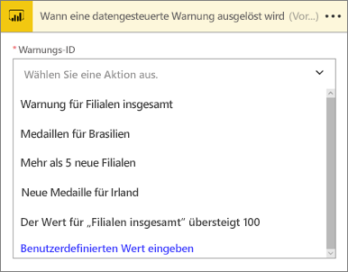
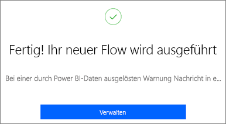
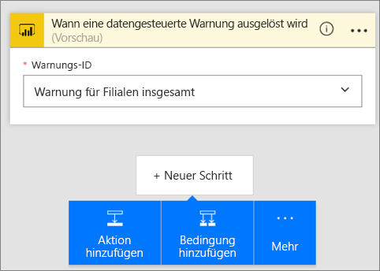
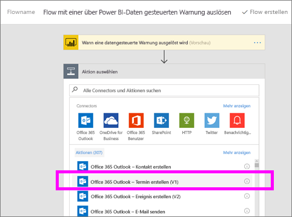
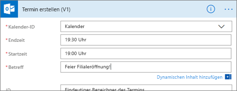

# Microsoft Flow und Power BI
## Was ist Microsoft Flow?
[Microsoft Flow](https://flow.microsoft.com/en-us/documentation/getting-started) ist ein SaaS-Dienst zum Automatisieren von Workflows zwischen den immer zahlreicheren Anwendungen und SaaS-Diensten, auf die Geschäftsbenutzer zugreifen. Mit Flow können Sie Aufgaben automatisieren, indem Sie Ihre bevorzugten Apps und Dienste (einschließlich Power BI) synchronisieren, um Benachrichtigungen zu erhalten, Dateien zu synchronisieren, Daten zu sammeln und weitere Aktionen ausführen zu lassen. Die Automatisierung von Workflows vereinfacht Aufgaben, die sich wiederholen.

[Erste Schritte mit Flow](https://flow.microsoft.com/documentation/getting-started)

Sehen Sie sich an, wie Sirui einen Flow erstellt, der eine detaillierte E-Mail an Kollegen versendet, wenn eine Power BI-Warnung ausgelöst wird. Befolgen Sie dann die schrittweisen Anleitungen unter dem Video, um es selbst ausprobieren.

<iframe width="560" height="315" src="https://www.youtube.com/embed/YhmNstC39Mw" frameborder="0" allowfullscreen></iframe>

## Erstellen eines Flows, der durch eine Power BI-Datenwarnung ausgelöst wird
In diesem Tutorial erfahren Sie, wie Sie zwei verschiedene Flows erstellen: einen Flow aus einer Vorlage und einen von Grund auf neuen Flow. Um die Schritte des Tutorials auszuführen, [erstellen Sie in Power BI eine Datenwarnung](service-set-data-alerts.md), und [registrieren Sie sich für Microsoft Flow](https://flow.microsoft.com/en-us/#home-signup) (kostenlos!).

## Erstellen eines Flows, der Power BI verwendet – aus einer Vorlage
In dieser Aufgabe verwenden wir eine Vorlage, um einen einfachen Flow zu erstellen, der durch eine Power BI-Datenwarnung (Benachrichtigung) ausgelöst wird.

1. Melden Sie sich bei Microsoft Flow („flow.microsoft.com“) an.
2. Wählen Sie **Meine Flows** aus.
   
   
3. Wählen Sie **Aus Vorlage erstellen** aus.
   
    
4. Verwenden Sie das Suchfeld, um Power BI-Vorlagen zu suchen, und wählen Sie **Post a message to a Slack channel when a Power BI data alert is triggered** (Nachricht in einem Slack-Kanal senden, wenn eine Power BI-Datenwarnung ausgelöst wird) aus.
   
    
5. Wählen Sie **Diese Vorlage verwenden** aus.
   
   
6. Wenn Sie dazu aufgefordert werden, stellen Sie eine Verbindung mit Slack und Power BI her, indem Sie **Anmelden** auswählen und dann den Anweisungen folgen. Ein grünes Häkchen gibt an, dass Sie angemeldet sind.  Nachdem Sie die Verbindungen bestätigt haben, wählen Sie **Weiter** aus.
   
   

### Erstellen des Flows
Diese Vorlage verfügt über einen Trigger (Power BI-Datenwarnung bei neuen Olympiamedaillen für Irland) und eine Aktion (Nachricht an Slack senden). Wenn Sie ein Feld auswählen, werden dynamische Inhalte angezeigt, die Sie einschließen können.  In diesem Beispiel haben wir den Kachelwert und die Kachel-URL in den Nachrichtentext eingefügt.

1. Wählen Sie in der Trigger-Dropdownliste eine Power BI-Datenwarnung aus. Wählen Sie die Option **New medal for Ireland** (Neue Medaille für Irland). Informationen zum Erstellen einer Warnung finden Sie unter [Datenwarnungen in Power BI](service-set-data-alerts.md).
   
   
2. Geben Sie zum Posten in Slack einen Kanalnamen und einen Nachrichtentext ein (Sie können auch die von Flow erstellte Standardnachricht auswählen). Beachten Sie den dynamischen Inhalt, den wir im Textfeld für Nachrichten hinzugefügt haben.
   
   > [!NOTE]
   > Schließen Sie am Anfang des Kanalnamens ein @-Zeichen ein.  Wenn der Slack-Channel beispielsweise „channelA“ heißt, geben Sie in Flow „@channelA“ ein.
   > 
   > 
   
   
3. Wenn Sie fertig sind, wählen Sie **Flow erstellen** oder **Flow speichern** aus.  Der Flow wird erstellt und ausgewertet.  Wenn Fehler gefunden werden, wird Ihnen dies mitgeteilt.
4. Wenn Fehler gefunden wurden, wählen Sie **Fluss bearbeiten** aus, um sie zu beheben. Wählen Sie andernfalls **Fertig** aus, um den neuen Flow auszuführen.
   
   
5. Öffnen Sie Ihr Slack-Konto, um die Meldung anzuzeigen.  
   
   

## Erstellen eines Flows, der Power BI verwendet – ohne Vorlage (leer)
In dieser Aufgabe erstellen wir einen einfachen Flow von Grund auf neu, der durch eine Power BI-Datenwarnung (Benachrichtigung) ausgelöst wird.

1. Melden Sie sich bei Microsoft Flow an.
2. Wählen Sie **Meine Flows** > **Ohne Vorlage erstellen** aus.
   
   
3. Verwenden Sie das Suchfeld, um einen Power BI-Trigger zu suchen, und wählen Sie **Flow mit einer über Power BI-Daten gesteuerten Warnung auslösen** aus.

### Erstellen des Flows
1. Wählen Sie in der Dropdownliste den Namen der Warnung aus.  Informationen zum Erstellen einer Warnung finden Sie unter [Datenwarnungen in Power BI](service-set-data-alerts.md).
   
    
2. Wählen Sie **Neuer Schritt** > **Aktion hinzufügen** aus.
   
   
3. Suchen Sie nach **Outlook**, und wählen Sie **Ereignis erstellen** aus.
   
   
4. Füllen Sie die Ereignisfelder aus. Wenn Sie ein Feld auswählen, werden dynamische Inhalte angezeigt, die Sie einschließen können.
   
   
5. Wählen Sie zum Abschluss **Flow erstellen** aus.  Der Flow wird gespeichert und ausgewertet. Wenn keine Fehler vorliegen, wählen Sie **Fertig** aus, um diesen Flow auszuführen.  Der neue Flow wird der Seite **Meine Flüsse** hinzugefügt.
   
   
6. Wenn der Flow durch die Power BI-Datenwarnung ausgelöst wird, erhalten Sie eine ähnliche Outlook-Ereignisbenachrichtigung wie die folgende.
   
    

### Nächste Schritte
* [Erste Schritte mit Microsoft Flow](https://flow.microsoft.com/en-us/documentation/getting-started/)
* [Festlegen von Datenwarnungen im Power BI-Dienst](service-set-data-alerts.md)
* [Festlegen von Datenwarnungen auf dem iPhone](mobile-set-data-alerts-in-the-mobile-apps.md)
* [Festlegen von Datenwarnungen in der mobilen Power BI-App für Windows 10](mobile-set-data-alerts-in-the-mobile-apps.md)
* Weitere Fragen? [Wenden Sie sich an die Power BI-Community](http://community.powerbi.com/)

