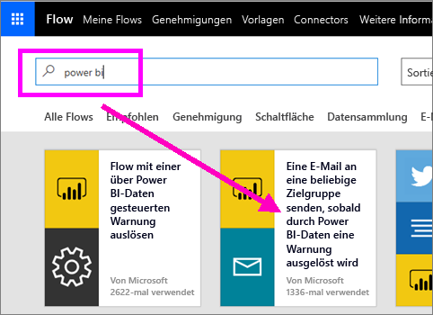
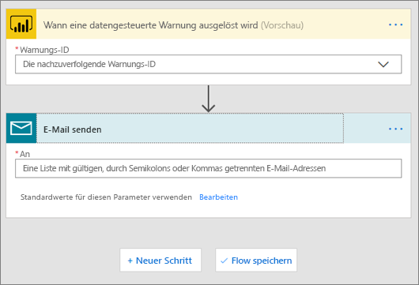
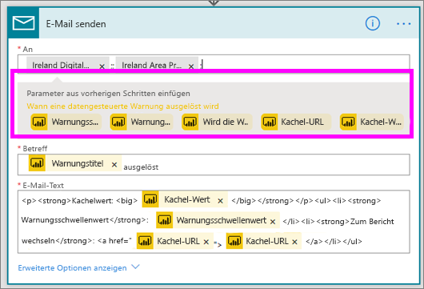
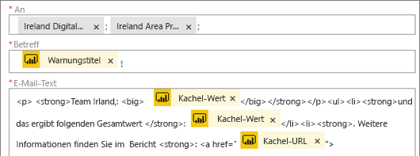
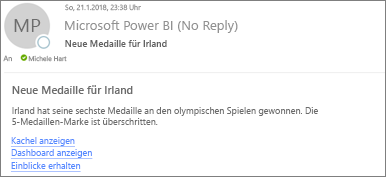

# Microsoft Flow und Power BI

[Microsoft Flow](https://flow.microsoft.com/en-us/documentation/getting-started) ist ein SaaS-Dienst zum Automatisieren von Workflows zwischen den immer zahlreicheren Anwendungen und SaaS-Diensten, auf die Geschäftsbenutzer zugreifen. Mit Flow können Sie Aufgaben automatisieren, indem Sie Ihre bevorzugten Apps und Dienste (einschließlich Power BI) synchronisieren, um Benachrichtigungen zu erhalten, Dateien zu synchronisieren, Daten zu sammeln und weitere Aktionen ausführen zu lassen. Die Automatisierung von Workflows vereinfacht Aufgaben, die sich wiederholen.

[Erste Schritte mit Flow](https://flow.microsoft.com/documentation/getting-started)

Sehen Sie sich an, wie Sirui einen Flow erstellt, der eine detaillierte E-Mail an Kollegen versendet, wenn eine Power BI-Warnung ausgelöst wird. Befolgen Sie dann die schrittweisen Anleitungen unter dem Video, um es selbst ausprobieren.

<iframe width="560" height="315" src="https://www.youtube.com/embed/YhmNstC39Mw" frameborder="0" allowfullscreen></iframe>

## Erstellen eines Flows, der durch eine Power BI-Datenwarnung ausgelöst wird

### Voraussetzungen
In diesem Tutorial erfahren Sie, wie Sie zwei verschiedene Flows erstellen: einen Flow aus einer Vorlage und einen von Grund auf neuen Flow. Um die Schritte des Tutorials auszuführen, [erstellen Sie in Power BI eine Datenwarnung](service-set-data-alerts.md), erstellen ein kostenloses Slack-Konto und [registrieren Sie sich für Microsoft Flow](https://flow.microsoft.com/en-us/#home-signup) (kostenlos!).

## Erstellen eines Flows, der Power BI verwendet – aus einer Vorlage
In dieser Aufgabe verwenden wir eine Vorlage, um einen einfachen Flow zu erstellen, der durch eine Power BI-Datenwarnung (Benachrichtigung) ausgelöst wird.

1. Melden Sie sich bei Microsoft Flow („flow.microsoft.com“) an.
2. Wählen Sie **Meine Flows** aus.
   
   
3. Wählen Sie **Aus Vorlage erstellen** aus.
   
    
4. Verwenden Sie das Suchfeld, um Power BI-Vorlagen zu suchen, und wählen Sie **Eine E-Mail an eine beliebige Zielgruppe senden, sobald durch Power BI-Daten eine Warnung ausgelöst wird > Weiter** aus.
   
    

### Erstellen des Flows
Diese Vorlage verfügt über einen Trigger (Power BI-Datenwarnung bei neuen Olympiamedaillen für Irland) und eine Aktion (E-Mail senden). Wenn Sie ein Feld auswählen, werden dynamische Inhalte angezeigt, die Sie einschließen können.  In diesem Beispiel haben wir den Kachelwert und die Kachel-URL in den Nachrichtentext eingefügt.

1. Wählen Sie in der Trigger-Dropdownliste eine Power BI-Datenwarnung aus. Wählen Sie die Option **New medal for Ireland** (Neue Medaille für Irland). Informationen zum Erstellen einer Warnung finden Sie unter [Datenwarnungen in Power BI](service-set-data-alerts.md).
   
   
2. Geben Sie mindestens eine gültige E-Mail-Adresse ein, und wählen Sie dann **Bearbeiten** (siehe unten) oder **Dynamische Inhalte hinzufügen** aus. 
   
   

3. Flow erstellt einen Titel und eine Nachricht für Sie, den bzw. die Sie beibehalten oder ändern können. Alle Werte, die von Ihnen beim Erstellen der Warnung in Power BI festgelegt wurden, können nun verwendet werden. Platzieren Sie einfach Ihren Cursor, und wählen Sie aus dem grau hervorgehobenen Bereich aus. 

   

1.  Wenn Sie beispielsweise in Power BI eine Warnung mit dem Titel **Wir haben eine weitere Medaille gewonnen** erstellt haben, können Sie **Warnungstitel** auswählen, um den Text in die Betreffzeile Ihrer E-Mail einzufügen.

    

    Darüber hinaus haben Sie Möglichkeit, den standardmäßigen E-Mail-Text zu übernehmen oder einen eigenen zu erstellen. Das obige Beispiel enthält einige Änderungen an der Nachricht.

1. Wenn Sie fertig sind, wählen Sie **Flow erstellen** oder **Flow speichern** aus.  Der Flow wird erstellt und ausgewertet.  Wenn Fehler gefunden werden, wird Ihnen dies mitgeteilt.
2. Wenn Fehler gefunden wurden, wählen Sie **Fluss bearbeiten** aus, um sie zu beheben. Wählen Sie andernfalls **Fertig** aus, um den neuen Flow auszuführen.
   
   
5. Sobald die Datenwarnung ausgelöst wird, wird eine E-Mail an die von Ihnen angegeben Adressen gesendet.  
   
   

## Erstellen eines Flows, der Power BI verwendet – ohne Vorlage (leer)
In dieser Aufgabe erstellen wir einen einfachen Flow von Grund auf neu, der durch eine Power BI-Datenwarnung (Benachrichtigung) ausgelöst wird.

1. Melden Sie sich bei Microsoft Flow an.
2. Wählen Sie **Meine Flows** > **Ohne Vorlage erstellen** aus.
   
   
3. Verwenden Sie das Suchfeld, um einen Power BI-Trigger zu suchen, und wählen Sie **Power BI – wenn eine datenbasierte Warnung ausgelöst wird** aus.

### Erstellen des Flows
1. Wählen Sie in der Dropdownliste den Namen der Warnung aus.  Informationen zum Erstellen einer Warnung finden Sie unter [Datenwarnungen in Power BI](service-set-data-alerts.md).
   
    
2. Wählen Sie **Neuer Schritt** > **Aktion hinzufügen** aus.
   
   
3. Suchen Sie nach **Outlook**, und wählen Sie **Ereignis erstellen** aus.
   
   
4. Füllen Sie die Ereignisfelder aus. Wenn Sie ein Feld auswählen, werden dynamische Inhalte angezeigt, die Sie einschließen können.
   
   
5. Wählen Sie zum Abschluss **Flow erstellen** aus.  Der Flow wird gespeichert und ausgewertet. Wenn keine Fehler vorliegen, wählen Sie **Fertig** aus, um diesen Flow auszuführen.  Der neue Flow wird der Seite **Meine Flüsse** hinzugefügt.
   
   
6. Wenn der Flow durch die Power BI-Datenwarnung ausgelöst wird, erhalten Sie eine ähnliche Outlook-Ereignisbenachrichtigung wie die folgende.
   
    

## Nächste Schritte
* [Erste Schritte mit Microsoft Flow](https://flow.microsoft.com/en-us/documentation/getting-started/)
* [Festlegen von Datenwarnungen im Power BI-Dienst](service-set-data-alerts.md)
* [Festlegen von Datenwarnungen auf dem iPhone](mobile-set-data-alerts-in-the-mobile-apps.md)
* [Festlegen von Datenwarnungen in der mobilen Power BI-App für Windows 10](mobile-set-data-alerts-in-the-mobile-apps.md)
* Weitere Fragen? [Wenden Sie sich an die Power BI-Community](http://community.powerbi.com/)

