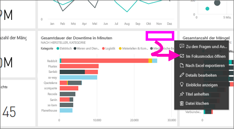
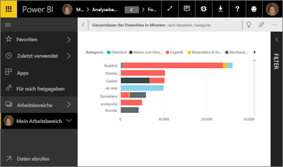
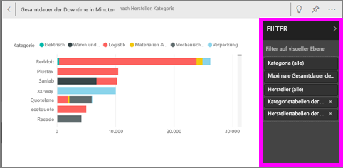
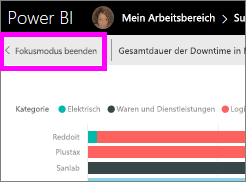

# Anzeigen einer Dashboardkachel oder eines Berichtsvisuals im Fokusmodus
<iframe width="560" height="315" src="https://www.youtube.com/embed/dtdLul6otYE" frameborder="0" allowfullscreen></iframe>

## Was ist der Fokusmodus?
Im ***Fokusmodus*** können Sie eine Dashboardkachel oder Berichtsvisualisierung erweitern (ausklappen) und so mehr Informationen sehen.  Sie können im Fokusmodus Filter anzeigen und ändern, die beim Erstellen dieses Visuals angewendet wurden.  

> [!NOTE]
> Der Fokusmodus unterscheidet sich vom [Vollbildmodus](service-fullscreen-mode.md).
> 
## Fokusmodus für Dashboards und Dashboardkacheln
1. Zeigen Sie auf die Kachelvisualisierung, wählen Sie die Auslassungspunkte (...) und dann **Im Fokusmodus öffnen**  aus.  
   
2. Die Kachel wird geöffnet und füllt den gesamten Berichtszeichenbereich. 

   

3. Erweitern Sie den Bereich „Filter“, um alle auf diese Visualisierung angewendeten Filter anzuzeigen.
   
   

4. Fahren Sie mit der Untersuchung fort, indem Sie die Filter ändern und, wenn Sie etwas Interessantes finden, die Visualisierung an ein Dashboard anheften.

5. Beenden Sie den Fokusmodus, und wechseln Sie zurück zum Dashboard, indem Sie **< Fokusmodus beenden** (in der linken oberen Ecke des Visuals) auswählen.
   
        

## Fokusmodus für Berichtvisualisierungen

1. Zeigen Sie auf die Berichtsvisualisierung, und wählen Sie das Symbol des für den **Fokusmodus**  aus.  
   
   
2. Die Visualisierung wird geöffnet und füllt den gesamten Zeichenbereich. 

   
   
3. Erweitern Sie den Bereich „Filter“, um alle auf diese Visualisierung angewendeten Filter anzuzeigen.
   
   
4. Fahren Sie mit der Untersuchung fort, indem Sie die Filter ändern und, wenn Sie etwas Interessantes finden, die Visualisierung an ein Dashboard anheften.   
5. Beenden Sie den Fokusmodus, und wechseln Sie zurück zum Bericht, indem Sie **Zurück zum Bericht** (in der linken oberen Ecke des Visuals) auswählen. 
   
      

## Wechseln vom Fokusmodus zum Vollbildmodus
Nachdem sie im Fokusmodus geöffnet wurde, kann die Kachel oder das Visual im [Vollbildmodus (TV-Modus)](service-fullscreen-mode.md) angezeigt werden. Im Vollbildmodus erfolgt die Anzeige ohne störende Menüs und Navigationssymbole.

## Zu beachtende Aspekte und Problembehandlung
* Wenn Sie den Fokusmodus für eine Visualisierung in einem Bericht verwenden, können Sie alle Filter anzeigen und ändern: Filter auf Visual-, Seiten- und Berichtsebene.    
* Wenn Sie den Fokusmodus für eine Visualisierung in einem Dashboard verwenden, können Sie nur Filter auf Visualebene anzeigen und ändern.

Weitere Fragen? [Wenden Sie sich an die Power BI-Community](http://community.powerbi.com/)

