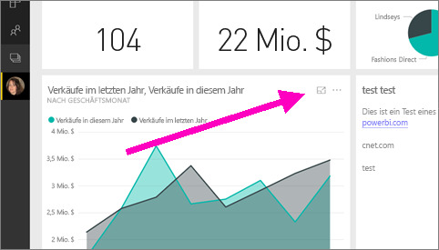
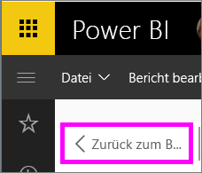

# Anzeigen einer Dashboardkachel oder Berichtsvisualisierung im Fokusmodus
<iframe width="560" height="315" src="https://www.youtube.com/embed/dtdLul6otYE" frameborder="0" allowfullscreen></iframe>

## Was ist der Fokusmodus?
Im ***Fokusmodus*** können Sie eine Dashboardkachel oder Berichtsvisualisierung erweitern (ausklappen) und so mehr Informationen sehen.  Sie können im Fokusmodus Filter anzeigen und ändern, die beim Erstellen dieses Visuals angewendet wurden.  

> [!NOTE]
> Der Fokusmodus unterscheidet sich vom [Vollbildmodus](service-tile-fullscreen-mode.md).
> 
> 

1. Zeigen Sie auf die Kachel oder Visualisierung, und wählen Sie das Symbol **Fokusmodus**  aus.  
   
   
2. Sie wird geöffnet und füllt den gesamten Zeichenbereich. Der Fokusmodus ist bei Dashboardkacheln und Berichtsvisualisierungen nahezu identisch, es gibt jedoch einige Unterschiede. Beispielsweise wählen Sie zum Beenden des Fokusmodus in einem Bericht **Zurück zum Bericht** aus. Zum Beenden des Fokusmodus in einem Dashboard wählen Sie hingegen **Fokusmodus beenden** aus. Informationen zu weiteren Unterschieden finden Sie im Folgenden unter **Zu beachtende Aspekte und Problembehandlung**.
   
   
3. Erweitern Sie den Bereich „Filter“, um alle auf diese Visualisierung angewendeten Filter anzuzeigen.
   
   
4. Fahren Sie mit der Untersuchung fort, indem Sie die Filter ändern und, wenn Sie etwas Interessantes finden, die Visualisierung an ein Dashboard anheften.   
5. Beenden Sie den Fokusmodus, und wechseln Sie zurück zum Dashboard, indem Sie **< Fokusmodus beenden** (in der linken oberen Ecke der Visualisierung) auswählen.
   
        
   
    Um den Fokusmodus zu beenden und zur Berichtsseite zurückzukehren, wählen Sie **Zurück zum Bericht** aus.    
   
    

## Wechseln vom Fokusmodus zum Vollbildmodus
Nachdem sie im Fokusmodus geöffnet wurde, kann die Kachel oder das Visual im [Vollbildmodus (TV-Modus)](service-tile-fullscreen-mode.md) angezeigt werden. Im Vollbildmodus erfolgt die Anzeige ohne störende Menüs und Navigationssymbole.

## Zu beachtende Aspekte und Problembehandlung
* Wenn Sie den Fokusmodus für eine Visualisierung in einem Bericht verwenden, können Sie alle Filter anzeigen und ändern: Filter auf Visual-, Seiten- und Berichtsebene.    
* Wenn Sie den Fokusmodus für eine Visualisierung in einem Dashboard verwenden, können Sie nur Filter auf Visualebene anzeigen und ändern.

Weitere Fragen? [Wenden Sie sich an die Power BI-Community](http://community.powerbi.com/)

