# Im Handumdrehen von einer Excel-Arbeitsmappe zum eindrucksvollen Bericht
Ihre Vorgesetzte möchte bis zum Ende des Arbeitstages von Ihnen einen Bericht über die aktuellen Verkaufszahlen in Verbindung mit den Eindrücken der letzten Kampagne angefertigt bekommen. Die neuesten Daten befinden sich jedoch in verschiedenen Systemen von Drittanbietern und in Dateien auf Ihrem Laptop. Bisher hat es Stunden gedauert, Visualisierungen zu erstellen und einen Bericht zu formatieren. Sie werden langsam unruhig.

Kein Problem. Mit Power BI können Sie in kürzester Zeit einen beeindruckenden Bericht erstellen.

In diesem Beispiel laden eine Excel-Datei von einem lokalen System hoch, erstellen einen neuen Bericht und geben diesen für Kollegen frei – alles innerhalb von Power BI.

## Bereiten Sie die Daten vor.
Nehmen wir eine einfache Excel-Datei als Beispiel. Bevor Sie Ihre Excel-Datei in Power BI laden können, müssen Sie Ihre Daten in einer flachen Tabelle anordnen. Dies bedeutet, dass jede Spalte den gleichen Datentyp enthält – z. B. Text, Datum, Anzahl oder Währung. Sie sollten eine Kopfzeile haben, es sollte jedoch keine Spalte oder Zeile vorhanden sein, die Gesamtsummen anzeigt.

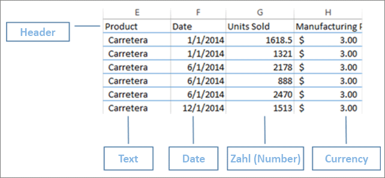

Formatieren Sie dann die Daten als Tabelle. Wählen Sie in Excel auf der Registerkarte „Start“ in der Gruppe „Formatvorlagen“ die Option **Als Tabelle formatieren**aus. Wählen Sie ein Tabellenformat, das auf das Arbeitsblatt angewendet wird. Das Excel-Arbeitsblatt kann jetzt in Power BI geladen werden.

## Laden Sie die Excel-Datei in Power BI hoch.
Power BI stellt Verbindungen mit vielen Datenquellen her, einschließlich Excel-Dateien auf Ihrem Computer. Melden Sie sich zunächst beim Power BI-Dienst an. Wenn Sie sich noch nicht registriert haben, [können Sie dies kostenlos tun](https://powerbi.com).

Erstellen Sie ein neues Dashboard. Öffnen Sie **Mein Arbeitsbereich**, und wählen Sie das Symbol **+ Erstellen** aus.

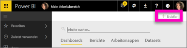

Wählen Sie **Dashboard**, geben Sie einen Namen ein, und wählen Sie **Erstellen** aus. Das neue Dashboard wird angezeigt – ohne Daten.

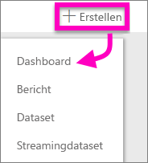

Wählen Sie unten im linken Navigationsbereich **Daten abrufen** aus. Wählen Sie auf der Seite „Daten abrufen“ unter „Mit Daten verbinden“ im Feld „Dateien“ die Option **Abrufen**aus.

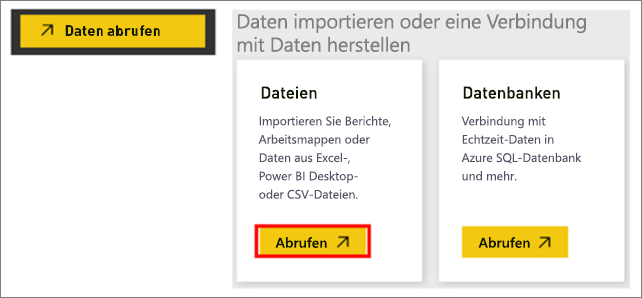

Wählen Sie auf der Seite „Dateien“ die Option **Lokale Datei**aus. Navigieren Sie zu der Excel-Arbeitsmappendatei auf Ihrem Computer, und wählen Sie sie zum Laden in Power BI aus. Wählen Sie **Importieren** aus.

> **HINWEIS**: Um dem Tutorial weiter folgen zu können, verwenden Sie die [Arbeitsmappe mit Finanzbeispiel](sample-financial-download.md).
> 
> 

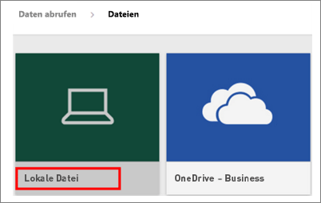

## Erstellen Sie den Bericht.
Nachdem Power BI Ihre Excel-Datei importiert hat, können Sie mit dem Erstellen des Berichts beginnen. Wenn die Meldung **Ihr Dataset steht bereit** angezeigt wird, wählen Sie **Dataset anzeigen** aus.  Power BI wird in der Bearbeitungsansicht geöffnet und zeigt den Berichtszeichenbereich an. Auf der rechten Seite werden die Bereiche „Visualisierungen“, „Filter“ und „Felder“ angezeigt.

Beachten Sie, dass die Daten der Excel-Arbeitsmappe im Bereich „Felder“ angezeigt werden. Unter dem Namen der Tabelle listet Power BI die Spaltenüberschriften als einzelne Felder auf.

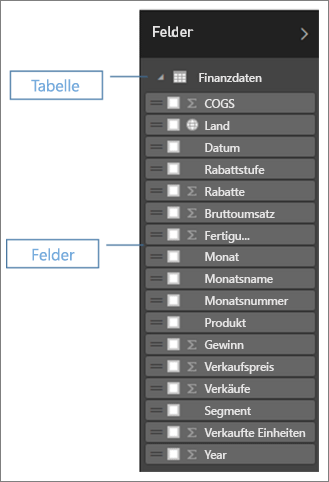

Nun können Sie Visualisierungen erstellen. Ihr Vorgesetzter möchte den Gewinn über die Zeit sehen. Ziehen Sie im Bereich „Felder“ den **Gewinn** auf den Zeichenbereich des Berichts. Power BI stellt standardmäßig ein Balkendiagramm dar. Ziehen Sie jetzt das **Datum** auf den Zeichenbereich des Berichts. Power BI aktualisiert das Balkendiagramm, um Gewinne nach Datum anzuzeigen.

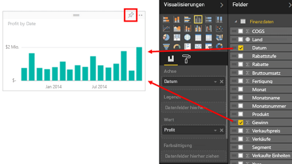

> **TIPP**: Wenn das Diagramm nicht wie erwartet aussieht, überprüfen Sie die Aggregationen. Klicken Sie beispielsweise im Bereich **Wert** mit der rechten Maustaste auf das Feld, das Sie gerade hinzugefügt haben, und stellen Sie sicher, dass die Daten auf die von Ihnen gewünschte Weise aggregiert werden.  In diesem Beispiel verwenden wir **Summe**.
> 
> 

Ihre Vorgesetzte möchte wissen, welche Länder die meisten Gewinne erzeugen. Beeindrucken Sie sie mit einer Kartenvisualisierung. Wählen Sie einen leeren Bereich im Zeichenbereich aus, und ziehen Sie die Felder **Land** und **Profit** einfach aus dem Felderbereich herüber. Power BI erstellt eine Kartenvisualisierung mit Blasendiagramm, die den relativen Gewinn jedes Standorts darstellt.

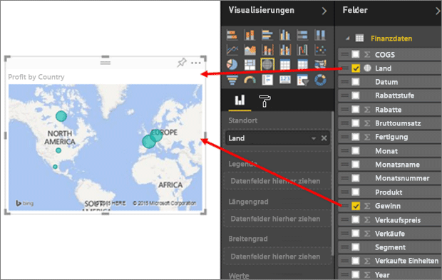

Wie sieht es mit der Anzeige einer Visualisierung der Verkäufe nach Produkt- und Marktsegment aus? Kein Problem. Aktivieren Sie im Bereich „Felder“ die Kontrollkästchen neben den Feldern „Verkäufe“, „Produkt“ und „Segment“. Power BI erstellt sofort ein Balkendiagramm. Ändern Sie den Typ des Diagramms durch Auswahl eines der Symbole im Menü „Visualisierungen“. Ändern Sie ihn z. B. in ein gestapeltes Balkendiagramm.  Wählen Sie zum Sortieren des Diagramms die Auslassungspunkte (...) und dann **Sortieren nach** aus.

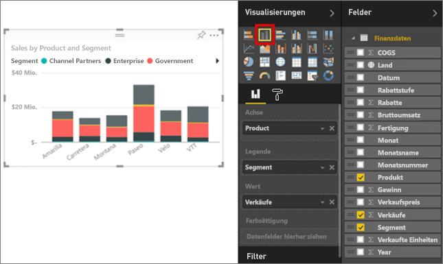

Heften Sie alle Visualisierungen an Ihr Dashboard. Jetzt können Sie sie mit Ihren Kollegen gemeinsam nutzen.

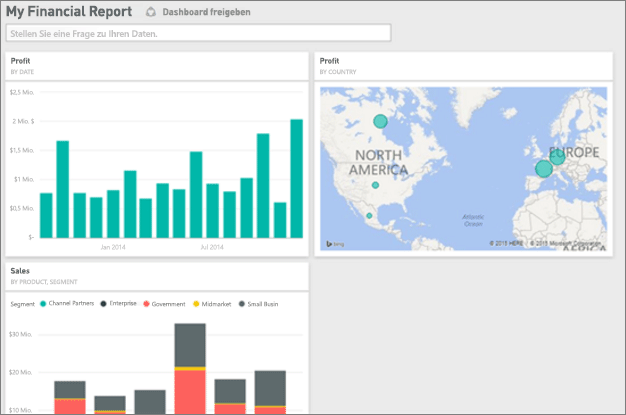

## Geben Sie das Dashboard frei.
Sie möchten Ihr Dashboard für Ihre Vorgesetzte, Paula, freigeben. Sie können Ihr Dashboard und den zugrunde liegenden Bericht für alle Kollegen freigeben, die über ein Power BI-Konto verfügen. Sie können mit dem Bericht interagieren, jedoch keine Änderungen speichern.

Zum Freigeben des Berichts wählen Sie am oberen Rand des Dashboards die Option **Freigeben**aus.

Power BI zeigt die Seite „Dashboard freigeben“ an. Geben Sie im oberen Bereich die E-Mail-Adressen der Empfänger ein. Fügen Sie eine Nachricht im Feld darunter hinzu. Um den Empfängern die Freigabe Ihres Dashboards für Dritte zu ermöglichen, wählen Sie **Empfängern das Freigeben Ihres Dashboards erlauben**aus. Wählen Sie **Freigeben**aus.

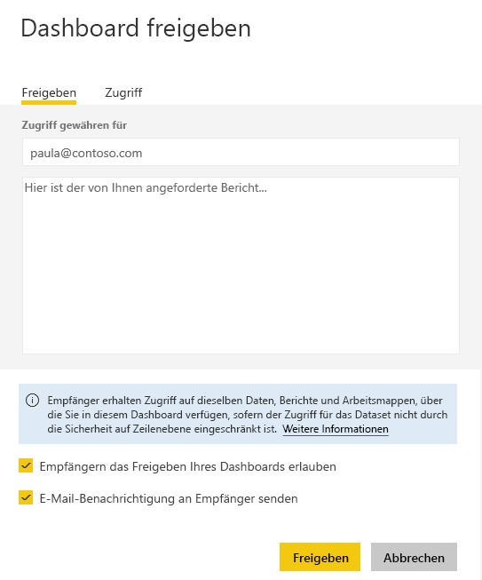

Nächste Schritte

* [Erste Schritte mit dem Power BI-Dienst](service-get-started.md)
* [Erste Schritte mit Power BI Desktop](desktop-getting-started.md)
* [Power BI – Grundkonzepte](consumer/end-user-basic-concepts.md)
* Weitere Fragen? [Wenden Sie sich an die Power BI-Community](http://community.powerbi.com/)

