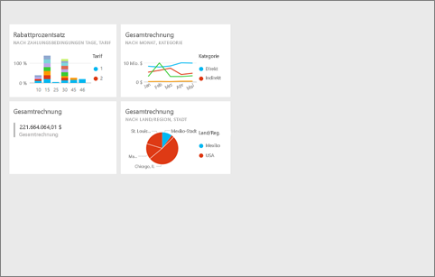
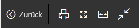
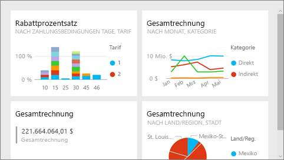
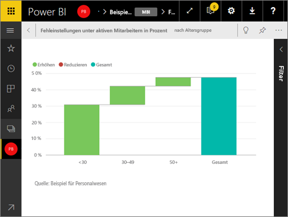

# Vollbildmodus in Power BI
## Was ist der Vollbildmodus?

Zeigen Sie Ihre Inhalte (Dashboards, Berichtsseiten, Kacheln und Visualisierungen) ohne störende Menüs und Navigationsleisten an.  Sie erhalten jederzeit eine aufgeräumte vollständige Ansicht Ihrer Inhalte auf einen Blick. Dies wird gelegentlich auch als TV-Modus bezeichnet. Die im Vollbildmodus verfügbaren Funktionen variieren je nach Inhalt.  

Einige Verwendungsmöglichkeiten des Vollbildmodus:

* Präsentieren Ihrer Dashboards, Kacheln, Visualisierungen oder Berichte in einer Besprechung oder Konferenz
* Anzeigen in einem Büro auf einem dedizierten großen Bildschirm oder Projektor
* Anzeigen auf einem kleinen Bildschirm
* Überprüfen im gesperrten Modus – Sie können den Bildschirm berühren oder mit dem Mauszeiger auf Kacheln zeigen, ohne den zugrunde liegenden Bericht oder das Dashboard zu öffnen.

> **HINWEIS**: Der Vollbildmodus unterscheidet sich vom [Fokusmodus (Aufklappmodus)](service-focus-mode.md).
> 
> 

Schauen Sie sich an, wie Amanda ihr Dashboard im Vollbildmodus öffnet, darin navigiert und dann die Standardeinstellung für die Anzeige mithilfe einiger URL-Parameter ändert. Befolgen Sie dann die schrittweisen Anleitungen unter dem Video, um es selbst ausprobieren.

<iframe width="560" height="315" src="https://www.youtube.com/embed/c31gZkyvC54" frameborder="0" allowfullscreen></iframe>

## Dashboards und Berichtsseiten im Vollbildmodus
1. Wählen Sie auf der Power BI-Menüleiste über Ihrem Dashboard oder Bericht das Symbol **Vollbild**  aus. Der Dashboardbereich oder die Berichtsseite nimmt den gesamten Bildschirm ein. Im folgenden Beispiel wird ein Dashboard dargestellt.
   
      
2. Im Vollbildmodus verfügen Sie über mehrere Menüoptionen.  Um das Menü anzuzeigen, bewegen Sie einfach die Maus oder den Cursor. 
   
     Menü für Dashboards    
         
   
     Menü für Berichtsseiten    
        
   
        
    Kehren Sie mit der Schaltfläche **Zurück** zur vorherigen Seite in Ihrem Browser zurück. Wenn die vorherige Seite eine Power BI-Seite war, wird sie ebenfalls im Vollbildmodus angezeigt.  Der Vollbildmodus bleibt so lange aktiviert, bis Sie ihn beenden.
   
        
    Verwenden Sie diese Schaltfläche, um die Dashboard- oder Berichtsseite im Vollbildmodus zu drucken. 
   
        
    Verwenden Sie die Schaltfläche **An Bildschirmgröße anpassen**, um das Dashboard so groß wie möglich anzuzeigen, ohne dass Bildlaufleisten verwendet werden.     
   
    
   
           
    Manchmal sind Bildlaufleisten nicht wichtig, und das Dashboard soll auf der gesamten Breite des verfügbaren Bereichs angezeigt werden. Wählen Sie die Schaltfläche **An Breite anpassen** aus.    
   
    
   
           
    Verwenden Sie in Berichten im Vollbildmodus diese Pfeile, um zwischen den Seiten im Bericht zu wechseln.    
3. Um den Vollbildmodus zu beenden, klicken Sie auf das Symbol **Vollbildmodus beenden**.
   
      

## Visualisierungen und Dashboardkacheln im Vollbildmodus
1. Um Dashboardkacheln und Berichtsvisualisierungen im Vollbildmodus anzuzeigen, müssen Sie mit der Kachel bzw. Visualisierung beginnen, die sich bereits im [Fokusmodus](service-focus-mode.md) befindet. 
   
    
2. Wählen Sie dann das Symbol „Vollbild“   für diese Kachel oder dieses Visual aus. Die Kachel oder das Visual wird ohne Menüs oder Navigationsleisten als Vollbild angezeigt.
   
    

## Nächste Schritte
[Dashboards in Power BI](service-dashboards.md)  
[Fokusmodus](service-focus-mode.md)    

Weitere Fragen? [Wenden Sie sich an die Power BI-Community](http://community.powerbi.com/)

