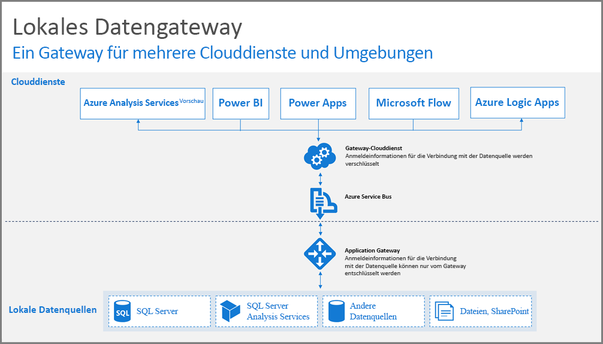
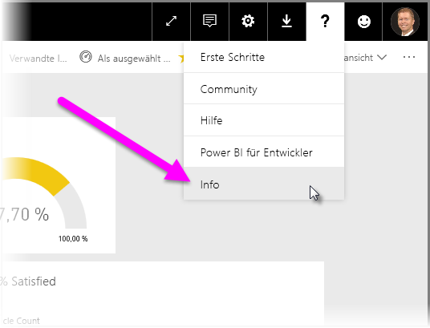
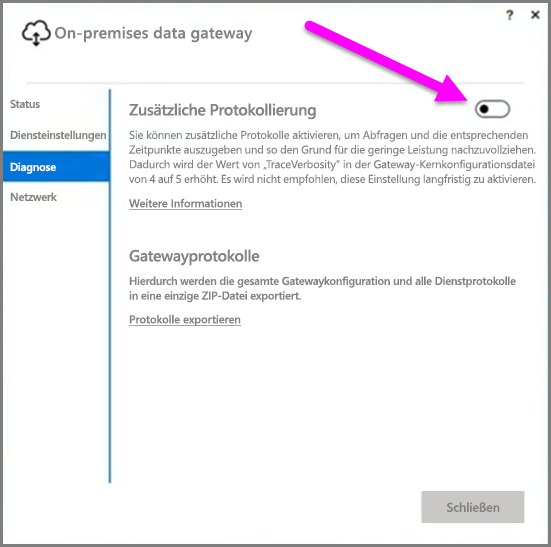
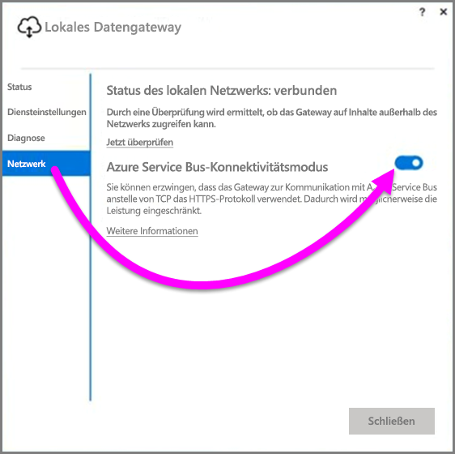
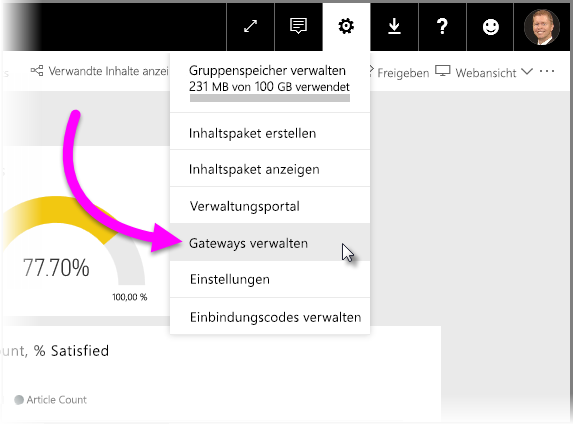

# Leitfaden zum Bereitstellen eines Datengateways für Power BI

Dieser Artikel bietet Anleitungen sowie Überlegungen zur Bereitstellung eines Datengateways in Ihrer Netzwerkumgebung. Ein **Gateway** ist eine Software, die den Zugriff auf Daten in einem privaten, lokalen Netzwerk erleichtert, um diese zu einem späteren Zeitpunkt in einem Clouddienst wie Power BI zu verwenden. Dieser Artikel führt Sie durch die Bereitstellung und bietet einen Leitfaden für die Einrichtung des **lokalen Datengateways**.

Weitere Informationen zum **lokalen Datengateway**, einschließlich ein Link zur Installation, finden Sie in diesem [Blogpost](https://powerbi.microsoft.com/blog/power-bi-gateways-march-update/).

## Hinweise zur Installation für das lokale Datengateway
Es gibt einige Überlegungen, die Sie bedenken sollten, bevor Sie sich zu sehr mit den Details der Installation und Bereitstellung beschäftigen. In den folgenden Abschnitten werden wichtige Aspekte beschrieben.

### Anzahl von Benutzern
Die Anzahl der Benutzer, die einen Bericht nutzen, der das Gateway verwendet, ist eine wichtige Metrik bei der Entscheidung, wo das Gateway installiert werden soll. Hier sind einige Fragen, die es zu berücksichtigen gilt:

* Verwenden Benutzer diese Berichte zu unterschiedlichen Tageszeiten?
* Welche Arten von Verbindungen verwenden sie (DirectQuery oder Import)?
* Verwenden alle Benutzer denselben Bericht?

Wenn alle Benutzer gleichzeitig auf einen angegebenen Bericht zugreifen, sollten Sie sicherstellen, dass Sie das Gateway auf einem Computer installieren, der all diese Anforderungen verarbeiten kann (die folgenden Abschnitte enthalten Leistungsindikatoren sowie Mindestanforderungen, die Ihnen dabei helfen, dies zu bestimmen).

Es existiert eine Einschränkung in **Power BI**, die nur *ein* Gateway pro *Bericht* zulässt. Also auch wenn ein Bericht auf mehreren Datenquellen basiert, müssen all diese Datenquellen ein einzelnes Gateway durchlaufen. Wenn jedoch ein Dashboard auf *mehreren* Berichten basiert, können Sie ein dediziertes Gateway für jeden beitragenden Bericht verwenden, um die Gatewaylast zwischen den Berichten zu verteilen, die zu diesem einzelnen Dashboard beitragen.

### Verbindungstyp
**Power BI** bietet zwei Arten von Verbindungen, **DirectQuery** und **Import**. Nicht alle Datenquellen unterstützen beide Verbindungstypen, und viele verschiedene Gründe tragen möglicherweise dazu bei, dass jeweils ein Typ bevorzugt wird, z.B. Sicherheitsanforderungen, Leistung, Datenlimits und Datenmodellgrößen. Weitere Informationen zum Verbindungstyp und unterstützten Datenquellen finden Sie in der *Liste der verfügbaren Datenquellentypen* im Artikel [Lokales Datengateway](service-gateway-onprem.md).

Je nachdem, welcher Verbindungstyp verwendet wird, kann die Netzwerkgateway-Verwendung variieren. Sie sollten beispielsweise versuchen, wenn möglich **DirectQuery**-Datenquellen von **ScheduledRefresh**-Datenquellen zu trennen (vorausgesetzt, sie befinden sich in unterschiedlichen Berichten und können getrennt werden). Dadurch wird verhindert, dass sich im Gateway tausende DirectQuery-Anforderungen in der Warteschlange befinden, wenn gleichzeitig die morgendlich geplante Aktualisierung eines großen Datenmodells stattfindet,das für das Hauptdashboard des Unternehmens verwendet wird. Berücksichtigen Sie deshalb Folgendes:

* Für die **geplante Aktualisierung**: Je nach Abfragegröße und Anzahl der pro Tag auftretenden Aktualisierungen können Sie sich zwischen den empfohlenen Mindestanforderungen für die Hardware und das Upgrade auf einen Computer mit höherer Leistung entscheiden. Wenn eine bestimmte Abfrage nicht reduziert ist, treten Transformationen auf dem Gatewaycomputer auf, und daher profitiert der Gatewaycomputer von mehr verfügbarem RAM.
* Für **DirectQuery**: Jedes Mal, wenn ein Benutzer den Bericht öffnet oder Daten ansieht, wird eine Abfrage gesendet. Wenn also mehr als 1.000 Benutzer gleichzeitig auf die Daten zugreifen, müssen Sie sicherstellen, dass Ihr Computer über robuste und leistungsfähige Hardwarekomponenten verfügt. Mehr CPU-Kerne führen zu einem besseren Durchsatz für eine **DirectQuery**-Verbindung.

Die Anforderungen für einen Computer, auf dem Sie ein **lokales Datengateway** installieren, sind die folgenden:

**Minimum:**

* .NET 4.5 Framework
* 64-Bit-Version von Windows 7/Windows Server 2008 R2 (oder höher)

**Empfohlen:**

* 8-Core-CPU
* 8 GB Speicher
* 64-Bit-Version von Windows 2012 R2 (oder höher)

### Speicherort
Der Speicherort der Gatewayinstallation kann erhebliche Auswirkungen auf Ihre Abfrageleistung haben. Stellen Sie also sicher, dass sich Ihr Gateway, die Speicherorte der Datenquelle sowie der Power BI-Mandant so nah wie möglich beieinander befinden, um die Netzwerklatenz zu reduzieren. Um den Speicherort Ihres Power BI-Mandaten im Power BI-Dienst zu bestimmen, wählen Sie das Fragezeichen **?** in der oberen rechten Ecke aus, und wählen Sie dann **Info** aus.

### Überwachung von Gateways
Es gibt einige Tools, die Sie verwenden können, um die Verwendung und Leistung Ihrer installierten Gateways zu überwachen.

#### Leistungsindikatoren
Es gibt viele Leistungsindikatoren, die verwendet werden können, um die Aktivität zu bewerten und zu prüfen, die auf dem Gateway auftritt. Die Leistungsindikatoren helfen Ihnen dabei, zu verstehen, ob Sie über große Aktivitätsvolumen durch den bestimmten Typ verfügen, der Sie möglicherweise auffordert, ein neues Gateway bereitzustellen.

> [!NOTE]
> Diese Leistungsindikatoren erfassen nicht die Dauer bestimmter Aufgaben.
> 
> 

Der *Gateway-Leistungsindikator* bietet Ihnen zusätzlich zu den Leistungsindikatoren Ihres Computers eine Vorstellung davon, wie viel Last Ihr Computer verarbeitet und ob die Ressourcenkapazität des Servers erschöpft oder überschritten wird.

Sie können über das Tool **Windows-Systemmonitor** auf diese Leistungsindikatoren zugreifen. Diese können von beliebigen Tools genutzt werden, die Sie zu diesem Zweck verwenden. Sehen Sie sich für eine ausführliche exemplarische Vorgehensweise zur Verwendung der Gateway-Leistungsüberwachung mit Power BI den folgenden Blogpost aus der Community an.

* [Monitor on-premises data gateways (Überwachen von lokalen Datengateways)](https://insightsquest.com/2016/08/08/monitor-on-premises-data-gateways/)

#### Protokolle
Konfigurations- und Dienstprotokolle bieten einen anderen Blick auf die Vorkommnisse mit Ihrem Gateway. Überprüfen Sie immer Ihre Gatewayprotokolle, wenn die Verbindung nicht wie erwartet funktioniert, da nicht alle Fehlermeldungen im Power BI-Dienst angezeigt werden.

Eine einfache Möglichkeit zum Anzeigen der Protokolldateien auf dem lokalen Computer ist die Verwendung der Schaltfläche *Protokolle exportieren* auf dem **lokalen Datengateway**, wenn Sie das Gateway erneut öffnen, nachdem die anfängliche Installation abgeschlossen ist, und dann **Diagnose > Protokolle exportieren** auswählen.

#### Zusätzliche Protokollierung
Standardmäßig führt das Gateway eine grundlegende Protokollierung durch. Wenn Sie Gatewayprobleme untersuchen und weitere Informationen zu Details der Abfrageverbindungen benötigen, können Sie zeitweise die *ausführliche Protokollierung* verwenden, um weitere Protokollinformationen zu sammeln. Wählen Sie hierzu im installierten Gateway **Diagnose > Zusätzliche Protokollierung** aus.

Das Aktivieren dieser Einstellung erhöht die Protokollgröße signifikant basierend auf der Gatewaynutzung. Es wird empfohlen, die **Zusätzliche Protokollierung** wieder zu deaktivieren, nachdem Sie mit der Überprüfung der Protokolle fertig sind. Es wird nicht empfohlen, diese Einstellung während der normalen Gatewaynutzung aktiviert zu lassen.

#### Netzwerkkonfiguration
Das Gateway stellt eine ausgehende Verbindung mit **Azure Service Bus** her. Das Gateway kommuniziert über die folgenden ausgehenden Ports:

* TCP 443 (Standard)
* 5671
* 5672
* 9350 bis 9354

Das Gateway benötigt *keine* eingehenden Ports. Alle erforderlichen Ports sind in der Liste oben aufgeführt.

Es wird empfohlen, in der Firewall die Blockierung der IP-Adressen für Ihren Datenbereich aufzuheben. Sie können die Liste der IP-Adressen herunterladen, die Sie in der [Liste der Microsoft Azure Datacenter IP-Adressen](https://www.microsoft.com/download/details.aspx?id=41653) finden. Diese Liste wird wöchentlich aktualisiert. Das Gateway verwendet für die Kommunikation mit **Azure Service Bus** die angegebenen IP-Adresse zusammen mit dem vollständig qualifizierten Domänennamen (Fully Qualified Domain Name, FQDN). Wenn Sie für das Gateway Kommunikation per HTTPS erzwingen, verwendet das Gateway ausschließlich den FQDN, und es erfolgt keine Kommunikation mithilfe von IP-Adressen.

#### Erzwingen der HTTPS-Kommunikation mit Azure Service Bus
Sie können erzwingen, dass das Gateway zur Kommunikation mit **Azure Service Bus** anstelle von TCP das HTTPS-Protokoll verwendet. Auf diese Weise wird die Leistung geringfügig verringert. Sie können auch das Gateway zwingen, mit **Azure Service Bus** zu kommunizieren, indem Sie HTTPS durch Verwendung der Benutzerschnittstelle des Gateways verwenden (ab der im März 2017 veröffentlichten Version des Gateway).

Wählen Sie im Gateway **Netzwerk** aus, und wählen Sie dann für **Azure Service Bus connectivity mode** (Azure Service Bus-Verbindungsmodus) die Option **Ein** aus.

### Zusätzlicher Leitfaden
Dieser Abschnitt enthält weitere Anleitungen zum Bereitstellen und Verwalten des Gateways.

* Vermeiden Sie einen Single Point of Failure. Verteilen Sie in diesem Fall, wenn möglich, Ihre lokalen Datenquellen auf verschiedenen Gateways. Wenn ein Computer nicht verfügbar ist, können Sie dadurch noch immer Teile Ihrer Daten aktualisieren, und es besteht nicht die Gefahr, dass diese Funktion komplett verloren geht.
* Das Gateway kann nicht auf einem Domänencontroller installiert werden, versuchen Sie es also nicht, und planen Sie dies auch nicht ein.
* Installieren Sie ein Gateway nicht auf einem Computer, der möglicherweise ausgeschaltet wird, in den Standby-Modus geht oder nicht mit dem Internet verbindet (z.B. einem Laptop), das das Gateway kann nicht unter diesen Bedingungen ausgeführt werden.
* Vermeiden Sie es, ein Gateway in einem drahtlosen Netzwerk zu installieren, da über ein Drahtlosnetzwerk die Leistung beeinträchtigt werden kann.

#### Gatewaywiederherstellung
Sie können Ihr vorhandenes Gateway wiederherstellen oder es auf einen neuen Computer mithilfe des **Wiederherstellungsschlüssels** verschieben. Der Wiederherstellungsschlüssel wird dem Benutzer bereitgestellt, der das Gateway installiert. Dies kann später *nicht* geändert werden. Der Wiederherstellungsschlüssel wird für die Verschlüsselung von Daten und die Gatewaywiederherstellung verwendet.

Um Ihre Gateway wiederherzustellen, stellen Sie sicher, dass Sie Administrator auf dem Gateway sind und dass Sie den Gatewaynamen kennen. Stellen Sie sicher, dass Sie den passenden Wiederherstellungsschlüssel besitzen und Ihnen ein neuer Computer mit ähnlichen Leistungsmerkmalen zur Verfügung steht.

Nachdem Sie sich angemeldet haben, wählen Sie die Option **Migrate an existing gateway** (Ein vorhandenes Gateway migrieren) aus. Als nächstes müssen Sie das Gateway auswählen, das Sie wiederherstellen oder migrieren möchten, und letztlich den Wiederherstellungsschlüssel bereitstellen und auf „Konfigurieren“ klicken. Nachdem dieser Schritt abgeschlossen ist, wird das alte Gateway mit dem neuen ersetzt, und das neue Gateway erbt dessen Namen und alle zuvor konfigurierten Datenquellen. Alle Datenquellen durchlaufen nun den neuen Computer, ohne dass Sie etwas erneut veröffentlichen müssen. Automatisches Failover wird noch nicht unterstützt. Allerdings handelt es sich um eine Funktion, die das Gateway-Team in Erwägung zieht.

#### Administratoren
Sie finden eine Liste der Gateway-Administratoren im **Power BI-Dienst**. Wenn Sie sich beim **Power BI**-Dienst angemeldet haben, wählen Sie **Einstellungen** (das Zahnradsymbol) **> Gateways verwalten > Gateway UI** (Gateway-Benutzeroberfläche) aus.  

Dort können Sie ein Gateway auswählen und die Liste der Gatewayadministratoren anzeigen. Die aufgeführten Administratoren können auf das Gateway zugreifen, es wiederherstellen und löschen. Sie können auch Datenquellen im Gateway hinzufügen und löschen . Stellen Sie sicher, dass alle Administratoren in der Organisation Zugriff auf alle Gateways in ihrer Gruppe haben. Dazu wird Folgendes empfohlen:

* Erstellen Sie eine **AAD**-Sicherheitsgruppe, und fügen Sie andere Benutzer hinzu, fügen Sie dann diese Sicherheitsgruppe der Liste der jeweiligen Gatewayadministratoren hinzu. Dadurch wird sichergestellt, dass im Falle eines Fehlers mehr als eine Person Zugriff auf das Gateway hat, oder wenn Sie das Gateway wiederherstellen oder migrieren können. Dadurch bekommen andere Administratoren einen Einblick, welche Gateways in ihren Gruppen verwendet werden und welche Datenquellen auf jedem Gateway vorhanden sind.

## Nächste Schritte
[Konfigurierung von Proxyeinstellungen](service-gateway-proxy.md)  
[Problembehandlung beim lokalen Datengateway](service-gateway-onprem-tshoot.md)  
[Lokales Datengateway – Häufig gestellte Fragen](service-gateway-onprem-faq.md)  

Weitere Fragen? [Wenden Sie sich an die Power BI-Community](http://community.powerbi.com/)

