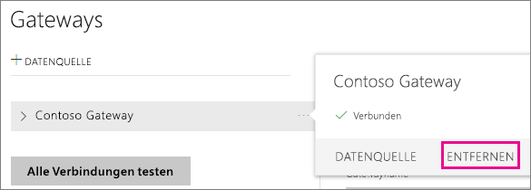
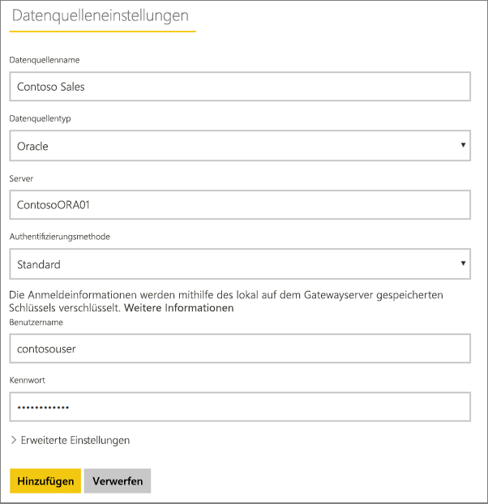
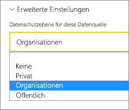
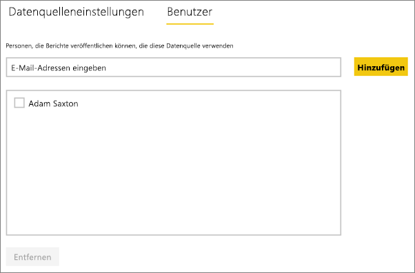

# Verwalten der Datenquelle – Import/Geplante Aktualisierung
Nach der Installation des lokalen Datengateways müssen Datenquellen hinzugefügt werden, die mit dem Gateway verwendet werden können. In diesem Artikel wird untersucht, wie mit Gateways und Datenquellen gearbeitet wird, die für die geplante Aktualisierung im Gegensatz zu DirectQuery oder Live-Verbindungen verwendet werden.

## Herunterladen und Installieren eines Gateways
Sie können das Gateway vom Power BI-Dienst herunterladen. Wählen Sie **Herunterladen** > **Datengateway**, oder gehen Sie auf die [Gateway-Downloadseite](https://go.microsoft.com/fwlink/?LinkId=698861).

## Hinzufügen eines Gateways
Zum Hinzufügen eines Gateways können Sie einfach das Enterprise-Gateway [herunterladen](https://go.microsoft.com/fwlink/?LinkId=698863) und auf einem Server in Ihrer Umgebung installieren. Nach der Installation das Gateway in der Gatewayliste unter **Gateways verwalten**angezeigt.

> [!NOTE]
> **Gateways verwalten** wird nur angezeigt, wenn Sie Administrator auf mindestens einem Gateway sind. Dies kann erfolgen, indem Sie als Administrator hinzugefügt werden oder indem Sie selbst ein Gateway installieren und konfigurieren.
> 
> 

## Entfernen eines Gateways
Beim Entfernen eines Gateways werden auch alle Datenquellen unter diesem Gateway gelöscht.  Dadurch verlieren auch alle Dashboards und Berichte, die auf diesen Datenquellen beruhen, ihre Funktionsfähigkeit.

1. Wählen Sie rechts oben das Zahnradsymbol  > **Gateways verwalten**.
2. Gateway > **Entfernen**.
   
   

## Hinzufügen einer Datenquelle
Sie können eine Datenquelle hinzufügen, indem Sie ein Gateway auswählen und auf **Datenquelle hinzufügen** klicken oder „Gateway“ > **Datenquelle hinzufügen** auswählen.

Sie können anschließend den **Datenquellentyp** in der Liste auswählen. Alle aufgeführten Datenquellen können für die geplante Aktualisierung mit dem Enterprise-Gateway verwendet werden. Analysis Services, SQL Server und SAP HANA können für die geplante Aktualisierung oder DirectQuery/Live-Verbindungen verwendet werden.

Sie sollten dann die Angaben für die Datenquelle vervollständigen, zu denen die Quell- und Anmeldeinformationen gehören, die für den Zugriff auf die Datenquelle verwendet werden.

> [!NOTE]
> Alle Abfragen der Datenquelle werden mithilfe dieser Anmeldeinformationen durchgeführt. Weitere Informationen darüber, wie [Anmeldeinformationen](service-gateway-onprem.md#credentials) gespeichert werden, finden Sie im Hauptartikel zum lokalen Datengateway.
> 
> 

Klicken Sie auf **Hinzufügen** , nachdem alle Angaben eingetragen wurden.  Sie können jetzt diese Datenquelle für die geplante Aktualisierung mit Ihren lokalen Daten verwenden. Bei erfolgreicher Ausführung wird *Verbindung hergestellt* angezeigt.

<!-- Shared Install steps Include -->
[!INCLUDE [gateway-onprem-datasources-include](./includes/gateway-onprem-datasources-include.md)]

### Erweiterte Einstellungen
Sie können die Datenschutzebene für die Datenquelle konfigurieren, die steuert, wie Daten kombiniert werden können. Diese wird nur für die geplante Aktualisierung verwendet und [Weitere Informationen](https://support.office.com/article/Privacy-levels-Power-Query-CC3EDE4D-359E-4B28-BC72-9BEE7900B540)

## Entfernen einer Datenquelle
Durch Entfernen einer Datenquelle geht die Funktionsfähigkeit aller Dashboards und Berichte verloren, die auf der betreffenden Datenquelle beruhen.  

Um eine Datenquelle zu entfernen, verwenden Sie „Datenquelle“ > **Entfernen**.

## Verwalten von Administratoren
Sie können auf der Registerkarte „Administratoren“ für das Gateway Benutzer hinzufügen und entfernen, die das Gateway verwalten dürfen. Derzeit können nur Benutzer hinzugefügt werden. Sicherheitsgruppen lassen sich nicht hinzufügen.

## Verwalten von Benutzern
Sie können auf der Registerkarte „Benutzer“ für die Datenquelle Benutzer oder Sicherheitsgruppen hinzufügen und entfernen, die diese Datenquelle verwenden dürfen.

> [!NOTE]
> Über die Benutzerliste wird nur gesteuert, wer Berichte veröffentlichen darf. Besitzer eines Berichts können Dashboards und Inhaltspakete erstellen und für andere Benutzer freigeben.
> 
> 

## Verwenden der Datenquelle für geplanten Aktualisierungen
Nachdem Sie die Datenquelle erstellt haben, kann diese mit DirectQuery-Verbindungen oder durch eine geplante Aktualisierung verwendet werden.

> [!NOTE]
> Der Name des Servers und der Datenbank müssen in Power BI Desktop und in der Datenquelle auf dem lokalen Datengateway übereinstimmen.
> 
> 

Der Link zwischen Ihrem Dataset und der Datenquelle innerhalb des Gateways basiert auf dem Namen Ihres Servers und Ihrer Datenbank. Diese müssen übereinstimmen. Wenn Sie z.B. eine IP-Adresse für den Servernamen angeben, müssen Sie die IP-Adresse in Power BI Desktop für die Datenquelle innerhalb der Gatewaykonfiguration verwenden. Wenn Sie *SERVER\INSTANZ* verwenden, müssen Sie in Power BI Desktop dieselbe Instanz verwenden, die auch in der für das Gateway konfigurierten Datenquelle verwendet wird.

Wenn Sie auf der Registerkarte **Benutzer** der im Gateway konfigurierten Datenquelle aufgeführt sind und der Name des Servers und der Datenbank übereinstimmen, wird das Gateway als Option für geplante Aktualisierungen angezeigt.

> [!WARNING]
> Wenn Ihr Dataset mehrere Datenquellen enthält, muss jede dieser Datenquellen dem Gateway hinzugefügt werden. Wenn eine oder mehrere Datenquellen dem Gateway nicht hinzugefügt werden, wird das Gateway nicht als für die geplante Aktualisierung verfügbar angezeigt.
> 
> 

## Einschränkungen
* Für das lokale Datengateway wird das Authentifizierungsschema OAuth nicht unterstützt. Datenquellen, die OAuth erfordern, können nicht hinzugefügt werden. Wenn Ihr Dataset über eine Datenquelle, die OAuth erfordert, verfügt, kann das Gateway nicht für die geplante Aktualisierung verwendet werden.

## Nächste Schritte
[Lokales Datengateway](service-gateway-onprem.md)  
[Ausführliche Informationen zum lokalen Datengateway](service-gateway-onprem-indepth.md)  
[Problembehandlung beim lokalen Datengateway](service-gateway-onprem-tshoot.md)  
Weitere Fragen? [Wenden Sie sich an die Power BI-Community](http://community.powerbi.com/)

