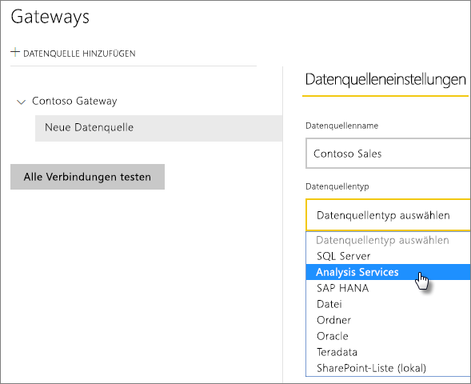
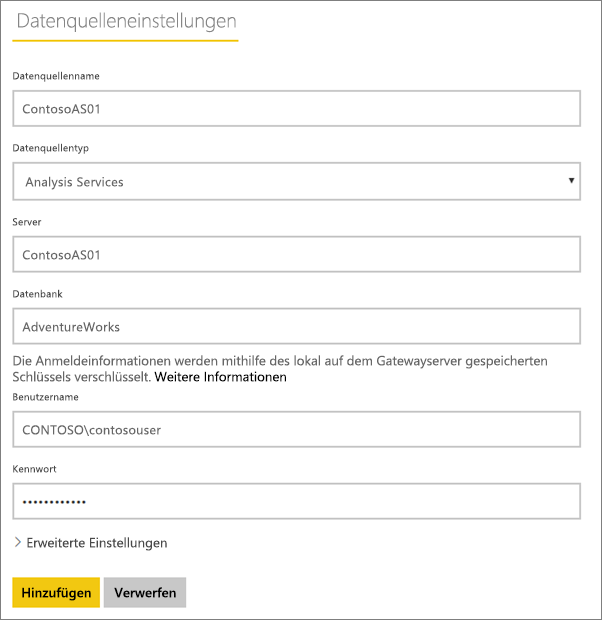
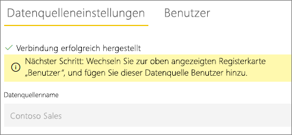
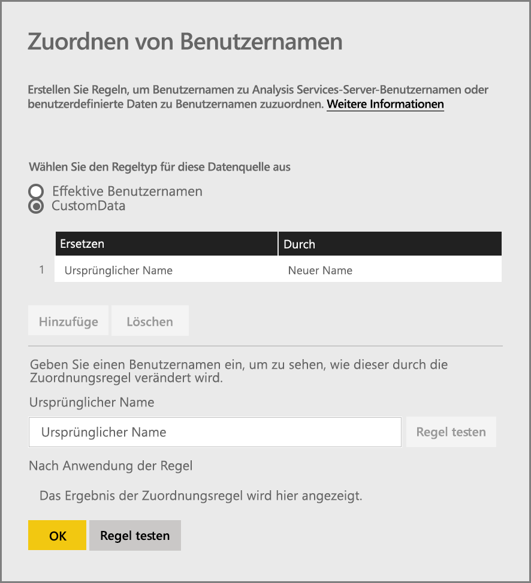
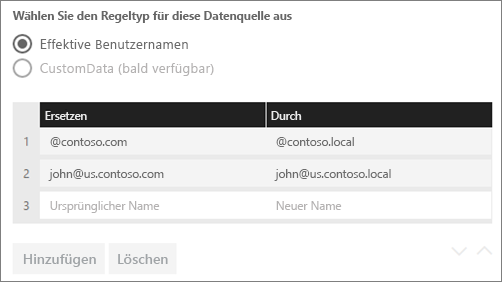
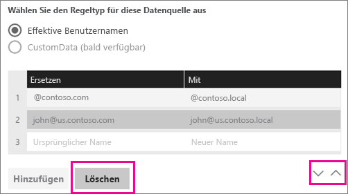
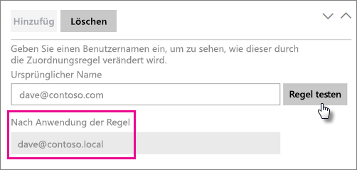
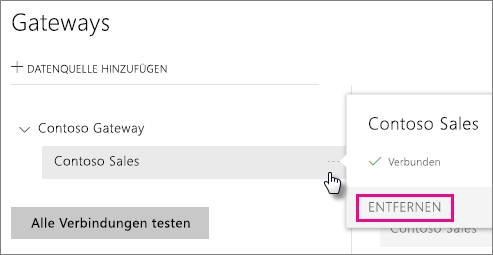
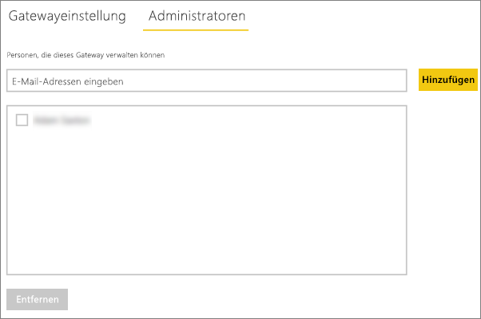
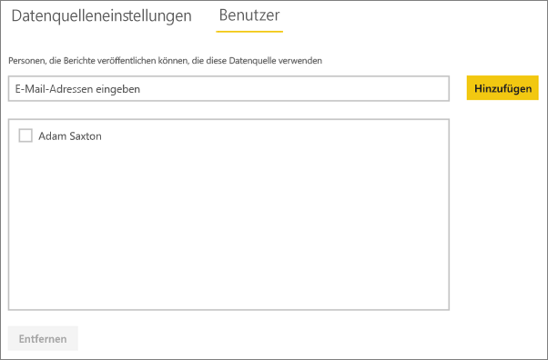

# Verwalten Ihrer Datenquelle – Analysis Services
Nach der Installation des lokalen Datengateways müssen Datenquellen hinzugefügt werden, die mit dem Gateway verwendet werden können. Dieser Artikel befasst sich mit dem Umgang mit Gateways und Datenquellen. Sie können die Datenquelle Analysis Services für die geplante Aktualisierung oder für Live-Verbindungen verwenden.

<iframe width="560" height="315" src="https://www.youtube.com/embed/ownIGbcRAAU" frameborder="0" allowfullscreen></iframe>

## Herunterladen und Installieren eines Gateways
Sie können das Gateway vom Power BI-Dienst herunterladen. Wählen Sie **Herunterladen** > **Datengateway**, oder gehen Sie auf die [Gateway-Downloadseite](https://go.microsoft.com/fwlink/?LinkId=698861).

## Einschränkungen der Liveverbindungen von Analysis Services
Sie können eine Liveverbindung für tabellarische oder mehrdimensionale Instanzen verwenden.

| **Serverversion** | **Erforderliche SKU** |
| --- | --- |
| 2012 SP1 CU4 oder höher |Business Intelligence und Enterprise SKU |
| 2014 |Business Intelligence und Enterprise SKU |
| 2016 |Standard-SKU oder höher |

* Die Formatierung auf Zellenebene sowie Übersetzungsfunktionen werden nicht unterstützt.
* Aktionen und benannte Mengen werden nicht für Power BI verfügbar gemacht. Dennoch können Sie eine Verbindung mit mehrdimensionalen Cubes herstellen, die auch Aktionen oder benannte Mengen enthalten, und Sie können entsprechende Visualisierungen und Berichte erstellen.

## Hinzufügen eines Gateways
Zum Hinzufügen eines Gateways können Sie einfach das Gateway [herunterladen](https://go.microsoft.com/fwlink/?LinkId=698861) und auf einem Server in Ihrer Umgebung installieren. Nach der Installation das Gateway in der Gatewayliste unter **Gateways verwalten**angezeigt.

> [!NOTE]
> **Gateways verwalten** wird nur angezeigt, wenn Sie Administrator auf mindestens einem Gateway sind. Dies kann erfolgen, indem Sie als Administrator hinzugefügt werden oder indem Sie selbst ein Gateway installieren und konfigurieren.
> 
> 

## Entfernen eines Gateways
Beim Entfernen eines Gateways werden auch alle Datenquellen unter diesem Gateway gelöscht.  Dadurch verlieren auch alle Dashboards und Berichte, die auf diesen Datenquellen beruhen, ihre Funktionsfähigkeit.

1. Wählen Sie rechts oben das Zahnradsymbol  > **Gateways verwalten**.
2. Gateway > **Entfernen**.
   
   

## Hinzufügen einer Datenquelle
Sie können eine Datenquelle hinzufügen, indem Sie ein Gateway auswählen und auf **Datenquelle hinzufügen** klicken oder „Gateway“ > **Datenquelle hinzufügen** auswählen.

Sie können anschließend den **Datenquellentyp** in der Liste auswählen. Wählen Sie „Analysis Services“, wenn Sie eine Verbindung mit einem mehrdimensionalen oder tabellarischen Server herstellen.

Sie sollten dann die Angaben für die Datenquelle vervollständigen, insbesondere **Server** und **Datenbank**.  

**Benutzername** und **Kennwort** werden wie von Ihnen eingegeben vom Gateway verwendet, um eine Verbindung mit der Analysis Services-Instanz herzustellen.

> [!NOTE]
> Das von Ihnen eingegebene Windows-Konto muss über Administratorberechtigungen für die Instanz verfügen, mit der Sie eine Verbindung herstellen. Wenn für das Kennwort dieses Konto ein Ablauf festgelegt ist, erhalten Benutzer möglicherweise einen Verbindungsfehler, wenn das Kennwort für die Datenquelle nicht aktualisiert wurde. Weitere Informationen darüber, wie [Anmeldeinformationen](service-gateway-onprem.md#credentials) gespeichert werden, finden Sie im Hauptartikel zum lokalen Datengateway.
> 
> 

Klicken Sie auf **Hinzufügen** , nachdem alle Angaben eingetragen wurden.  Sie können diese Datenquelle jetzt für die geplante Aktualisierung oder Live-Verbindungen mit einer lokalen Analysis Services-Instanz verwenden.  Bei erfolgreicher Ausführung wird *Verbindung hergestellt* angezeigt.

### Erweiterte Einstellungen
Sie können die Datenschutzebene für die Datenquelle konfigurieren, die steuert, wie Daten kombiniert werden können. Diese wird nur für die geplante Aktualisierung verwendet und und gilt nicht für Live-Verbindungen. [Weitere Informationen](https://support.office.com/article/Privacy-levels-Power-Query-CC3EDE4D-359E-4B28-BC72-9BEE7900B540)

## Benutzernamen bei Analysis Services
Bei jeder Interaktion eines Benutzers mit einem Bericht, der mit Analysis Services verbunden ist, wird der effektive Benutzername an das Gateway und von dort aus an Ihren lokalen Analysis Services-Server übergeben. Als effektiver Benutzer wird die E-Mail-Adresse, mit der Sie sich bei Power BI anmelden, an Analysis Services übergeben. Diese wird in der Verbindungseigenschaft [EffectiveUserName](https://msdn.microsoft.com/library/dn140245.aspx#bkmk_auth) übergeben. Diese E-Mail-Adresse muss mit einem in der lokalen Active Directory-Domäne definierten UPN übereinstimmen. Der UPN ist eine Eigenschaft des Active Directory-Kontos. Das Windows-Konto muss dann in einer Analysis Services-Rolle vorhanden sein. Wenn in Active Directory keine Übereinstimmung gefunden werden kann, wird die Anmeldung nicht erfolgreich durchgeführt. [Weitere Informationen](https://msdn.microsoft.com/library/ms677605.aspx)

Sie können auch Ihren Power BI-Anmeldename einem lokalen Verzeichnis-UPN zuordnen. [Weitere Informationen](service-gateway-enterprise-manage-ssas.md#map-user-names)

<iframe width="560" height="315" src="https://www.youtube.com/embed/Qb5EEjkHoLg" frameborder="0" allowfullscreen></iframe>

### Woher weiß ich meinen UPN?
Sie kennen möglicherweise nicht Ihren UPN und sind auch kein Domänenadministrator. Sie können den folgenden Befehl von Ihrer Arbeitsstation ausführen, um den UPN für Ihr Konto zu ermitteln.

    whoami /upn

Das Ergebnis ähnelt einer E-Mail-Adresse, es handelt sich aber um den UPN für Ihr Domänenkonto. Wenn Sie eine Analysis Services-Datenquelle für Liveverbindungen verwenden und dies nicht die E-Mail-Adresse ist, mit der Sie sich bei Power BI anmelden, lesen Sie die Informationen unter [Zuordnen von Benutzernamen](#map-user-names).

## Zuordnen von Benutzernamen
<iframe width="560" height="315" src="https://www.youtube.com/embed/eATPS-c7YRU" frameborder="0" allowfullscreen></iframe>

Es gibt zwei Möglichkeiten, Benutzernamen für Analysis Services zuzuordnen:

1. Manuelles Neuzuordnen von Benutzern 
2. Lokale Suche von Active Directory-Eigenschaften, um AAD-UPNs Active Directory-Benutzern zuzuordnen (Zuordnung mit AD-Suche)

Es ist zwar möglich, mit dem zweiten Ansatz eine manuelle Zuordnung durchzuführen, dies ist jedoch zeitaufwändig, und die Verwaltung ist schwierig. Besonders kompliziert wäre eine solche Vorgehensweise bei unzureichender Musterübereinstimmung, wenn sich beispielsweise Domänennamen zwischen AAD und lokalem AD unterscheiden oder wenn sich Benutzerkontonamen zwischen AAD und AD unterscheiden. Daher wird das manuelle Zuordnen im Rahmen des zweiten Ansatzes nicht empfohlen.

Diese beiden Ansätze werden nacheinander in den folgenden beiden Abschnitten beschrieben.

### Manuelles Neuzuordnen von Benutzernamen
Sie können für Analysis Services-Datenquellen benutzerdefinierte UPN-Regeln (User Principal Name, Benutzerprinzipalname) Regeln konfigurieren. Dies hilft Ihnen, wenn der Anmeldename für den Power BI-Dienst nicht mit Ihrem lokale Verzeichnis-UPN übereinstimmt. Wenn Sie sich bei Power BI mit john@contoso.com anmelden, Ihr lokaler Verzeichnis-UPN aber john@contoso.local lautet, können Sie eine Zuordnungsregel konfigurieren, damit john@contoso.local an Analysis Services übergeben wird.

Den Bildschirm für die UPN-Zuordnung rufen Sie wie folgt auf.

1. Klicken Sie auf das **Zahnradsymbol**, und wählen Sie **Gateways verwalten** aus.
2. Erweitern Sie das Gateway, das die Analysis Services-Datenquelle enthält. Wenn Sie noch keine Analysis Services-Datenquelle erstellt haben, können Sie dies jetzt nachholen.
3. Wählen Sie die Datenquelle und dann die Registerkarte **Benutzer** aus.
4. Wählen Sie **Benutzernamen zuordnen** aus.
   
    

Sie sehen dann Optionen zum Hinzufügen von Regeln und zum Testen eines gegebenen Benutzers.

> [!NOTE]
> Es kann vorkommen, dass Sie versehentlich einen Benutzer ändern. Beispiel: Wenn Sie für **Ersetzen (Ursprünglicher Name)** *@contoso.com* und für **Durch (Neuer Name)** *@contoso.local* eingeben, wird bei allen Benutzern, deren Anmeldename *@contoso.com* enthält, dieser Teil durch *@contoso.local* ersetzt. Wenn Sie für **Ersetzen (Ursprünglicher Name)** außerdem *dave@contoso.com* und für **Durch (Neuer Name)** *dave@contoso.local* eingeben, wird ein Benutzer mit dem Anmeldenamen v-dave@contoso.com als v-dave*@contoso.local* gesendet.
> 
> 

### Zuordnung mit AD-Suche
Führen Sie die Schritte in diesem Abschnitt aus, um eine lokale AD-Eigenschaftensuche durchzuführen und AAD-UPNs Active Directory-Benutzern neu zuzuordnen. Gehen wir zunächst auf die Funktionsweise ein.

Im **Power BI-Dienst** geschieht Folgendes:

- Für jede Abfrage eines Power BI-AAD-Benutzers bei einem lokalen SSAS-Server wird eine UPN-Zeichenfolge übergeben. Beispiel:     firstName.lastName@contoso.com

> [!NOTE]
> Alle manuellen UPN-Benutzerzuordnungen, die in der Power BI-Datenquellenkonfiguration definiert sind, werden angewendet, *bevor* die Zeichenfolge mit dem Benutzernamen an das lokale Datengateway gesendet wird.
> 
> 

Führen Sie am lokalen Datengateway mit konfigurierbarer Benutzerzuordnung Folgendes aus:

1. Suchen Sie nach dem durchsuchbaren Active Directory (automatisch oder konfigurierbar)
2. Suchen Sie nach dem Attribut der AD-Person (z.B. *E-Mail*), basierend auf der eingehenden UPN-Zeichenfolge („firstName.lastName@contoso.com“) aus dem **Power BI-Dienst**.
3. Wenn die AD-Suche zu einem Fehler führt, wird versucht, den übergebenen UPN als EffectiveUser in SSAS zu verwenden.
4. Bei erfolgreicher AD-Suche wird *UserPrincipalName* der betreffenden AD-Person abgerufen. 
5. Das E-Mail-Attribut *UserPrincipalName* wird als *EffectiveUser* an SSAS übergeben. Beispiel: *Alias@corp.on-prem.contoso*

Konfigurieren des Gateways für die Durchführung der AD-Suche:

1. Herunterladen und Installieren des aktuellen Gateways
2. Im Gateway müssen Sie den **Dienst des lokalen Datengateways** so ändern, dass er mit einem Domänenkonto ausgeführt wird (und nicht mit einem lokalen Dienstkonto – andernfalls funktioniert die AD-Suche zur Laufzeit nicht ordnungsgemäß). Sie müssen den Gateway-Dienst neu starten, damit die Änderung wirksam wird.  Wechseln Sie zur Gateway-App auf dem Computer (suchen Sie nach „lokales Datengateway“). Wählen Sie hierzu **Diensteinstellungen > Dienstkonto ändern** aus. Vergewissern Sie sich, dass Sie über den Wiederherstellungsschlüssel für das Gateway verfügen, da Sie es auf demselben Computer wiederherstellen müssen (es sei denn, Sie möchten stattdessen ein neues Gateway erstellen). 
3. Navigieren Sie als Administrator zum Installationsordner des Gateways, *C:\Programme\On-premises data gateway*, um sicherzustellen, dass Sie über Schreibberechtigungen verfügen, und bearbeiten Sie die folgende Datei:
   
       Microsoft.PowerBI.DataMovement.Pipeline.GatewayCore.dll.config 
4. Bearbeiten Sie die folgenden beiden Konfigurationswerte gemäß *Ihren* Active Directory-Attributkonfigurationen für Ihre AD-Benutzer. Die unten aufgeführten Konfigurationswerte sind nur Beispiele – Sie müssen die Ihrer Active Directory-Konfiguration entsprechenden Werte angeben. 
   
   
5. Starten Sie den Dienst **Lokales Datengateway** neu, damit die Konfigurationsänderung wirksam wird.

### Arbeiten mit Zuordnungsregeln
Um eine Zuordnungsregel zu erstellen, geben Sie einen Wert für **Ursprünglicher Name** und **Neuer Name** ein und wählen dann **Hinzufügen** aus.

| Feld | Beschreibung |
| --- | --- |
| Ersetzen (Ursprünglicher Name) |Die E-Mail-Adresse, mit der Sie sich bei Power BI angemeldet haben. |
| Durch (Neuer Name) |Der Wert, durch den Sie ihn ersetzten möchten. Das Ergebnis der Ersetzung wird an die Eigenschaft *EffectiveUserName* für die Analysis Services-Verbindung übergeben. |

Wenn Sie ein Element in der Liste auswählen, können Sie es mithilfe der **Richtungspfeile** an eine andere Position verschieben mit **Löschen** entfernen.

### Verwenden eines Platzhalters (\*)
Sie können für die Zeichenfolge in **Ersetzen (Ursprünglicher Name)** einen Platzhalter verwenden. Dieser kann nur einzeln und nicht zusammen mit anderen Teilen der Zeichenfolge verwendet werden. Dadurch können Sie alle Benutzer abdecken und an die Datenquelle einen einzelnen Wert übergeben. Dies ist hilfreich, wenn Sie möchten, dass alle Benutzer in der Organisation die gleichen Benutzernamen in der lokalen Umgebung verwenden.

### Testen von Zuordnungsregeln
Sie können überprüfen, womit ein ursprünglicher Namen ersetzt wird, indem Sie einen Wert für **Ursprünglicher Name** eingeben und **Regel testen** auswählen.

> [!NOTE]
> Es dauert einige Minuten, bis der Dienst Regeln verwendet, die gespeichert wurden. Im Browser wird die Regel sofort verwendet.
> 
> 

### Einschränkungen für Zuordnungsregeln
* Die Zuordnung für die zu konfigurierende Datenquelle. Dies ist keine globale Einstellung. Wenn Sie über mehrere Analysis Services-Datenquellen verfügen, müssen Sie die Benutzer für jede Datenquelle zuordnen.

## Entfernen einer Datenquelle
Durch Entfernen einer Datenquelle geht die Funktionsfähigkeit aller Dashboards und Berichte verloren, die auf der betreffenden Datenquelle beruhen.  

Um eine Datenquelle zu entfernen, verwenden Sie „Datenquelle“ > **Entfernen**.

## Verwalten von Administratoren
Sie können auf der Registerkarte „Administratoren“ für das Gateway Benutzer (oder Sicherheitsgruppen) hinzufügen und entfernen, die das Gateway verwalten dürfen.

## Verwalten von Benutzern
Sie können auf der Registerkarte „Benutzer“ für die Datenquelle Benutzer oder Sicherheitsgruppen hinzufügen und entfernen, die diese Datenquelle verwenden dürfen.

> [!NOTE]
> Über die Benutzerliste wird nur gesteuert, wer Berichte veröffentlichen darf. Besitzer eines Berichts können Dashboards und Inhaltspakete erstellen und für andere Benutzer freigeben.
> 
> 

## Verwenden der Datenquelle
Nachdem Sie die Datenquelle erstellt haben, kann diese mit Liveverbindungen oder durch eine geplante Aktualisierung verwendet werden.

> [!NOTE]
> Der Name des Servers und der Datenbank müssen in Power BI Desktop und in der Datenquelle auf dem lokalen Datengateway übereinstimmen.
> 
> 

Der Link zwischen Ihrem Dataset und der Datenquelle innerhalb des Gateways basiert auf dem Namen Ihres Servers und Ihrer Datenbank. Diese müssen übereinstimmen. Wenn Sie z.B. eine IP-Adresse für den Servernamen angeben, müssen Sie die IP-Adresse in Power BI Desktop für die Datenquelle innerhalb der Gatewaykonfiguration verwenden. Wenn Sie *SERVER\INSTANZ* verwenden, müssen Sie in Power BI Desktop dieselbe Instanz verwenden, die auch in der für das Gateway konfigurierten Datenquelle verwendet wird.

Dies gilt für Liveverbindungen ebenso wie für geplante Aktualisierungen.

### Verwenden der Datenquelle mit Liveverbindungen
Stellen Sie sicher, dass der Name des Servers und der Datenbank in Power BI Desktop und der für das Gateway konfigurierten Datenquelle identisch sind. Stellen Sie außerdem sicher, dass der Benutzer auf der Registerkarte **Benutzer** der Datenquelle aufgeführt ist, um Datasets über eine Liveverbindung veröffentlichen zu können. Sie treffen die Auswahl für Liveverbindungen in Power BI Desktop beim Importieren der Daten.

Nach der Veröffentlichung von Power BI Desktop oder mit **Daten abrufen** sollten Ihre Berichte funktionieren. Es kann nach dem Erstellen der Datenquelle im Gateway mehrere Minuten dauern, bis die Verbindung genutzt werden kann.

### Verwenden der Datenquelle mit geplanten Aktualisierungen
Wenn Sie auf der Registerkarte **Benutzer** der im Gateway konfigurierten Datenquelle aufgeführt sind und der Name des Servers und der Datenbank übereinstimmen, wird das Gateway als Option für geplante Aktualisierungen angezeigt.

## Nächste Schritte
[Lokales Datengateway](service-gateway-onprem.md)  
[Ausführliche Informationen zum lokalen Datengateway](service-gateway-onprem-indepth.md)  
[Problembehandlung beim lokalen Datengateway](service-gateway-onprem-tshoot.md)  
Weitere Fragen? [Wenden Sie sich an die Power BI-Community](http://community.powerbi.com/)

