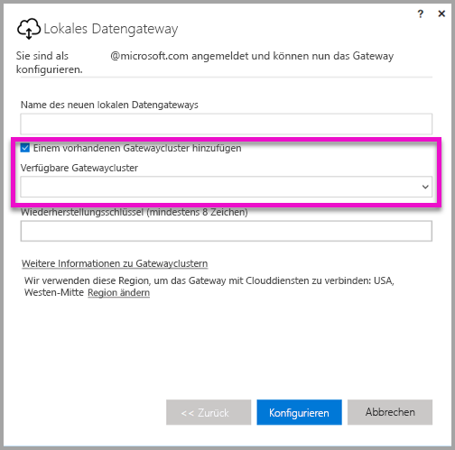
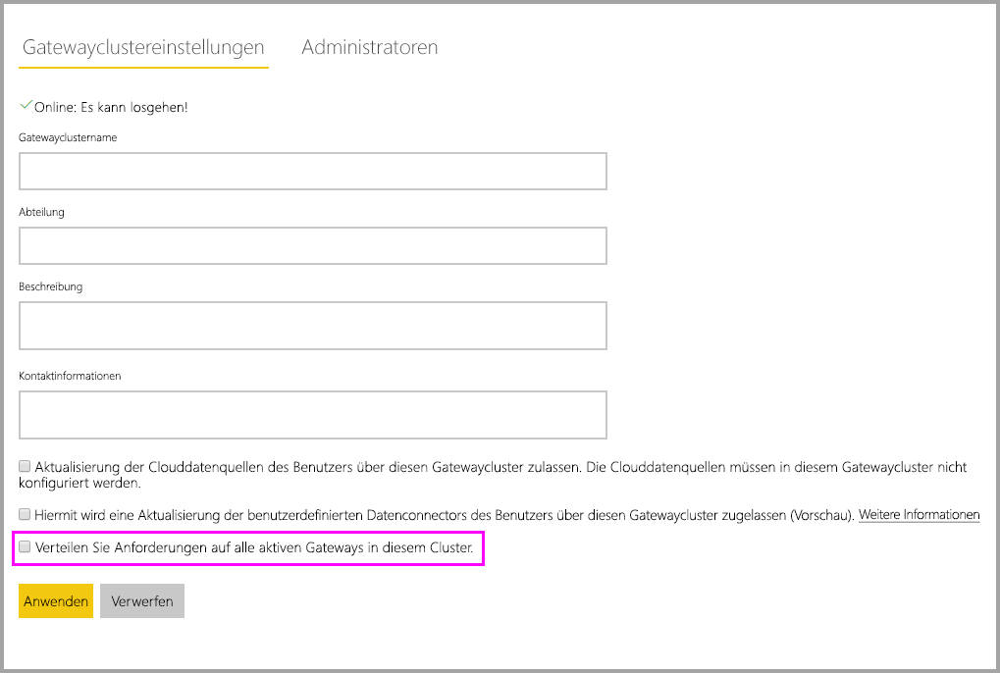

# <a name="high-availability-clusters-for-on-premises-data-gateway"></a>Hochverfügbarkeitscluster für lokale Datengateways

Sie können **Hochverfügbarkeitscluster** mit Installationen von **lokalen Datengateways** erstellen, um den Zugriff Ihrer Organisation auf lokale Datenressourcen sicherzustellen, die in Power BI-Berichten und -Dashboards verwendet werden. Mit solchen Clustern können Gatewayadministratoren Gateways gruppieren und so Single Points of Failure beim Zugriff auf lokale Datenressourcen vermeiden. Der Power BI-Dienst nutzt immer das primäre Gateway im Cluster, es sei denn, es ist nicht verfügbar. In diesem Fall weicht der Dienst auf das nächste Gateway im Cluster aus usw.

In diesem Artikel wird beschrieben, mit welchen Schritten Sie einen Hochverfügbarkeitscluster mit lokalen Datengateways erstellen und welche Best Practices Sie beim Einrichten beachten sollten. Für Gatewaycluster mit hoher Verfügbarkeit ist mindestens das Update von November 2017 auf dem lokalen Datengateway erforderlich.

## <a name="setting-up-high-availability-clusters-of-gateways"></a>Einrichten von Hochverfügbarkeitsclustern mit Gateways

Während des Installationsvorgangs für das **lokale Datengateway** können Sie angeben, ob das Gateway einem vorhandenen Gatewaycluster hinzugefügt werden soll. 



Um ein Gateway einem vorhandenen Cluster hinzuzufügen, müssen Sie den *Wiederherstellungsschlüssel* für die primäre Gatewayinstanz für den Cluster angeben, dem das neue Gateway hinzugefügt werden soll. Auf dem primären Gateway für den Cluster muss das Gatewayupdate von November 2017 oder später ausgeführt werden. 

## <a name="managing-a-gateway-cluster"></a>Verwalten eines Gatewayclusters

Sobald ein Gatewaycluster aus mindestens zwei Gateways besteht, gelten alle Verwaltungsvorgänge für Gateways, z.B. Hinzufügen von Datenquellen oder Gewähren von Administratorberechtigungen für ein Gateway, für alle Gateways im Cluster.

Wenn Administratoren im **Power BI-Dienst** das Zahnradsymbol und dann **Gateways verwalten** auswählen, sehen sie eine Liste der registrierten Cluster oder einzelnen Gateways, aber keine einzelnen Gatewayinstanzen, die Mitglieder des Clusters sind.

Alle neuen Anforderungen für eine **geplante Aktualisierung** und DirectQuery-Vorgänge werden automatisch an die primäre Instanz eines Gatewayclusters weitergeleitet. Wenn die primäre Gatewayinstanz nicht online ist, wird die Anforderung an eine andere Gatewayinstanz im Cluster weitergeleitet.

## <a name="distribute-requests-traffic-across-all-gateways-in-a-cluster"></a>Verteilen von durch Anforderungen verursachtem Datenverkehr auf alle Gateways in einem Cluster

Sie können festlegen, dass der Datenverkehr auf alle Gateways in einem Cluster verteilt wird. Wenn Sie auf der Seite **Gateways verwalten** im **Power BI-Dienst** in der Liste in der Navigationsstruktur auf der linken Seite auf einen Gatewaycluster klicken, können Sie die Option „Verteilen Sie Anforderungen auf alle aktiven Gateways in diesem Cluster“ wählen.



## <a name="powershell-support-for-gateway-clusters"></a>PowerShell-Unterstützung für Gatewaycluster

PowerShell-Skripts sind im Installationsordner für das lokale Datengateway verfügbar. Standardmäßig lautet der Ordner *C:\Programme\Lokales Datengateway*. Sie müssen die PowerShell-Version 5 oder höher verwenden, damit diese Skripts ordnungsgemäß funktionieren. Mit den PowerShell-Skripts können Benutzer die folgenden Vorgänge ausführen:

-   Abrufen einer Liste der für einen Benutzer verfügbaren Gatewaycluster
-   Abrufen einer Liste der in einem Cluster registrierten Gatewayinstanzen sowie deren Status (online oder offline)
-   Ändern des Aktivierungs-/Deaktivierungsstatus für eine Gatewayinstanz in einem Cluster sowie anderer Gatewayeigenschaften
-   Löschen eines Gateways

Um die PowerShell-Befehle in der Tabelle auszuführen, müssen Sie zuerst die folgenden Schritte ausführen:

1. Öffnen Sie ein PowerShell-Befehlsfenster als Administrator.
2. Führen Sie dann einmalig den folgenden PowerShell-Befehl aus (dabei wird vorausgesetzt, dass Sie auf dem aktuellen Computer noch keine PowerShell-Befehle ausgeführt haben):

    ```powershell
    Set-ExecutionPolicy -ExecutionPolicy Unrestricted -Force
    ```

3. Navigieren Sie dann im PowerShell-Fenster zum Installationsordner des lokalen Datengateways, und importieren Sie mit dem folgenden Befehl das erforderliche Modul:

    ```powershell
    Import-Module .\OnPremisesDataGatewayHAMgmt.psm1
    ```

Nachdem Sie diese Schritte ausgeführt haben, können Sie Ihre Gatewaycluster mit den Befehlen in der folgenden Tabelle verwalten.

| **Befehl** | **Beschreibung** | **Parameter** |
| --- | --- | --- |
| *Login-OnPremisesDataGateway* |Mit diesem Befehl kann sich ein Benutzer anmelden, um seine lokalen Datengatewaycluster zu verwalten.  Sie müssen diesen Befehl *zuerst* ausführen und sich anmelden, damit dann andere Hochverfügbarkeitsbefehle richtig ausgeführt werden können. Hinweis: Das AAD-Auth-Token, das beim Anmeldeaufruf abgerufen wird, ist nur 1 Stunde lang gültig und läuft dann ab. Sie können den Anmeldebefehl erneut ausführen, um ein neues Token abzurufen.| AAD-Benutzername und -Kennwort (bei der Ausführung des Befehls bereitgestellt, nicht beim ersten Aufruf)|
| *Get-OnPremisesDataGatewayClusters* | Ruft die Liste der Gatewaycluster für den angemeldeten Benutzer ab. | Optional können Sie zur besseren Lesbarkeit Formatierungsparameter an diesen Befehl übergeben, z.B. *Format-Table -AutoSize -Wrap* |
| *Get-OnPremisesDataClusterGateways* | Ruft die Liste der Gateways im angegebenen Cluster sowie zusätzliche Informationen für jedes Gateway ab (Status (online/offline), Computername usw.) | *-ClusterObjectID xyz* (wobei *xyz* durch einen tatsächlichen Wert für eine Clusterobjekt-ID ersetzt wird, der mit dem Befehl *Get-OnPremisesDataGatewayClusters* abgerufen werden kann)|
| *Set-OnPremisesDataGateway* | Hiermit können Sie die Eigenschaftswerte für ein bestimmtes Gateway innerhalb eines Clusters festlegen und u.a. eine bestimmte Gatewayinstanz aktivieren/deaktivieren.  | *-ClusterObjectID xyz* (*xyz* wird durch einen tatsächlichen Wert für eine Clusterobjekt-ID ersetzt, der mit dem Befehl *Get-OnPremisesDataGatewayClusters* abgerufen werden kann) *-GatewayObjectID abc* (*abc* wird durch den tatsächlichen Wert der Gatewayobjekt-ID ersetzt, der mit dem Befehl *Get-OnPremisesDataClusterGateways* abgerufen werden kann, wenn eine Clusterobjekt-ID vorhanden ist) |
| *Get-OnPremisesDataGatewayStatus* | Hiermit können Sie den Status für eine bestimmte Gatewayinstanz innerhalb eines Clusters abrufen.  | *-ClusterObjectID xyz* (*xyz* wird dabei durch einen tatsächlichen Wert für eine Clusterobjekt-ID ersetzt, der mit dem Befehl *Get-OnPremisesDataGatewayClusters* abgerufen werden kann) *-GatewayObjectID abc* (*abc* wird durch den tatsächlichen Wert der Gatewayobjekt-ID ersetzt, der mit dem Befehl *Get-OnPremisesDataClusterGateways* abgerufen werden kann, wenn eine Clusterobjekt-ID vorhanden ist) |
| *Remove-OnPremisesDataGateway*  | Hiermit können Sie eine Gatewayinstanz aus einem Cluster entfernen. Beachten Sie dabei, dass das primäre Gateway im Cluster erst entfernt werden kann, nachdem alle anderen Gateways im Cluster entfernt wurden.| *-ClusterObjectID xyz* (*xyz* wird dabei durch einen tatsächlichen Wert für eine Clusterobjekt-ID ersetzt, der mit dem Befehl *Get-OnPremisesDataGatewayClusters* abgerufen werden kann) *-GatewayObjectID abc* (*abc* wird durch den tatsächlichen Wert der Gatewayobjekt-ID ersetzt, der mit dem Befehl *Get-OnPremisesDataClusterGateways* abgerufen werden kann, wenn eine Clusterobjekt-ID vorhanden ist) |

## <a name="next-steps"></a>Nächste Schritte

-   [Verwalten Ihrer Datenquelle – Analysis Services](service-gateway-enterprise-manage-ssas.md)  
-   [Verwalten Ihrer Datenquelle –SAP HANA](service-gateway-enterprise-manage-sap.md)  
-   [Verwalten Ihrer Datenquelle – SQL Server](service-gateway-enterprise-manage-sql.md)  
-   [Verwalten der Datenquelle – Oracle](service-gateway-onprem-manage-oracle.md)  
-   [Verwalten der Datenquelle – Import/Geplante Aktualisierung](service-gateway-enterprise-manage-scheduled-refresh.md)  
-   [Ausführliche Informationen zum lokalen Datengateway](service-gateway-onprem-indepth.md)  
-   [Lokales Datengateway (persönlicher Modus)](service-gateway-personal-mode.md)
-   [Konfigurieren von Proxyeinstellungen für das lokale Datengateway](service-gateway-proxy.md)  
-   [Verwenden von Kerberos für SSO (Single Sign-On, Einmaliges Anmelden) von Power BI bei lokalen Datenquellen](service-gateway-sso-kerberos.md)  

Weitere Fragen? [Wenden Sie sich an die Power BI-Community](http://community.powerbi.com/)
