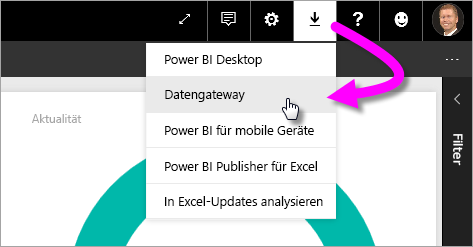
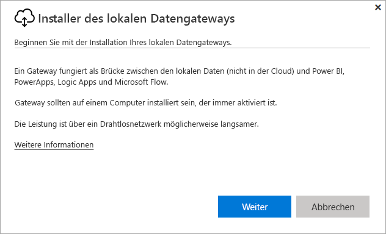
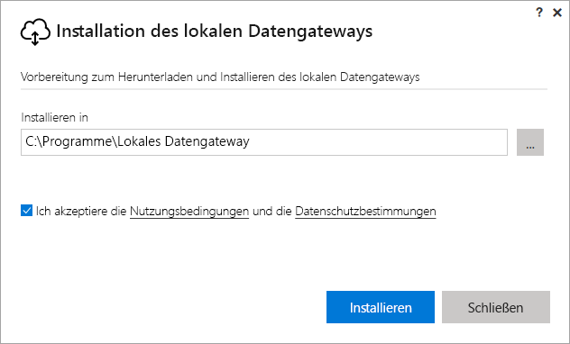
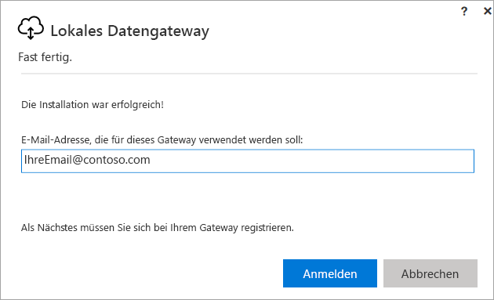
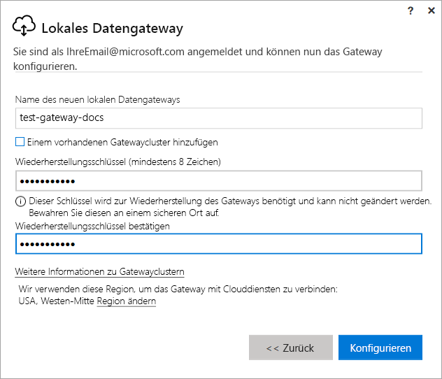
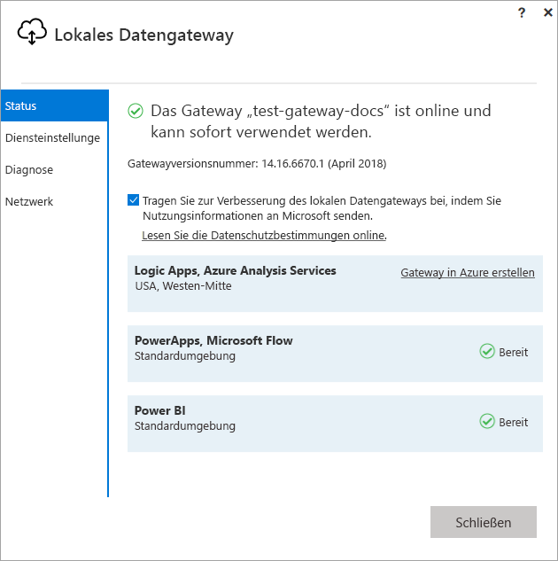
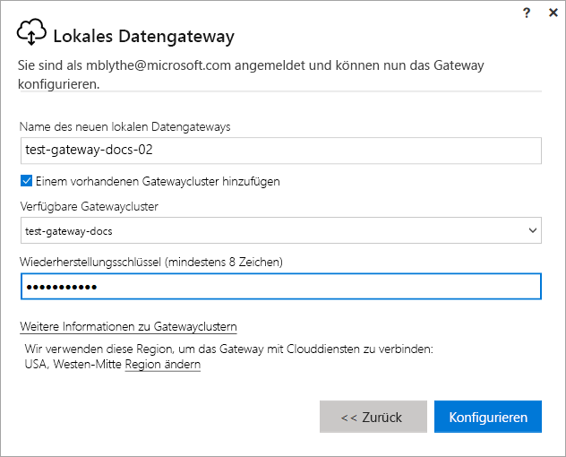

# Installieren eines Gateways für Power BI

Ein Power BI-Gateway ist eine Softwareanwendung, die Sie in einem lokalen Netzwerk installieren und den Zugriff auf Daten in diesem Netzwerk erleichtert. Wie in der [Übersicht](service-gateway-getting-started.md) beschrieben, können Sie ein Gateway im persönlichen oder Standardmodus (empfohlen) installieren. Sie können im Standardmodus ein eigenständiges Gateway installieren oder ein Gateway einem *Cluster* hinzufügen – Letzteres empfiehlt sich, um Hochverfügbarkeit sicherzustellen. In diesem Artikel erfahren Sie, wie Sie ein standardmäßiges Gateway installieren und dann ein anderes Gateway zum Erstellen eines Clusters hinzufügen.

Wenn Sie noch nicht bei Power BI registriert sind, müssen Sie sich zuerst für eine [kostenlose Testversion registrieren](https://app.powerbi.com/signupredirect?pbi_source=web).

## Herunterladen und Installieren eines Gateways

Das Gateway wird auf dem Computer ausgeführt, auf dem Sie es installieren, darum müssen Sie sicherstellen, dass Sie es auf einem Computer installieren, der immer eingeschaltet ist. Um bessere Leistung und Zuverlässigkeit zu erzielen, sollte der Computer sich in einem verkabelten Netzwerk statt einem drahtlosen befinden.

1. Wählen Sie im Power BI-Dienst in der oberen rechten Ecke **Symbol „Herunterladen“**  > **Datengateway** aus.

    

2. Wählen Sie auf der Downloadseite die Schaltfläche **GATEWAY HERUNTERLADEN** aus.

3. Wählen Sie **Weiter**aus.     

    

4. Wählen Sie **Lokales Datengateway (empfohlen)** > **Weiter** aus.

    

5. Behalten Sie den Standardpfad für die Installation bei, stimmen Sie den Bedingungen zu, und wählen Sie **Installieren** aus.

    

6. Geben Sie das Konto ein, das Sie verwenden, um sich bei Power BI anzumelden, und wählen Sie **Anmelden** aus.

    

    Das Gateway ist mit Ihrem Power BI-Konto verknüpft, und Sie verwalten Gateways vom Power BI-Dienst aus. Sie sind jetzt bei Ihrem Konto angemeldet.

7. Wählen Sie **Registrieren Sie ein neues Gateway auf diesem Computer** > **Weiter** aus.

    

8. Geben Sie einen Namen für das Gateway (muss innerhalb der Mandanten eindeutig sein) und einen Schlüssel für die Wiederherstellung ein. Sie benötigen diesen Schlüssel, wenn Sie das Gateway wiederherstellen oder verschieben möchten. Wählen Sie **Konfigurieren** aus.

    

    Beachten Sie die Option **Einem vorhandenen Gatewaycluster hinzufügen**. Wir verwenden diese Option im nächsten Abschnitt des Artikels.

9. Überprüfen Sie die Informationen im letzten Fenster. Beachten Sie, dass das Gateway sowohl für Power BI als auch PowerApps und Datenfluss verfügbar ist, da das gleiche Konto für alle drei verwendet wird. Wählen Sie **Schließen** aus.

    

Nachdem Sie nun erfolgreich ein Gateway installiert haben, können Sie ein anderes Gateway hinzufügen, um einen Cluster zu erstellen.

## Hinzufügen eines anderen Gateways zum Erstellen eines Clusters

Mit einem Cluster können Gatewayadministratoren einen Single Point of Failure für den lokalen Datenzugriff vermeiden. Wenn das primäre Gateway nicht verfügbar ist, werden Datenanforderungen an das zweite Gateway weitergeleitet, das Sie hinzufügen, usw. Da Sie nur ein einziges Standardgateway auf einem Computer installieren können, müssen Sie das zweite Gateway für den Cluster auf einem anderen Computer installieren. Dies ist sinnvoll, da Sie Redundanz im Cluster wünschen.

Für Gatewaycluster mit hoher Verfügbarkeit ist mindestens das Update von November 2017 auf dem lokalen Datengateway erforderlich.

1. Laden Sie das Gateway auf einen anderen Computer herunter, und installieren Sie es.

2. Nachdem Sie sich bei Ihrem Power BI-Konto angemeldet haben, registrieren Sie das Gateway. Wählen Sie **Einem vorhandenen Cluster hinzufügen** aus. Wählen Sie unter **Verfügbare Gatewaycluster** das erste Gateway aus, das Sie installiert haben (das *primäre Gateway*), und geben Sie den Wiederherstellungsschlüssel für dieses Gateway ein. Wählen Sie **Konfigurieren** aus.

    

## Nächste Schritte

[Verwalten eines Power BI-Gateways](service-gateway-manage.md)

Weitere Fragen? [Wenden Sie sich an die Power BI-Community](http://community.powerbi.com/)