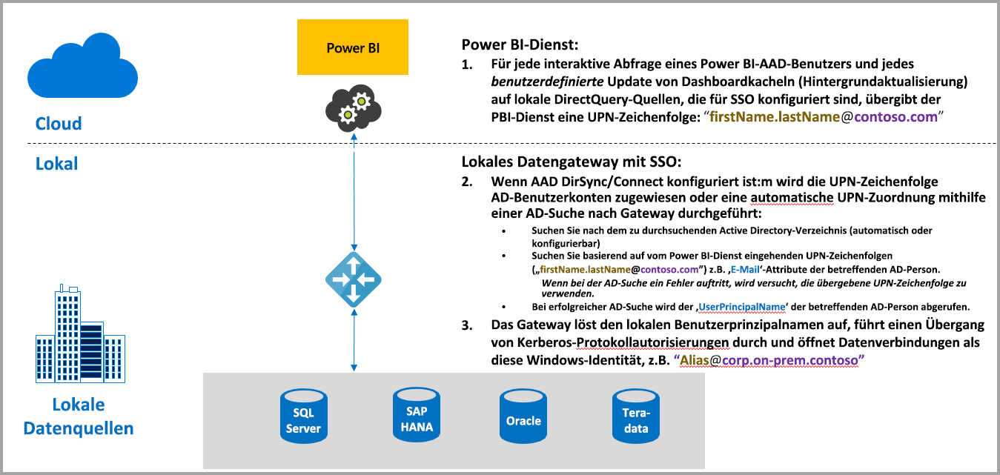
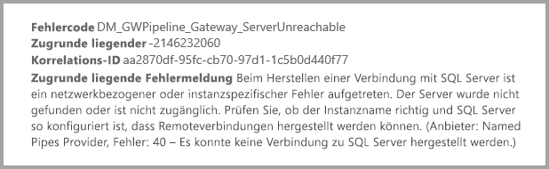
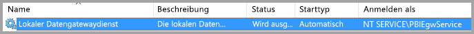
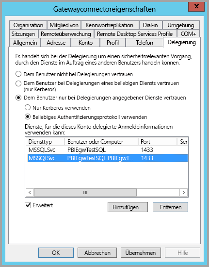
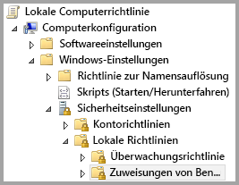
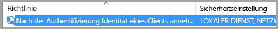
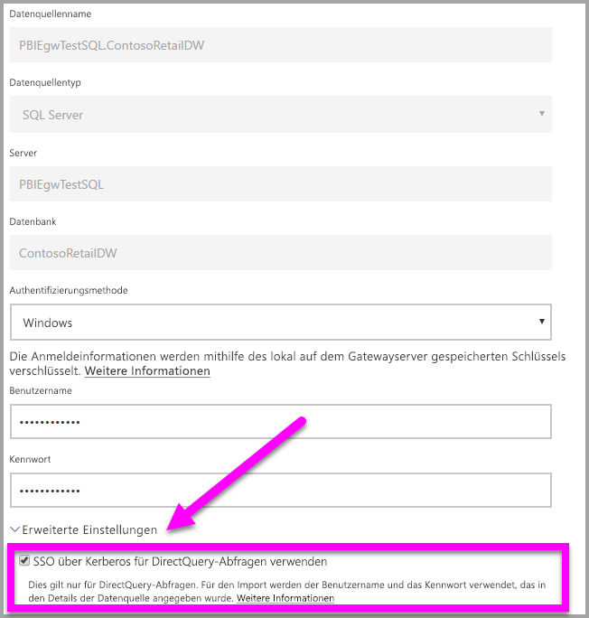
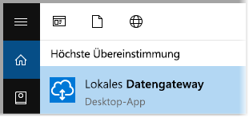
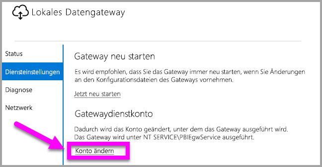

# Verwenden von Kerberos für SSO (Single Sign-On, Einmaliges Anmelden) von Power BI bei lokalen Datenquellen
Sie können nahtlose Verbindungen mit einmaligem Anmelden erreichen und für Power BI-Berichte und -Dashboards das Aktualisieren von lokalen Daten ermöglichen, indem Sie Ihr lokales Datengateway mit Kerberos konfigurieren. Das lokale Datengateway ermöglicht das einmalige Anmelden über DirectQuery; hiermit werden Verbindungen mit lokalen Datenquellen hergestellt.

Die folgenden Datenquellen werden derzeit unterstützt, alle basieren auf der [eingeschränkten Kerberos-Delegierung](https://technet.microsoft.com/library/jj553400.aspx):

* SQL Server
* SAP HANA
* Teradata

Wenn ein Benutzer mit einem DirectQuery-Bericht im Power BI-Dienst interagiert, kann jeder Kreuzfilter-, Segmentierungs-, Sortier- und Berichtsbearbeitungsvorgang Abfragen bewirken, die live für die zugrunde liegende Datenquelle ausgeführt werden.  Wenn das einmalige Anmelden für die Datenquelle konfiguriert ist, werden Abfragen unter der Identität des Benutzers ausgeführt, der mit Power BI interagiert (d.h. über die Webumgebung oder mobile Power BI-Apps). Somit sieht jeder Benutzer genau die Daten, für die er in der zugrunde liegenden Datenquelle über Berechtigungen verfügt – bei aktiviertem einmaligen Anmelden erfolgt keine Zwischenspeicherung freigegebener Daten für verschiedene Benutzer.

## Ausführen einer Abfrage mit SSO – ausgeführte Schritte
Eine mit SSO ausgeführte Abfrage umfasst drei Schritte, wie in der folgenden Abbildung veranschaulicht.

> [!NOTE]
> SSO für Oracle ist noch nicht aktiviert, befindet sich jedoch in der Entwicklung und ist in Kürze verfügbar.
> 
> 

Es folgen weitere Details zu diesen Schritten:

1. Für jede Abfrage schließt der **Power BI-Dienst** beim Senden einer Abfrageanforderung an das konfigurierte Gateway den *Benutzerprinzipalnamen* (UPN) ein.
2. Das Gateway muss den Azure Active Directory-UPN einer lokalen Active Directory-Identität zuordnen.
   
   a.  Wenn AAD DirSync (auch als *AAD Connect* bezeichnet) konfiguriert ist, erfolgt die Zuordnung automatisch im Gateway.
   
   b.  Andernfalls kann das Gateway den Azure AD-UPN suchen und einem lokalen Benutzer zuordnen. Dies erfolgt durch eine Suche in der lokalen Active Directory-Domäne.
3. Der Prozess des Gatewaydiensts nimmt die Identität des zugeordneten lokalen Benutzers an, öffnet die Verbindung mit der zugrunde liegenden Datenbank und sendet die Abfrage. Das Gateway muss nicht auf denselben Computern wie die Datenbank installiert sein.
   
   - Der Benutzeridentitätswechsel und die Verbindung mit der Datenbank sind nur erfolgreich, wenn das Gatewaydienstkonto ein Domänenkonto (oder eine Dienst-SID) ist und wenn die eingeschränkte Kerberos-Delegierung für die Datenbank so konfiguriert wurde, dass Kerberos-Tickets aus dem Gatewaydienstkonto akzeptiert werden.  
   
   > [!NOTE]
   > Bezüglich der Dienst-SID: Wenn AAD DirSync/Connect konfiguriert ist und Benutzerkonten synchronisiert sind, muss der Gatewaydienst keine lokalen AD-Suchvorgänge zur Laufzeit ausführen, und Sie können die lokale Dienst-SID (statt eines Domänenkontos) für den Gatewaydienst verwenden. Die in diesem Artikel beschriebenen Schritte für die Konfiguration der eingeschränkten Kerberos-Delegierung sind identisch mit den Schritten dieser Konfiguration (sie werden lediglich auf das Computerobjekt des Gateways in Active Directory angewendet und nicht auf das Domänenkonto).

> [!NOTE]
> So aktivieren Sie SSO für SAP HANA:
>
> - Vergewissern Sie sich, dass auf dem SAP HANA-Server die erforderliche Mindestversion ausgeführt wird, die von der Plattformebene Ihres SAP HANA-Servers abhängig ist:
>     - [HANA 2 SPS 01 Rev 012.03](https://launchpad.support.sap.com/#/notes/2557386)
>     - [HANA 2 SPS 02 Rev 22](https://launchpad.support.sap.com/#/notes/2547324)
>     - [HANA 1 SP 12 Rev 122.13](https://launchpad.support.sap.com/#/notes/2528439)
>
> - Installieren Sie auf dem Gatewaycomputer den aktuellen HANA-ODBC-Treiber von SAP.  Die Mindestversion ist die HANA-ODBC-Version 2.00.020.00 vom August 2017.
>
> Weitere Informationen zum Einrichten und Konfigurieren des einmaligen Anmeldens für SAP HANA mithilfe von Kerberos finden Sie im SAP HANA Security Guide im Thema [Single Sign-On Using Kerberos (Einmaliges Anmelden mithilfe von Kerberos)](https://help.sap.com/viewer/b3ee5778bc2e4a089d3299b82ec762a7/2.0.03/en-US/1885fad82df943c2a1974f5da0eed66d.html) und unter den Links auf dieser Seite, insbesondere SAP Note 1837331 – HOWTO HANA DBSSO Kerberos/Active Directory. 
>
>

## Fehler aufgrund einer unzureichenden Kerberos-Konfiguration
Wenn der zugrunde liegende Datenbankserver und das Gateway nicht ordnungsgemäß für die **eingeschränkte Kerberos-Delegierung** konfiguriert sind, kann die folgende Fehlermeldung ausgegeben werden:

Die technischen Details der Fehlermeldung können wie folgt aussehen:

Infolgedessen kann das Gateway aufgrund der unzureichenden Kerberos-Konfiguration nicht die Identität des ursprünglichen Benutzers annehmen, und mit der Datenbank kann keine Verbindung hergestellt werden.

## Vorbereiten für die eingeschränkte Kerberos-Delegierung
Für die ordnungsgemäße Funktion der eingeschränkten Kerberos-Delegierung müssen verschiedene Elemente konfiguriert werden, u.a. *Dienstprinzipalnamen* (SPN) und Delegierungseinstellungen für Dienstkonten.

### Voraussetzung 1: Installieren und Konfigurieren des lokalen Datengateways
Diese Version des lokalen Datengateways unterstützt das direkte Upgrade sowie die Übernahme der Einstellungen von vorhandenen Gateways.

### Voraussetzung 2: Ausführen des Gateway-Windows-Diensts als Domänenkonto
In einer Standardinstallation wird das Gateway als Dienstkonto des lokalen Computers (speziell *NT Service\PBIEgwService*) ausgeführt; siehe folgende Abbildung:

Zum Aktivieren der **eingeschränkten Kerberos-Delegierung** muss das Gateway als Domänenkonto ausgeführt werden, es sei denn, Ihr AAD ist bereits mit dem lokalen Active Directory synchronisiert (mit AAD DirSync/Connect). Es gibt zwei Möglichkeiten, diesen Kontowechsel ordnungsgemäß vorzunehmen:

* Wenn Sie mit einer früheren Version des lokalen Datengateways begonnen haben, führen Sie alle fünf Schritte genau in der vorgeschriebenen Reihenfolge aus (u.a. Ausführen der Gatewaykonfiguration in Schritt 3), die im folgenden Artikel beschrieben werden:
  
  * [Ändern des Gatewaydienstkontos in einen Domänenbenutzer](https://powerbi.microsoft.com/documentation/powerbi-gateway-proxy/#changing-the-gateway-service-account-to-a-domain-user)
  * Wenn Sie die Vorschauversion des lokalen Datengateways bereits installiert haben, können Sie nun die Dienstkonten direkt über die Benutzeroberfläche aus der Konfiguration des Gateways ändern. Weitere Informationen hierzu finden Sie unter **Umstellen des Gateways auf ein Domänenkonto** am Ende dieses Artikels.

> [!NOTE]
> Wenn AAD DirSync/Connect konfiguriert ist und Benutzerkonten synchronisiert sind, muss der Gatewaydienst keine lokalen AD-Suchvorgänge zur Laufzeit ausführen, und Sie können die lokale Dienst-SID (statt eines Domänenkontos) für den Gatewaydienst verwenden. Die in diesem Artikel beschriebenen Schritte für die Konfiguration der eingeschränkten Kerberos-Delegierung sind identisch mit denen dieser Konfiguration (sie basieren lediglich auf der Dienst-SID und nicht auf dem Domänenkonto).
> 
> 

### Voraussetzung 3: Vorhandene Domänenadministratorrechte zum Konfigurieren von SPNs (SetSPN) und Einstellungen für die eingeschränkte Kerberos-Delegierung
Zwar ist es für einen Domänenadministrator möglich, anderen Personen vorübergehend oder dauerhaft Rechte zum Konfigurieren von SPNs und der Kerberos-Delegierung zu gewähren, ohne dass dafür Domänenadministratorrechte benötigt werden. Diese Vorgehensweise ist jedoch nicht ratsam. Im folgenden Abschnitt werden die erforderlichen Schritte für **Voraussetzung 3** ausführlich erläutert.

## Konfigurieren der eingeschränkten Kerberos-Delegierung für das Gateway und die Datenquelle
Um das System ordnungsgemäß zu konfigurieren, müssen die folgenden zwei Elemente konfiguriert bzw. überprüft werden:

1. Konfigurieren Sie ggf. einen SPN für das Domänenkonto des Gatewaydiensts (sofern noch keine erstellt wurden).
2. Konfigurieren Sie Delegierungseinstellungen für das Domänenkonto des Gatewaydiensts.

Beachten Sie, dass Sie zum Ausführen dieser beiden Konfigurationsschritte Domänenadministrator sein müssen.

In den folgenden Abschnitten werden diese Schritte beschrieben.

### Konfigurieren eines SPN für das Gatewaydienstkonto
Bestimmen Sie zunächst, ob bereits ein SPN für das Domänenkonto erstellt wurde, das als Gatewaydienstkonto verwendet wird; führen Sie dabei jedoch diese Schritte aus:

1. Starten Sie **Active Directory-Benutzer und -Computer** als Domänenadministrator.
2. Klicken Sie mit der rechten Maustaste auf die Domäne, wählen Sie **Suchen** aus, und geben Sie den Kontonamen des Gatewaydienstkontos ein.
3. Klicken Sie im Suchergebnis mit der rechten Maustaste auf das Gatewaydienstkonto, und wählen Sie **Eigenschaften** aus.
   
   * Wenn im Dialogfeld **Eigenschaften** die Registerkarte **Delegierung** angezeigt wird, wurde bereits ein SPN erstellt, und Sie können mit dem nächsten Unterabschnitt zum Konfigurieren der Delegierungseinstellungen fortfahren.

Ist im Dialogfeld **Eigenschaften** keine Registerkarte **Delegierung** vorhanden, können Sie manuell einen SPN für das Konto erstellen, wodurch die Registerkarte **Delegierung** hinzugefügt wird (diese bietet die einfachste Möglichkeit, Delegierungseinstellungen zu konfigurieren). Sie können einen SPN mit dem [setspn-Tool](https://technet.microsoft.com/library/cc731241.aspx) von Windows erstellen (Sie benötigen Domänenadministratorrechte, um den SPN zu erstellen).

Angenommen, das Gatewaydienstkonto heißt „PBIEgwTest\GatewaySvc“, während der Name des Computers, auf dem der Gatewaydienst ausgeführt wird, **Machine1** lautet. Zum Festlegen des SPN für das Gatewaydienstkonto für den Computer in diesem Beispiel führen Sie den folgenden Befehl aus:

Ist dieser Schritt abgeschlossen, können wir mit dem Konfigurieren von Delegierungseinstellungen fortfahren.

### Konfigurieren von Delegierungseinstellungen für das Gatewaydienstkonto
Die zweite Konfigurationsvoraussetzung sind die Delegierungseinstellungen für das Gatewaydienstkonto. Es gibt verschiedene Tools, mit denen Sie diese Schritte ausführen können. In diesem Artikel verwenden wir **Active Directory-Benutzer und -Computer**, ein Snap-In der MMC (Microsoft Management Console), mit dem Sie Informationen im Verzeichnis verwalten und veröffentlichen können; dieses Tool ist auf Domänencontrollern standardmäßig verfügbar. Sie können es über die Konfiguration von **Windows-Funktionen** auf anderen Computern aktivieren.

Wir müssen die **eingeschränkte Kerberos-Delegierung** mit Protokollübertragung konfigurieren. Bei der eingeschränkten Delegierung müssen die Dienste explizit angegeben werden, an die delegiert werden soll – so akzeptieren z.B. nur Ihr SQL Server oder Ihr SAP HANA-Server Delegierungsaufrufe vom Gatewaydienstkonto.

In diesem Abschnitt wird davon ausgegangen, dass Sie bereits SPNs für die zugrunde liegenden Datenquellen (wie SQL Server, SAP HANA, Teradata usw.) konfiguriert haben. Informationen zum Konfigurieren der SPNs für diese Datenquellenserver finden Sie in der technischen Dokumentation für den jeweiligen Datenbankserver. Sie können auch den Blogbeitrag mit dem Abschnitt [*What SPN does your app require?*](https://blogs.msdn.microsoft.com/psssql/2010/06/23/my-kerberos-checklist/) (Welchen SPN benötigt Ihre App?) lesen.

In den folgenden Schritten wird von einer lokalen Umgebung mit zwei Computern ausgegangen: ein Gatewaycomputer und ein Datenbankserver (SQL Server-Datenbank). Für das Beispiel werden zudem die folgenden Einstellungen und Namen angenommen:

* Gatewaycomputername: **PBIEgwTestGW**
* Gatewaydienstkonto: **PBIEgwTest\GatewaySvc** (Kontoanzeigename: Gateway Connector)
* Computername der SQL Server-Datenquelle: **PBIEgwTestSQL**
* Dienstkonto der SQL Server-Datenquelle: **PBIEgwTest\SQLService**

Für diese Beispielnamen und -einstellungen sind folgende Konfigurationsschritte auszuführen:

1. Starten Sie mit Domänenadministratorrechten **Active Directory-Benutzer und -Computer**.
2. Klicken Sie mit der rechten Maustaste auf das Gatewaydienstkonto (**PBIEgwTest\GatewaySvc**), und wählen Sie **Eigenschaften** aus.
3. Wählen Sie die Registerkarte **Delegierung** aus.
4. Wählen Sie **Computer nur bei Delegierungen angegebener Dienste vertrauen** aus.
5. Wählen Sie dann **Beliebiges Authentifizierungsprotokoll verwenden** aus.
6. Klicken Sie unter **Dienste, für die dieses Konto delegierte Anmeldeinformationen verwenden kann** auf **Hinzufügen**.
7. Wählen Sie im Dialogfeld „Neu“ **Benutzer oder Computer** aus.
8. Geben Sie das Dienstkonto für den SQL Server-Datenbankdienst (**PBIEgwTest\SQLService**) ein, und klicken Sie auf **OK**.
9. Wählen Sie den SPN aus, den Sie für den Datenbankserver erstellt haben. In unserem Beispiel beginnt der SPN mit **MSSQLSvc**. Wenn Sie sowohl den FQDN als auch den NetBIOS-SPN für den Datenbankdienst hinzugefügt haben, wählen Sie beide aus. Ggf. wird nur einer angezeigt.
10. Klicken Sie auf **OK**. Der SPN sollte jetzt in der Liste angezeigt werden.
11. Wahlweise können Sie **Erweitert** auswählen, um den FQDN und den NetBIOS-SPN anzuzeigen.
12. Das angezeigte Dialogfeld ähnelt dem Folgenden, wenn Sie **Erweitert** aktiviert haben.
    
    
13. Wählen Sie **OK**aus.
    
    Schließlich muss dem Gatewaydienstkonto auf dem Computer, auf dem der Gatewaydienst (**PBIEgwTestGW** in unserem Beispiel) ausgeführt werden, die lokale Richtlinie „Annehmen der Clientidentität nach Authentifizierung“ gewährt werden. Sie können dies mit dem lokalen Gruppenrichtlinien-Editor (**gpedit**) ausführen/überprüfen.
14. Führen Sie auf dem Gatewaycomputer Folgendes aus: *gpedit.msc*
15. Navigieren Sie zu **Richtlinie für „Lokaler Computer“ > Computerkonfiguration > Windows-Einstellungen > Sicherheitseinstellungen > Lokale Richtlinien > Zuweisen von Benutzerrechten**, wie in der folgenden Abbildung veranschaulicht.
    
    
16. Wählen Sie in der Liste der Richtlinien unter **Zuweisen von Benutzerrechten** den Eintrag **Annehmen der Clientidentität nach Authentifizierung** aus.
    
    
    
    Klicken Sie mit der rechten Maustaste, und öffnen Sie das Dialogfeld **Eigenschaften** für **Annehmen der Clientidentität nach Authentifizierung**, und überprüfen Sie die Liste der Konten. Sie muss das Gatewaydienstkonto (**PBIEgwTest\GatewaySvc**) enthalten.
17. Wählen Sie in der Liste der Richtlinien unter **Zuweisen von Benutzerrechten** den Eintrag **Als Teil des Betriebssystems fungieren (SeTcbPrivilege)** aus. Vergewissern Sie sich, dass das Gatewaydienstkonto auch in der Liste der Konten aufgeführt wird.
18. Starten Sie den Dienstprozess **Lokales Datengateway** neu.

## Ausführen eines Power BI-Berichts
Nachdem alle zuvor in diesem Artikel beschriebenen Konfigurationsschritte ausgeführt wurden, können Sie auf der Seite **Gateways verwalten** in Power BI die Datenquelle konfigurieren und dort unter **Erweiterte Einstellungen** das einmalige Anmelden aktivieren und anschließend an die betreffende Datenquelle gebundene Berichte und Datasets veröffentlichen.

Diese Konfiguration funktioniert in den meisten Fällen. Bei Kerberos können jedoch je nach Umgebung unterschiedliche Konfigurationen vorhanden sein. Wenn der Bericht immer noch nicht geladen wird, wenden Sie sich an Ihren Domänenadministrator, um das Problem zu untersuchen.

## Umstellen des Gateways auf ein Domänenkonto
An früherer Stelle in diesem Artikel wurde das Umstellen des Gateways von einem lokalen Dienstkonto auf die Ausführung als Domänenkonto beschrieben; hierbei wurde die Benutzeroberfläche des **lokalen Datengateways** verwendet. Im Folgenden werden die dazu benötigten Schritte erläutert.

1. Starten Sie das Konfigurationstool **Lokales Datengateway**.
   
   
2. Klicken Sie auf der Hauptseite auf die Schaltfläche **Anmelden**, und melden Sie sich mit Ihrem Power BI-Konto an.
3. Wählen Sie nach abgeschlossener Anmeldung die Registerkarte **Diensteinstellungen** aus.
4. Klicken Sie auf **Konto ändern**, um die geführte exemplarische Vorgehensweise zu starten, wie in der folgenden Abbildung veranschaulicht.
   
   

## Nächste Schritte
Weitere Informationen zum **lokalen Datengateway** und **DirectQuery** finden Sie in den folgenden Ressourcen:

* [Lokales Datengateway](service-gateway-onprem.md)
* [DirectQuery in Power BI](desktop-directquery-about.md)
* [Von DirectQuery unterstützte Datenquellen](desktop-directquery-data-sources.md)
* [DirectQuery und SAP BW](desktop-directquery-sap-bw.md)
* [DirectQuery und SAP HANA](desktop-directquery-sap-hana.md)

