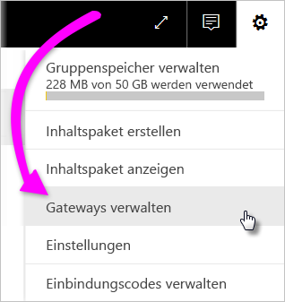
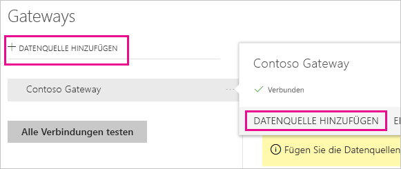
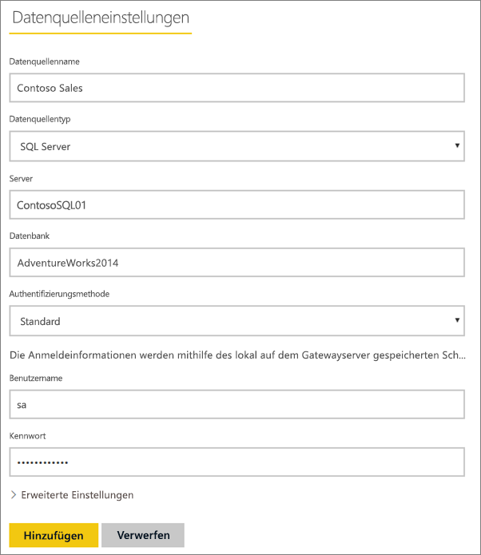
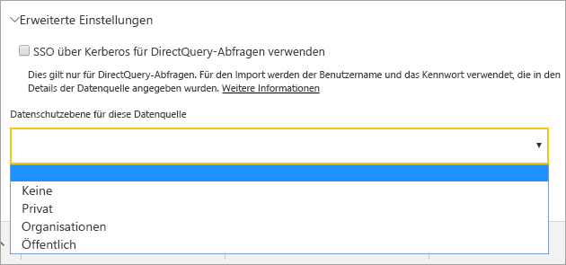
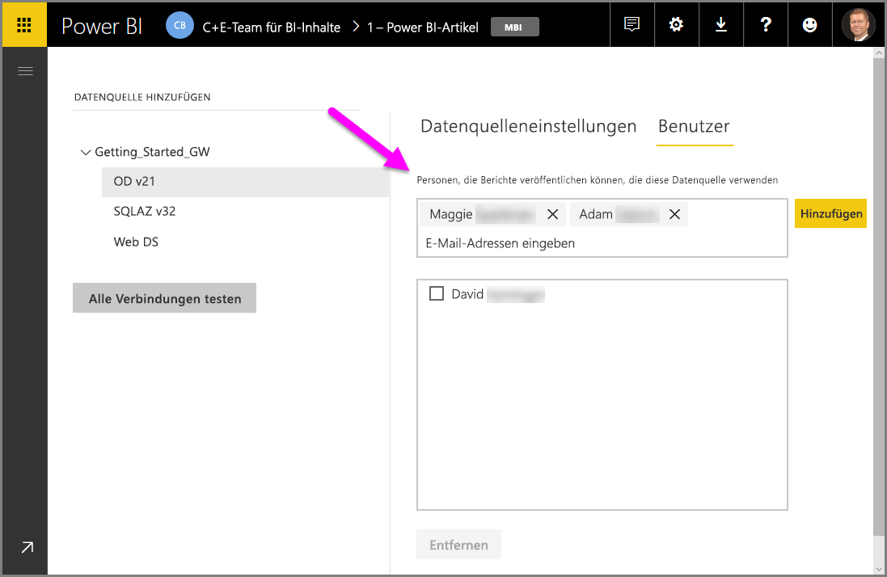
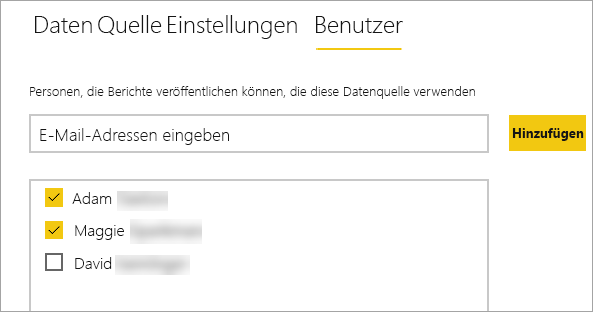
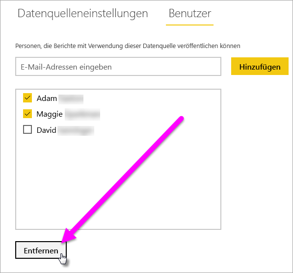
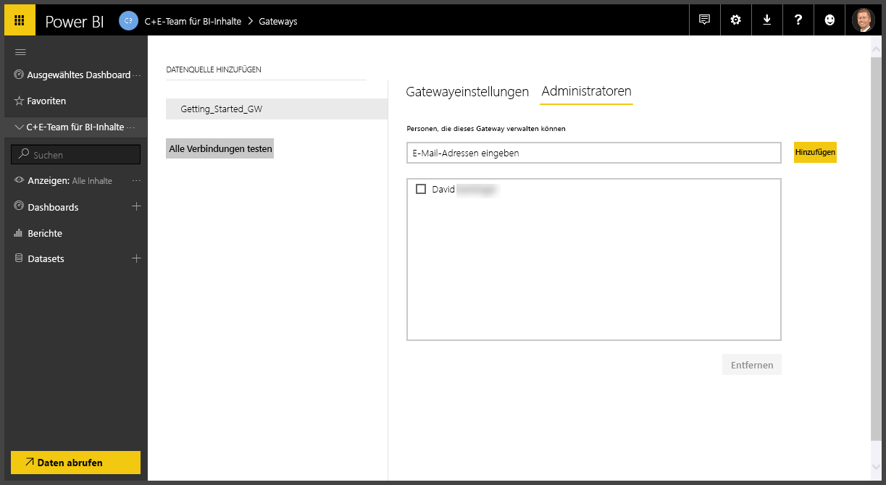
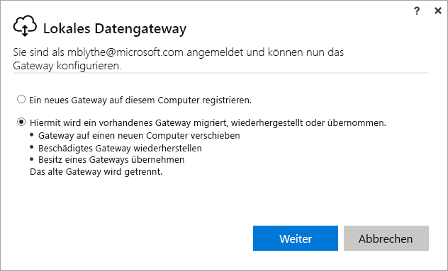
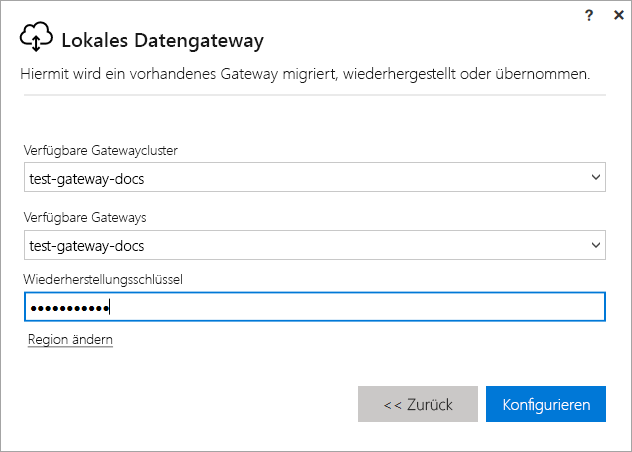

# Verwalten eines Power BI-Gateways

Nachdem Sie [ein Power BI-Datengateway installiert haben](service-gateway-install.md), können Sie es im Bereich **Gateways verwalten** des Power BI-Diensts, in der Gateway-App auf Ihrem lokalen Computer oder mit PowerShell-Skripts verwalten. In diesem Artikel geht es primär um den Power BI-Dienst. Wenn Sie bereits ein Gateway installiert haben, sollten Sie als Nächstes [eine Datenquelle hinzufügen](#add-a-data-source) und dann [Benutzer hinzufügen](#add-users-to-a-data-source), sodass diese auf die Datenquelle zugreifen können.

## Verwalten von Datenquellen

Power BI unterstützt viele lokale Datenquellen, von denen jede eigene Anforderungen aufweist. In diesem Beispiel zeigen wir Ihnen, wie Sie SQL Server als Datenquelle hinzufügen, die Schritte sind für andere Datenquellen aber die gleichen.

### Hinzufügen einer Datenquelle

1. Klicken Sie in der oberen rechten Ecke des Power BI-Diensts auf das Zahnradsymbol  und dann auf **Gateways verwalten**.

    

2. Wählen Sie ein Gateway aus und klicken auf **Datenquelle hinzufügen**, oder wechseln Sie zu „Gateways“ und klicken Sie auf **Datenquelle hinzufügen**.

    

3. Wählen Sie den **Datenquellentyp** aus.

    

4. Geben Sie Informationen zur Datenquelle ein. In diesem Beispiel: **Server**, **Datenbank** und weitere Informationen.  

    

5. Für SQL Server wählen Sie eine **Authentifizierungsmethode** aus: **Windows** oder **Standard** (SQL-Authentifizierung).  Wenn Sie **Standard** auswählen, geben Sie die Anmeldeinformationen für Ihre Datenquelle ein.

6. Konfigurieren Sie optional unter **Erweiterte Einstellungen** die [Datenschutzebene]((https://support.office.com/article/Privacy-levels-Power-Query-CC3EDE4D-359E-4B28-BC72-9BEE7900B540)) für Ihre Datenquelle (gilt nicht für [DirectQuery](desktop-directquery-about.md)).

    

7. Wählen Sie **Hinzufügen**. Bei erfolgreicher Ausführung wird *Die Verbindung wurde hergestellt.* angezeigt.

    

Sie können diese Datenquelle jetzt verwenden, um Daten aus SQL Server in Ihre Power BI-Dashboards und -Berichte einzubinden.

### Entfernen einer Datenquelle

Sie können eine Datenquelle entfernen, wenn Sie sie nicht mehr verwenden. Vorsicht: Durch Entfernen einer Datenquelle geht die Funktionsfähigkeit aller Dashboards und Berichte verloren, die auf der betreffenden Datenquelle beruhen.

Um eine Datenquelle zu entfernen, wechseln Sie zu der Datenquelle, und klicken Sie auf **Entfernen**.

## Verwalten von Benutzern und Administratoren

Nachdem Sie eine Datenquelle zu einem Gateway hinzugefügt haben, gewähren Sie Benutzern und Sicherheitsgruppen Zugriff auf die spezifische Datenquelle (nicht auf das gesamte Gateway). Die Datenquellen-Benutzerliste steuert nur, wer Berichte veröffentlichen darf, die Daten aus der Datenquelle enthalten. Besitzer eines Berichts können Dashboards, Inhaltspakete und Apps erstellen und diese dann für andere Benutzer freigeben.

Sie können Benutzern und Sicherheitsgruppen auch Verwaltungszugriff auf das Gateway gewähren.

### Hinzufügen von Benutzern zu einer Datenquelle

1. Klicken Sie in der oberen rechten Ecke des Power BI-Diensts auf das Zahnradsymbol  und dann auf **Gateways verwalten**.

2. Wählen Sie die Datenquelle aus, der Sie Benutzer hinzufügen möchten.

3. Wählen Sie **Benutzer** aus, und geben Sie einen Benutzer aus Ihrer Organisation ein, dem Sie Zugriff auf die ausgewählte Datenquelle gewähren möchten. Im folgenden Bildschirm sehen Sie, dass Maggie und Adam hinzugefügt werden.

    

4. Klicken Sie auf **Hinzufügen**, und das hinzugefügte Mitglied wird im Feld angezeigt.

    

Das war schon alles. Denken Sie daran, dass Sie jeder Datenquelle, für die Sie den Zugriff gewähren möchten, Benutzer hinzufügen müssen. Jede Datenquelle verfügt über eine eigene Liste von Benutzern, und Sie müssen jeder Datenquelle separat Benutzer hinzufügen.

### Entfernen von Benutzern aus einer Datenquelle

Auf der Registerkarte **Benutzer** für die Datenquelle können Sie Benutzer und Sicherheitsgruppen entfernen, die diese Datenquelle verwenden.

### Hinzufügen und Entfernen von Administratoren

Auf der Registerkarte **Administratoren** für das Gateway können Sie Benutzer (oder Sicherheitsgruppen) hinzufügen und entfernen, die das Gateway verwalten dürfen.

## Verwalten eines Gatewayclusters

Sobald Sie einen Gatewaycluster aus mindestens zwei Gateways erstellt haben, gelten alle Verwaltungsvorgänge für Gateways, z.B. Hinzufügen von Datenquellen oder Gewähren von Administratorberechtigungen für ein Gateway, für alle Gateways im Cluster. 

Wenn Administratoren im **Power BI-Dienst** das Zahnradsymbol und dann **Gateways verwalten** auswählen, sehen sie eine Liste der registrierten Cluster oder einzelnen Gateways, aber keine einzelnen Gatewayinstanzen, die Mitglieder des Clusters sind.

Alle neuen Anforderungen für eine **geplante Aktualisierung** und DirectQuery-Vorgänge werden automatisch an die primäre Instanz eines Gatewayclusters weitergeleitet. Wenn die primäre Gatewayinstanz nicht online ist, wird die Anforderung an eine andere Gatewayinstanz im Cluster weitergeleitet.

## Migrieren, Wiederherstellen oder Übernehmen eines Gateways

Führen Sie das Gatewayinstallationsprogramm auf dem Computer aus, auf dem Sie das Gateway migrieren, wiederherstellen oder übernehmen möchten.

1. Laden Sie das Gateway herunter, und installieren Sie es.

2. Nachdem Sie sich bei Ihrem Power BI-Konto angemeldet haben, registrieren Sie das Gateway. Klicken Sie auf **Migrieren, Wiederherstellen oder Übernehmen eines vorhandenen Gateways** > **Weiter**.

    

3. Treffen Sie Ihre Auswahl aus den verfügbaren Clustern und Gateways, und geben Sie den Wiederherstellungsschlüssel für das ausgewählte Gateway ein. Wählen Sie **Konfigurieren** aus.

    

## Neustart eines Gateways

Das Gateway wird als Windows-Dienst ausgeführt. Wie bei jedem Windows-Dienst gibt es mehrere Möglichkeiten zum Starten und Beenden. In der Eingabeforderung müssen Sie daher wie folgt vorgehen:

1. Starten Sie auf dem Computer, auf dem das Gateway ausgeführt wird, eine Eingabeaufforderung mit Administratorrechten.

2. Geben Sie `net stop PBIEgwService` ein, um den Dienst zu beenden.

3. Geben Sie `net start PBIEgwService` ein, um den Dienst neu zu starten.

## Entfernen eines Gateways

Sie können ein Gateway entfernen, wenn Sie es nicht mehr verwenden. Beachten Sie jedoch, dass durch das Entfernen eines Gateways alle darin enthaltenen Datenquellen gelöscht werden. Dadurch verlieren auch alle Dashboards und Berichte, die auf diesen Datenquellen beruhen, ihre Funktionsfähigkeit.

1. Klicken Sie in der oberen rechten Ecke des Power BI-Diensts auf das Zahnradsymbol  und dann auf **Gateways verwalten**.

2. Wählen Sie das Gateway aus, und klicken Sie auf **Entfernen**
   
   

## Nächste Schritte

[Leitfaden zum Bereitstellen eines Datengateways](service-gateway-deployment-guidance.md)

Weitere Fragen? [Wenden Sie sich an die Power BI-Community](http://community.powerbi.com/)