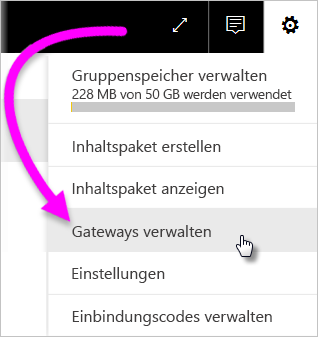
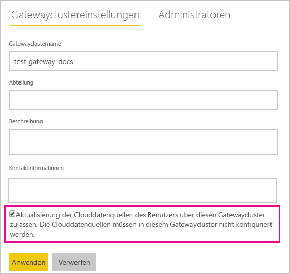
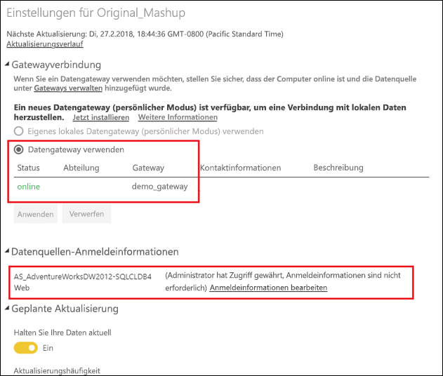

# Zusammenführen oder Anfügen von lokalen und Clouddatenquellen

Mit dem lokalen Datengateway können Sie lokale und Clouddatenquellen in derselben Abfrage zusammenführen oder daran anfügen. Dies ist hilfreich, wenn Sie Daten aus mehreren Quellen in derselben Abfrage kombinieren möchten.

## Voraussetzungen

- Ein [auf einem lokalen Computer installiertes Gateway](service-gateway-install.md)
- Eine Power BI Desktop-Datei mit Abfragen, die lokale und Clouddatenquellen enthält.

1. Klicken Sie in der oberen rechten Ecke des Power BI-Diensts auf das Zahnradsymbol  und dann auf **Gateways verwalten**.

    

2. Wählen Sie das Gateway aus, das Sie konfigurieren möchten.

3. Klicken Sie unter **Gatewayclustereinstellungen** auf die Optionen **Ermöglichen Sie die Aktualisierung der Clouddatenquellen des Benutzers über diesen Gatewaycluster** > **Übernehmen**.

    

4. Fügen Sie unter diesem Gatewaycluster alle [lokalen Datenquellen](service-gateway-enterprise-manage-scheduled-refresh.md#add-a-data-source) hinzu, die in Ihren Abfragen verwendet werden. Die Clouddatenquellen müssen hier nicht hinzugefügt werden.

4. Laden Sie die Power BI Desktop-Datei mit den Abfragen, die lokale und Clouddatenquellen enthalten, zu Power BI hoch.

5. Gehen Sie auf der Seite **Dataseteinstellungen** für das neue Dataset folgendermaßen vor:

    - Wählen Sie für die lokale Quelle das Gateway aus, das dieser Datenquelle zugeordnet ist.

    - Bearbeiten Sie unter **Datenquellen-Anmeldeinformationen** die Clouddatenquellen-Anmeldeinformationen nach Bedarf.

    

6. Wenn Sie die Cloudanmeldeinformationen festgelegt haben, können Sie das Dataset mithilfe der Option **Jetzt aktualisieren** aktualisieren oder eine Aktualisierung in regelmäßigen Abständen planen.

## Nächste Schritte

Weitere Informationen zu Datenaktualisierung für Gateways finden Sie unter [Verwenden der Datenquelle für geplanten Aktualisierungen](service-gateway-enterprise-manage-scheduled-refresh.md#using-the-data-source-for-scheduled-refresh).