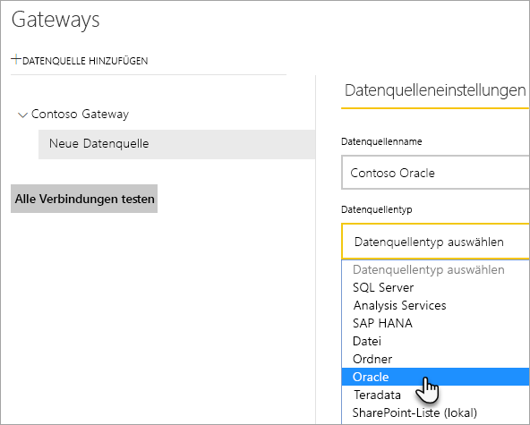
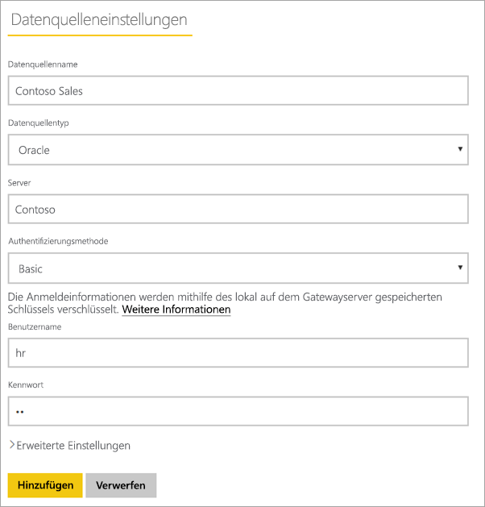
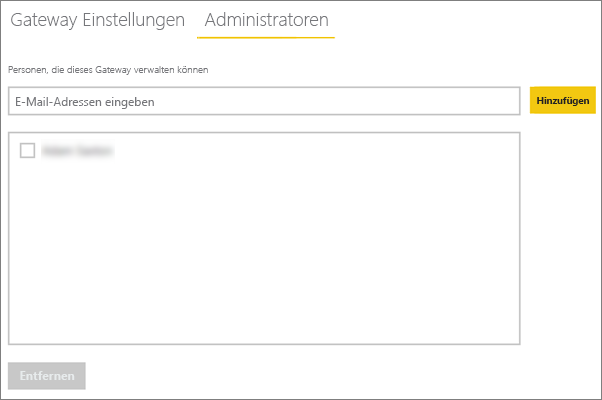

# <a name="manage-your-data-source---oracle"></a>Verwalten der Datenquelle – Oracle
Nach der Installation des lokalen Datengateways müssen Datenquellen hinzugefügt werden, die mit dem Gateway verwendet werden können. Dieser Artikel befasst sich mit dem Umgang mit Gateways und Datenquellen. Sie können die Oracle-Datenquelle für die geplante Aktualisierung oder für DirectQuery verwenden.

## <a name="download-and-install-the-gateway"></a>Herunterladen und Installieren eines Gateways
Sie können das Gateway vom Power BI-Dienst herunterladen. Wählen Sie **Herunterladen** > **Datengateway**, oder gehen Sie auf die [Gateway-Downloadseite](https://go.microsoft.com/fwlink/?LinkId=698861).


> [!WARNING]
> Damit das Gateway eine Verbindung mit dem Oracle-Server herstellen kann, muss der Oracle-Datenanbieter für .NET (ODP.NET) installiert und konfiguriert sein. ODP.NET ist Teil der Oracle Data Access Components (ODAC). Weitere Informationen zum Herunterladen des Oracle-Anbieters finden Sie unter [Installieren des Oracle-Clients](#installing-the-oracle-client) weiter unten.
> 
> 

## <a name="installing-the-oracle-client"></a>Installieren des Oracle-Clients
Verwenden Sie für **32-Bit**-Versionen von Power BI Desktop den folgenden Link, um den **32-Bit**-Oracle-Client herunterzuladen und zu installieren:

* [32-Bit-Oracle Data Access Components (ODAC) mit Oracle Developer Tools für Visual Studio (12.1.0.2.4)](http://www.oracle.com/technetwork/topics/dotnet/utilsoft-086879.html)

Verwenden Sie für **64-Bit**-Versionen von Power BI Desktop und für das lokale Datengateway den folgenden Link, um den **64-Bit**-Oracle-Client herunterzuladen und zu installieren:

* [64-Bit-ODAC 12.2c-Version 1 (12.2.0.1.0) für Windows x64](http://www.oracle.com/technetwork/database/windows/downloads/index-090165.html)

Nach der Installation muss die Datei „tnsnames.ora“ mit den korrekten Daten für Ihre Datenbank konfiguriert werden. Power BI Desktop und das Gateway verwenden den Wert „net_service_name“, der in der Datei „tnsnames.ora“ definiert wird. Wenn dieser Wert nicht festgelegt wurde, kann keine Verbindung hergestellt werden. Der standardmäßige Pfad der Datei „tnsnames.ora“ ist: `[Oracle Home Directory]\Network\Admin\tnsnames.ora`. Weitere Informationen zur Konfiguration der Datei „tnsnames.ora“ finden Sie unter [Oracle: Local Naming Parameters (tnsnames.ora)](https://docs.oracle.com/cd/B28359_01/network.111/b28317/tnsnames.htm).

### <a name="example-tnsnamesora-file-entry"></a>Beispieleintrag in der Datei „tnsnames.ora“
Grundsätzlich haben Einträge in der Datei „tnsnames.ora“ das folgende Format.

```
net_service_name=
 (DESCRIPTION=
   (ADDRESS=(protocol_address_information))
   (CONNECT_DATA=
     (SERVICE_NAME=service_name)))
```

Hier sehen Sie ein Beispiel mit ausgefüllten Server- und Portinformationen.

```
CONTOSO =
  (DESCRIPTION =
    (ADDRESS = (PROTOCOL = TCP)(HOST = oracleserver.contoso.com)(PORT = 1521))
    (CONNECT_DATA =
      (SERVER = DEDICATED)
      (SERVICE_NAME = CONTOSO)
    )
  )
```

## <a name="add-a-gateway"></a>Hinzufügen eines Gateways
Zum Hinzufügen eines Gateways können Sie einfach das Gateway [herunterladen](https://go.microsoft.com/fwlink/?LinkId=698861) und auf einem Server in Ihrer Umgebung installieren. Nach der Installation das Gateway in der Gatewayliste unter **Gateways verwalten**angezeigt.

> [!NOTE]
> **Gateways verwalten** wird nur angezeigt, wenn Sie Administrator auf mindestens einem Gateway sind. Dies kann erfolgen, indem Sie als Administrator hinzugefügt werden oder indem Sie selbst ein Gateway installieren und konfigurieren.
> 
> 

## <a name="remove-a-gateway"></a>Entfernen eines Gateways
Beim Entfernen eines Gateways werden auch alle Datenquellen unter diesem Gateway gelöscht.  Dadurch verlieren auch alle Dashboards und Berichte, die auf diesen Datenquellen beruhen, ihre Funktionsfähigkeit.

1. Wählen Sie rechts oben das Zahnradsymbol  > **Gateways verwalten**.
2. Gateway > **Entfernen**.
   
   

## <a name="add-a-data-source"></a>Hinzufügen einer Datenquelle
Sie können eine Datenquelle hinzufügen, indem Sie ein Gateway auswählen und auf **Datenquelle hinzufügen** klicken oder „Gateway“ > **Datenquelle hinzufügen** auswählen.


Sie können anschließend den **Datenquellentyp** in der Liste auswählen.



Sie sollten dann die Angaben für die Datenquelle vervollständigen, insbesondere **Server** und **Datenbank**.  

Zudem muss eine **Authentifizierungsmethode**festgelegt werden.  Dabei kann es sich um **Windows** oder **Basic**handeln.  Wählen Sie **Standard** aus, wenn ein in Oracle erstelltes Konto statt der Windows-Authentifizierung verwendet werden soll. Geben Sie dann die Anmeldeinformationen ein, die für diese Datenquelle verwendet werden sollen.

> [!NOTE]
> Alle Abfragen der Datenquelle werden mithilfe dieser Anmeldeinformationen durchgeführt. Weitere Informationen darüber, wie [Anmeldeinformationen](service-gateway-onprem.md#credentials) gespeichert werden, finden Sie im Hauptartikel zu On-premises data gateway.
> 
> 



Klicken Sie auf **Hinzufügen** , nachdem alle Angaben eingetragen wurden.  Sie können diese Datenquelle (oder DirectQuery) jetzt für geplante Aktualisierungen mit einem lokalen Oracle-Server verwenden. Bei erfolgreicher Ausführung wird *Verbindung hergestellt* angezeigt.


### <a name="advanced-settings"></a>Erweiterte Einstellungen
Sie können die Datenschutzebene für die Datenquelle konfigurieren, die steuert, wie Daten kombiniert werden können. Diese wird nur für die geplante Aktualisierung verwendet und gilt nicht für DirectQuery. [Weitere Informationen](https://support.office.com/article/Privacy-levels-Power-Query-CC3EDE4D-359E-4B28-BC72-9BEE7900B540)


## <a name="remove-a-data-source"></a>Entfernen einer Datenquelle
Durch Entfernen einer Datenquelle geht die Funktionsfähigkeit aller Dashboards und Berichte verloren, die auf der betreffenden Datenquelle beruhen.  

Um eine Datenquelle zu entfernen, verwenden Sie „Datenquelle“ > **Entfernen**.


## <a name="manage-administrators"></a>Verwalten von Administratoren
Sie können auf der Registerkarte „Administratoren“ für das Gateway Benutzer (oder Sicherheitsgruppen) hinzufügen und entfernen, die das Gateway verwalten dürfen.



## <a name="manage-users"></a>Verwalten von Benutzern
Sie können auf der Registerkarte „Benutzer“ für die Datenquelle Benutzer oder Sicherheitsgruppen hinzufügen und entfernen, die diese Datenquelle verwenden dürfen.

> [!NOTE]
> Über die Benutzerliste wird nur gesteuert, wer Berichte veröffentlichen darf. Besitzer eines Berichts können Dashboards und Inhaltspakete erstellen und für andere Benutzer freigeben. Benutzer, die den Bericht oder das Dashboard lediglich verwenden, müssen nicht in der Liste der Benutzer aufgeführt sein.
> 
> 


## <a name="using-the-data-source"></a>Verwenden der Datenquelle
Nachdem Sie die Datenquelle erstellt haben, kann diese mit DirectQuery-Verbindungen oder durch eine geplante Aktualisierung verwendet werden.

> [!WARNING]
> Die Namen des Servers und der Datenbank müssen in Power BI Desktop und in der Datenquelle innerhalb des lokalen Datengateways übereinstimmen.
> 
> 

Der Link zwischen Ihrem Dataset und der Datenquelle innerhalb des Gateways basiert auf dem Namen Ihres Servers und Ihrer Datenbank. Diese müssen übereinstimmen. Wenn Sie z.B. eine IP-Adresse für den Servernamen angeben, müssen Sie die IP-Adresse in Power BI Desktop für die Datenquelle innerhalb der Gatewaykonfiguration verwenden. Dieser Name muss außerdem einem Alias entsprechen, der in der Datei „tnsnames.ora“ definiert wurde. Weitere Informationen zur Datei „tnsnames.ora“ finden Sie unter [Installieren des Oracle-Clients](#installing-the-oracle-client).

Dies gilt für DirectQuery ebenso wie für geplante Aktualisierungen.

### <a name="using-the-data-source-with-directquery-connections"></a>Verwenden der Datenquelle mit DirectQuery-Verbindungen
Stellen Sie sicher, dass der Name des Servers und der Datenbank in Power BI Desktop und der für das Gateway konfigurierten Datenquelle identisch sind. Stellen Sie außerdem sicher, dass der Benutzer auf der Registerkarte **Benutzer** der Datenquelle aufgeführt ist, um DirectQuery-Datasets veröffentlichen zu können. Sie treffen die Auswahl für DirectQuery in Power BI Desktop beim Importieren der Daten. [Weitere Informationen](desktop-use-directquery.md)

Nach der Veröffentlichung von Power BI Desktop oder mit **Daten abrufen** sollten Ihre Berichte funktionieren. Es kann nach dem Erstellen der Datenquelle im Gateway mehrere Minuten dauern, bis die Verbindung genutzt werden kann.

### <a name="using-the-data-source-with-scheduled-refresh"></a>Verwenden der Datenquelle mit geplanten Aktualisierungen
Wenn Sie auf der Registerkarte **Benutzer** der im Gateway konfigurierten Datenquelle aufgeführt sind und der Name des Servers und der Datenbank übereinstimmen, wird das Gateway als Option für geplante Aktualisierungen angezeigt.


## <a name="troubleshooting"></a>Problembehandlung
In Oracle kann eine Reihe an Fehlern angezeigt werden, wenn die Namenssyntax entweder fehlerhaft ist oder die Konfiguration nicht ordnungsgemäß ausgeführt wurde.

* ORA-12154: TNS: could not resolve the connect identifier specified (Der angegebene Verbindungsbezeichner konnte nicht aufgelöst werden)  
* ORA-12514: TNS listener does not currently know of service requested in connect descriptor (TNS-Listener kann den in der Verbindungsbeschreibung abgefragten Dienst momentan nicht finden)  
* ORA-12541: TNS: no listener (kein Listener)  
* ORA-12170: TNS:Connect timeout occurred (Verbindungstimeout)  
* ORA-12504: TNS listener was not given the SERVICE_NAME in CONNECT_DATA (SERVICE_NAME in CONNECT_DATA wurde nicht an den TNS-Listener übergeben)  

Diese Fehler können auftreten, wenn der Oracle-Client nicht installiert ist oder wenn dieser nicht ordnungsgemäß konfiguriert wurde. Wenn der Client installiert ist, überprüfen Sie, ob die Datei „tnsnames.ora“ ordnungsgemäß konfiguriert und „net_service_name“ den richtigen Wert aufweist. Stellen Sie außerdem sicher, dass der Wert von „net_service_name“ auf dem Computer, auf dem Power BI Desktop ausgeführt wird, und auf dem Computer mit dem Gateway übereinstimmt. Weitere Informationen finden Sie unter [Installieren des Oracle-Clients](#installing-the-oracle-client).

> [!NOTE]
> Außerdem kann eine mangelnde Kompatibilität der Oracle-Serverversion mit der Oracle-Clientversion zu Problemen führen. Diese müssen in der Regel übereinstimmen.
> 
> 

Weitere Informationen zur Problembehandlung im Zusammenhang mit dem Gateway finden Sie unter [On-premises Data Gateway – Problembehandlung](service-gateway-onprem-tshoot.md).

## <a name="next-steps"></a>Nächste Schritte
[Lokales Datengateway](service-gateway-onprem.md)  
[Ausführliche Informationen zum lokalen Datengateway](service-gateway-onprem-indepth.md)  
[Lokales Datengateway – Problembehandlung](service-gateway-onprem-tshoot.md)  
[Power BI Premium](service-premium.md)

Weitere Fragen? [Stellen Sie Ihre Frage in der Power BI-Community.](http://community.powerbi.com/)

