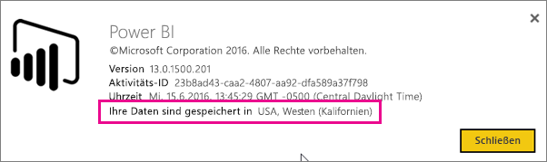
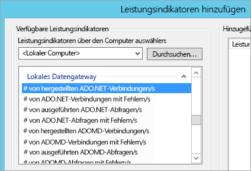
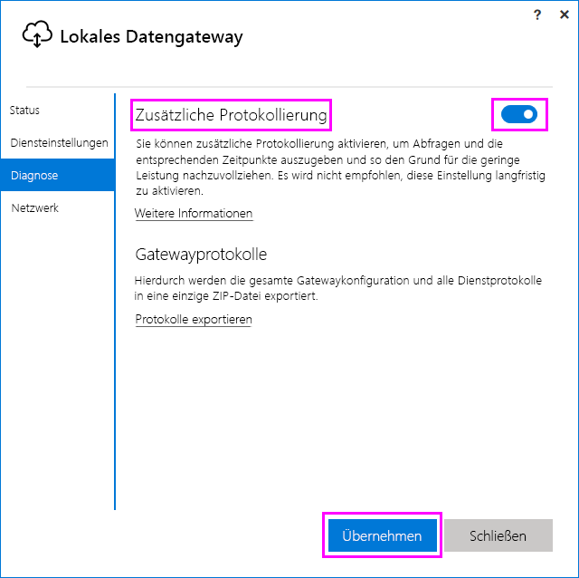
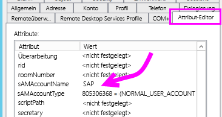
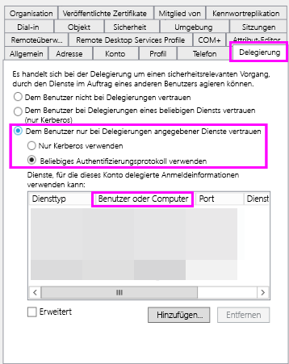
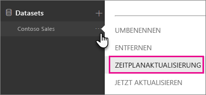
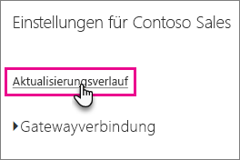
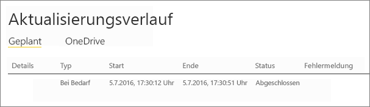

# <a name="troubleshooting-the-on-premises-data-gateway"></a>Lokales Datengateway – Problembehandlung
In diesem Artikel werden einige häufige Probleme erläutert, die beim Verwenden des **lokalen Datengateways** auftreten können.

<!-- Shared Community & support links Include -->
[!INCLUDE [gateway-onprem-tshoot-support-links-include](./includes/gateway-onprem-tshoot-support-links-include.md)]

<!-- Shared Troubleshooting Install Include -->
[!INCLUDE [gateway-onprem-tshoot-install-include](./includes/gateway-onprem-tshoot-install-include.md)]

## <a name="configuration"></a>Konfiguration
### <a name="how-to-restart-the-gateway"></a>So starten Sie das Gateway neu
Das Gateway wird als Windows-Dienst ausgeführt, Sie haben daher mehrere Möglichkeiten zum Starten und Beenden. Sie können z. B. eine Eingabeaufforderung mit erhöhten Berechtigungen auf dem Computer öffnen, auf dem das Gateway ausgeführt wird, und dann einen der folgenden Befehle eingeben:

* Führen Sie diesen Befehl aus, um den Dienst zu beenden:

    '''   net stop PBIEgwService   '''
* Führen Sie diesen Befehl aus, um den Dienst zu starten:

    '''   net start PBIEgwService   '''

### <a name="error-failed-to-create-gateway-please-try-again"></a>Fehler: Fehler beim Erstellen des Gateways. Versuchen Sie es erneut.
Alle Details sind verfügbar, aber der Aufruf des Power BI-Diensts gab eine Fehlermeldung zurück. Die Fehlermeldung und eine Aktivitäts-ID werden angezeigt. Dies kann aus unterschiedlichen Gründen eintreten. Die unten genannten Protokolle lassen sich zusammenstellen und prüfen, um weitere Details zu erhalten.

Der Fehler kann auch auf eine fehlerhafte Proxykonfiguration zurückzuführen sein. Die Benutzeroberfläche unterstützt jetzt die Konfiguration eines Proxys. Hier erhalten Sie weitere Informationen zum [Ändern der Proxykonfiguration](service-gateway-proxy.md)

### <a name="error-failed-to-update-gateway-details--please-try-again"></a>Fehler: Fehler beim Aktualisieren des Gateways.  Versuchen Sie es erneut.
Informationen wurden vom Power BI-Dienst an das Gateway empfangen. Die Informationen wurden dem lokalen Windows-Dienst übergeben, aber nicht zurückgeliefert. Möglicherweise ist die Erstellung eines symmetrischen Schlüssels fehlgeschlagen. Die innere Ausnahme wird unter **Details anzeigen**angezeigt. Die unten genannten Protokolle lassen sich zusammenstellen und prüfen, um weitere Details zu erhalten.

### <a name="error-power-bi-service-reported-local-gateway-as-unreachable-please-restart-the-gateway-and-try-again"></a>Fehler: Der Power BI-Dienst hat gemeldet, dass das lokale Gateway nicht erreichbar ist. Bitte starten Sie das Gateway neu, und versuchen Sie es erneut.
Am Ende der Konfiguration wird Power BI-Dienst erneut aufgerufen, um das Gateway zu validieren. Der Power BI-Dienst hat dabei das Gateway nicht als *live* gemeldet. Das Neustarten des Windows-Diensts könnte bewirken, dass die Kommunikation anschließend erfolgreich ist. Die unten genannten Protokolle lassen sich zusammenstellen und prüfen, um weitere Details zu erhalten.

### <a name="script-error-during-sign-into-power-bi"></a>Skriptfehler bei der Anmeldung bei Power BI
Sie erhalten möglicherweise einen Skriptfehler, wenn Sie sich im Rahmen der Konfiguration des lokalen Datengateways bei Power BI anmelden. Das Problem sollte gelöst werden, wenn Sie das folgende Sicherheitsupdate installieren. Die Installation kann über Windows Update durchgeführt werden.

[MS16-051: Sicherheitsupdate für Internet Explorer: 10. Mai 2016 (KB 3154070)](https://support.microsoft.com/kb/3154070)

### <a name="gateway-configuration-failed-with-a-null-reference-exception"></a>Gateway configuration failed with a null reference exception (Fehler bei der Gatewaykonfiguration mit einer Nullverweisausnahme)
Es könnte ein Fehler ähnlich dem folgenden auftreten:

        Failed to update gateway details.  Please try again.
        Error updating gateway configuration.

Dazu gehört eine Stapelüberwachung, die Folgendes enthalten kann:

        Microsoft.PowerBI.DataMovement.Pipeline.Diagnostics.CouldNotUpdateGatewayConfigurationException: Error updating gateway configuration. ----> System.ArgumentNullException: Value cannot be null.
        Parameter name: serviceSection

Wenn Sie von einem älteren Gateway aktualisieren, bleibt die Konfigurationsdatei erhalten. Möglicherweise fehlt ein Abschnitt. Wenn das Gateway versucht, diesen zu lesen, erhalten wir die oben genannte Nullverweisausnahme.

Führen Sie die folgenden Schritte aus, um den Fehler zu beheben.

1. Deinstallieren Sie das Gateway.
2. Löschen Sie den folgenden Ordner:

        c:\Program Files\On-premises data gateway
3. Installieren Sie das Gateway erneut.
4. Wenden Sie bei Bedarf den Wiederherstellungsschlüssel an, um ein vorhandenes Gateway wiederherzustellen.

### <a name="support-for-tls-1112"></a>Unterstützung für TLS 1.1/1.2
Ab dem Update von August 2017 verwendet das lokale Datengateway für die Kommunikation mit dem **Power BI-Dienst** standardmäßig Transport Layer Security (TLS) 1.1 bzw. 1.2. Frühere Versionen des lokalen Datengateways verwenden standardmäßig TLS 1.0. Am 1. November 2017 endet die Unterstützung für TLS 1.0. Bis zu diesem Zeitpunkt müssen Sie also ein Upgrade Ihrer Installationen des lokalen Datengateways auf die Version vom August 2017 oder eine neuere Version durchführen, damit es weiterhin funktionsfähig ist.

Es ist zu beachten, dass vor dem 1. November TLS 1.0 durch das lokale Datengateway immer noch unterstützt und als Fallbackmechanismus verwendet wird. Um sicherzustellen, dass für sämtlichen Datenverkehr im Gateway TLS 1.1 oder 1.2 verwendet wird (und um die Verwendung von TLS 1.0 im Gateway zu verhindern), müssen Sie auf dem Computer, auf dem der Gatewaydienst ausgeführt wird, die folgenden Registrierungsschlüssel hinzufügen oder ändern:

        [HKEY_LOCAL_MACHINE\SOFTWARE\Microsoft\.NETFramework\v4.0.30319]"SchUseStrongCrypto"=dword:00000001
        [HKEY_LOCAL_MACHINE\SOFTWARE\Wow6432Node\Microsoft\.NETFramework\v4.0.30319]"SchUseStrongCrypto"=dword:00000001

> [!NOTE]
> Durch Hinzufügen bzw. Ändern dieser Registrierungsschlüssel wird die Änderung auf alle .NET-Anwendungen angewendet. Weitere Informationen zu den Registrierungsänderungen mit Auswirkungen auf TLS für andere Anwendungen finden Sie unter [TLS-Registrierungseinstellungen (Transport Layer Security)](https://docs.microsoft.com/windows-server/security/tls/tls-registry-settings).
> 
> 

## <a name="data-sources"></a>Datenquellen
### <a name="error-unable-to-connect-details-invalid-connection-credentials"></a>Fehler: Es konnte keine Verbindung hergestellt werden. Details: „Ungültige Anmeldeinformationen für die Verbindung.“
In **Details anzeigen**sollte die von der Datenquelle empfangene Fehlermeldung angezeigt werden. Für SQL Server sollte etwa Folgendes angezeigt werden:

    Login failed for user 'username'.

Achten Sie darauf, dass Benutzername und Kennwort richtig sind. Überprüfen Sie auch, ob anhand dieser Anmeldeinformationen eine Verbindung mit der Datenquelle hergestellt werden kann. Achten Sie auch darauf, dass das verwendete Konto der ausgewählten **Authentifizierungsmethode**entspricht.

### <a name="error-unable-to-connect-details-cannot-connect-to-the-database"></a>Fehler: Es konnte keine Verbindung hergestellt werden. Details: „Es konnte keine Verbindung mit der Datenbank hergestellt werden.“
Wir konnten die Verbindung mit dem Server, jedoch nicht mit der angeforderten Datenbank herstellen. Überprüfen Sie den Namen der Datenbank sowie die erforderliche Berechtigung des Benutzers für den Zugriff auf die Datenbank.

In **Details anzeigen**sollte die von der Datenquelle empfangene Fehlermeldung angezeigt werden. Für SQL Server sollte etwa Folgendes angezeigt werden:

    Cannot open database "AdventureWorks" requested by the login. The login failed. Login failed for user 'username'.

### <a name="error-unable-to-connect-details-unknown-error-in-data-gateway"></a>Fehler: Es konnte keine Verbindung hergestellt werden. Details: „Unbekannter Fehler in Datengateway“
Dieser Fehler kann aus verschiedenen Gründen auftreten. Achten Sie darauf, dass Sie von dem Computer, auf dem das Gateway ausgeführt wird, eine Verbindung mit der Datenquelle herstellen können. Es könnte auch an einem nicht erreichbaren DHCP-Server liegen.

In **Details anzeigen**wird der Fehlercode **DM_GWPipeline_UnknownError**angezeigt.

Sie können auch in den Ereignisprotokollen nach weiteren Details suchen: „Ereignisprotokolle“ > **Anwendungs- und Dienstprotokolle** > **Dienst Lokales Datengateway**.

### <a name="error-we-encountered-an-error-while-trying-to-connect-to-server-details-we-reached-the-data-gateway-but-the-gateway-cant-access-the-on-premises-data-source"></a>Fehler: Fehler beim Herstellen einer Verbindung mit<server>. Details: „Das Datengateway wurde erreicht, aber das Gateway kann nicht auf die lokale Datenquelle zugreifen.“
Wir konnten keine Verbindung mit der angegebenen Datenquelle herstellen. Überprüfen Sie die für diese Datenquelle angegebenen Informationen.

In **Details anzeigen**wird der Fehlercode **DM_GWPipeline_Gateway_DataSourceAccessError**angezeigt.

Wenn die zugrunde liegende Fehlermeldung ähnlich wie die folgende ist, bedeutet dies, dass das Konto, das Sie für die Datenquelle verwenden, keinem Serveradministrator für diese Analysis Services-Instanz gehört. [Weitere Informationen](https://docs.microsoft.com/sql/analysis-services/instances/grant-server-admin-rights-to-an-analysis-services-instance)

    The 'CONTOSO\account' value of the 'EffectiveUserName' XML for Analysis property is not valid.

Wenn die zugrunde liegende Fehlermeldung der folgenden ähnelt, könnte dies bedeuten, dass das Verzeichnisattribut [token-groups-global-and-universal](https://msdn.microsoft.com/library/windows/desktop/ms680300.aspx) (TGGAU) womöglich nicht im Servicekonto für Analysis Services vorhanden ist:

    The user name or password is incorrect.

Bei Domänen, die mit Windows-Versionen vor Windows 2000 kompatibel sind, ist das TGGAU-Attribut aktiviert. Allerdings aktivieren die meisten neu erstellten Domänen dieses Attribut nicht standardmäßig. Weitere Informationen zu diesem Thema finden Sie [hier](https://support.microsoft.com/kb/331951).

Sie können dies wie folgt überprüfen.

1. Verbinden Sie sich mit dem Analysis Services-Computer in SQL Server Management Studio. Schließen Sie in den erweiterten Verbindungseigenschaften EffectiveUserName für den betreffenden Benutzer ein, und prüfen Sie, ob der Fehler erneut auftritt.
2. Sie können das Active Directory-Tool „Dsacls“ verwenden, um zu überprüfen, ob das Attribut aufgeführt ist. Dieses Tool befindet sich normalerweise auf einem Domänencontroller. Sie müssen wissen, wie der spezifische Domänenname für das Konto lautet und ihn an das Tool weitergeben.

        dsacls "CN=John Doe,CN=UserAccounts,DC=contoso,DC=com"

    Das Ergebnis wird in etwa das folgende sein:

            Allow BUILTIN\Windows Authorization Access Group
                                          SPECIAL ACCESS for tokenGroupsGlobalAndUniversal
                                          READ PROPERTY

Um dieses Problem zu beheben, müssen Sie das TGGAU-Attribut auf dem Konto aktivieren, das für den Analysis Services-Windows-Dienst verwendet wird.

**Eine weitere mögliche Ursache für die Meldung „User name or password incorrect“ (Benutzername oder Kennwort falsch).**

Dieser Fehler kann auch dadurch verursacht werden, dass sich der Analysis Services-Server in einer anderen Domäne als die Benutzer befindet und keine bidirektionale Vertrauensstellung eingerichtet ist.

In diesem Fall müssen Sie mit Ihren Domänenadministratoren zusammenarbeiten, um die Vertrauensstellung zwischen den Domänen zu überprüfen.

**Datengateway-Datenquellen können nicht in der Datenabrufumgebung aus dem Power BI-Dienst für Analysis Services angezeigt werden**

Stellen Sie sicher, dass Ihr Konto auf der Registerkarte **Benutzer** der Datenquelle in der Gateway-Konfiguration aufgelistet ist. Wenn Sie keinen Zugriff auf das Gateway haben, wenden Sie sich an den Administrator des Gateways und bitten Sie ihn um die Überprüfung. Die in der Analysis Services-Liste aufgeführte Datenquelle ist nur für Konten in der Liste **Benutzer** sichtbar.

### <a name="error-you-dont-have-any-gateway-installed-or-configured-for-the-data-sources-in-this-dataset"></a>Error: You don't have any gateway installed or configured for the data sources in this dataset (Fehler: Für die Datenquellen in diesem Dataset wurde kein Gateway installiert oder konfiguriert.)
Stellen Sie sicher, dass Sie mindestens eine Datenquelle zum Gateway hinzugefügt haben. Der Vorgang wird im Abschnitt „Hinzufügen einer Datenquelle“ unter [Verwalten eines Power BI-Gateways](service-gateway-manage.md#add-a-data-source) beschrieben. Wenn das Gateway nicht im Verwaltungsportal unter **Gateways verwalten** aufgeführt wird, löschen Sie den Cache Ihres Browsers, oder melden Sie sich ab und dann wieder an.

## <a name="datasets"></a>Datasets
### <a name="error-there-is-not-enough-space-for-this-row"></a>Fehler: Für diese Zeile ist nicht ausreichend Platz vorhanden.
Dieser Fehler tritt auf, wenn eine einzelne Zeile größer als 4 MB ist. Finden Sie in diesem Fall heraus, um welche Zeile in der Datenquelle es sich handelt, und versuchen Sie, die Zeile herauszufiltern oder deren Größe zu verringern.

### <a name="error-the-server-name-provided-doesnt-match-the-server-name-on-the-sql-server-ssl-certificate"></a>Fehler: Der angegebene Servername stimmt nicht mit dem Servernamen auf dem SQL Server-SSL-Zertifikat überein.
Dieser Fehler kann auftreten, wenn der allgemeine Name des Zertifikats für den vollqualifizierten Domänennamen (Fully Qualified Domain Name, FQDN) des Servers gilt, Sie jedoch nur den NetBIOS-Namen des Servers angegeben haben. Dies verursacht eine Nichtübereinstimmung für das Zertifikat. Um dieses Problem zu beheben, muss in der Gatewaydatenquelle und in der PBIX-Datei der FQDN des Servers als Servername verwendet werden.

### <a name="i-dont-see-the-on-premises-data-gateway-persent-when-configuring-scheduled-refresh"></a>Beim Konfigurieren der geplanten Aktualisierung wird das lokale Datengateway nicht angezeigt.
Dies kann durch unterschiedliche Szenarien verursacht werden.

1. In Power BI Desktop wurden andere Server- und Datenbanknamen als in der für das Gateway konfigurierten Datenquelle eingegeben. Sie müssen die gleichen Werte aufweisen. Dabei wird die Groß-/Kleinschreibung nicht beachtet.
2. Ihr Konto ist nicht auf der Registerkarte **Benutzer** der Datenquelle in der Gatewaykonfiguration aufgelistet. Sie müssen den Administrator des Gateways bitten, Ihr Konto dieser Liste hinzuzufügen.
3. Die Power BI Desktop-Datei verfügt über mehrere Datenquellen, und nicht alle dieser Datenquellen sind für das Gateway konfiguriert. Jede Datenquelle muss für das Gateway definiert sein, damit das Gateway in der geplanten Aktualisierung angezeigt wird.

### <a name="error-the-received-uncompressed-data-on-the-gateway-client-has-exceeded-limit"></a>Fehler: Für die empfangenen unkomprimierten Daten auf dem Gatewayclient wurde das Limit überschritten.
Das Limit beträgt genau 10 GB unkomprimierte Daten pro Tabelle. Wenn dieses Problem auftritt, haben Sie geeignete Möglichkeiten, es einzuschränken und zu vermeiden. Insbesondere hilft es, die Verwendung langer Zeichenfolgenwerte mit vielen Wiederholungen zu reduzieren und stattdessen einen normalisierten Schlüssel zu verwenden oder die Spalte zu entfernen (sofern sie nicht verwendet wird).

## <a name="reports"></a>Berichte
### <a name="report-could-not-access-the-data-source-because-you-do-not-have-access-to-our-data-source-via-an-on-premises-data-gateway"></a>Bericht konnte nicht auf die Datenquelle zugreifen, weil Sie nicht über ein lokales Datengateway auf Ihre Datenquelle zugreifen können.
Hierfür gibt es meist eine der folgenden Ursachen.

1. Die Datenquelleninformationen stimmen nicht mit dem Inhalt des zugrunde liegenden Datasets überein. Der Server- und der Datenbankname der Datenquelle, die für das lokale Datengateway definiert ist, müssen mit Ihren Angaben in Power BI Desktop übereinstimmen. Wenn Sie in Power BI Desktop eine IP-Adresse verwenden, muss die Datenquelle für das lokale Datengateway ebenfalls eine IP-Adresse verwenden.
2. Auf den Gateways Ihrer Organisation sind keine Datenquellen verfügbar. Sie können die Datenquelle für ein neues oder vorhandenes lokales Gateway konfigurieren.

### <a name="error-data-source-access-error-please-contact-the-gateway-administrator"></a>Fehler: Fehler beim Zugriff auf die Datenquelle. Bitte wenden Sie sich an den Gatewayadministrator.
Wenn dieser Bericht eine Liveverbindung mit Analysis Services verwendet, könnte ein Problem mit einem an EffectiveUserName übergebenen Wert auftreten, der entweder nicht gültig ist oder über keine Berechtigungen auf dem Analysis Services-Computer verfügt. Ein Authentifizierungsproblem ist normalerweise darauf zurückzuführen, dass der Wert, der an EffectiveUserName übergeben wird, mit keinem lokalen Benutzerprinzipalnamen (user principal name; UPN) übereinstimmt.

Sie können Folgendes tun, um dies zu bestätigen.

1. Suchen Sie den effektiven Benutzernamen innerhalb der [Gatewayprotokolle](#logs).
2. Wenn Sie den zu übergebenden Wert ermittelt haben, überprüfen Sie, ob er korrekt ist. Falls es sich um Ihren Benutzer handelt, können Sie den folgenden Befehl in einer Eingabeaufforderung ausführen, um den UPN herauszufinden. Der Benutzerprinzipalname sieht wie eine E-Mail-Adresse aus.

        whoami /upn

Sie können optional anzeigen, was Power BI von Azure Active Directory erhält.

1. Wechseln Sie zu [https://developer.microsoft.com/graph/graph-explorer](https://developer.microsoft.com/graph/graph-explorer).
2. Wählen Sie **Sign in** (Anmelden) in der rechten oberen Ecke aus.
3. Führen Sie die folgende Abfrage aus. Ihnen wird eine ziemlich große JSON-Antwort angezeigt.

        https://graph.windows.net/me?api-version=1.5
4. Suchen Sie nach **userPrincipalName**.

Wenn Ihr Azure Active Directory-UPN nicht mit Ihrem lokalen Active Directory-UPN übereinstimmt, können Sie die Funktion [Benutzernamen zuordnen](service-gateway-enterprise-manage-ssas.md#map-user-names) verwenden, um ihn durch einen gültigen Wert zu ersetzen. Alternativ können Sie sich entweder an Ihren Mandantenadministrator oder an Ihren lokalen Active Directory-Administrator wenden, damit er Ihren UPN ändert.

<!-- Shared Troubleshooting Firewall/Proxy Include -->
[!INCLUDE [gateway-onprem-tshoot-firewall-include](./includes/gateway-onprem-tshoot-firewall-include.md)]

Sie können die Rechenzentrumsregion, in der Sie sich befinden, wie folgt herausfinden:

1. Wählen Sie das **?** in der oberen rechten Ecke des Power BI-Diensts.
2. Wählen Sie **Info** aus.
3. Ihre Datenregion wird unter **Ihre Daten sind gespeichert in** aufgelistet.

    

Wenn Sie noch immer nicht weiterkommen, versuchen Sie mithilfe eines Tools wie [Fiddler](#fiddler) oder Netsh eine Netzwerkablaufverfolgung durchzuführen. Allerdings handelt es sich bei diesen Tools um fortgeschrittene Erfassungsmethoden, weswegen Sie möglicherweise Unterstützung beim Analysieren der gesammelten Daten benötigen. Sie können den [Support](https://support.microsoft.com) um Unterstützung bitten.

## <a name="performance"></a>Leistung
<iframe width="560" height="315" src="https://www.youtube.com/embed/IJ_DJ30VNk4?showinfo=0" frameborder="0" allowfullscreen></iframe>

### <a name="performance-counters"></a>Leistungsindikatoren
Es gibt eine Reihe von Leistungsindikatoren, die zum Messen der Aktivitäten für das Gateway verwendet werden können. Diese können hilfreich sein, um nachzuvollziehen, ob eine große Auslastung mit Aktivitäten vorhanden ist und möglicherweise ein neues Gateway eingerichtet werden muss. Diese Leistungsindikatoren spiegeln nicht wider, wie lange bestimmte Aktionen dauern.

Sie können über das Tool „Windows-Systemmonitor“ auf diese Leistungsindikatoren zugreifen.



Es gibt drei allgemeine Gruppierungen dieser Leistungsindikatoren.

| Indikatortyp | Beschreibung |
| --- | --- |
| ADO.NET |Wird für alle DirectQuery-Verbindungen verwendet. |
| ADOMD |Wird für Analysis Services 2014 und frühere Versionen verwendet. |
| OLEDB |Wird von bestimmten Datenquellen verwendet. Dies schließt SAP HANA und Analysis Services 2016 und höher ein. |
| Mashup |Umfasst alle importierten Datenquellen. Wenn Sie eine Aktualisierung planen oder eine Aktualisierung nach Bedarf ausführen, wird das Mashup-Engine durchlaufen. |

Im Folgenden finden Sie eine Liste der verfügbaren Leistungsindikatoren.

| Leistungsindikator | Beschreibung |
| --- | --- |
| # von hergestellten ADO.NET-Verbindungen/s |Anzahl der pro Sekunde ausgeführten ADO.NET-Aktionen zum Öffnen einer Verbindung (erfolgreich oder Fehler). |
| # von ADO.NET-Verbindungen mit Fehlern/s |Anzahl der ADO.NET-Aktionen zum Öffnen einer Verbindung mit Fehlern pro Sekunde. |
| # von ausgeführten ADO.NET-Abfragen/s |Anzahl der pro Sekunde ausgeführten ADO.NET-Abfragen (erfolgreich oder Fehler). |
| # von ADO.NET-Abfragen mit Fehlern/s |Anzahl von pro Sekunde ausgeführten ADO.NET-Abfragen mit Fehlern. |
| # von hergestellten ADOMD-Verbindungen/s |Anzahl der pro Sekunde ausgeführten ADOMD-Aktionen zum Öffnen einer Verbindung (erfolgreich oder Fehler). |
| # von ADOMD-Verbindungen mit Fehlern/s |Anzahl der ADOMD-Aktionen zum Öffnen einer Verbindung mit Fehlern pro Sekunde. |
| # von ausgeführten ADOMD-Abfragen/s |Anzahl der pro Sekunde ausgeführten ADOMD-Abfragen (erfolgreich oder Fehler). |
| # von ADOMD-Abfragen mit Fehlern/s |Anzahl von pro Sekunde ausgeführten ADOMD-Abfragen mit Fehlern. |
| # aller hergestellten Verbindungen/s |Anzahl der pro Sekunde ausgeführten Aktionen zum Öffnen einer Verbindung (erfolgreich oder Fehler). |
| # aller Verbindungen mit Fehlern/s |Anzahl der Aktionen zum Öffnen einer Verbindung pro Sekunde mit Fehlern. |
| # aller ausgeführten Abfragen/s |Anzahl der pro Sekunde ausgeführten Abfragen (erfolgreich oder Fehler). |
| # von Elementen im ADO.NET-Verbindungspool |Anzahl der Elemente im ADO.NET-Verbindungspool. |
| # von Elementen im OLEDB-Verbindungspool |Anzahl der Elemente im OLEDB-Verbindungspool. |
| # von Elementen im Service Bus-Pool |Anzahl der Elemente im Service Bus-Pool. |
| # von hergestellten Mashup-Verbindungen/s |Anzahl der pro Sekunde ausgeführten Mashup-Aktionen zum Öffnen einer Verbindung (erfolgreich oder Fehler). |
| # von Mashup-Verbindungen mit Fehlern/s |Anzahl der Mashup-Aktionen zum Öffnen einer Verbindung pro Sekunde mit Fehlern. |
| # von ausgeführten Mashup-Abfragen/s |Anzahl der pro Sekunde ausgeführten Mashup-Abfragen (erfolgreich oder Fehler). |
| # von Mashup-Abfragen mit Fehlern/s |Anzahl von pro Sekunde ausgeführten Mashup-Abfragen mit Fehlern |
| # von mehreren Resultsets von OLEDB-Abfragen mit Fehlern/s |Anzahl von OLEDB-Abfragen mit Fehlern für mehrere Resultsets, die pro Sekunde ausgeführt wurden. |
| # von ausgeführten OLEDB-Abfragen von mehreren Resultsets mit Fehlern/s |Anzahl der pro Sekunde ausgeführten OLEDB-Abfragen mit mehreren Resultsets (erfolgreich oder Fehler). |
| # von hergestellten OLEDB-Verbindungen/s |Anzahl der pro Sekunde ausgeführten OLEDB-open connection-Aktionen (erfolgreich oder Fehler). |
| # von OLEDB-Verbindungen mit Fehlern/s |Anzahl der OLEDB-Aktionen zum Öffnen einer Verbindung pro Sekunde mit Fehlern. |
| # von ausgeführten OLEDB-Abfragen/s |Anzahl der pro Sekunde ausgeführten OLEDB-Abfragen mit mehreren Resultsets (erfolgreich oder Fehler). |
| # von OLEDB-Abfragen mit Fehlern/s |Anzahl von OLEDB-Abfragen mit Fehlern mit mehreren Resultsets, die pro Sekunde ausgeführt wurden. |
| # von ausgeführten OLEDB-Abfragen mit einem Resultset/s |Anzahl der pro Sekunde ausgeführten OLEDB-Abfragen mit einem Resultset (erfolgreich oder Fehler). |
| # von Abfragen mit Fehlern/s |Anzahl von pro Sekunde ausgeführten Abfragen mit Fehlern. |
| # von OLEDB-Abfragen mit einem Resultset mit Fehlern/s |Anzahl von OLEDB-Abfragen mit Fehlern mit einem Resultset, die pro Sekunde ausgeführt wurden. |

## <a name="reviewing-slow-performing-queries"></a>Überprüfen von Abfragen mit geringer Leistung
Es kann vorkommen, dass die Antwort über das Gateway langsam ist. Dies kann bei DirectQuery-Abfragen oder beim Aktualisieren eines importierten Datasets auftreten. Sie können zusätzliche Protokolle aktivieren, um Abfragen und die entsprechenden Zeitpunkte auszugeben und so den Grund für die geringe Leistung nachzuvollziehen. Wenn Sie eine Abfrage ermitteln, die lange ausgeführt wird, müssen Sie möglicherweise zusätzliche Änderungen an der Datenquelle vornehmen, um die Leistung von Abfragen zu optimieren. Ein Beispiel hierfür ist das Anpassen von Indizes für eine SQL Server-Abfrage.

Sie müssen zwei Konfigurationsdateien ändern, um die Dauer einer Abfrage zu bestimmen.

### <a name="microsoftpowerbidatamovementpipelinegatewaycoredllconfig"></a>Microsoft.PowerBI.DataMovement.Pipeline.GatewayCore.dll.config
Ändern Sie in der Datei *Microsoft.PowerBI.DataMovement.Pipeline.GatewayCore.dll.config* den `EmitQueryTraces`-Wert von `False` in `True`. Standardmäßig befindet sich diese Datei unter *C:\Programme\Lokales Datengateway*. Durch Aktivieren von `EmitQueryTraces` wird mit dem Protokollieren von Abfragen begonnen, die vom Gateway an eine Datenquelle gesendet werden.

> [!IMPORTANT]
> Das Aktivieren von EmitQueryTraces kann die Größe des Protokolls erheblich erhöhen, abhängig von der Auslastung des Gateways. Wenn Sie die Protokolle überprüft haben, sollten Sie EmitQueryTraces auf „False“ festlegen. Es wird nicht empfohlen, diese Einstellung langfristig aktiviert zu lassen.
> 
> 

```
<setting name="EmitQueryTraces" serializeAs="String">
    <value>True</value>
</setting>
```

**Beispiel für Abfrageeintrag**

```
DM.EnterpriseGateway Information: 0 : 2016-09-15T16:09:27.2664967Z DM.EnterpriseGateway    4af2c279-1f91-4c33-ae5e-b3c863946c41    d1c77e9e-3858-4b21-3e62-1b6eaf28b176    MGEQ    c32f15e3-699c-4360-9e61-2cc03e8c8f4c    FF59BC20 [DM.GatewayCore] Executing query (timeout=224) "<pi>
SELECT
TOP (1000001) [t0].[ProductCategoryName],[t0].[FiscalYear],SUM([t0].[Amount])
 AS [a0]
FROM
(
(select [$Table].[ProductCategoryName] as [ProductCategoryName],
    [$Table].[ProductSubcategory] as [ProductSubcategory],
    [$Table].[Product] as [Product],
    [$Table].[CustomerKey] as [CustomerKey],
    [$Table].[Region] as [Region],
    [$Table].[Age] as [Age],
    [$Table].[IncomeGroup] as [IncomeGroup],
    [$Table].[CalendarYear] as [CalendarYear],
    [$Table].[FiscalYear] as [FiscalYear],
    [$Table].[Month] as [Month],
    [$Table].[OrderNumber] as [OrderNumber],
    [$Table].[LineNumber] as [LineNumber],
    [$Table].[Quantity] as [Quantity],
    [$Table].[Amount] as [Amount]
from [dbo].[V_CustomerOrders] as [$Table])
)
 AS [t0]
GROUP BY [t0].[ProductCategoryName],[t0].[FiscalYear] </pi>"
```

### <a name="microsoftpowerbidatamovementpipelinediagnosticsdllconfig"></a>Microsoft.PowerBI.DataMovement.Pipeline.Diagnostics.dll.config
Ändern Sie in der Datei *Microsoft.PowerBI.DataMovement.Pipeline.Diagnostics.dll.config* den `TracingVerbosity`-Wert von `4` in `5`. Standardmäßig befindet sich diese Datei unter *C:\Programme\Lokales Datengateway*. Durch das Ändern dieser Einstellung wird mit dem Protokollieren von ausführlichen Einträgen im Gateway-Protokoll begonnen. Dazu gehören auch Einträge, die die Dauer anzeigen. Sie können auch ausführliche Einträge aktivieren, indem Sie die Schaltfläche „Zusätzliche Protokollierung“ in der lokalen Gatewayanwendung aktivieren.

   

> [!IMPORTANT]
> Das Aktivieren von TraceVerbosity `5` kann das Protokoll erheblich vergrößern, abhängig von der Auslastung des Gateways. Wenn Sie die Protokolle überprüft haben, sollten Sie TraceVerbosity auf `4` festlegen. Es wird nicht empfohlen, diese Einstellung langfristig aktiviert zu lassen.
> 
> 

```
<setting name="TracingVerbosity" serializeAs="String">
    <value>5</value>
</setting>
```

<a name="activities"></a>

### <a name="activity-types"></a>Aktivitätstypen

| Aktivitätstyp | Beschreibung |
| --- | --- |
| MGEQ |Über ADO.NET ausgeführte Abfragen. Hierzu gehören DirectQuery-Datenquellen. |
| MGEO |Über OLEDB ausgeführte Abfragen. Dies schließt SAP HANA und Analysis Services 2016 ein. |
| MGEM |Über das Mashup-Engine ausgeführte Abfragen. Dies wird mit importierten Datasets verwendet, die geplante Aktualisierungen oder Aktualisierungen bei Bedarf verwenden. |

### <a name="determine-the-duration-of-a-query"></a>Bestimmen der Dauer einer Abfrage
Sie können wie folgt vorgehen, um zu bestimmen, wie lange die Abfrage der Datenquelle gedauert hat.

1. Öffnen Sie das Gateway-Protokoll.
2. Suchen Sie nach einem [Aktivitätstyp](#activities), um die Abfrage zu finden. Ein Beispiel hierfür wäre MGEQ.
3. Notieren Sie sich die zweite GUID, da dies die Anforderungs-ID ist.
4. Suchen Sie weiter nach MGEQ, bis Sie den Eintrag „FireActivityCompletedSuccessfullyEvent“ mit der Dauer gefunden haben. Sie können überprüfen, ob der Eintrag die gleiche Anforderungs-ID aufweist. Die Dauer wird in Millisekunden angegeben.

        DM.EnterpriseGateway Verbose: 0 : 2016-09-26T23:08:56.7940067Z DM.EnterpriseGateway    baf40f21-2eb4-4af1-9c59-0950ef11ec4a    5f99f566-106d-c8ac-c864-c0808c41a606    MGEQ    21f96cc4-7496-bfdd-748c-b4915cb4b70c    B8DFCF12 [DM.Pipeline.Common.TracingTelemetryService] Event: FireActivityCompletedSuccessfullyEvent (duration=5004)

   > [!NOTE]
   > FireActivityCompletedSuccessfullyEvent ist ein ausführlicher Eintrag. Dieser Eintrag wird nur protokolliert, wenn TraceVerbosity auf Ebene 5 festgelegt wurde.
   > 
   > 

## <a name="kerberos"></a>Kerberos

Wenn der zugrundeliegende Datenbankserver und das lokale Daten-Gateway nicht ordnungsgemäß für die [eingeschränkte Kerberos-Delegierung](service-gateway-kerberos-for-sso-pbi-to-on-premises-data.md) konfiguriert sind, aktivieren Sie die [ausführliche Protokollierung](#microsoftpowerbidatamovementpipelinediagnosticsdllconfig) am Gateway und untersuchen Sie anhand der Fehler bzw. Ablaufverfolgungen in den Protokolldateien des Gateways als Ausgangspunkt für die Fehlersuche.

### <a name="impersonationlevel"></a>ImpersonationLevel

Das ImpersonationLevel bezieht sich auf die SPN-Einrichtung oder die lokale Richtlinieneinstellung.

```
[DataMovement.PipeLine.GatewayDataAccess] About to impersonate user DOMAIN\User (IsAuthenticated: True, ImpersonationLevel: Identification)
```

**Lösung**

Folgen Sie diesen Schritten zur Lösung des Problems:
1. Richten Sie einen SPN für das lokale Gateway ein.
2. Richten Sie eine eingeschränkte Delegierung in Ihrem Active Directory (AD) ein.

### <a name="failedtoimpersonateuserexception-failed-to-create-windows-identity-for-user-userid"></a>FailedToImpersonateUserException: Windows-Identität für Benutzer userid konnte nicht erstellt werden

Der Ausnahmefehler FailedToImpersonateUserException tritt auf, wenn Sie nicht die Identität zu einem anderen Benutzer wechseln können. Dies kann auch passieren, wenn das Konto, zu dessen Identität Sie wechseln möchten, von einer anderen Domäne als derjenigen stammt, auf der sich die Gatewaydienstdomäne befindet (dies ist eine Einschränkung).

**Lösung**
* Vergewissern Sie sich, dass die Konfiguration korrekt ist, wie oben im Abschnitt „ImpersonationLevel“ beschrieben.
* Stellen Sie sicher, dass die Benutzeridentität, zu der Sie versuchen zu wechseln, ein gültiges AD-Konto ist.

### <a name="general-error-1033-error-while-parsing-protocol"></a>Allgemeiner Fehler: 1033. Fehler beim Parsen von Protokoll

Fehler 1033 tritt auf, sobald Ihre externe ID, die in SAP HANA konfiguriert ist, nicht mit den Anmeldeinformationen übereinstimmt, wenn die Identität des Benutzers über den UPN (alias@domain.com) gewechselt wird. In den Protokollen sehen Sie den „Original UPN „alias@domain.com“, der durch einen neuen UPN „alias@domain.com“ ersetzt wird, wie unten gezeigt.“

```
[DM.GatewayCore] SingleSignOn Required. Original UPN 'alias@domain.com' replaced with new UPN 'alias@domain.com'.
```

**Lösung**
* Der imitierte Benutzer muss für SAP HANA das Attribut „sAMAccountName“ in AD (Benutzeralias) verwenden. Ist dieses nicht korrekt, wird Fehler 1033 angezeigt.

    

* In den Protokollen sollten Sie den sAMAccountName (Alias) und nicht den UPN sehen, bei dem es sich um den Alias gefolgt von der Domäne handelt (alias@doimain.com).

    

```
      <setting name="ADUserNameReplacementProperty" serializeAs="String">
        <value>sAMAccount</value>
      </setting>
      <setting name="ADServerPath" serializeAs="String">
        <value />
      </setting>
      <setting name="CustomASDataSource" serializeAs="String">
        <value />
      </setting>
      <setting name="ADUserNameLookupProperty" serializeAs="String">
        <value>AADEmail</value>
```

### <a name="sap-aglibodbchdb-dllhdbodbc-communication-link-failure-10709-connection-failed-rte-1-kerberos-error-major-miscellaneous-failure-851968-minor-no-credentials-are-available-in-the-security-package"></a>[SAP AG][LIBODBCHDB DLL][HDBODBC] Kommunikationsverbindungsfehler;-10709 Verbindungsfehler (RTE:[-1] Kerberos-Fehler. Hauptversion: „Sonstiger Fehler [851968]“, Nebenversion: „Im Sicherheitspaket sind keine Anmeldeinformationen verfügbar.“

Die Fehlermeldung „-10709 Verbindungsfehler“ wird angezeigt, wenn Ihre Delegierung nicht ordnungsgemäß in AD konfiguriert wurde.

**Lösung**
* Stellen Sie sicher, dass Sie der SAP Hana-Server auf der Registerkarte „Delegierung“ im AD für das Gatewaydienstkonto vorhanden ist.

   

<!-- Shared Troubleshooting tools Include -->
[!INCLUDE [gateway-onprem-tshoot-tools-include](./includes/gateway-onprem-tshoot-tools-include.md)]

### <a name="refresh-history"></a>Verlauf aktualisieren
Beim Verwenden des Gateways für die planmäßige Aktualisierung können Sie über die Option **Verlauf aktualisieren** erkennen, welche Fehler aufgetreten sind, und nützliche Daten für eine Supportanfrage abrufen. Sie können sowohl geplante Aktualisierungen als auch Aktualisierungen nach Bedarf anzeigen. Hier ist beschrieben, wie Sie zur Option **Verlauf aktualisieren**gelangen.

1. Wählen Sie im Power BI-Navigationsbereich in **Datasets** für das Dataset &gt; Menü öffnen &gt;**Aktualisierung planen** aus.

    
2. Wählen Sie unter **Einstellungen für...** &gt;**Aktualisierung planen** die Option **Verlauf aktualisieren** aus.

    

    

Weitere Informationen zur Problembehandlung bei Aktualisierungsszenarien finden Sie im Artikel [Problembehandlung bei Aktualisierungsszenarien](refresh-troubleshooting-refresh-scenarios.md).

## <a name="next-steps"></a>Nächste Schritte
[Konfigurieren von Proxyeinstellungen für Power BI-Gateways](service-gateway-proxy.md)  
[Lokales Datengateway](service-gateway-onprem.md)  
[Ausführliche Informationen zum lokalen Datengateway](service-gateway-onprem-indepth.md)  
[Verwalten Ihrer Datenquelle – Analysis Services](service-gateway-enterprise-manage-ssas.md)  
[Verwalten Ihrer Datenquelle –SAP HANA](service-gateway-enterprise-manage-sap.md)  
[Verwalten Ihrer Datenquelle – SQL Server](service-gateway-enterprise-manage-sql.md)  
[Verwalten der Datenquelle – Import/Geplante Aktualisierung](service-gateway-enterprise-manage-scheduled-refresh.md)  
Weitere Fragen? [Wenden Sie sich an die Power BI-Community](http://community.powerbi.com/)
