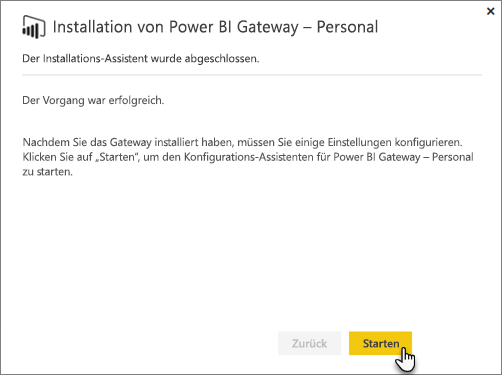
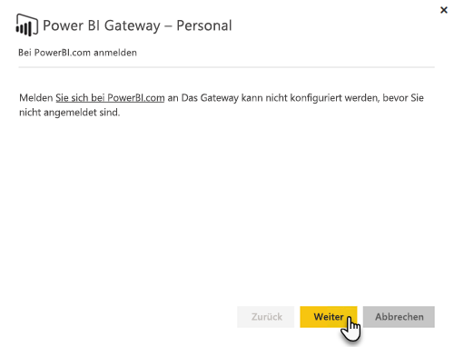
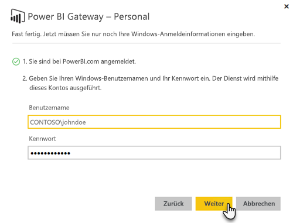

# Lokales Datengateway

Das lokale Datengateway fungiert als Brücke, da es eine schnelle und sichere Datenübertragung zwischen lokalen Daten (Daten außerhalb der Cloud) und den Power BI-, Microsoft Flow-, Logic Apps- und PowerApps-Diensten bereitstellt.

Sie können ein einziges Gateway gleichzeitig für verschiedene Dienste verwenden. Wenn Sie sowohl Power BI als auch PowerApps verwenden, können Sie dasselbe Gateway für beide verwenden. Das ist von dem Konto abhängig, mit dem Sie sich anmelden.

> [!NOTE]
> Das lokale Datengateway implementiert Datenkomprimierung sowie Transportverschlüsselung in allen Modi.

<!-- Shared Requirements Include -->
[!INCLUDE [gateway-onprem-requirements-include](./includes/gateway-onprem-requirements-include.md)]

### Einschränkungen der Liveverbindungen von Analysis Services

Sie können eine Liveverbindung für tabellarische oder mehrdimensionale Instanzen verwenden.

| **Serverversion** | **Erforderliche SKU** |
| --- | --- |
| 2012 SP1 CU4 oder höher |Business Intelligence und Enterprise SKU |
| 2014 |Business Intelligence und Enterprise SKU |
| 2016 |Standard-SKU oder höher |

* Die Formatierung auf Zellenebene sowie Übersetzungsfunktionen werden nicht unterstützt.
* Aktionen und benannte Mengen werden nicht für Power BI verfügbar gemacht. Dennoch können Sie eine Verbindung mit mehrdimensionalen Cubes herstellen, die auch Aktionen oder benannte Mengen enthalten, und Sie können entsprechende Visualisierungen und Berichte erstellen.

<!-- Shared Install steps Include -->
[!INCLUDE [gateway-onprem-datasources-include](./includes/gateway-onprem-datasources-include.md)]

## Herunterladen und Installieren von On-premises Data Gateway

Klicken Sie im Menü „Downloads“ auf **Datengateway**, um das Gateway herunterzuladen. Laden Sie [On-premises data gateway](http://go.microsoft.com/fwlink/?LinkID=820925) herunter.

Beachten Sie, dass Sie das lokale Datengateway aktualisieren, indem Sie das Gateway erneut installieren, wie in diesem Abschnitt beschrieben. Wenn Sie eine neuere Version des Gateways installieren, bleiben Ihre bestehenden Einstellungen erhalten. Wenn Sie die gleiche Version installieren, gilt das als komplette Neuinstallation. Das heißt, Ihre Einstellungen werden nicht übernommen.

<!-- Shared Install steps Include -->
[!INCLUDE [gateway-onprem-install-include](./includes/gateway-onprem-install-include.md)]

## Installieren Sie das Gateway im Modus „Persönliches Gateway“.

> [!NOTE]
> Die persönliche Version des Gateways funktioniert nur mit Power BI.

Nach der Installation des persönlichen Gateways müssen Sie den **Konfigurations-Assistenten für Power BI Gateway – Personal** starten.

Sie müssen sich anschließend bei Power BI anmelden, um das Gateway bei dem Clouddienst zu registrieren.

Sie müssen auch den Windows-Benutzernamen und das Windows-Kennwort angeben, die der Windows-Dienst verwenden wird. Sie können ein anderes Windows-Konto als Ihr eigenes angeben. Der Gatewaydienst wird mithilfe dieses Kontos ausgeführt.

Nachdem die Installation abgeschlossen ist, müssen Sie Ihre Datasets in Power BI aufrufen und unbedingt die Anmeldeinformationen für Ihre lokalen Datenquellen eingeben.

## Speichern von verschlüsselten Anmeldeinformationen in der Cloud

Beim Hinzufügen einer Datenquelle für das Gateway müssen Sie für diese Datenquelle Anmeldeinformationen angeben. Alle Abfragen der Datenquelle werden mithilfe dieser Anmeldeinformationen durchgeführt. Die Anmeldeinformationen werden mithilfe einer asymmetrischen Verschlüsselung vor der Speicherung in der Cloud sicher verschlüsselt, sodass sie in der Cloud nicht entschlüsselt werden können. Die Anmeldeinformationen werden an den lokalen Computer gesendet, der das Gateway ausführt, und auf diesem beim Zugriff auf die Daten entschlüsselt.

<!-- Account and Port information -->
[!INCLUDE [gateway-onprem-accounts-ports-more](./includes/gateway-onprem-accounts-ports-more.md)]

<!-- How the gateway works -->
[!INCLUDE [gateway-onprem-how-it-works-include](./includes/gateway-onprem-how-it-works-include.md)]

## Einschränkungen und Überlegungen

* [Azure Information Protection](https://docs.microsoft.com/microsoft-365/enterprise/protect-files-with-aip
) wird derzeit nicht unterstützt.
* [Access Online](https://products.office.com/en-us/access) wird derzeit nicht unterstützt.
* R-Skripts werden nur dann unterstützt, wenn das Gateway im persönlichen Modus ausgeführt wird.

## Verwaltung auf Mandantenebene

Als Mandantenadministrator können Sie alle in Ihrem Mandanten installierten lokalen Datengateways anzeigen und verwalten. Diese Funktion ist derzeit in der öffentlichen Vorschauversion verfügbar. Weitere Informationen finden Sie in der Dokumentation des [Power Platform Admin Center](/power-platform/admin/onpremises-data-gateway-management).

Alternativ wird Mandantenadministratoren empfohlen, die Benutzer der Organisation darum zu bitten, sie zu jedem installierten Gateway als Administrator hinzuzufügen. Dadurch können alle Gateways der Organisation über die Seite „Gatewayeinstellungen“ oder über [PowerShell-Befehle](service-gateway-high-availability-clusters.md#powershell-support-for-gateway-clusters) verwaltet werden. 

## Aktivieren von ausgehenden Azure-Verbindungen

Das lokale Datengateway nutzt den Azure Service Bus für die Cloudverbindung und stellt gleichzeitig ausgehende Verbindungen zu seiner zugeordneten Azure-Region her. In der Standardeinstellung ist dies der Speicherort Ihres Power BI-Mandanten. Weitere Informationen finden Sie unter [Wo befindet sich mein Power BI-Mandant?](https://powerbi.microsoft.com/en-us/documentation/powerbi-admin-where-is-my-tenant-located/)
Wenn ausgehende Verbindungen von einer Firewall blockiert werden, müssen Sie die Firewall so konfigurieren, dass sie ausgehende Verbindungen vom lokalen Datengateway zu seiner zugeordneten Azure-Region zulässt. Auf der Seite zu [Microsoft Azure Datacenter-IP-Bereichen](https://www.microsoft.com/download/details.aspx?id=41653) finden Sie Details zu den IP-Adressbereichen jedes Azure-Rechenzentrums.
> [!NOTE]
> Die IP-Adressbereiche können sich mit der Zeit ändern, laden Sie also regelmäßig die neuesten Informationen herunter. 

## Problembehandlung

Sollten beim Installieren und Konfigurieren eines Gateways Probleme auftreten, lesen Sie [Problembehandlung beim lokalen Datengateway](service-gateway-onprem-tshoot.md). Wenn Sie glauben, dass ein Problem bei Ihrer Firewall aufgetreten ist, lesen Sie den Abschnitt [Firewall or Proxy](service-gateway-onprem-tshoot.md#firewall-or-proxy) (Firewall oder Proxy) im Artikel zur Problembehandlung.

Wenn Sie der Meinung sind, dass Proxyprobleme mit dem Gateway vorliegen, finden Sie weitere Informationen unter [Konfigurieren von Proxyeinstellungen für Power BI-Gateways](service-gateway-proxy.md).

## Nächste Schritte

[Verwalten Ihrer Datenquelle – Analysis Services](service-gateway-enterprise-manage-ssas.md)  
[Verwalten Ihrer Datenquelle –SAP HANA](service-gateway-enterprise-manage-sap.md)  
[Verwalten Ihrer Datenquelle – SQL Server](service-gateway-enterprise-manage-sql.md)  
[Verwalten der Datenquelle – Oracle](service-gateway-onprem-manage-oracle.md)  
[Verwalten der Datenquelle – Import/Geplante Aktualisierung](service-gateway-enterprise-manage-scheduled-refresh.md)  
[Ausführliche Informationen zum lokalen Datengateway](service-gateway-onprem-indepth.md)  
[Lokales Datengateway (persönlicher Modus) – die neue Version des persönlichen Gateways](service-gateway-personal-mode.md)  
[Konfigurieren von Proxyeinstellungen für das lokale Datengateway](service-gateway-proxy.md)  

Weitere Fragen? [Wenden Sie sich an die Power BI-Community](http://community.powerbi.com/)
