# <a name="tutorial-connect-to-on-premises-data-in-sql-server"></a>Tutorial: Herstellen einer Verbindung mit lokalen Daten in SQL Server

Ein lokales Datengateway ist eine Softwareanwendung, die Sie in einem lokalen Netzwerk installieren. Es ermöglicht Zugriff auf Daten in diesem Netzwerk. In diesem Tutorial erstellen Sie einen Bericht in Power BI Desktop basierend auf Beispieldaten, die aus SQL Server importiert wurden. Danach veröffentlichen Sie den Bericht im Power BI-Dienst und konfigurieren ein Gateway, sodass der Dienst auf die lokalen Daten zugreifen kann. Dieser Zugriff bedeutet, dass der Dienst die Daten aktualisieren kann, um den Bericht auf dem neuesten Stand zu halten.

In diesem Tutorial erhalten Sie Informationen zu den folgenden Vorgängen:
> [!div class="checklist"]
> * Erstellen eines Berichts aus Daten in SQL Server
> * Veröffentlichen des Berichts im Power BI-Dienst
> * Hinzufügen von SQL Server als Gatewaydatenquelle
> * Aktualisieren der Daten im Bericht

Wenn Sie noch nicht bei Power BI registriert sind, müssen Sie sich zuerst für eine [kostenlose Testversion registrieren](https://app.powerbi.com/signupredirect?pbi_source=web).


## <a name="prerequisites"></a>Voraussetzungen

* [Installieren von Power BI Desktop](https://powerbi.microsoft.com/desktop/)
* [Installieren von SQL Server](https://docs.microsoft.com/sql/database-engine/install-windows/install-sql-server) auf einem lokalen Computer 
* [Installieren eines lokalen Datengateways](service-gateway-install.md) auf demselben lokalen Computer (in Produktionsumgebung würde es sich in der Regel um einen anderen Computer handeln)


## <a name="set-up-sample-data"></a>Einrichten von Beispieldaten

Als Erstes fügen Sie Beispieldaten zu SQL Server hinzu, um diese im Rest des Tutorials verwenden zu können.

1. Stellen Sie in SQL Server Management Studio (SSMS) eine Verbindung mit Ihrer SQL Server-Instanz her, und erstellen Sie eine Testdatenbank.

    ```sql
    CREATE DATABASE TestGatewayDocs
    ```

2. Fügen Sie in der erstellten Datenbank eine Tabelle hinzu, und fügen Sie Daten ein.

    ```sql
    USE TestGatewayDocs

    CREATE TABLE Product (
        SalesDate DATE,
        Category  VARCHAR(100),
        Product VARCHAR(100),
        Sales MONEY,
        Quantity INT
    )

    INSERT INTO Product VALUES('2018-05-05','Accessories','Carrying Case',9924.60,68)
    INSERT INTO Product VALUES('2018-05-06','Accessories','Tripod',1350.00,18)
    INSERT INTO Product VALUES('2018-05-11','Accessories','Lens Adapter',1147.50,17)
    INSERT INTO Product VALUES('2018-05-05','Accessories','Mini Battery Charger',1056.00,44)
    INSERT INTO Product VALUES('2018-05-06','Accessories','Telephoto Conversion Lens',1380.00,18)
    INSERT INTO Product VALUES('2018-05-06','Accessories','USB Cable',780.00,26)
    INSERT INTO Product VALUES('2018-05-08','Accessories','Budget Movie-Maker',3798.00,9)
    INSERT INTO Product VALUES('2018-05-09','Digital video recorder','Business Videographer',10400.00,13)
    INSERT INTO Product VALUES('2018-05-10','Digital video recorder','Social Videographer',3000.00,60)
    INSERT INTO Product VALUES('2018-05-11','Digital','Advanced Digital',7234.50,39)
    INSERT INTO Product VALUES('2018-05-07','Digital','Compact Digital',10836.00,84)
    INSERT INTO Product VALUES('2018-05-08','Digital','Consumer Digital',2550.00,17)
    INSERT INTO Product VALUES('2018-05-05','Digital','Slim Digital',8357.80,44)
    INSERT INTO Product VALUES('2018-05-09','Digital SLR','SLR Camera 35mm',18530.00,34)
    INSERT INTO Product VALUES('2018-05-07','Digital SLR','SLR Camera',26576.00,88)
    ```

3. Wählen Sie die Daten in der Tabelle aus, um sie zu überprüfen.

    ```sql
    SELECT * FROM Product
    ```

    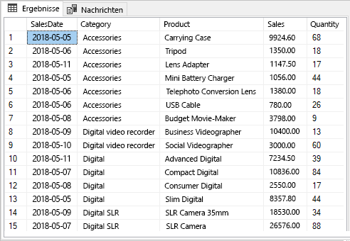


## <a name="build-and-publish-a-report"></a>Erstellen und Veröffentlichen eines Berichts

Nachdem Sie jetzt über Beispieldaten verfügen, mit denen Sie arbeiten können, stellen Sie als Nächstes in Power BI Desktop eine Verbindung mit SQL Server her und erstellen einen Bericht basierend auf diesen Daten. Dann veröffentlichen Sie den Bericht im Power BI-Dienst.

1. Klicken Sie in Power BI Desktop auf der Registerkarte **Start** auf **Daten abrufen** > **SQL Server**.

2. Geben Sie unter **Server** den Namen Ihres Servers und unter **Datenbank** den Namen „TestGatewayDocs“ ein. Wählen Sie **OK**aus. 

    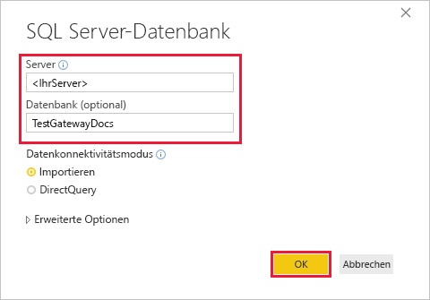

3. Überprüfen Sie Ihre Anmeldeinformationen, und klicken Sie auf **Verbinden**.

4. Wählen Sie im **Navigator** die Tabelle **Product** aus, und klicken Sie auf **Laden**.

    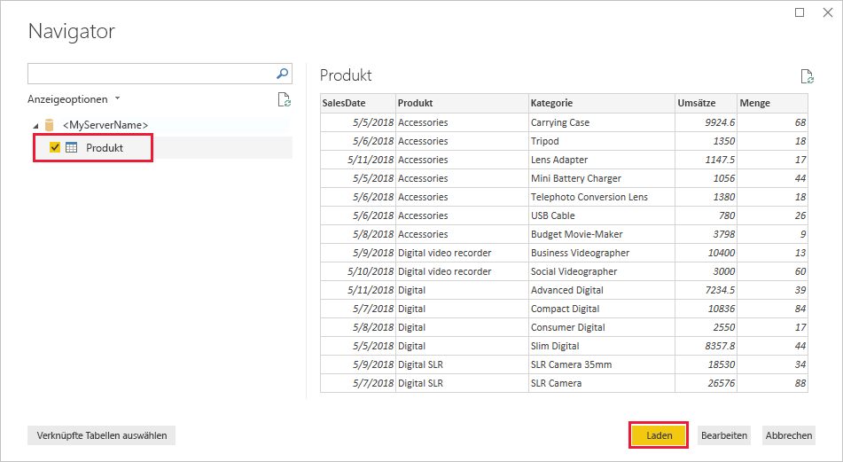

5. Wählen Sie in der Power BI Desktop-Ansicht **Bericht** im Bereich **Visualisierungen** die Option **Gestapeltes Säulendiagramm** aus.

    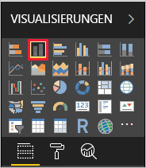    

6. Wenn in der Berichtscanvas das Säulendiagramm ausgewählt ist, wählen Sie im Bereich **Felder** die Felder **Category** und **Sales** aus.  

    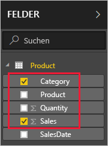

    Das Diagramm sollte nun wie folgt aussehen.

    

    Beachten Sie, dass **SLR Camera** aktuell die höchsten Verkaufszahlen aufweist. Das wird sich ändern, wenn Sie die Daten und den Bericht später in diesem Tutorial aktualisieren.

7. Speichern Sie den Bericht mit dem Namen „TestGatewayDocs.pbix“.

8. Klicken Sie auf der Registerkarte **Start** nacheinander auf **Veröffentlichen** > **Mein Arbeitsbereich** > **Auswählen**. Melden Sie sich beim Power BI-Dienst an, wenn Sie dazu aufgefordert werden. 

    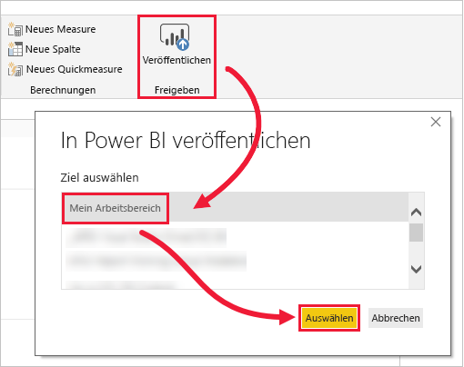

9. Wählen Sie auf dem Bildschirm **Erfolg** die Option **„TestGatewayDocs.pbix“ in Power BI öffnen** aus.


## <a name="add-sql-server-as-a-gateway-data-source"></a>Hinzufügen von SQL Server als Gatewaydatenquelle

In Power BI Desktop stellen Sie eine direkte Verbindung mit SQL Server her, aber der Power BI-Dienst erfordert ein Gateway, das als Brücke fungiert. Jetzt fügen Sie Ihre SQL Server-Instanz als Datenquelle für das Gateway hinzu, das Sie in einem früheren Artikel (siehe [Voraussetzungen](#prerequisites)) erstellt haben. 

1. Klicken Sie in der oberen rechten Ecke des Power BI-Diensts auf das Zahnradsymbol  und dann auf **Gateways verwalten**.

    

2. Wählen Sie **Datenquelle hinzufügen** aus, und geben Sie „test-sql-source“ als **Datenquellennamen** ein.

    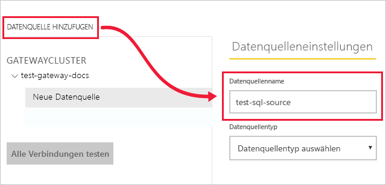

3. Wählen Sie **SQL Server** als **Datenquellentyp** aus, und geben Sie weitere Werte ein, wie hier gezeigt.

    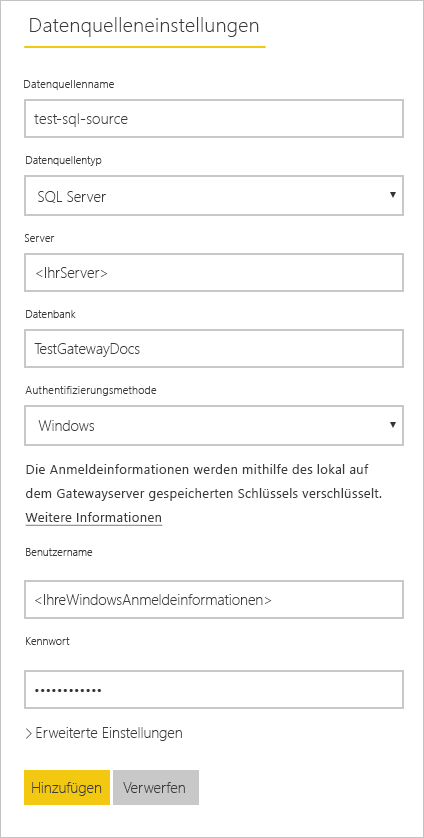


   |          Option           |                                               Wert                                                |
   |---------------------------|----------------------------------------------------------------------------------------------------|
   |   **Datenquellenname**    |                                          test-sql-source                                           |
   |   **Datenquellentyp**    |                                             SQL Server                                             |
   |        **Server**         | Der Name Ihrer SQL Server-Instanz (muss mit der Angabe in Power BI Desktop identisch sein) |
   |       **Datenbank**        |                                          TestGatewayDocs                                           |
   | **Authentifizierungsmethode** |                                              Windows                                               |
   |       **Benutzername**        |             Das Konto zum Herstellen der Verbindung mit SQL Server, z.B. michael@contoso.com             |
   |       **Kennwort**        |                   Das Kennwort für das Konto zum Herstellen der Verbindung mit SQL Server                    |


4. Wählen Sie **Hinzufügen**. Bei erfolgreicher Ausführung wird *Die Verbindung wurde hergestellt.* angezeigt.

    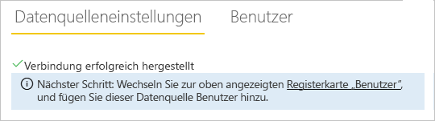

    Sie können diese Datenquelle jetzt verwenden, um Daten aus SQL Server in Ihre Power BI-Dashboards und -Berichte einzubinden.


## <a name="configure-and-use-data-refresh"></a>Konfigurieren und Verwenden der Datenaktualisierung

Sie haben einen Bericht im Power BI-Dienst veröffentlicht und die SQL Server-Datenquelle konfiguriert. Jetzt nehmen Sie eine Änderung an der Tabelle „Product“ vor. Diese Änderung wird über das Gateway an den veröffentlichten Bericht geleitet. Sie konfigurieren auch geplante Aktualisierungen, um zukünftige Änderungen zu verarbeiten.

1. Aktualisieren Sie in SSMS die Daten in der Tabelle „Product“.

    ```sql
    UPDATE Product
    SET Sales = 32508, Quantity = 252
    WHERE Product='Compact Digital'     

    ```

2. Wählen Sie im Power BI-Dienst im linken Navigationsbereich die Option **Mein Arbeitsbereich** aus.

3. Klicken Sie unter **Datasets** für das Dataset **TestGatewayDocs** auf **Mehr** (**...**) > **Jetzt aktualisieren**.

    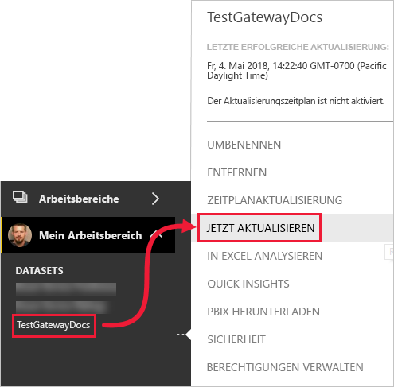

4. Wählen Sie **Mein Arbeitsbereich** > **Berichte** > **TestGatewayDocs** aus. Sie sehen, dass die Aktualisierung übertragen wurde und jetzt **Compact Digital** die Verkaufszahlen anführt. 

    

5. Wählen Sie **Mein Arbeitsbereich** > **Berichte** > **TestGatewayDocs** aus. Klicken Sie auf **Mehr** (**...**) > **Aktualisierung planen**.

6. Legen Sie unter **Aktualisierung planen** die Aktualisierung auf **Ein** fest, und klicken Sie dann auf **Anwenden**. Das Dataset wird standardmäßig täglich aktualisiert.

    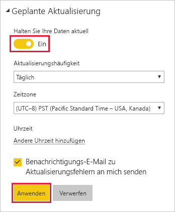

## <a name="clean-up-resources"></a>Bereinigen von Ressourcen
Wenn Sie die Beispieldaten nicht mehr verwenden möchten, führen Sie `DROP DATABASE TestGatewayDocs` in SSMS aus. Wenn Sie die SQL Server-Datenquelle nicht mehr verwenden möchten, [entfernen Sie die Datenquelle](service-gateway-manage.md#remove-a-data-source). 


## <a name="next-steps"></a>Nächste Schritte
In diesem Tutorial haben Sie Informationen zu den folgenden Vorgängen erhalten:
> [!div class="checklist"]
> * Erstellen eines Berichts aus Daten in SQL Server
> * Veröffentlichen des Berichts im Power BI-Dienst
> * Hinzufügen von SQL Server als Gatewaydatenquelle
> * Aktualisieren der Daten im Bericht

Fahren Sie mit dem nächsten Artikel fort, um mehr zu erfahren.
> [!div class="nextstepaction"]
> [Verwalten eines Power BI-Gateways](service-gateway-manage.md)

