# <a name="use-kerberos-for-single-sign-on-sso-from-power-bi-to-on-premises-data-sources"></a>Verwenden von Kerberos für SSO (Single Sign-On, Einmaliges Anmelden) von Power BI bei lokalen Datenquellen

Verwenden Sie die [eingeschränkte Kerberos-Delegierung](https://technet.microsoft.com/library/jj553400.aspx), um eine nahtlose Konnektivität für das einmalige Anmelden zu ermöglichen. Durch das Aktivieren von SSO für Power BI-Berichte und -Dashboards können Daten aus lokalen Datenquellen einfacher aktualisiert werden.

## <a name="supported-data-sources"></a>Unterstützte Datenquellen

Folgende Datenquellen werden derzeit unterstützt:

* SQL Server
* SAP HANA
* SAP BW
* Teradata
* Spark
* Impala

Außerdem wird SAP HANA mit [Security Assertion Markup Language (SAML)](service-gateway-sso-saml.md) unterstützt.

### <a name="sap-hana"></a>SAP HANA

Gehen Sie folgendermaßen vor, um SSO für SAP HANA zu aktivieren:

* Vergewissern Sie sich, dass auf dem SAP HANA-Server die erforderliche Mindestversion ausgeführt wird, die von der Plattformebene Ihres SAP HANA-Servers abhängig ist:
  * [HANA 2 SPS 01 Rev 012.03](https://launchpad.support.sap.com/#/notes/2557386)
  * [HANA 2 SPS 02 Rev 22](https://launchpad.support.sap.com/#/notes/2547324)
  * [HANA 1 SP 12 Rev 122.13](https://launchpad.support.sap.com/#/notes/2528439)
* Installieren Sie auf dem Gatewaycomputer den aktuellen HANA-ODBC-Treiber von SAP.  Die Mindestversion ist die HANA-ODBC-Version 2.00.020.00 vom August 2017.

Weitere Informationen zum Einrichten und Konfigurieren des einmaligen Anmeldens für SAP HANA mithilfe von Kerberos finden Sie im SAP HANA Security Guide im Thema [Single Sign-On Using Kerberos (Einmaliges Anmelden mithilfe von Kerberos)](https://help.sap.com/viewer/b3ee5778bc2e4a089d3299b82ec762a7/2.0.03/en-US/1885fad82df943c2a1974f5da0eed66d.html) und unter den Links auf dieser Seite, insbesondere SAP Note 1837331 – HOWTO HANA DBSSO Kerberos/Active Directory.

## <a name="preparing-for-kerberos-constrained-delegation"></a>Vorbereiten für die eingeschränkte Kerberos-Delegierung

Für die ordnungsgemäße Funktion der eingeschränkten Kerberos-Delegierung müssen verschiedene Elemente konfiguriert werden, u.a. *Dienstprinzipalnamen* (SPN) und Delegierungseinstellungen für Dienstkonten.

### <a name="prerequisite-1-install--configure-the-on-premises-data-gateway"></a>Voraussetzung 1: Installieren und Konfigurieren des lokalen Datengateways

Diese Version des lokalen Datengateways unterstützt das direkte Upgrade sowie die Übernahme der Einstellungen von vorhandenen Gateways.

### <a name="prerequisite-2-run-the-gateway-windows-service-as-a-domain-account"></a>Voraussetzung 2: Ausführen des Gateway-Windows-Diensts als Domänenkonto

In einer Standardinstallation wird das Gateway als Dienstkonto des lokalen Computers (speziell *NT Service\PBIEgwService*) ausgeführt; siehe folgende Abbildung:

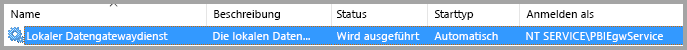

Zum Aktivieren der **eingeschränkten Kerberos-Delegierung** muss das Gateway als Domänenkonto ausgeführt werden, es sei denn, Ihr Azure AD ist bereits mit dem lokalen Active Directory synchronisiert (mit Azure AD DirSync/Connect). Wenn Sie das Konto in ein Domänenkonto ändern müssen, finden Sie im Verlauf dieses Artikels weitere Informationen unter [Switching the gateway to a domain account (Umstellen des Gateways auf ein Domänenkonto)](#switching-the-gateway-to-a-domain-account).

> [!NOTE]
> Wenn Azure AD DirSync/Connect konfiguriert ist und Benutzerkonten synchronisiert sind, muss der Gatewaydienst keine lokalen AD-Suchvorgänge zur Laufzeit ausführen, und Sie können die lokale Dienst-SID (statt eines Domänenkontos) für den Gatewaydienst verwenden. Die in diesem Artikel beschriebenen Schritte für die Konfiguration der eingeschränkten Kerberos-Delegierung sind identisch mit den Schritten dieser Konfiguration (sie werden lediglich auf das Computerobjekt des Gateways in Active Directory angewendet und nicht auf das Domänenkonto).

### <a name="prerequisite-3-have-domain-admin-rights-to-configure-spns-setspn-and-kerberos-constrained-delegation-settings"></a>Voraussetzung 3: Vorhandene Domänenadministratorrechte zum Konfigurieren von SPNs (SetSPN) und Einstellungen für die eingeschränkte Kerberos-Delegierung

Der Domänenadministrator kann anderen Personen zwar vorübergehend oder dauerhaft Rechte zum Konfigurieren von SPNs und der Kerberos-Delegierung gewähren, ohne dass dafür Domänenadministratorrechte benötigt werden, diese Vorgehensweise ist jedoch nicht ratsam. Im folgenden Abschnitt werden die erforderlichen Schritte für **Voraussetzung 3** ausführlich erläutert.

## <a name="configuring-kerberos-constrained-delegation-for-the-gateway-and-data-source"></a>Konfigurieren der eingeschränkten Kerberos-Delegierung für das Gateway und die Datenquelle

Um das System ordnungsgemäß zu konfigurieren, müssen die folgenden zwei Elemente konfiguriert bzw. überprüft werden:

1. Konfigurieren Sie ggf. einen SPN für das Domänenkonto des Gatewaydiensts.

2. Konfigurieren Sie Delegierungseinstellungen für das Domänenkonto des Gatewaydiensts.

Beachten Sie, dass Sie zum Ausführen dieser beiden Konfigurationsschritte Domänenadministrator sein müssen.

In den folgenden Abschnitten werden diese Schritte beschrieben.

### <a name="configure-an-spn-for-the-gateway-service-account"></a>Konfigurieren eines SPN für das Gatewaydienstkonto

Bestimmen Sie zunächst, ob bereits ein SPN für das Domänenkonto erstellt wurde, das als Gatewaydienstkonto verwendet wird; führen Sie dabei jedoch diese Schritte aus:

1. Starten Sie **Active Directory-Benutzer und -Computer** als Domänenadministrator.

2. Klicken Sie mit der rechten Maustaste auf die Domäne, wählen Sie **Suchen** aus, und geben Sie den Kontonamen des Gatewaydienstkontos ein.

3. Klicken Sie im Suchergebnis mit der rechten Maustaste auf das Gatewaydienstkonto, und wählen Sie **Eigenschaften** aus.

4. Wenn im Dialogfeld **Eigenschaften** die Registerkarte **Delegierung** angezeigt wird, wurde bereits ein SPN erstellt, und Sie können mit dem nächsten Unterabschnitt zum Konfigurieren der Delegierungseinstellungen fortfahren.

    Ist im Dialogfeld **Eigenschaften** keine Registerkarte **Delegierung** vorhanden, können Sie manuell einen SPN für das Konto erstellen, wodurch die Registerkarte **Delegierung** hinzugefügt wird (mit dieser können Sie Delegierungseinstellungen am einfachsten konfigurieren). Sie können einen SPN mit dem [setspn-Tool](https://technet.microsoft.com/library/cc731241.aspx) von Windows erstellen (Sie benötigen Domänenadministratorrechte, um den SPN zu erstellen).

    Angenommen, das Gatewaydienstkonto heißt „PBIEgwTest\GatewaySvc“, während der Name des Computers, auf dem der Gatewaydienst ausgeführt wird, **Machine1** lautet. Zum Festlegen des SPN für das Gatewaydienstkonto für den Computer in diesem Beispiel führen Sie den folgenden Befehl aus:

    

    Ist dieser Schritt abgeschlossen, können wir mit dem Konfigurieren von Delegierungseinstellungen fortfahren.

### <a name="configure-delegation-settings-on-the-gateway-service-account"></a>Konfigurieren von Delegierungseinstellungen für das Gatewaydienstkonto

Die zweite Konfigurationsvoraussetzung sind die Delegierungseinstellungen für das Gatewaydienstkonto. Es gibt verschiedene Tools, mit denen Sie diese Schritte ausführen können. In diesem Artikel verwenden wir **Active Directory-Benutzer und -Computer**, ein Snap-In der MMC (Microsoft Management Console), mit dem Sie Informationen im Verzeichnis verwalten und veröffentlichen können. Es ist auf Domänencontrollern standardmäßig verfügbar. Sie können es über die Konfiguration von **Windows-Funktionen** auf anderen Computern aktivieren.

Wir müssen die **eingeschränkte Kerberos-Delegierung** mit Protokollübertragung konfigurieren. Bei der eingeschränkten Delegierung müssen Sie explizit angeben, an welche Dienste die Delegierung erfolgen soll. Nur Ihr Server von SQL Server oder SAP HANA akzeptiert beispielsweise Delegierungsaufrufe vom Gatewaydienstkonto.

In diesem Abschnitt wird davon ausgegangen, dass Sie bereits SPNs für die zugrunde liegenden Datenquellen (wie SQL Server, SAP HANA, Teradata, Spark usw.) konfiguriert haben. Informationen zum Konfigurieren der SPNs für diese Datenquellenserver finden Sie in der technischen Dokumentation für den jeweiligen Datenbankserver. Sie können auch den Blogbeitrag mit dem Abschnitt [*What SPN does your app require?*](https://blogs.msdn.microsoft.com/psssql/2010/06/23/my-kerberos-checklist/) (Welchen SPN benötigt Ihre App?) lesen.

In den folgenden Schritten wird davon ausgegangen, dass Sie eine lokale Umgebung mit zwei Computern besitzen: einem Gatewaycomputer und einem Datenbankserver, der SQL Server ausführt. Für dieses Beispiel wird ebenfalls von folgenden Einstellungen und Namen ausgegangen:

* Gatewaycomputername: **PBIEgwTestGW**
* Gatewaydienstkonto: **PBIEgwTest\GatewaySvc** (Kontoanzeigename: Gateway Connector)
* Computername der SQL Server-Datenquelle: **PBIEgwTestSQL**
* Dienstkonto der SQL Server-Datenquelle: **PBIEgwTest\SQLService**

Für diese Beispielnamen und -einstellungen sind folgende Konfigurationsschritte auszuführen:

1. Starten Sie mit Domänenadministratorrechten **Active Directory-Benutzer und -Computer**.

2. Klicken Sie mit der rechten Maustaste auf das Gatewaydienstkonto (**PBIEgwTest\GatewaySvc**), und wählen Sie **Eigenschaften** aus.

3. Wählen Sie die Registerkarte **Delegierung** aus.

4. Wählen Sie **Computer nur bei Delegierungen angegebener Dienste vertrauen** aus.

5. Wählen Sie dann **Beliebiges Authentifizierungsprotokoll verwenden** aus.

6. Klicken Sie unter **Dienste, für die dieses Konto delegierte Anmeldeinformationen verwenden kann** auf **Hinzufügen**.

7. Wählen Sie im Dialogfeld „Neu“ **Benutzer oder Computer** aus.

8. Geben Sie das Dienstkonto für den SQL Server-Datenbankdienst (**PBIEgwTest\SQLService**) ein, und klicken Sie auf **OK**.

9. Wählen Sie den SPN aus, den Sie für den Datenbankserver erstellt haben. In unserem Beispiel beginnt der SPN mit **MSSQLSvc**. Wenn Sie sowohl den FQDN als auch den NetBIOS-SPN für den Datenbankdienst hinzugefügt haben, wählen Sie beide aus. Ggf. wird nur einer angezeigt.

10. Klicken Sie auf **OK**. Der SPN sollte jetzt in der Liste angezeigt werden.

11. Wahlweise können Sie **Erweitert** auswählen, um den FQDN und den NetBIOS-SPN anzuzeigen.

12. Das angezeigte Dialogfeld ähnelt Folgenden, wenn Sie **Erweitert** aktiviert haben. Wählen Sie **OK**aus.

    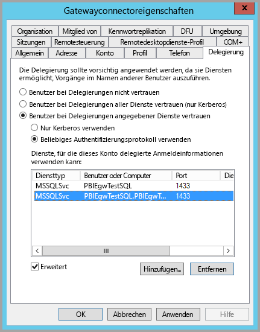

Schließlich muss dem Gatewaydienstkonto auf dem Computer, auf dem der Gatewaydienst (**PBIEgwTestGW** in unserem Beispiel) ausgeführt werden, die lokale Richtlinie „Annehmen der Clientidentität nach Authentifizierung“ gewährt werden. Sie können dies mit dem lokalen Gruppenrichtlinien-Editor (**gpedit**) ausführen/überprüfen.

1. Führen Sie auf dem Gatewaycomputer Folgendes aus: *gpedit.msc*

1. Navigieren Sie zu **Richtlinie für „Lokaler Computer“ > Computerkonfiguration > Windows-Einstellungen > Sicherheitseinstellungen > Lokale Richtlinien > Zuweisen von Benutzerrechten**, wie in der folgenden Abbildung veranschaulicht.

    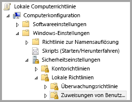

1. Wählen Sie in der Liste der Richtlinien unter **Zuweisen von Benutzerrechten** den Eintrag **Annehmen der Clientidentität nach Authentifizierung** aus.

    

    Klicken Sie mit der rechten Maustaste, und öffnen Sie das Dialogfeld **Eigenschaften** für **Annehmen der Clientidentität nach Authentifizierung**, und überprüfen Sie die Liste der Konten. Sie muss das Gatewaydienstkonto (**PBIEgwTest\GatewaySvc**) enthalten.

1. Wählen Sie in der Liste der Richtlinien unter **Zuweisen von Benutzerrechten** den Eintrag **Als Teil des Betriebssystems fungieren (SeTcbPrivilege)** aus. Vergewissern Sie sich, dass das Gatewaydienstkonto auch in der Liste der Konten aufgeführt wird.

1. Starten Sie den Dienstprozess **Lokales Datengateway** neu.

Wenn Sie SAP HANA verwenden, wird empfohlen, diese zusätzlichen Schritte durchzuführen, um die Leistung geringfügig zu verbessern.

1. Suchen Sie im Installationsverzeichnis des Gateways folgende Konfigurationsdatei, und öffnen Sie diese: *Microsoft.PowerBI.DataMovement.Pipeline.GatewayCore.dll.config*.

1. Suchen Sie die Eigenschaft *FullDomainResolutionEnabled*, und ändern Sie ihren Wert in *True*.

    ```xml
    <setting name=" FullDomainResolutionEnabled " serializeAs="String">
          <value>True</value>
    </setting>
    ```

## <a name="running-a-power-bi-report"></a>Ausführen eines Power BI-Berichts

Nachdem alle zuvor in diesem Artikel beschriebenen Konfigurationsschritte ausgeführt wurden, können Sie auf der Seite **Gateways verwalten** in Power BI die Datenquelle konfigurieren. Anschließend können Sie unter **Erweiterte Einstellungen** SSO aktivieren, um Berichte und Datasets zu veröffentlichen, die an diese Datenquelle gebunden sind.

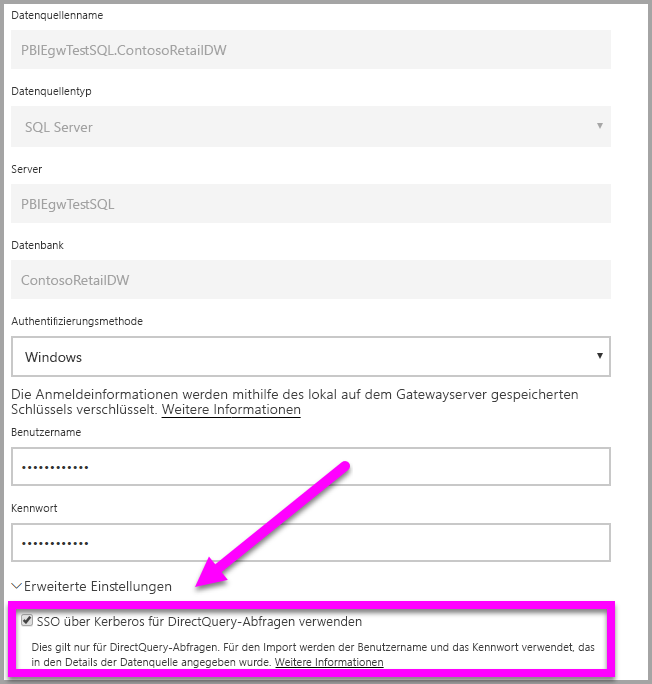

Diese Konfiguration funktioniert in den meisten Fällen. Bei Kerberos können jedoch je nach Umgebung unterschiedliche Konfigurationen vorhanden sein. Wenn der Bericht immer noch nicht geladen wird, wenden Sie sich an Ihren Domänenadministrator, um das Problem zu untersuchen.

## <a name="switching-the-gateway-to-a-domain-account"></a>Umstellen des Gateways auf ein Domänenkonto

An früherer Stelle in diesem Artikel wurde das Umstellen des Gateways von einem lokalen Dienstkonto auf die Ausführung als Domänenkonto beschrieben; hierbei wurde die Benutzeroberfläche des **lokalen Datengateways** verwendet. Im Folgenden werden die dazu benötigten Schritte erläutert.

1. Starten Sie das Konfigurationstool **Lokales Datengateway**.

   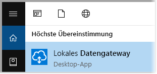

2. Klicken Sie auf der Hauptseite auf die Schaltfläche **Anmelden**, und melden Sie sich mit Ihrem Power BI-Konto an.

3. Wählen Sie nach abgeschlossener Anmeldung die Registerkarte **Diensteinstellungen** aus.

4. Klicken Sie wie in der folgenden Abbildung dargestellt auf **Konto ändern**, um die geführte exemplarische Vorgehensweise zu starten.

   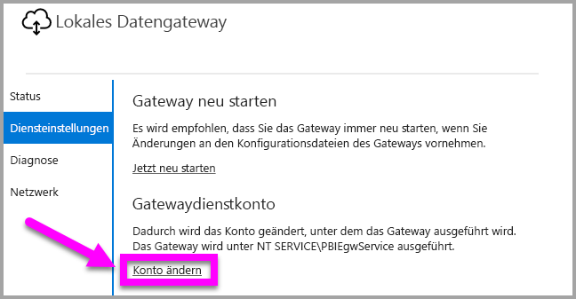

## <a name="configuring-sap-bw-for-sso"></a>Konfigurieren von SAP BW für SSO

Da Sie nun wissen, wie Kerberos mit einem Gateway funktioniert, können Sie SSO für SAP Business Warehouse (SAP BW) konfigurieren. Bei den folgenden Schritten wird vorausgesetzt, dass Sie auf die [eingeschränkte Kerberos-Delegierung](#preparing-for-kerberos-constrained-delegation) vorbereitet sind, die zuvor im Artikel beschrieben wurde.

Dieser Leitfaden wurde so umfassend wie möglich gestaltet. Wenn Sie bereits einige dieser Schritte durchgeführt haben, können Sie sie überspringen: Beispielsweise haben Sie bereits einen Service-Benutzer für Ihren BW-Server erstellt und ihm einen SPN zugeordnet, oder Sie haben die Bibliothek „gsskrb5“ bereits installiert.

### <a name="setup-gsskrb5-on-client-machines-and-the-bw-server"></a>Einrichten von gsskrb5 auf Clientcomputern und dem BW-Server

gsskrb5 muss sowohl vom Client als auch vom Server genutzt werden, damit eine SSO-Verbindung über das Gateway hergestellt werden kann. Die Common Crypto-Bibliothek (sapcrypto) wird derzeit nicht unterstützt.

1. Laden Sie gsskrb5/gx64krb5 von [SAP Note 2115486](https://launchpad.support.sap.com/) (S-User erforderlich) herunter. Versichern Sie sich, dass Sie mindestens Version 1.0.11.x von „gsskrb5.dll“ und „gx64krb5.dll“ besitzen.

1. Speichern Sie die Bibliothek an einem Ort auf Ihrem Gatewaycomputer, auf den Ihre Gatewayinstanz (und SAP GUI, wenn Sie die SSO-Verbindung mithilfe von SAP GUI/Logon testen möchten) zugreifen kann.

1. Legen Sie eine weitere Kopie an einem Ort auf Ihrem BW-Servercomputer ab, auf den der BW-Server zugreifen kann.

1. Legen Sie auf den Client- und Servercomputern die Umgebungsvariablen „SNC\_LIB“ und „SNC\_LIB\_64“ darauf fest, auf die Speicherorte von „gsskrb5.dll“ bzw. „gx64krb5.dll“ zu verweisen.

### <a name="create-a-bw-service-user-and-enable-snc-communication-using-gsskrb5-on-the-bw-server"></a>Erstellen eines BW-Service-Benutzers und Aktivieren der SNC-Kommunikation mit gsskrb5 auf dem BW-Server

Neben der bereits durchgeführten Gatewaykonfiguration gibt es einige zusätzliche Schritte, die für SAP BW spezifisch sind. Im Abschnitt [**Configure delegation settings on the gateway service account (Konfigurieren von Delegierungseinstellungen für das Gatewaydienstkonto)**](#configure-delegation-settings-on-the-gateway-service-account) der Dokumentation wird davon ausgegangen, dass Sie bereits SPNs für die zugrunde liegenden Datenquellen konfiguriert haben. So führen Sie diese Konfiguration für SAP BW durch:

1. Erstellen Sie auf einem Active Directory-Domänencontrollerserver einen Service-Benutzer (zuerst nur einen einfachen Active Directory-Benutzer) für den SAP BW-Anwendungsserver in Ihrer Active Directory-Umgebung. Weisen Sie diesem anschließend einen SPN zu.

    SAP empfiehlt, den SPN mit „SAP/“ zu beginnen, aber auch die Verwendung anderer Präfixe wie z.B. „HTTP/“ sollte möglich sein. Den Rest des Namens können Sie frei wählen. Sie können beispielsweise den Benutzernamen des Service-Benutzers des SAP BW-Servers verwenden. Wenn Sie beispielsweise „BWServiceUser@\<DOMAIN\>“ als Service-Benutzer erstellt haben, können Sie den SPN „SAP/BWServiceUser“ verwenden. Sie können die SPN-Zuordnung beispielsweise mit dem Befehl „setspn“ festlegen. Wenn Sie beispielsweise den SPN für den gerade erstellten Service-Benutzer festlegen möchten, können Sie folgenden Befehl über ein Befehlsfenster auf einem Domänencontrollercomputer ausführen: `setspn -s SAP/ BWServiceUser DOMAIN\ BWServiceUser`. Weitere Informationen finden Sie in der SAP BW-Dokumentation.

1. Erteilen Sie dem Service-Benutzer Zugriff auf Ihren SAP BW-Anwendungsserver:

    1. Fügen Sie auf dem SAP BW-Servercomputer den Service-Benutzer zur lokalen Administratorgruppe für Ihren SAP BW-Server hinzu, indem Sie das Programm „Computerverwaltung“ öffnen und auf die lokale Administratorgruppe für Ihren Server doppelklicken.

        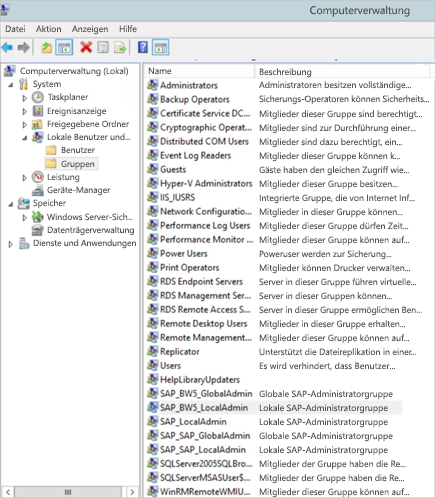

    1. Doppelklicken Sie auf die lokale Administratorgruppe, und klicken Sie auf **Hinzufügen**, um Ihren SAP BW-Service-Benutzer zur Gruppe hinzuzufügen. Verwenden Sie die Schaltfläche **Namen überprüfen**, um sicherzustellen, dass Sie den Namen richtig eingegeben haben. Wählen Sie **OK**aus.

1. Legen Sie den Service-Benutzer des SAP BW-Servers als den Benutzer fest, der den SAP BW-Serverdienst auf dem SAP BW-Servercomputer startet.

    1. Öffnen Sie das Programm „Ausführen“, und geben Sie „Services.msc“ ein. Suchen Sie den Dienst für die Instanz Ihres SAP BW-Anwendungsservers. Klicken Sie mit der rechten Maustaste darauf, und wählen Sie **Eigenschaften** aus.

        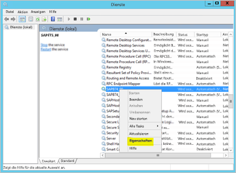

    1. Wechseln Sie zur Registerkarte **Anmelden**, und ändern Sie den Benutzer wie oben angegeben in Ihren SAP BW-Service-Benutzer. Geben Sie das Benutzerkennwort ein, und klicken Sie auf **OK**.

1. Melden Sie sich bei Ihrem Server über SAP GUI/Logon an, und legen Sie folgende Profilparameter mithilfe der Transaktion RZ10 fest:

    1. Legen Sie den Profilparameter „snc/identity/as“ auf „p:\<SAP BW-Service-Benutzer\>“ fest, z.B. p:BWServiceUser@MYDOMAIN.COM. Beachten Sie das „p:“, das dem UPN des Service-Benutzers vorangestellt ist. Das Präfix lautet nicht „p:CN=“, wie bei Verwendung der Common Crypto-Bibliothek als SNC-Bibliothek.

    1. Legen Sie den Profilparameter „snc/gssapi\_lib“ auf \<Pfad zu gsskrb5.dll/gx64krb5.dll auf dem Servercomputer\> (die verwendete Bibliothek hängt von der Bitanzahl des Betriebssystems ab) fest. Achten Sie darauf, die Bibliothek an einem Ort zu speichern, auf den der SAP BW-Anwendungsserver zugreifen kann.

    1. Legen Sie außerdem folgende zusätzliche Profilparameter fest, bei denen Sie den Wert nach Bedarf ändern können. Beachten Sie, dass Clients durch die letzten fünf Optionen eine Verbindung mit dem SAP BW-Server über SAP GUI/Logon herstellen können, ohne dass SNC konfiguriert wurde.

        | **Einstellung** | **Wert** |
        | --- | --- |
        | snc/data\_protection/max | 3 |
        | snc/data\_protection/min | 1 |
        | snc/data\_protection/use | 9 |
        | snc/accept\_insecure\_cpic | 1 |
        | snc/accept\_insecure\_gui | 1 |
        | snc/accept\_insecure\_r3int\_rfc | 1 |
        | snc/accept\_insecure\_rfc | 1 |
        | snc/permit\_insecure\_start | 1 |

    1. Legen Sie die Eigenschaft „snc/enable“ auf 1 fest.

1. Wenn Sie diese Profilparameter festgelegt haben, öffnen Sie die SAP Management Console auf dem Servercomputer, und starten Sie die SAP BW-Instanz neu. Wenn der Server nicht startet, überprüfen Sie erneut, dass Sie die Profilparameter korrekt festgelegt haben. Weitere Informationen zu den Einstellungen für die Profilparameter finden Sie in der [SAP-Dokumentation](https://help.sap.com/saphelp_nw70ehp1/helpdata/en/e6/56f466e99a11d1a5b00000e835363f/frameset.htm). Im Verlauf der Dokumentation finden Sie ebenfalls einen Abschnitt mit Problembehebungen, falls Probleme auftreten.

### <a name="map-a-bw-user-to-an-active-directory-user"></a>Zuordnen eines BW-Benutzers zu einem Active Directory-Benutzer

Ordnen Sie einen Active Directory-Benutzer dem Benutzer eines SAP BW-Anwendungsservers zu, und testen Sie die SSO-Verbindung in SAP GUI/Logon.

1. Melden Sie sich über SAP GUI/Logon bei Ihrem SAP BW-Server an. Führen Sie die Transaktion SU01 aus.

1. Geben Sie bei **User** (Benutzer) den SAP BW-Benutzer ein, für den SSO-Verbindungen aktiviert werden soll (auf dem Screenshot wird die Berechtigung für BIUSER festgelegt). Klicken Sie in der Symbolleiste des SAP Logon-Fensters auf das Stiftsymbol zum **Bearbeiten**.

    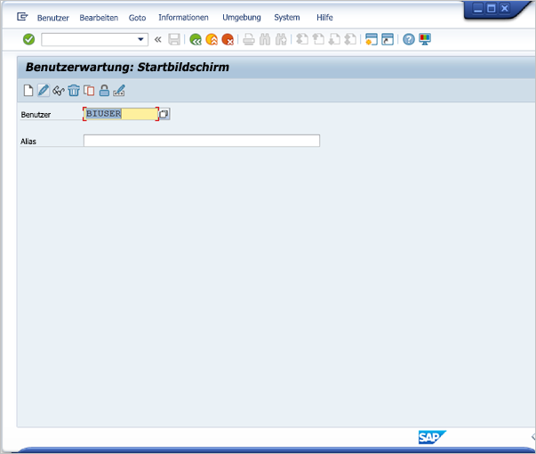

1. Wählen Sie die Registerkarte **SNC** aus. Geben Sie im Eingabefeld „SNC name“ (SNC-Name) den Wert „p:\<Active Directory-Benutzer\>@\<Domäne\>“ ein. Achten Sie auf die erforderliche Zeichenfolge „p:“, die dem UPN des Active Directory-Benutzers vorangestellt sein muss. Der angegebene Active Directory-Benutzer sollte der Person oder Organisation gehören, für die Sie den SSO-Zugriff auf den SAP BW-Anwendungsserver gewähren möchten. Wenn Sie beispielsweise dem Benutzer [testuser@TESTDOMAIN.COM](mailto:testuser@TESTDOMAIN.COM) SSO-Zugriff gewähren möchten, geben Sie p:testuser@TESTDOMAIN.COM ein.

    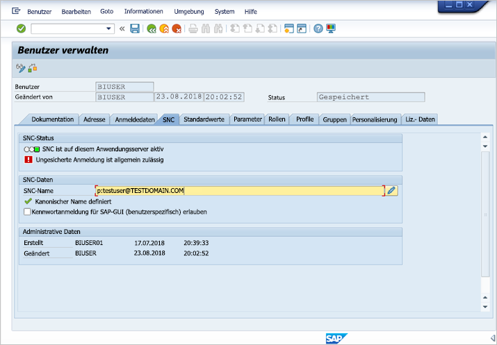

1. Klicken Sie auf das Diskettensymbol in der Symbolleiste, um die Einstellung zu speichern.

### <a name="test-sign-in-using-sso"></a>Testen der Anmeldung mit SSO

Überprüfen Sie, dass Sie sich über SAP GUI/Logon mit SSO als der Active Directory-Benutzer anmelden können, für den Sie den SSO-Zugriff gerade aktiviert haben.

1. Melden Sie sich bei einem Computer, auf dem SAP Logon installiert ist, *als der Active Directory-Benutzer an, für den Sie den SSO-Zugriff gerade aktiviert haben*, und starten Sie SAP GUI/Logon. Erstellen Sie eine neue Verbindung.

1. Klicken Sie im Fenster **Create New System Entry** (Neuen Systemeintrag erstellen) auf **User Specified System** (Benutzerdefiniertes System), und klicken Sie dann auf **Next** (Weiter).

    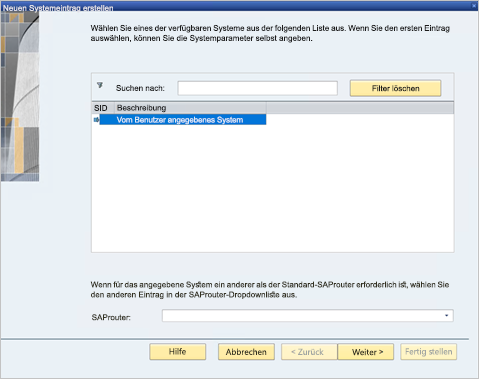

1. Geben Sie die entsprechenden Details (einschließlich Anwendungsserver, Instanznummer und System-ID) auf der nächsten Seite ein, und klicken Sie dann auf **Finish** (Fertig stellen).

1. Klicken Sie mit der rechten Maustaste auf die neue Verbindung, und wählen Sie **Properties** (Eigenschaften) aus. Wählen Sie die Registerkarte **Network** (Netzwerk) aus. Geben Sie im Fenster **SNC Name** (SNC-Name) den Wert „p:\<UPN des SAP BW-Service-Benutzers\>“ (z.B. p:BWServiceUser@MYDOMAIN.COM) ein, und klicken Sie dann auf **OK**.

    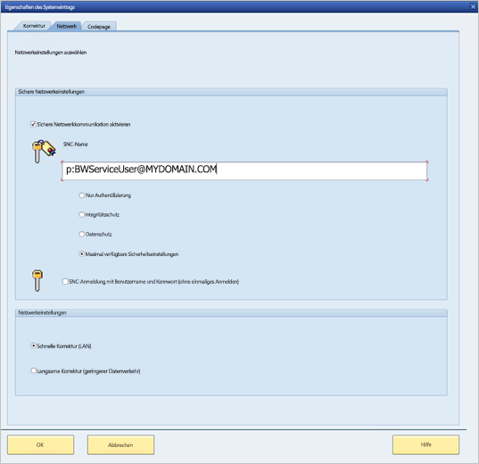

1. Doppelklicken Sie auf die Verbindung, die Sie gerade erstellt haben, um eine SSO-Verbindung mit dem BW-Server aufzubauen. Wenn die Verbindung erfolgreich ist, fahren Sie mit dem nächsten Schritt fort. Gehen Sie die vorherigen Schritt in dieser Dokumentation andernfalls erneut durch, um sicherzustellen, dass diese ordnungsgemäß durchgeführt wurden. Alternativ können Sie den untenstehenden Abschnitt zur Problembehandlung lesen. Beachten Sie, dass Sie keine Verbindung zum SAP BW-Server mit SSO im Gatewaykontext herstellen können, wenn die Verbindung in diesem Kontext fehlschlägt.

### <a name="troubleshoot-installation-and-connections"></a>Behandeln von Installations- und Verbindungsproblemen

Befolgen Sie diese Schritte, wenn Probleme mit der Installation von gsskrb5 oder der SSO-Verbindung über SAP GUI/Logon auftreten.

1. Das Anzeigen der Serverprotokolle („...work\dev\_w0“ auf dem Servercomputer) kann beim Behandeln von Problemen hilfreich sein, die beim Setup von gsskrb5 auftreten. Dies gilt insbesondere dann, wenn der SAP BW-Server nicht startet, nachdem die Profilparameter geändert wurden.

1. Wenn Sie den SAP BW-Dienst aufgrund eines Anmeldefehlers („logon failure“) nicht starten können, haben Sie möglicherweise das falsche Kennwort angegeben, als Sie den Benutzer zum Starten von SAP BW festgelegt haben. Überprüfen Sie das Kennwort, indem Sie sich bei einem Computer in Ihrer Active Directory-Umgebung als der SAP BW-Service-Benutzer anmelden.

1. Wenn eine Fehlermeldung bezüglich der SQL-Anmeldeinformationen angezeigt wird, sollten Sie überprüfen, ob Sie dem Service-Benutzer Zugriff auf die SAP BW-Datenbank gewährt haben.

1. „(GSS-API) specified target is unknown or unreachable“ ((GSS-API) Das angegebene Ziel ist unbekannt oder nicht erreichbar.): Diese Meldung bedeutet in der Regel, dass Sie den falschen SNC-Namen angegeben haben. Stellen Sie sicher, dass Sie in der Clientanwendung nur „p:“ verwenden, nicht etwa „p:CN=“ oder eine andere Zeichenfolge außer dem UPN des Service-Benutzers.

1. „(GSS-API) An invalid name was supplied“ ((GSS-API) Ein ungültiger Name wurde angegeben.): Stellen Sie sicher, dass „p:“ im Wert des SNC-Identitätsprofilparameters des Servers enthalten ist.

1. „(SNC error) the specified module could not be found“ ((SNC-Fehler) Das angegebene Modul wurde nicht gefunden.): Dieser Fehler wird üblicherweise dadurch verursacht, dass sich gsskrb5.dll/gx64krb5.dll an einem Speicherort befindet, der für den Zugriff erweiterte Berechtigungen (Administratorrechte) erfordert.

### <a name="add-registry-entries-to-the-gateway-machine"></a>Hinzufügen von Registrierungseinträgen zum Gatewaycomputer

Fügen Sie erforderliche Registrierungseinträge zur Registrierung des Computers hinzu, auf dem das Gateway installiert ist.

1. Führen Sie folgende Befehle in einem Befehlsfenster aus:

    1. REG ADD HKLM\SOFTWARE\Wow6432Node\SAP\gsskrb5 /v ForceIniCredOK /t REG\_DWORD /d 1 /f

    1. REG ADD HKLM\SOFTWARE\SAP\gsskrb5 /v ForceIniCredOK /t REG\_DWORD /d 1 /f

### <a name="set-configuration-parameters-on-the-gateway-machine"></a>Festlegen von Konfigurationsparametern auf dem Gatewaycomputer

Es gibt zwei Optionen zum Festlegen von Konfigurationsparametern, je nachdem, ob Azure AD DirSync so konfiguriert ist, dass Benutzer sich als Azure AD-Benutzer beim Power BI-Dienst anmelden können.

Wenn Azure AD DirSync konfiguriert ist, gehen Sie wie folgt vor.

1. Öffnen Sie die Hauptdatei für die Gatewaykonfiguration, *Microsoft.PowerBI.DataMovement.Pipeline.GatewayCore.dll*. Standardmäßig ist diese Datei unter *C:\Programme\Lokales Datengateway* gespeichert.

1. Stellen Sie sicher, dass die Eigenschaft **FullDomainResolutionEnabled** auf TRUE und **SapHanaSsoRemoveDomainEnabled** auf FALSE festgelegt ist.

1. Speichern Sie die Konfigurationsdatei.

1. Starten Sie den Gatewaydienst über die Registerkarte „Dienste“ des Task-Managers neu (Rechtsklick > Neu starten).

    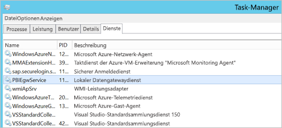

Wenn Sie Azure AD DirSync nicht konfiguriert haben, führen Sie diese Schritte für **jeden Power BI-Dienstbenutzer aus, den Sie einem Azure AD-Benutzer zuordnen möchten**. Durch diese Schritte wird ein Power BI-Dienstbenutzer manuell mit einem Active Directory-Benutzer mit der Berechtigung zur Anmeldung bei BW verknüpft.

1. Öffnen Sie die Hauptdatei für die Gatewaykonfiguration, „Microsoft.PowerBI.DataMovement.Pipeline.GatewayCore.dll“. Standardmäßig befindet sich diese Datei unter C:\Programme\Lokales Datengateway.

1. Legen Sie **ADUserNameLookupProperty** auf „msDS-cloudExtensionAttribute1“ und **ADUserNameReplacementProperty** auf „SAMAccountName“ fest. Speichern Sie die Konfigurationsdatei.

1. Starten Sie den Gatewaydienst über die Registerkarte **Dienste** des Task-Managers (Rechtsklick > **Neu starten**) neu.

    

1. Legen Sie die Eigenschaft „msDS-cloudExtensionAttribute1“ des Active Directory-Benutzers, den Sie einem SAP BW-Benutzer zugeordnet haben, auf den Power BI-Dienstbenutzer fest, für den Sie Kerberos-SSO aktivieren möchten. Sie können die Eigenschaft „msDS-cloudExtensionAttribute1“ beispielsweise über das MMC-Snap-In „Active Directory-Benutzer und -Computer“ festlegen. Es können jedoch auch andere Methoden verwendet werden.

    1. Melden Sie sich bei einem Domänencontrollercomputer als Administrator an.

    1. Öffnen Sie den Ordner **Users** (Benutzer) im Fenster des Snap-Ins, und doppelklicken Sie auf den Active Directory-Benutzer, den Sie einem SAP BW-Benutzer zugeordnet haben.

    1. Wählen Sie die Registerkarte **Attribute Editor** (Attribut-Editor) aus.

        Wenn diese Registerkarte nicht angezeigt wird, suchen Sie nach Anweisungen, wie Sie diese aktivieren, oder verwenden Sie eine andere Methode, um die Eigenschaft „msDS-cloudExtensionAttribute1“ festzulegen. Wählen Sie eines der Attribute aus, und drücken Sie die Taste „M“, um zu den Active Directory-Eigenschaften zu navigieren, die mit „m“ beginnen. Suchen Sie die Eigenschaft „msDS-cloudExtensionAttribute1“, und doppelklicken Sie darauf. Legen Sie den Wert auf den Benutzernamen fest, den Sie für die Anmeldung beim Power BI-Dienst verwenden. Verwenden Sie dazu das Format „YourUser@YourDomain“.

    1. Wählen Sie **OK**aus.

        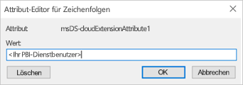

    1. Klicken Sie auf **Übernehmen**. Stellen Sie sicher, dass der richtige Wert in der Spalte „Value“ (Wert) festgelegt wurde.

### <a name="add-a-new-bw-application-server-data-source-to-the-power-bi-service"></a>Hinzufügen einer neuen Datenquelle eines SAP BW-Anwendungsservers zu Power BI

Fügen Sie die SAP BW-Datenquelle zu Ihrem Gateway hinzu: Befolgen Sie die weiter oben in diesem Artikel angeführten Anweisungen zum [Ausführen eines Berichts](#running-a-power-bi-report).

1. Geben Sie im Konfigurationsfenster der Datenquelle genau wie bei der Anmeldung beim SAP BW-Server über Power BI Desktop den **Hostnamen**, die **Systemnummer** und die **Client-ID** des Anwendungsservers ein. Wählen Sie **Windows** als **Authentifizierungsmethode** aus.

1. Geben Sie im Feld **Name des SNC-Partners** Folgendes ein: p:\<SPN, den Sie Ihrem BW-Service-Benutzer zugeordnet haben\>. Wenn der SPN z.B. „SAP/BWServiceUser@MYDOMAIN.COM“ lautet, geben Sie „p:SAP/BWServiceUser@MYDOMAIN.COM“ im Feld **Name des SNC-Partners** ein.

1. Legen Sie „SNC\_LIB“ oder „SNC\_LIB\_64“ als SNC-Bibliothek fest.

1. Als **Benutzername** und **Kennwort** sollten der Benutzername und das Kennwort eines Active Directory-Benutzers mit der Berechtigung, sich über SSO beim SAP BW-Server anzumelden (also ein Active Directory-Benutzer, der einem SAP BW-Benutzer über die Transaktion SU01 zugeordnet wurde), verwendet werden. Diese Anmeldeinformationen werden nur verwendet, wenn das Kontrollkästchen **SSO über Kerberos für DirectQuery-Abfragen verwenden** *nicht* aktiviert ist.

1. Aktivieren Sie das Kontrollkästchen **SSO über Kerberos für DirectQuery-Abfragen verwenden**, und klicken Sie auf **Anwenden**. Wenn die Testverbindung nicht erfolgreich ist, überprüfen Sie, dass das Setup und die Konfigurationsschritte ordnungsgemäß durchgeführt wurden.

    Das Gateway verwendet immer die eingegebenen Anmeldeinformationen, um eine Testverbindung mit dem Server herzustellen und geplante Aktualisierungen importbasierter Berichte durchzuführen. Das Gateway versucht nur, eine SSO-Verbindung herzustellen, wenn **SSO über Kerberos für DirectQuery-Abfragen verwenden** ausgewählt ist und der Benutzer auf einen Bericht oder ein Dataset auf DirectQuery-Basis zugreift.

### <a name="test-your-setup"></a>Testen des Setups

Veröffentlichen Sie einen DirectQuery-Bericht über Power BI Desktop im Power BI-Dienst, um Ihr Setup zu testen. Stellen Sie sicher, dass Sie beim Power BI-Dienst als Azure AD-Benutzer oder ein Benutzer angemeldet sind, den Sie der Eigenschaft „msDS-cloudExtensionAttribute1“ eines Azure AD-Benutzers zugeordnet haben. Wenn das Setup erfolgreich abgeschlossen wurde, sollten Sie basierend auf dem veröffentlichten Dataset im Power BI-Dienst einen Bericht erstellen und Daten über Visuals im Bericht per Pull übertragen können.

### <a name="troubleshooting-gateway-connectivity-issues"></a>Behandlung von Konnektivitätsproblemen des Gateways

1. Überprüfen Sie die Gatewayprotokolle. Öffnen Sie die Anwendung für die Gatewaykonfiguration, klicken Sie auf **Diagnose**, und klicken Sie dann auf **Protokolle exportieren**. Die letzten Fehler befinden sich am Ende der überprüften Protokolldatei.

    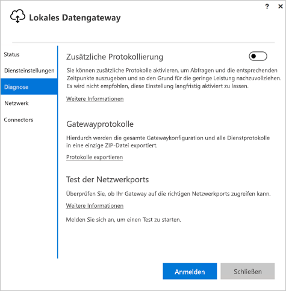

1. Aktivieren Sie die SAP BW-Ablaufverfolgung, und überprüfen Sie die generierten Protokolldateien. Es sind verschiedene SAP BW-Ablaufverfolgungen verfügbar. Weitere Informationen finden Sie in der SAP-Dokumentation.

## <a name="errors-from-an-insufficient-kerberos-configuration"></a>Fehler aufgrund einer unzureichenden Kerberos-Konfiguration

Wenn der zugrunde liegende Datenbankserver und das Gateway nicht ordnungsgemäß für die **eingeschränkte Kerberos-Delegierung** konfiguriert sind, kann die folgende Fehlermeldung ausgegeben werden:


Die technischen Details der Fehlermeldung (DM_GWPipeline_Gateway_ServerUnreachable) können folgendermaßen aussehen:

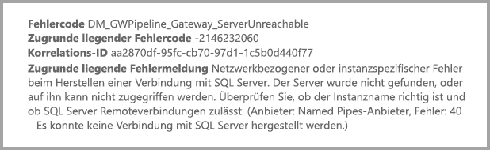

Infolgedessen kann das Gateway die Identität des ursprünglichen Benutzers nicht annehmen, und es kann keine Verbindung mit der Datenbank hergestellt werden.

## <a name="next-steps"></a>Nächste Schritte

Weitere Informationen zum **lokalen Datengateway** und **DirectQuery** finden Sie in den folgenden Ressourcen:

* [Lokales Datengateway](service-gateway-onprem.md)
* [DirectQuery in Power BI](desktop-directquery-about.md)
* [Von DirectQuery unterstützte Datenquellen](desktop-directquery-data-sources.md)
* [DirectQuery und SAP BW](desktop-directquery-sap-bw.md)
* [DirectQuery und SAP HANA](desktop-directquery-sap-hana.md)