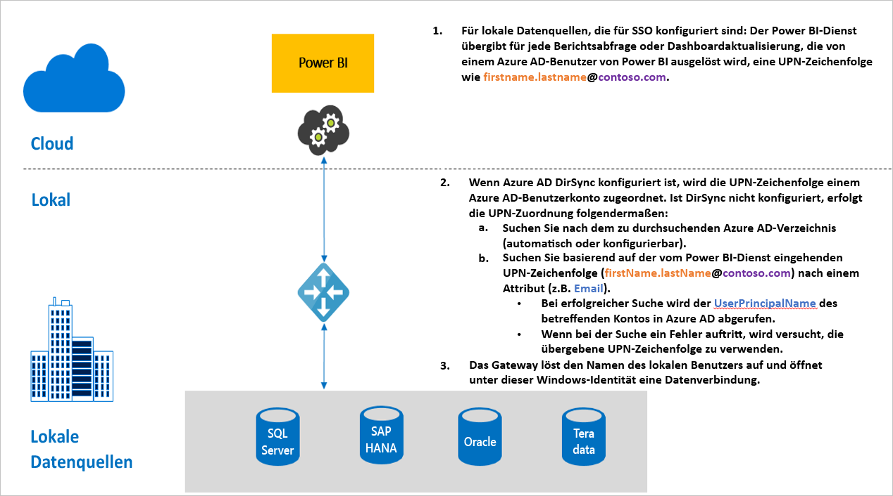

# Übersicht: Single Sign-On für Gateways in Power BI

Sie können nahtlose Verbindungen mit SSO gewährleisten und für Power BI-Berichte und -Dashboards das Aktualisieren von lokalen Daten ermöglichen, indem Sie Ihr lokales Datengateway entweder mit der eingeschränkten Delegierung von Kerberos oder Security Assertion Markup Language (SAML) konfigurieren. Das lokale Datengateway ermöglicht das einmalige Anmelden über DirectQuery. Damit werden Verbindungen mit lokalen Datenquellen hergestellt.

Folgende Datenquellen werden derzeit unterstützt:

* SQL Server ([Kerberos](service-gateway-sso-kerberos.md))
* SAP HANA ([Kerberos](service-gateway-sso-kerberos.md) und [SAML](service-gateway-sso-saml.md)
* SAP BW ([Kerberos](service-gateway-sso-kerberos.md))
* Teradata ([Kerberos](service-gateway-sso-kerberos.md))
* Spark ([Kerberos](service-gateway-sso-kerberos.md))
* Impala ([Kerberos](service-gateway-sso-kerberos.md))
* SSO ist auch möglich, dass [Daten aus anderen Quellen](desktop-directquery-data-sources.md#single-sign-on-sso-for-directquery-sources) ohne Verwendung eines Datengateways

Wenn ein Benutzer mit einem DirectQuery-Bericht im Power BI-Dienst interagiert, kann jeder Kreuzfilter-, Segmentierungs-, Sortier- und Berichtsbearbeitungsvorgang Abfragen bewirken, die live für die zugrunde liegende Datenquelle ausgeführt werden.  Wenn SSO für die Datenquelle konfiguriert ist, werden Abfragen unter der Identität des Benutzers ausgeführt, der mit Power BI interagiert (d.h. über die Webumgebung oder mobile Power BI-Apps). Somit sieht jeder Benutzer genau die Daten, für die er in der zugrunde liegenden Datenquelle über Berechtigungen verfügt – bei aktiviertem einmaligen Anmelden erfolgt keine Zwischenspeicherung freigegebener Daten für verschiedene Benutzer.

## Abfrageschritte beim Ausführen von SSO

Eine mit SSO ausgeführte Abfrage umfasst drei Schritte, wie in der folgenden Abbildung veranschaulicht.

> [!NOTE]
> SSO für Oracle ist noch nicht aktiviert, befindet sich jedoch in der Entwicklung und ist in Kürze verfügbar.

Es folgen weitere Details zu diesen Schritten:

1. Für jede Abfrage schließt der **Power BI-Dienst** beim Senden einer Abfrageanforderung an das konfigurierte Gateway den *Benutzerprinzipalnamen* (UPN) ein.

2. Das Gateway muss den Azure Active Directory-UPN einer lokalen Active Directory-Identität zuordnen.

   a.  Wenn Azure AD DirSync (auch als *Azure AD Connect* bezeichnet) konfiguriert ist, erfolgt die Zuordnung automatisch im Gateway.

   b.  Andernfalls kann das Gateway den Azure AD-UPN suchen und einem lokalen Benutzer zuordnen. Dies erfolgt durch eine Suche in der lokalen Active Directory-Domäne.

3. Der Prozess des Gatewaydiensts nimmt die Identität des zugeordneten lokalen Benutzers an, öffnet die Verbindung mit der zugrunde liegenden Datenbank und sendet die Abfrage. Das Gateway muss nicht auf denselben Computern wie die Datenbank installiert sein.

## Nächste Schritte

Nachdem Sie sich nun grundlegend mit SSO auskennen, können Sie sich ausführlichere Informationen zu Kerberos und SAML ansehen:

* [Einmaliges Anmelden (SSO): Kerberos](service-gateway-sso-kerberos.md)
* [Einmaliges Anmelden (SSO): SAML](service-gateway-sso-saml.md)
