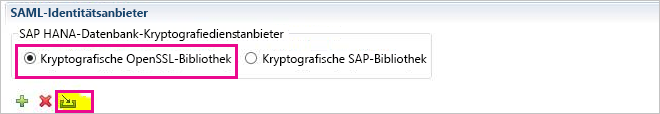
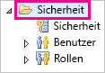
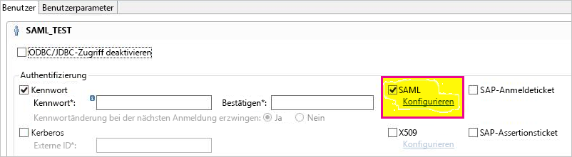
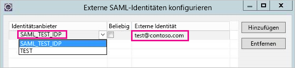
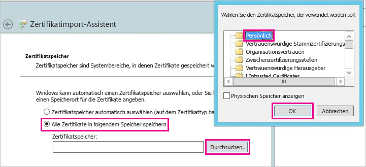
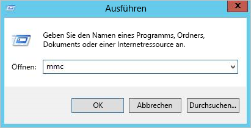
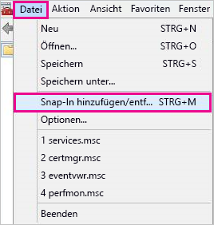
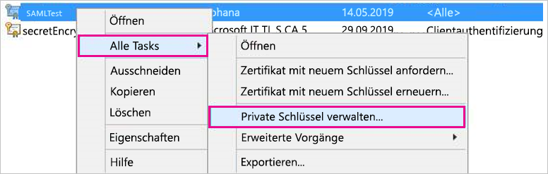
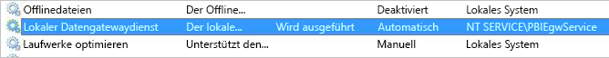
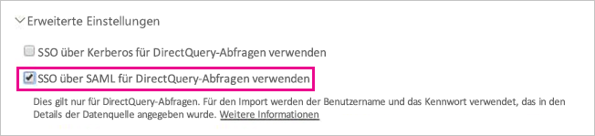

# <a name="use-security-assertion-markup-language-saml-for-single-sign-on-sso-from-power-bi-to-on-premises-data-sources"></a>Verwenden von SAML (Security Assertion Markup Language) für SSO (Single Sign-On, Einmaliges Anmelden) von Power BI bei lokalen Datenquellen

Verwenden Sie [SAML (Security Assertion Markup Language)](https://www.onelogin.com/pages/saml) zum Aktivieren der nahtlosen SSO-Konnektivität. Durch das Aktivieren von SSO für Power BI-Berichte und -Dashboards können Daten aus lokalen Datenquellen einfacher aktualisiert werden.

## <a name="supported-data-sources"></a>Unterstützte Datenquellen

Derzeit wird SAP HANA mit SAML unterstützt. Weitere Informationen zum Einrichten und Konfigurieren von SSO für SAP HANA mit SAML finden Sie in der SAP HANA-Dokumentation unter [SAML SSO for BI Platform to HANA (SAML SSO für die BI-Plattform mit HANA)](https://wiki.scn.sap.com/wiki/display/SAPHANA/SAML+SSO+for+BI+Platform+to+HANA).

Mit [Kerberos](service-gateway-sso-kerberos.md) werden weitere Datenquellen unterstützt.

Für HANA wird **dringend** die Aktivierung der Verschlüsselung empfohlen, bevor eine SAML-SSO-Verbindung hergestellt wird. Sie sollten den HANA-Server daher so konfigurieren, dass verschlüsselte Verbindungen akzeptiert werden. Auch für das Gateway sollten Sie die Verschlüsselung einrichten, wenn dieses mit dem HANA-Server kommuniziert. Der HANA-ODBC-Treiber ist standardmäßig **nicht** in der Lage, SAML-Assertionen zu verschlüsseln. Wenn die Verschlüsselung nicht aktiviert ist, wird die signierte SAML-Assertion unverschlüsselt vom Gateway zum HANA-Server gesendet und kann dann abgefangen und von Drittanbietern wiederverwendet werden.

## <a name="configuring-the-gateway-and-data-source"></a>Konfigurieren des Gateways und der Datenquelle

Wenn Sie SAML verwenden wollen, müssen Sie eine Vertrauensstellung zwischen den HANA-Servern, für die Sie SSO aktivieren möchten, und dem Gateway herstellen, das in diesem Szenario als SAML-Identitätsanbieter (IdP) dient. Es gibt verschiedene Möglichkeiten, diese Vertrauensstellung herzustellen. Sie können beispielsweise das X.509-Zertifikat des Gateway-IdP in den Zertifikatspeicher der HANA-Server importieren oder die X.509-Zertifikate des Gateways von einer Stammzertifizierungsstelle signieren lassen, die von den HANA-Servern als vertrauenswürdig eingestuft wird. In diesem Leitfaden wird der zweite Ansatz beschrieben. Sie können jedoch bei Bedarf auch einen anderen verwenden.

Beachten Sie außerdem, dass in dieser Anleitung OpenSSL als Kryptografieanbieter des HANA-Servers verwendet wird. Stattdessen kann aber auch die SAP Cryptographic Library (auch unter dem Namen CommonCryptoLib oder sapcrypto bekannt) verwendet werden, um die Einrichtungsschritte für die Vertrauensstellung abzuschließen. Weitere Informationen finden Sie in der offiziellen SAP-Dokumentation.

In den folgenden Schritten wird beschrieben, wie Sie mithilfe einer Stammzertifizierungsstelle, die vom HANA-Server als vertrauenswürdig eingestuft wird, das X.509-Zertifikat des Gateway-IdP signieren und auf diese Weise eine Vertrauensstellung zwischen dem HANA-Server und dem Gateway-IdP herstellen.

1. Erstellen Sie das X.509-Zertifikat und den privaten Schlüssel für die Stammzertifizierungsstelle. Sie können diese beispielsweise wie folgt im PEM-Format erstellen:

```
openssl req -new -x509 -newkey rsa:2048 -days 3650 -sha256 -keyout CA_Key.pem -out CA_Cert.pem -extensions v3_ca
```

Fügen Sie das Zertifikat (z. B. mit dem Namen „CA_Cert.pem“) dem Zertifikatspeicher des HANA-Servers hinzu, sodass dieser Server alle erstellen Zertifikate, die von der Stammzertifizierungsstelle signiert werden, als vertrauenswürdig einstuft. Den Speicherort des Zertifikatspeichers für den HANA-Server finden Sie in der **ssltruststore**-Konfigurationseinstellung. Wenn Sie die Schritte in der SAP-Dokumentation zur Konfiguration von OpenSSL umgesetzt haben, stuft der HANA-Server möglicherweise bereits eine Stammzertifizierungsstelle als vertrauenswürdig ein, die dann wiederverwendet werden kann. Weitere Informationen finden Sie unter [How to Configure Open SSL for SAP HANA Studio to SAP HANA Server (Konfigurieren von OpenSSL-Verbindungen zwischen SAP HANA Studio und einem SAP HANA-Server)](https://archive.sap.com/documents/docs/DOC-39571). Wenn Sie über mehrere HANA-Server verfügen, für die Sie SSO mit SAML aktivieren möchten, müssen Sie sicherstellen, dass jeder Server diese Stammzertifizierungsstelle als vertrauenswürdig einstuft.

1. Erstellen Sie das X.509-Zertifikat für den Gateway-IdP. Wenn Sie beispielsweise eine Zertifikatsignierungsanforderung (IdP_Req.pem) und einen privaten Schlüssel (IdP_Key.pem) erstellen möchten, die ein Jahr lang gültig sind, müssen Sie den folgenden Befehl ausführen:

```
 openssl req -newkey rsa:2048 -days 365 -sha256 -keyout IdP_Key.pem -out IdP_Req.pem -nodes
```


Signieren Sie mithilfe der Stammzertifizierungsstelle, die von Ihren HANA-Servern als vertrauenswürdig eingestuft wird, die Zertifikatsignierungsanforderung. Wenn Sie beispielsweise „IdP_Req.pem“ mithilfe von „CA_Cert.pem“ und „CA_Key.pem“ signieren möchten, müssen Sie den folgenden Befehl ausführen:

  ```
openssl x509 -req -days 365 -in IdP_Req.pem -sha256 -extensions usr_cert -CA CA_Cert.pem -CAkey CA_Key.pem -CAcreateserial -out IdP_Cert.pem
```
Da so erstellte IdP-Zertifikat ist ein Jahr lang gültig (siehe „-days“-Option). Importieren Sie nun Ihr IdP-Zertifikat in SAP HANA Studio, um einen neuen SAML-Identitätsanbieter zu erstellen.

1. Klicken Sie in SAP HANA Studio mit der rechten Maustaste auf Ihren SAP HANA-Server, navigieren Sie dann zu **Security (Sicherheit)** > **Open Security Console (Sicherheitskonsole öffnen)** > **SAML Identity Provider (SAML-Identitätsanbieter)** > **OpenSSL Cryptographic Library (Kryptografische OpenSSL-Bibliothek)**.

    

1. Klicken Sie auf **Import** (Importieren), navigieren Sie zu „IdP_Cert.pem“, und importieren Sie die Datei.

1. Klicken Sie in SAP HANA Studio auf den Ordner **Security (Sicherheit)**.

    

1. Erweitern Sie **Users (Benutzer)**, und wählen Sie dann den Benutzer aus, den Sie Ihrem Power BI-Benutzer zuordnen möchten.

1. Wählen Sie **SAML** aus, und klicken Sie dann auf **Configure (Konfigurieren)**.

    

1. Wählen Sie den Identitätsanbieter aus, den Sie in Schritt 2 erstellt haben. Für **externen Identität**, geben Sie die Power BI-Benutzer-UPN (in der Regel die e-Mail-Adresse der Benutzer sich bei Power BI anmeldet), und wählen Sie dann **hinzufügen**. Beachten Sie, dass wenn Sie Ihr Gateway aus, um die Konfigurationsoption ADUserNameReplacementProperty verwenden konfiguriert haben sollten Sie den Wert eingeben, der ursprüngliche UPN des Power BI-Benutzers ersetzt. Wenn Sie die ADUserNameReplacementProperty "sAMAccountName" festlegen sollten Sie z. B. des Benutzers "sAMAccountName" eingeben.

    

Nachdem Sie das Zertifikat und die Identität konfiguriert haben, können Sie als Nächstes das Zertifikat in das PFX-Format konvertieren und den Gatewaycomputer für die Verwendung des Zertifikats konfigurieren.

1. Konvertieren Sie das Zertifikat in das PFX-Format, indem Sie den folgenden Befehl ausführen. Beachten Sie, dass dieser Befehl als Kennwort für die PFX-Datei „root“ festlegt.

    ```
    openssl pkcs12 -export -out samltest.pfx -in IdP_Cert.pem -inkey IdP_Key.pem -passin pass:root -passout pass:root
    ```

1. Kopieren Sie die PFX-Datei auf den Gatewaycomputer:

    1. Doppelklicken Sie auf die Datei „samltest.pfx“, und klicken Sie dann auf **Local Machine (Lokaler Computer)** > **Next (Weiter)**.

    1. Geben Sie das Kennwort ein, und klicken Sie auf **Next (Weiter)**.

    1. Wählen Sie die Option **Place all certificates in the following store (Alle Zertifikate unter folgendem Speicherort speichern)** aus, und klicken Sie dann auf **Browse (Durchsuchen)** > **Personal (Eigene Zertifikate)** > **OK**.

    1. Klicken Sie auf **Next (Weiter)**, und dann auf **Finish (Fertig stellen)**.

    

1. Gewähren Sie dem Gatewaydienstkonto den Zugriff auf den privaten Schlüssel des Zertifikats:

    1. Führen Sie die Microsoft Management Console (MMC) auf dem Gatewaycomputer aus.

        

    1. Klicken Sie unter **File (Datei)** auf **Add/Remove Snap-in (Snap-In hinzufügen/entfernen)**.

        

    1. Klicken Sie auf **Certificates (Zertifikate)** > **Add (Hinzufügen)**, und klicken Sie dann auf **Computer account (Computerkonto)** > **Next (Weiter)**.

    1. Klicken Sie auf **Local Computer (Lokaler Computer)** > **Finish (Fertig stellen)** > **OK**.

    1. Erweitern Sie **Certificates (Zertifikate)** > **Personal (Eigene Zertifikate)** > **Certificates (Zertifikate)**, und suchen Sie nach dem Zertifikat.

    1. Klicken Sie mit der rechten Maustaste auf das Zertifikat, und navigieren Sie zu **All Tasks (Alle Aufgaben)** > **Manage Private Keys (Private Schlüssel verwalten)**.

        

    1. Fügen Sie das Gatewaydienstkonto der Liste hinzu. Das Standardkonto ist **NT SERVICE\PBIEgwService**. Sie können herausfinden, welches Konto den Gatewaydienst ausführt, indem Sie **services.msc** ausführen, und nach **On-premises data gateway service (Lokaler Datengatewaydienst)** suchen.

        

Führen Sie schlussendlich die folgenden Schritte aus, um den Zertifikatfingerabdruck zur Gatewaykonfiguration hinzuzufügen.

1. Führen Sie den folgenden PowerShell-Befehl aus, um die Zertifikate auf Ihrem Computer aufzulisten.

    ```powershell
    Get-ChildItem -path cert:\LocalMachine\My
    ```
1. Kopieren Sie den Fingerabdruck des von Ihnen erstellten Zertifikats.

1. Navigieren Sie zum Gatewayverzeichnis, das standardmäßig C:\Programme\On-premises data gateway ist.

1. Öffnen Sie „PowerBI.DataMovement.Pipeline.GatewayCore.dll.config“, und suchen Sie nach dem Abschnitt \*SapHanaSAMLCertThumbprint\*. Fügen Sie den kopierten Fingerabdruck ein.

1. Starten Sie den Gatewaydienst neu.

## <a name="running-a-power-bi-report"></a>Ausführen eines Power BI-Berichts

Sie können jetzt die Seite **Manage Gateway (Gateway verwalten)** in Power BI verwenden, um die Datenquelle zu konfigurieren, und unter **Erweiterte Einstellungen** können Sie das einmalige Anmelden aktivieren. Anschließend können Sie Berichte und Datasets veröffentlichen, die an diese Datenquelle gebunden sind.



## <a name="troubleshooting"></a>Problembehandlung

Nachdem SSO konfiguriert wurde, wird Ihnen im Power BI-Portal möglicherweise der folgende Fehler angezeigt: „The credentials provided cannot be used for the SapHana source.“ (Die bereitgestellten Anmeldeinformationen können nicht für die SapHana-Quelle verwendet werden.) Dieser Fehler bedeutet, dass die SAML-Anmeldeinformationen von SAP HANA nicht akzeptiert wurden.

In den Authentifizierungsablaufverfolgungen finden sich detaillierte Informationen zur Fehlerbehebung bei Problemen mit Anmeldeinformationen bei SAP HANA. Befolgen Sie diese Schritte, um die Ablaufverfolgung für Ihren SAP HANA-Server zu konfigurieren.

1. Aktivieren Sie auf dem SAP HANA-Server die Authentifizierungsablaufverfolgung, indem Sie folgende Abfrage ausführen.

    ```
    ALTER SYSTEM ALTER CONFIGURATION ('indexserver.ini', 'SYSTEM') set ('trace', 'authentication') = 'debug' with reconfigure 
    ```

1. Reproduzieren Sie das Problem, das aufgetreten ist.

1. Öffnen Sie in HANA Studio die Administratorkonsole, und wechseln Sie zur Registerkarte **Diagnosis Files** (Diagnosedateien).

1. Öffnen Sie die aktuellste indexserver-Ablaufverfolgung, und suchen Sie nach „SAMLAuthenticator.cpp“.

    Sie sollten ähnlich wie in folgendem Beispiel eine detaillierte Fehlermeldung finden, die die Grundursache angibt.

    ```
    [3957]{-1}[-1/-1] 2018-09-11 21:40:23.815797 d Authentication   SAMLAuthenticator.cpp(00091) : Element '{urn:oasis:names:tc:SAML:2.0:assertion}Assertion', attribute 'ID': '123123123123123' is not a valid value of the atomic type 'xs:ID'.
    [3957]{-1}[-1/-1] 2018-09-11 21:40:23.815914 i Authentication   SAMLAuthenticator.cpp(00403) : No valid SAML Assertion or SAML Protocol detected
    ```

1. Sobald Sie die Problembehandlung abgeschlossen haben, deaktivieren Sie die Ablaufverfolgung, indem Sie die folgende Abfrage ausführen.

    ```
    ALTER SYSTEM ALTER CONFIGURATION ('indexserver.ini', 'SYSTEM') UNSET ('trace', 'authentication');
    ```

## <a name="next-steps"></a>Nächste Schritte

Weitere Informationen zum **lokalen Datengateway** und **DirectQuery** finden Sie in den folgenden Ressourcen:

* [On-premises data gateway (Lokales Datengateway)](service-gateway-onprem.md)
* [DirectQuery in Power BI](desktop-directquery-about.md)
* [Von DirectQuery unterstützte Datenquellen](desktop-directquery-data-sources.md)
* [DirectQuery und SAP BW](desktop-directquery-sap-bw.md)
* [DirectQuery und SAP HANA](desktop-directquery-sap-hana.md)
