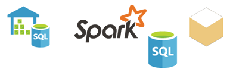

# Datenquellen für den Power BI-Dienst
Daten sind der Kern von Power BI. Wenn Sie Daten untersuchen, Diagramme und Dashboards erstellen oder über Q&A Fragen stellen, stammen die Daten, die all diesen Visualisierungen und Antworten zugrunde liegen, aus einem Dataset. Doch woher stammt das Dataset? Aus einer Datenquelle.

In diesem Artikel werden die unterschiedlichen Typen von Datenquellen beschrieben, mit denen Sie über den Power BI-Dienst eine Verbindung herstellen können. Denken Sie daran, dass Sie Daten auch aus vielen weiteren Typen von Datenquellen beziehen können. Für diese Quellen müssen Sie jedoch möglicherweise zunächst Power BI Desktop oder die erweiterten Datenabfrage- und Datenmodellierungsfeatures von Excel verwenden. Wir gehen dazu später mehr ins Detail. Zunächst sollen die unterschiedlichen Typen von Datenquellen betrachtet werden, mit denen Sie über die Website des Power BI-Diensts eine Verbindung herstellen können.

Sie können in Power BI Daten aus jeder dieser Datenquellen abrufen, indem Sie auf **Mein Arbeitsbereich** > **Daten abrufen** klicken.

## Dateien

**Excel** (XLSX, XLSM): Eine Arbeitsmappe in Excel kann Daten enthalten, die Sie selbst in Arbeitsblätter eingegeben haben, und Sie können in Excel mithilfe von Power Query („Abrufen und Transformieren“ in Excel 2016) oder Power Pivot Daten aus externen Datenquellen abfragen und laden. Sie können Daten in Tabellen in Arbeitsblätter importieren (die Daten *müssen* in einer Tabelle vorliegen), oder Daten importieren, die in ein Datenmodell geladen wurden. Weitere Informationen finden Sie unter [Abrufen von Daten aus Excel](service-get-data-from-files.md).

**Power BI Desktop** (PBIX) – Sie können mithilfe von Power BI Desktop Daten aus externen Datenquellen abfragen und laden, das Datenmodell mit Measures und Beziehungen erweitern und Berichte erstellen. Sie können die Power BI Desktop-Datei in die Power BI-Website importieren. Power BI Desktop eignet sich am besten für fortgeschrittene Benutzer, die über gute Kenntnisse zu Datenquellen, zur Datenabfrage und -transformation und zu Konzepten der Datenmodellierung verfügen. Weitere Informationen finden Sie unter [Verbinden mit Daten in Power BI Desktop](desktop-connect-to-data.md).

**Durch Trennzeichen getrennte Dateien** (CSV): Dabei handelt es sich um einfache Textdateien mit Datenzeilen. Jede Zeile kann einen oder mehrere Werte enthalten, die jeweils durch ein Komma getrennt sind. Beispielsweise kann eine CSV-Datei mit Namens- und Adressdaten mehrere Zeilen enthalten, von denen jede Werte für Vorname, Nachname, Straße, Ort, Bundesland/Kanton usw. enthält. Sie können keine Daten in eine CSV-Datei importieren, jedoch können viele Anwendungen, z. B. Excel, einfache Tabellendaten als CSV-Datei speichern.

Für andere Dateitypen, z. B. XML-Tabellendateien (.xml) oder Textdateien (.txt), können Sie zunächst mithilfe von „Abrufen und transformieren“ Daten abfragen, transformieren und in eine Excel- oder Power BI Desktop-Datei laden. Anschließend können Sie die Excel- oder Power BI Desktop-Datei nach Power BI importieren.

Es macht zudem einen erheblichen Unterschied, wo Sie die Dateien speichern. OneDrive for Business bietet das größte Maß an Flexibilität und Integration in Power BI. Sie können die Dateien auf dem lokalen Laufwerk speichern. Wenn Sie jedoch die Daten aktualisieren müssen, sind einige zusätzliche Schritte erforderlich. Die verlinkten Artikel enthalten weitere Informationen.

## Inhaltspakete

In Inhaltspaketen sind bereits alle Daten und Berichte vorbereitet, die Sie benötigen. In Power BI gibt es zwei Typen von Inhaltspaketen: Inhaltspakete aus Diensten wie Google Analytics, Marketo oder Salesforce, und Inhaltspakete, die von anderen Benutzern in Ihrer Organisation erstellt und freigegeben wurden.

**Dienste**: Es gibt Dutzende von Diensten mit Inhaltspaketen für Power BI, und ihre Anzahl nimmt ständig zu. Für die meisten Dienste benötigen Sie ein Konto. Weitere Informationen finden Sie unter [Herstellen einer Verbindung mit Diensten](service-connect-to-services.md).

**Organisationsbezogen**: Wenn Sie und andere Benutzer in Ihrer Organisation über ein Power BI Pro-Konto verfügen, können Sie Inhaltspakete erstellen, freigeben und verwenden. Weitere Informationen finden Sie unter [Organisationsbezogene Inhaltspakete](service-organizational-content-pack-introduction.md).

## Datenbanken

**Datenbanken in der Cloud**: Sie können im Power BI-Dienst mithilfe von DirectQuery eine Live-Verbindung mit Azure SQL-Datenbank, Azure SQL Data Warehouse, Spark on Azure HDInsight und SQL Server Analysis Services herstellen. Verbindungen von Power BI mit diesen Datenbanken sind Liveverbindungen. Das bedeutet, dass z.B. nach dem Herstellen der Verbindung mit einer Azure SQL-Datenbank beim Untersuchen der Daten und beim Erstellen von Berichten in Power BI immer eine direkte Abfrage der Datenbank ausgeführt wird, wenn Sie die Daten segmentieren oder einer Visualisierung ein weiteres Feld hinzufügen. Weitere Informationen finden Sie unter [Azure und Power BI](service-azure-and-power-bi.md).

**Lokale Datenbanken**: Sie können im Power BI-Dienst eine direkte Verbindung mit SQL Server Analysis Services-Datenbanken für tabellarische Modelle herstellen. Dies erfordert Power BI Enterprise-Gateway. Wenn Sie nicht genau wissen, wie Sie eine Verbindung mit der tabellarischen Modelldatenbank Ihrer Organisation herstellen können, wenden Sie sich an den Administrator oder die IT-Abteilung. Weitere Informationen finden Sie unter [SQL Server Analysis Services-Tabellendaten in Power BI](sql-server-analysis-services-tabular-data.md).

Für andere Typen von Datenbanken in Ihrer Organisation müssen Sie zunächst mithilfe von Power BI Desktop oder Excel eine Verbindung mit den Daten herstellen, diese abfragen und in ein Datenmodell laden. Anschließend können Sie die Datei nach Power BI importieren, wo ein Dataset erstellt wird. Wenn Sie eine geplante Aktualisierung konfigurieren, verwendet Power BI die Verbindungsinformationen aus der Datei zusammen mit den von Ihnen konfigurierten Aktualisierungseinstellungen, um eine direkte Verbindung mit der Datenquelle herzustellen und Updates abzufragen. Diese Aktualisierungen werden dann in das Dataset in Power BI geladen. Weitere Informationen finden Sie unter [Verbinden mit Daten in Power BI Desktop](desktop-connect-to-data.md).

## Was muss ich beachten, wenn die Daten aus einer anderen Quelle stammen?
Es gibt Hunderte unterschiedlicher Datenquellen, die Sie mit Power BI verwenden können. Unabhängig von ihrer Herkunft müssen diese Daten jedoch ein Format aufweisen, das von Power BI zum Erstellen von Berichten und Dashboards, zum Beantworten von Fragen mit Q&A und weitere Vorgänge verwendet werden kann.

Die Daten einiger Datenquellen liegen bereits in einem Format vor, das für den Power BI-Dienst geeignet ist. Dies gilt z. B. für Inhaltspakete von Dienstanbietern wie Google Analytics und Twilio. Die SQL Server Analysis Services-Datenbanken für tabellarische Modelle weisen ebenfalls ein geeignetes Format auf. Und Sie können eine Liveverbindung mit Datenbanken in der Cloud, z. B. Azure SQL-Datenbank und Spark on HDInsight, herstellen.

In anderen Fällen müssen Sie möglicherweise die gewünschten Daten abfragen und in eine Datei laden. Angenommen, in einer Data Warehouse-Datenbank auf einem Server in Ihrer Organisation befinden sich z.B. Logistikdaten. Sie können im Power BI-Dienst keine direkte Verbindung mit der Datenbank herstellen und mit der Untersuchung ihrer Daten beginnen (es sei denn, es handelt sich um eine Datenbank für tabellarische Modelle). Sie können jedoch mit Power BI Desktop oder Excel die Logistikdaten abfragen und in ein Datenmodell laden, das Sie dann als Datei speichern. Anschließend können Sie diese Datei nach Power BI importieren, wo ein Dataset erstellt wird.

Ihr Einwand lautet wahrscheinlich: „Die Logistikdaten in der Datenbank ändern sich aber täglich. Wie kann ich sicherstellen, dass mein Dataset in Power BI aktualisiert wurde?“ – Die Verbindungsinformationen aus der Power BI Desktop- oder Excel-Datei werden zusammen mit den Daten in das Dataset importiert. Wenn Sie eine geplante Aktualisierung konfigurieren oder das Dataset manuell aktualisieren, verwendet Power BI die Verbindungsinformationen aus dem Dataset zusammen mit einigen anderen Einstellungen, um eine direkte Verbindung mit der Datenbank herzustellen, Aktualisierungen abzufragen und diese in das Dataset zu laden. Wahrscheinlich ist Power BI Gateway erforderlich, um die Datenübertragung zwischen dem lokalen Server und Power BI zu sichern. Alle Visualisierungen in Berichten und Dashboards werden automatisch aktualisiert.

Sie sehen also, dass Sie Daten auch in Power BI übertragen können, wenn keine direkte Verbindung vom Power BI-Dienst mit der Datenquelle hergestellt werden kann. Es sind lediglich einige zusätzliche Schritte und eventuell ein wenig Hilfe von der IT-Abteilung erforderlich. Weitere Informationen finden Sie unter [Datenquellen in Power BI Desktop](desktop-data-sources.md).

## Einige weitere Informationen
Sie treffen in Power BI häufig auf die Begriffe „Dataset“ und „Datenquelle“. Diese werden oft als Synonyme verwendet, bezeichnen jedoch zwei völlig unterschiedliche, wenn auch verwandte Dinge.

Ein ***Dataset*** wird in Power BI automatisch erstellt, wenn Sie mit „Daten abrufen“ eine Verbindung mit einem Inhaltspaket herstellen und Daten aus diesem importieren oder eine Verbindung mit einer Livedatenquelle herstellen. Ein Dataset enthält Informationen zur Datenquelle, Anmeldeinformationen für die Datenquelle und häufig eine aus der Datenquelle kopierte Teilmenge von Daten. Beim Erstellen von Visualisierungen in Berichten und Dashboards basieren diese in den meisten Fällen auf Daten im Dataset.

Eine ***Datenquelle*** ist der Ort, aus dem die Daten in einem Dataset tatsächlich stammen. Dies kann beispielsweise ein Onlinedienst wie Google Analytics oder QuickBooks, eine Datenbank in der Cloud wie die Azure SQL-Datenbank oder eine Datenbank bzw. Datei auf einem lokalen Computer oder Server in Ihrer Organisation sein.

### Datenaktualisierung
Wenn Sie die Dateien auf dem lokalen Laufwerk oder einem Laufwerk irgendwo in Ihrer Organisation speichern, ist möglicherweise Power BI Gateway erforderlich, um das Dataset in Power BI zu aktualisieren. Außerdem muss der Computer, auf dem die Datei gespeichert wird, in Betrieb sein, wenn die Aktualisierung erfolgt. Sie können die Datei auch erneut importieren oder die Funktion „Veröffentlichen“ in Excel oder Power BI Desktop verwenden, jedoch sind dies keine automatischen Prozesse.

Wenn Sie die Dateien in OneDrive for Business oder SharePoint – Teamwebsites speichern und anschließend eine Verbindung mit Power BI herstellen oder die Dateien nach Power BI importieren, sind das Dataset, die Berichte und das Dashboard immer aktuell. Da sich OneDrive und Power BI in der Cloud befinden, kann Power BI ca. einmal pro Stunde eine direkte Verbindung mit der gespeicherten Datei herstellen und nach Aktualisierungen suchen. Wenn Aktualisierungen gefunden werden, werden das Dataset und alle Visualisierungen automatisch aktualisiert.

Inhaltspakete aus Diensten werden automatisch aktualisiert. In den meisten Fällen einmal pro Tag. Sie können sie manuell aktualisieren, jedoch hängt es vom Dienstanbieter ab, ob aktualisierte Daten angezeigt werden. Die Aktualisierung der Inhaltspakete von anderen Personen in Ihrer Organisation hängt von den verwendeten Datenquellen und davon ab, wie der Ersteller des Inhaltspakets die Aktualisierung eingerichtet hat.

Azure SQL-Datenbank, Azure SQL Data Warehouse und Spark on Azure HDInsight sind Datenquellen in der Cloud. Da sich der Power BI-Dienst ebenfalls in der Cloud befindet, kann Power BI mithilfe von DirectQuery eine Liveverbindung mit ihnen herstellen. Die Daten in Power BI sind immer synchronisiert, und es ist nicht erforderlich, eine Aktualisierung einzurichten.

Wenn Sie in Power BI eine Verbindung mit SQL Server Analysis Services herstellen, handelt es sich um eine Liveverbindung wie bei einer Azure-Datenbank in der Cloud, die Datenbank selbst befindet sich jedoch auf einem Server in der Organisation. Dieser Typ von Verbindung erfordert Power BI Gateway, das normalerweise von der IT-Abteilung konfiguriert wird.

Die Datenaktualisierung ist ein äußerst wichtiger Aspekt von Power BI und zu komplex, um an dieser Stelle umfassend behandelt zu werden. Wenn Sie gründliche Kenntnisse zu diesem Aspekt erwerben möchten, lesen Sie [Aktualisieren von Daten in Power BI](refresh-data.md).

## Überlegungen und Einschränkungen
Für alle im Power BI-Dienst verwendeten Datenquellen gelten die folgenden Überlegungen und Einschränkungen. Es gibt weitere Einschränkungen, die für bestimmte Features gelten, die folgende Liste gilt jedoch für den Power BI-Dienst insgesamt:

* **Beschränkung der Datasetgröße** – Jedes Dataset im Power BI-Dienst darf nicht größer als 1 GB sein.
* **Maximale Anzahl der Zeilen** – Die maximale Anzahl der Zeilen im Dataset (wenn DirectQuery nicht verwendet wird) beträgt 2 Milliarden, wobei drei dieser Zeilen reserviert sind (sodass maximal 1.999.999.997 Zeilen verwendet werden können). Bei Verwendung von DirectQuery beträgt die maximale Anzahl von Zeilen 1 Million.
* **Maximale Anzahl der Spalten** – In einem Dataset sind für die Gesamtheit der Tabellen im Dataset maximal 16.000 Spalten zulässig. Dies gilt für den Power BI-Dienst und für in Power BI-Desktop verwendete Datasets. In Power BI wird im Dataset eine interne Zeilennummernspalte pro Tabelle verwendet. Das bedeutet, dass für jede Tabelle im Dataset die maximale Anzahl von Spalten 16.000 minus eins beträgt.

