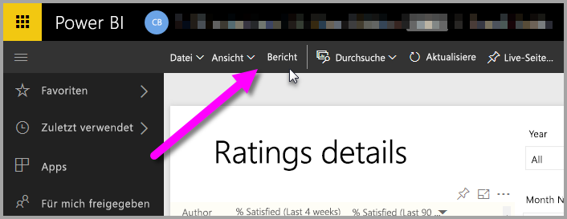
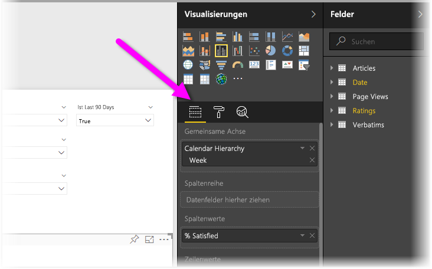
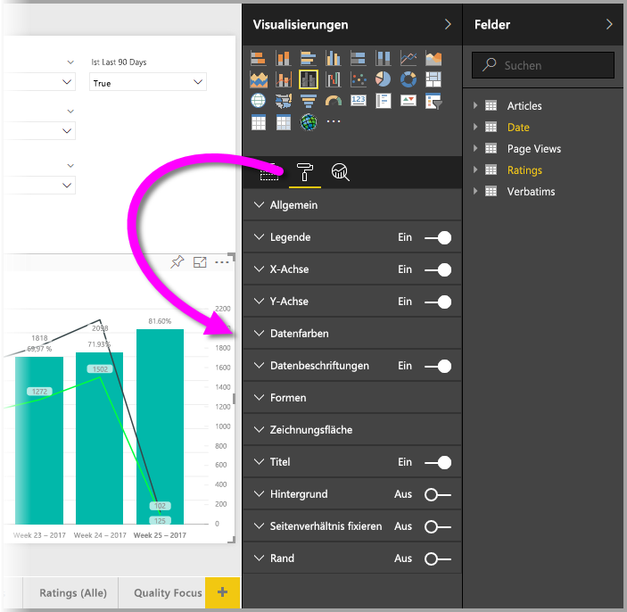
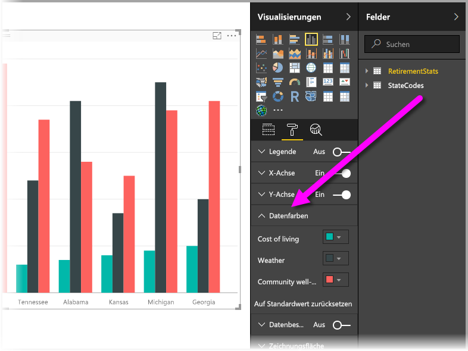
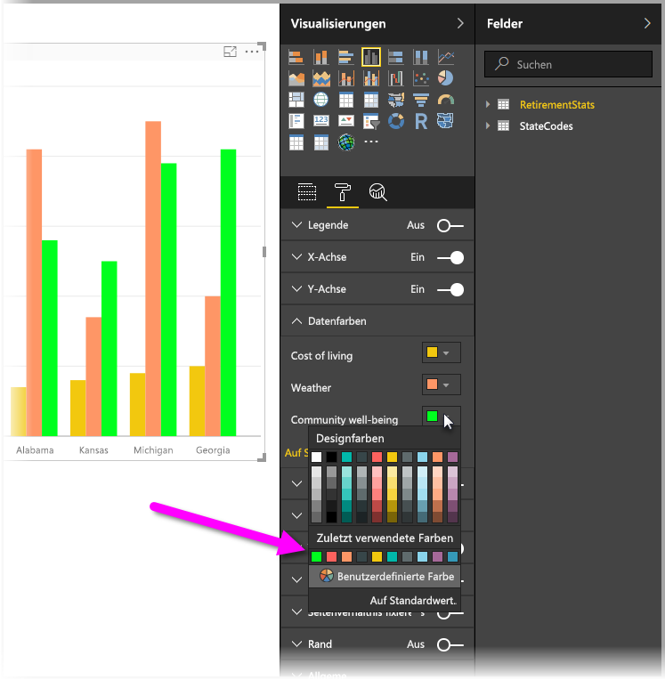
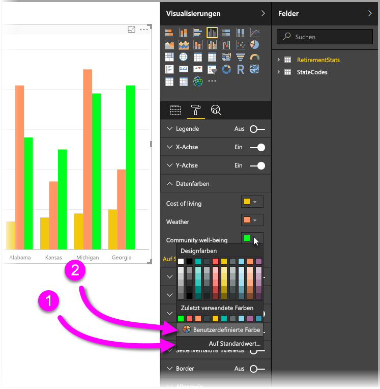
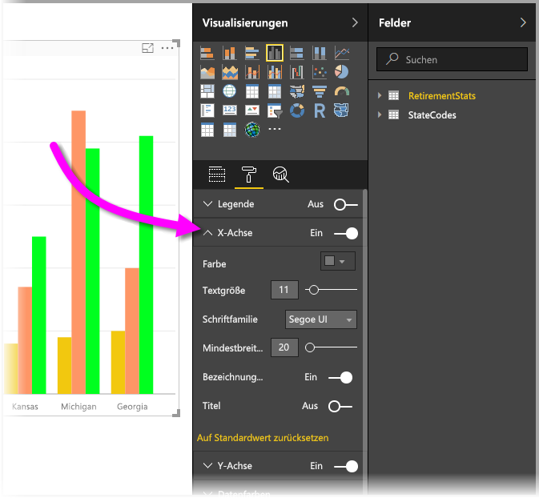

# Erste Schritte mit Farbeinstellungen und Achseneigenschaften
In **Power BI** können Sie die Farbe von Datenreihen und Datenpunkten und selbst den Hintergrund von Visualisierungen ändern. So haben Sie eine umfassende Kontrolle über die Anzeige Ihrer Dashboards und Berichte.

Wählen Sie zunächst aus **Mein Arbeitsbereich** einen **Bericht** aus. Wählen Sie dann im oberen Menübereich die Option **Bericht bearbeiten**aus.  

Wenn Sie eine Visualisierung ausgewählt haben und einen Bericht bearbeiten, wird der Bereich **Visualisierungen** angezeigt, in dem Sie Visualisierungen hinzufügen oder ändern können. Direkt unter den verfügbaren Visualisierungen werden drei Symbole angezeigt: **Felder** (zwei Kästchen), **Format** (eine Farbwalze) und **Analyse** (eine Lupe). In der folgenden Abbildung ist das Symbol **Felder** ausgewählt, was durch den einen gelben Balken unterhalb des Symbols erkennbar ist.

Wenn Sie **Format**auswählen, zeigt der Bereich unterhalb des Symbols die verfügbaren Farb- und Achseneinstellungen der ausgewählten Visualisierung an.  

Verschiedene Elemente der einzelnen Visualisierung können angepasst werden:

* Legende
* X-Achse
* Y-Achse
* Datenfarben
* Datenbeschriftungen
* Formen
* Zeichnungsfläche
* Titel
* Hintergrund
* Seitenverhältnis fixieren
* Rand

> [!NOTE]
>  
> Nicht bei jedem Visualisierungstyp werden all diese Elemente angezeigt. Die ausgewählte Visualisierung wirkt sich darauf aus, welche Anpassungen verfügbar sind. So wird Ihnen beispielsweise bei einem Kreisdiagramm keine X-Achse angezeigt, da Kreisdiagramme über keine X-Achsen verfügen.
> 
> 

Beachten Sie außerdem, dass **Filter** anstelle der Symbole angezeigt werden, wenn keine Visualisierung ausgewählt wurde. Dadurch können Sie die Filter auf alle Visualisierungen auf der Seite anwenden.

Im Folgenden finden Sie ein Beispiel zu Farben und eines zum Ändern der Achseneigenschaften. Diese Beispiele zeigen Ihnen, wie Farben, Achsen und Beschriftungen angepasst werden.

## Arbeiten mit Filtern
Zum Anpassen von Farben in einem Diagramm sind die folgenden Schritte auszuführen.

1. Wählen Sie im Berichtszeichenbereich **Säulendiagramm (gruppiert)** aus.
2. Wählen Sie danach das Symbol **Format** aus, um die verfügbaren Anpassungsmöglichkeiten anzuzeigen.
3. Danach wählen Sie den kleinen Pfeil nach unten aus, der links von **Datenfarben** angezeigt wird. Dadurch sehen Sie, wie die Datenfarben mit den für die ausgewählte Visualisierung spezifischen Optionen angepasst werden können.
4. **Datenfarben** wird nach unten erweitert und zeigt die verfügbaren Anpassungen an.  
   

Hier können Sie verschiedene Änderungen vornehmen. Mit dem Pfeil nach unten neben der Farbe ist es möglich, die verfügbaren Datenreihen zu ändern. In diesem Beispiel wählen wir Gelb für **Lebenshaltungskosten**, Orange für **Wetter** und Grün für **Gesellschaftliches Wohlbefinden**. Der folgende Bildschirm zeigt den letzten Schritt an, das Ändern der **Lebenshaltungskosten**.  

Die Änderungen werden in der folgenden Abbildung dargestellt. Das Diagramm ist nun sehr farbenfroh. Beim Arbeiten mit Farben sind die folgenden Elemente sehr hilfreich. Die Zahlen in der folgenden Auflistung werden auf dem Bildschirm unten ebenfalls angezeigt. So sehen Sie, wo Sie auf diese Elemente zugreifen oder diese ändern.

1. Die Farben gefallen Ihnen nicht? Kein Problem: Über **Auf Standardwert zurücksetzen** wird Ihre Auswahl wieder auf die Standardeinstellungen zurückgesetzt. Dabei können Sie eine Farbe oder die gesamte Visualisierung zurücksetzen.
2. Möchten Sie eine Farbe auswählen, die Sie in der Palette nicht finden? Wählen Sie einfach **Benutzerdefinierte Farbe**aus, und Ihnen wird ein Farbspektrum angezeigt.  
   

Gefällt Ihnen die zuletzt vorgenommene Änderung nicht? Mit **STRG + Z** machen Sie die letzte Änderung wie gewohnt rückgängig.

## Ändern der Achseneigenschaften
Häufig soll auch die X-Achse oder die Y-Achse geändert werden. Ähnlich wie bei den Farbeinstellungen können Sie auch die Achseneigenschaften ändern, indem Sie links neben der zu ändernden Achse den Pfeil nach unten auswählen, wie in der folgenden Abbildung dargestellt.  

Wählen Sie zum Reduzieren der Optionen für die **X-Achsen** den Pfeil nach oben aus, der neben der **X-Achse**angezeigt wird.

Die Beschriftungen der X-Achse werden mithilfe des Optionsfelds neben der **X-Achse**komplett ausgeblendet. Das Optionsfeld neben **Titel**legt fest, ob Achsentitel ein- oder ausgeblendet werden.  

Auf Ihre Power BI-Berichte und Dashboards können Sie die verschiedensten Farben und viele weitere Anpassungsmöglichkeiten anwenden.

> [!NOTE]
>  
> Die Farb- und Achseneinstellungen sowie die zugehörigen Anpassungen, die bei Auswahl des Symbols **Format** verfügbar sind, stehen auch in Power BI Desktop zur Verfügung.
> 
> 

Weitere Informationen finden Sie im folgenden Artikel:  

* [Tipps und Tricks zur Farbformatierung in Power BI](service-tips-and-tricks-for-color-formatting.md)  

