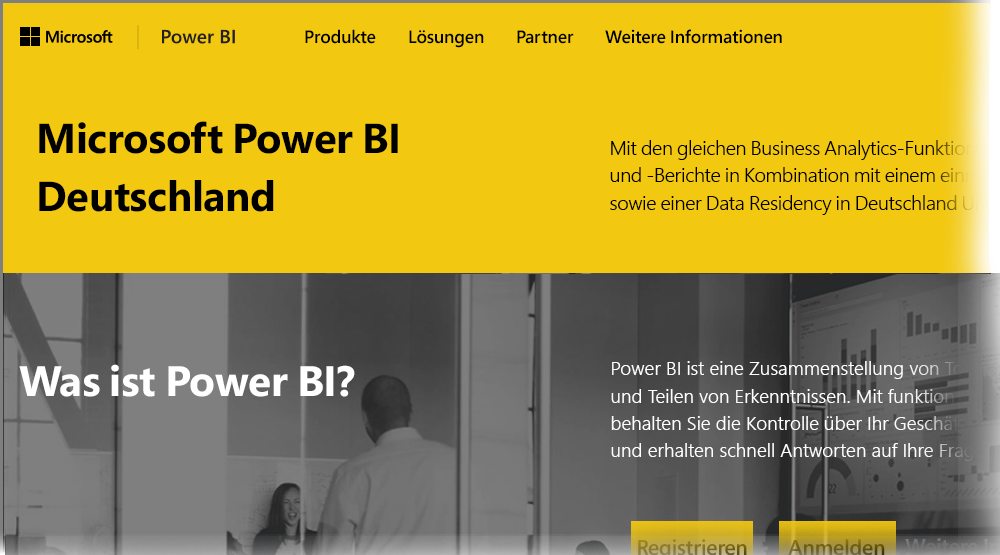

# Häufig gestellte Fragen zu Power BI für Kunden der Microsoft Cloud Deutschland
Der **Power BI-Dienst** verfügt über eine Version für Kunden in der Europäischen Union/Europäischen Freihandelszone (EU/EFTA), die häufig auch als Microsoft Cloud Deutschland (MCD) bezeichnet wird. Die in diesem Artikel vorgestellte Version des **Power BI-Diensts** ist speziell für Kunden in der EU/EFTA konzipiert. Es handelt sich hierbei um ein eigenes, von der kommerziellen Version des **Power BI-Diensts** und von den Power BI-Diensten für Kunden in Behörden abweichendes Produkt.

## Fragen und Antworten

Die folgenden Fragen und Antworten bieten wichtige Informationen für den Power BI Pro-Dienst in der Microsoft Cloud Deutschland (MCD), also der Cloud des Power BI-Diensts, die speziell für Kunden in der EU/EFTA bereitgestellt wird.

1. **Was ist der Power BI-Dienst für die Microsoft Cloud Deutschland?**
   
   Der Power BI-Dienst für Kunden in der EU/EFTA, auch als Microsoft Cloud Deutschland (MCD) bezeichnet, ist eine mit Bestimmungen der EU/EFTA konforme Cloud, wobei der Power BI-Dienst über deutsche Datencenter bereitgestellt wird. Alle ruhenden Kundendaten im Power BI-Dienst für die EU/EFTA-Cloud sind in Deutschland gespeichert. Dabei fungiert T-Systems als unabhängiger deutscher Datentreuhänder, und der physische und logische Zugriff auf die Daten unterliegt deutschem Recht. Der Power BI-Dienst für die EU/EFTA-Cloud erfordert ein anderes Konto als die kommerzielle Version des Power BI-Diensts. Weitere Informationen über Microsoft Cloud Deutschland finden Sie [hier](https://www.microsoft.com/trustcenter/cloudservices/nationalcloud).
2. **Wo finde ich Preis- und Anmeldeinformationen für Power BI in der Microsoft Cloud Deutschland?**
   
   Auf der [Homepage von Microsoft Power BI Deutschland](https://powerbi.microsoft.com/power-bi-germany/) finden Sie viele Informationen, einschließlich Informationen zu den Preisen. Auf dieser Seite finden Sie auch einen Link zur Registrierung für eine 30-Tage-Testversion des **Power BI Pro-Diensts** mit 25 Benutzerlizenzen. Bei der Registrierung für die Testversion haben Sie die Möglichkeit, nach Bedarf zusätzliche Lizenzen zu kaufen oder hinzuzufügen. Wir bieten auch EA-Preise (Enterprise Agreement), Behördenpreise und Preise für gemeinnützige Organisationen. Weitere Informationen erhalten Sie von Ihrem Microsoft-Kundenbetreuer.
3. **Ich habe einen Microsoft Cloud Deutschland-Mandanten im Rahmen von Azure Deutschland- und/oder Office 365 Deutschland-Abonnements. Kann ich mich mit einem vorhandenen Mandanten bei Power BI Deutschland registrieren?**
   
   Ja. Sie können sich bei der Registrierung mit dem Administratorkonto eines vorhandenen Microsoft Cloud Deutschland-Mandanten anmelden und dem vorhandenen Mandanten in der Microsoft Cloud Deutschland die Lizenzen für den Power BI Pro-Dienst hinzufügen. Bitte beachten Sie, dass Microsoft Cloud Deutschland-Mandanten und -Benutzerkonten sich von den Mandanten und Benutzerkonten des Power BI-Diensts für die Microsoft Cloud Deutschland unterscheiden.
4. **Gibt es einen kostenlosen Dienst im Power BI-Dienst für die Microsoft Cloud Deutschland?**
   
   Nein. Wir bieten im Power BI-Dienst für die Microsoft Cloud Deutschland keine kostenlosen Lizenzversionen. Wir empfehlen Ihnen jedoch, sich für [Power BI Free in unserer öffentlichen Cloud](https://powerbi.microsoft.com/get-started/) zu registrieren, wenn sich Ihre geschäftlichen Anforderungen mit Power BI Free erfüllen lassen.
5. **Kann ich mit dem Power BI-Dienst für die Microsoft Cloud Deutschland Power BI Desktop, Power BI Mobile, lokales Datengateway und Publisher für Excel verwenden?**
   
   Ja. Wir haben unsere Power BI-Clientprodukte für die nahtlose Integration in den Power BI-Dienst für die Microsoft Cloud Deutschland aktualisiert. Melden Sie sich mit Ihrem Konto des Power BI-Diensts für die Microsoft Cloud Deutschland an, um die gleichen Clientprodukte mit dem Power BI-Dienst für die Microsoft Cloud Deutschland zu verwenden. Sie können die neueste Version der Clientprodukte auf den folgenden Webseiten herunterladen:
   
   * [Power BI Desktop](https://powerbi.microsoft.com/desktop/)
   * [Power BI – Mobilgeräte](https://powerbi.microsoft.com/mobile/)
   * [Lokales Datengateway](https://powerbi.microsoft.com/gateway/)
   * [Power BI Publisher für Excel](https://powerbi.microsoft.com/excel-dashboard-publisher/)
6. **Gibt es Einschränkungen der Features des Power BI-Diensts für die Microsoft Cloud Deutschland?**
   
   Die folgenden Dienstfeatures sind im Power BI-Dienst für die Microsoft Cloud Deutschland derzeit nicht verfügbar:
   
   * Webveröffentlichung
   * ArcGIS Maps von Esri
   * Power BI Embedded (getrennt getaktete ISV-Lizenzen, wird in der Zukunft über [Microsoft Azure Deutschland](https://azure.microsoft.com/overview/clouds/germany/) angeboten)
7. **Wo finde ich Informationen zum Konfigurieren des Power BI-Diensts für die Microsoft Cloud Deutschland zur Verwendung und Integration in meinen Anwendungen?**
   
   Wir haben unsere [SaaS-Einbettungsbeispiele für Entwickler](https://github.com/Microsoft/PowerBI-Developer-Samples) mit Konfigurationsinformationen für die Microsoft Cloud Deutschland und andere spezielle Power BI-Clouds aktualisiert. Beachten Sie in den Beispielen für cloudspezifische Konfigurationsendpunkte den Ordner **CloudConfigs**. In der folgenden Tabelle werden verschiedene Konfigurationsendpunkte für den Power BI-Dienst für die Microsoft Cloud Deutschland (und zum Vergleich die öffentliche Cloud) aufgeführt.

| **Endpunktname und/oder -verwendung** | **URL des Power BI-Diensts für die Microsoft Cloud Deutschland** | **Entsprechende URL in der öffentlichen Cloud (zum Vergleich)** |
| --- | --- | --- |
| Startseite, Registrieren und Anmeldung |[https://powerbi.microsoft.com/power-bi-germany/](https://powerbi.microsoft.com/power-bi-germany/) |[https://powerbi.microsoft.com/](https://powerbi.microsoft.com/) |
| Direktes Anmelden beim Power BI-Dienst |[https://app.powerbi.de/?noSignUpCheck=1](https://app.powerbi.de/?noSignUpCheck=1) |[https://app.powerbi.com/?noSignUpCheck=1](https://app.powerbi.com/?noSignUpCheck=1) |
| Dienst-API |[https://api.powerbi.de/](https://api.powerbi.de/) |[https://api.powerbi.com/](https://api.powerbi.com/) |
| Office-Portal für die Benutzerlizenzverwaltung, Dienstintegritätsstatus und Supportanforderungen von Administratoren |[https://portal.office.de/](https://portal.office.de/) |[https://portal.office.com/](https://portal.office.com/) |
| URI der AAD-Autorität |[https://login.microsoftonline.de/common/oauth2/authorize/](https://login.microsoftonline.de/common/oauth2/authorize/) |[https://login.microsoftonline.com/common/oauth2/authorize/](https://login.microsoftonline.com/common/oauth2/authorize/) |
| URI für Power BI-Dienstressourcen |[https://analysis.cloudapi.de/powerbi/api](https://analysis.cloudapi.de/powerbi/api) |[https://analysis.windows.net/powerbi/api](https://analysis.windows.net/powerbi/api) |
| Bibliothek benutzerdefinierter Visuals |[https://app.powerbi.de/visuals/](https://app.powerbi.de/visuals/) |[https://app.powerbi.com/visuals/](https://app.powerbi.com/visuals/) |
| Registrieren einer Anwendung für Power BI (für Embedded) |[https://app.powerbi.de/apps](https://app.powerbi.de/apps) |[https://app.powerbi.com/apps](https://app.powerbi.com/apps) |
| Azure-Portal (für Embedded) |[https://portal.microsoftazure.de/](https://portal.microsoftazure.de/) |[https://portal.azure.com/](https://portal.azure.com/) |
| Community |[https://community.powerbi.com/](https://community.powerbi.com/) |[https://community.powerbi.com/](https://community.powerbi.com/) |

## Nächste Schritte
Mit Power BI können Sie viele verschiedene Aufgaben ausführen. Weitere Informationen und Anweisungen sowie einen Artikel zur Registrierung für den Dienst finden Sie in den folgenden Ressourcen:

* [Geführtes Lernen zu Power BI](guided-learning/gettingstarted.yml?tutorial-step=1)
* [Erste Schritte mit Power BI](service-get-started.md)
* [Was ist Power BI Desktop?](desktop-what-is-desktop.md)

