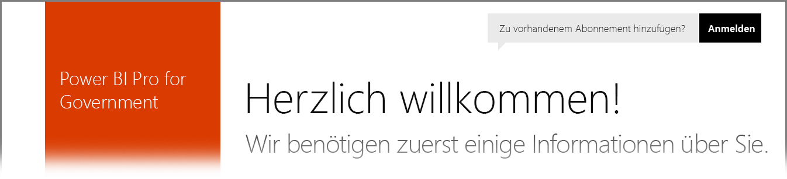

# Power BI für Angehörige von US-Behörden
Für den **Power BI-Dienst** ist im Rahmen von **Office 365 US Government Community**-Abonnements eine Version für Kunden verfügbar, die Angehörige von US-Behörden sind. Die in diesem Artikel vorgestellte Version des **Power BI-Diensts** ist speziell für Angehörige von US-Behörden konzipiert. Es handelt sich hierbei um ein separates und von der kommerziellen Version des **Power BI-Diensts** abweichendes Produkt.

In den folgenden Abschnitten werden die *Funktionen* beschrieben, die für die Version des **Power BI-Diensts** für US-Behörden verfügbar sind. Außerdem werden einige *Einschränkungen* erläutert, häufig gestellte Fragen (**FAQ**) und Antworten behandelt (u.a. zur Registrierung) und Links für weitere Informationen aufgeführt.

## Features von Power BI US Government
Es muss beachtet werden, dass **Power BI US Government** nur als **Pro-Lizenz** und nicht als Free-Lizenz verfügbar ist. Bestimmte Features des Power BI-Diensts stehen in der Version **Power BI US Government** des Diensts zur Verfügung.

Die folgenden Funktionen stehen Kunden von **Power BI US Government** zur Verfügung, gemäß der in der **Pro**-Lizenz beschriebenen Funktionalität:

* Erstellen und Anzeigen von Dashboards und Berichten
* [Beschränkung der Datenkapazität](service-admin-manage-your-data-storage-in-power-bi.md)
* [Geplante Datenaktualisierung](refresh-data.md)
* Aktualisierbare Teamdashboards
* Active Directory-Gruppen für Freigaben und die Verwaltung der Zugriffskontrolle
* [Importieren von Daten](service-get-data.md) und Berichten aus Excel-, CSV- und Power BI Desktop-Dateien
* Datenverwaltungsgateway
* Verschlüsselung sämtlicher Daten in SQL Azure und Blob Storage für Power BI
* Herstellen einer Dienstverbindung mit [Inhaltspaketen](service-connect-to-services.md)

## Konnektivität zwischen Azure Government Cloud-Diensten und öffentlichen Azure Cloud Services 

Azure ist auf mehrere Clouds verteilt. Standardmäßig dürfen Mandanten Firewallregeln für eine cloudspezifische Instanz öffnen. Für cloudübergreifende Netzwerke müssen jedoch bestimmte Firewallregeln geöffnet werden, damit zwischen Diensten kommuniziert werden kann. Wenn Sie ein Power BI-Kunde sind und über SQL-Instanzen in der öffentlichen Cloud verfügen, für die Sie Zugriff benötigen, müssen Sie in SQL für die folgenden Datencenter bestimmte Firewallregeln für den Azure Government Cloud-IP-Adressbereich öffnen:

* USGov Iowa
* USGov Virginia
* USGov Texas
* USGov Arizona

In der öffentlichen Cloud sind die IP-Adressbereiche verfügbar, für die Government Cloud müssen Sie jedoch ein Azure-Supportticket öffnen, um die IP-Adressbereiche für die oben aufgeführten Datencenter anzufordern. 

## Einschränkungen von Power BI US Government
Einige Funktionen, die in der kommerziellen Version des **Power BI-Diensts** verfügbar sind, stehen im **Power BI-Dienst** für Angehörige von US-Behörden *nicht* zur Verfügung. Das Power BI-Team arbeitet derzeit daran, diese Funktionen auch für Kunden bei US-Behörden zur Verfügung zu stellen. Dieser Artikel wird aktualisiert, sobald diese Funktionen verfügbar sind.

* **Einbetten in SharePoint Online**: Mit dem Power BI-Webpart können keine Inhalte in SharePoint Online eingebettet werden.
* **Power BI US Government** ist nur als **Pro**-Lizenz verfügbar. Alle Verweise auf Power BI (Free)-Lizenzen im Administratorportal (oder als Benutzer) beziehen sich auf die Ausführung in einer kommerziellen Power BI-Dienstcloud.
* **Überwachung:** Die Überwachung ist über das Office 365 Security & Compliance Center ab dem 1. Juni 2018 nicht mehr verfügbar.
* **Power BI-Inhalte in Cortana:** Power BI-Ergebnisse werden in den Cortana-Suchergebnissen nicht angezeigt. Hierzu zählen auch Ergebnisse für Power BI-Inhalte (Dashboards, Berichte, Apps) sowie Ergebnisse, in denen für bestimmte Schlüsselwörter für Cortana optimierte Berichtsseiten angezeigt werden.
* **Freigabe für externe Benutzer:** Die Freigabe ist innerhalb eines Power BI-Mandanten zulässig, und ab Juni 2018 ist die keine Freigabe auch für Benutzer außerhalb Ihres Power BI-Mandanten möglich. Weitere Informationen finden Sie unter [Verteilen von Power BI-Inhalten an externe Gastbenutzer mit Azure AD B2B](service-admin-azure-ad-b2b.md).
* **Nutzungsmetriken für Dashboards und Berichte**: Nutzungsmetriken sind für Berichte und Dashboards nicht verfügbar. Kunden können Überwachungsprotokolldaten verwenden, um Nutzungsinformationen für Inhalte in Ihrer Organisation abzurufen.

Wenn Ihrem Konto **Power BI**-Free-Lizenzen zugewiesen sind, wird dieses Konto in einer kommerziellen Version des **Power BI**-Diensts ausgeführt und ist nicht Teil des Angebots **Power BI US Government**. Bei diesen Free-Konten können die folgenden Probleme auftreten:

* Authentifizieren von Gateway, Mobilgeräten und Desktops nicht möglich
* Kein Zugriff auf kommerzielle Azure-Datenquellen
* Manueller Upload von PBIX-Dateien aus der kommerziellen Version erforderlich
* Mobile Power BI-Apps nicht verfügbar

Um diese Probleme zu beheben, wenden Sie sich an den Ansprechpartner für Ihr Konto.

## Häufig gestellte Fragen (FAQ) für die Version des Power BI-Diensts für US-Behörden
Anhand der folgenden Fragen (und Antworten) finden Sie schnell die benötigten Informationen zum Dienst.

**Frage:** Wie migriere ich meine Daten aus dem kommerziellen **Power BI**-Dienst in den **Power BI-Dienst** für US-Behörden?

**Antwort:** Ihr Administrator muss eine neue Instanz von **Power BI** unter einem separaten, für US-Behörden spezifischen Abonnement erstellen. Sie können dann die Daten aus der kommerziellen Version im **Power BI-Dienst** für US-Behörden replizieren, die kommerzielle Lizenz entfernen und die vorhandene Domäne dem neuen, für US-Behörden spezifischen Dienst zuordnen.

**Frage:** Warum kann ich keine Verbindung mit einem bestimmten Inhaltspaket herstellen?

**Antwort:** Sie müssen sicherstellen, dass Ihr Abonnement aktiviert wurde, damit Sie eine Verbindung mit dem Inhaltspaket herstellen können.

**Frage:** Ich möchte **Power BI** für meine US-Behörde verwenden. Wie beginne ich?

**Antwort:** Die Registrierungsschritte (auch als *Onboarding* bezeichnet) unterscheiden sich je nach vorhandener Lizenz und Abonnement. Im Artikel zur [Registrierung bei Power BI US Government](service-govus-signup.md) finden Sie weitere Informationen.

**Frage:** Lautet die URL für die Verbindung mit **Power BI** für US-Behörden anders als die URL für die kommerzielle Version von **Power BI**?

**Antwort:** Ja, die URLs unterscheiden sich. Die folgende Tabelle enthält die verschiedenen URLs:

| URL der kommerziellen Version | URL der Version für US-Behörden |
| --- | --- |
| https://app.powerbi.com/ |[https://app.powerbigov.us](https://app.powerbigov.us) |

**Frage:** Mein Konto wird in mehreren Sovereign Clouds bereitgestellt. Wie wähle ich in **Power BI Desktop** aus, mit welcher Cloud eine Verbindung hergestellt werden soll?

**Antwort:** Ab dem **Power BI Desktop**-Release im Juli 2018 können Sie auswählen, welche Cloud Sie verwenden möchten, wenn Sie sich bei **Power BI Desktop** anmelden.

## Nächste Schritte
Mit Power BI können Sie viele verschiedene Aufgaben ausführen. Weitere Informationen und Anweisungen sowie einen Artikel zur Registrierung für den Dienst finden Sie in den folgenden Ressourcen:

* [Registrierung bei Power BI for US Government](service-govus-signup.md)
* <a href="https://channel9.msdn.com/Blogs/Azure/Cognitive-Services-HDInsight-and-Power-BI-on-Azure-Government">Demo zu Power BI US Government</a>
* [Geführtes Lernen zu Power BI](guided-learning/gettingstarted.yml?tutorial-step=1)
* [Erste Schritte mit Power BI](service-get-started.md)
* [Was ist Power BI Desktop?](desktop-what-is-desktop.md)

