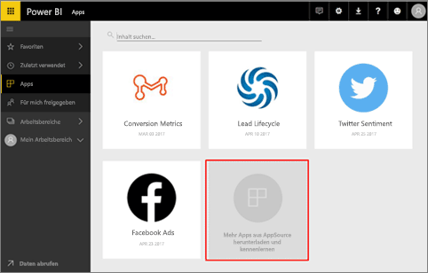
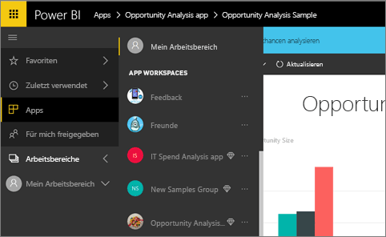
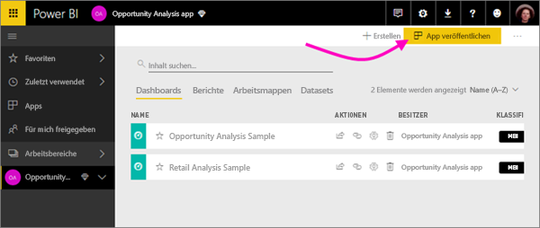
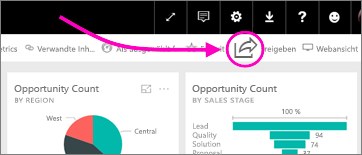
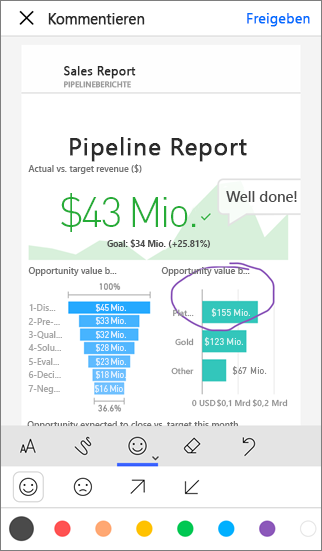

# Wie kann ich in Power BI mit anderen Personen zusammenarbeiten und Elemente freigeben?

Sie haben Dashboards und Berichte erstellt. Zusätzlich kann es sein, dass Sie gemeinsam mit Ihren Kollegen an diesen Dashboards und Berichten arbeiten. Dann möchten Sie, dass andere Benutzer Zugriff auf die Dashboards und Berichte haben. Was ist die beste Möglichkeit, um sie zu verteilen?

In diesem Artikel werden folgende Optionen für die Zusammenarbeit und die Freigabe in Power BI verglichen: 

* Zusammenarbeit mit Kollegen, um aussagekräftige Berichte und Dashboards in *App-Arbeitsbereichen* zu erstellen
* Bündeln dieser Dashboards und Berichte in *Apps* und Veröffentlichen der Apps für eine größere Gruppe oder die gesamte Organisation
* Freigeben von Dashboards oder Berichten für einige Personen, aus dem Dienst oder aus den mobilen Power BI-Apps
* Veröffentlichen im Web, sodass beliebige Benutzer sie anzeigen und mit ihnen interagieren können
* Drucken 

Unabhängig davon, welche Option Sie auswählen, benötigen Sie zum Freigeben eines Dashboards eine [Power BI Pro-Lizenz](service-free-vs-pro.md), oder es muss sich um Inhalte in einer [Premium-Kapazität](service-premium.md) handeln. Die Lizenzanforderungen für die Kollegen, die Ihre Dashboards anzeigen, variieren abhängig von der Option, die Sie auswählen. In den folgenden Abschnitten werden die Einzelheiten erläutert. 

*Apps im Power BI-Dienst*

## Zusammenarbeiten mit Kollegen, um eine App zu erstellen
Angenommen, Sie und Ihre Teamkollegen möchten Ihre Einblicke in Power BI für Ihre Organisation veröffentlichen. Die beste Möglichkeit hierzu ist das Erstellen einer *App*. Eine App ist eine Sammlung von Dashboards und Berichten, die erstellt wurden, um Schlüsselmetriken für Ihre Organisation bereitzustellen. 

Zum Erstellen einer App benötigen Sie einen *App-Arbeitsbereich*, dem Ihre Teamkollegen als Mitglieder angehören. Sie können sich den App-Arbeitsbereich als einen Ort vorstellen, an dem Sie gemeinsam mit Ihren Kollegen an Power BI-Dashboards und -Berichten arbeiten können. Alle Mitglieder können Berichte in Power BI Desktop erstellen und diese im App-Arbeitsbereich veröffentlichen, und alle Mitglieder benötigen Power BI Pro-Lizenzen.

**Wenn Sie für Kollegen lediglich ein fertig gestelltes Dashboard freigeben möchten, fügen Sie diese Kollegen nicht dem App-Arbeitsbereich hinzu.** Stattdessen [erstellen Sie das Dashboard in einem App-Arbeitsbereich](service-create-distribute-apps.md) und veröffentlichen die App für die Kollegen. 

## Veröffentlichen der App für viele Benutzer
Angenommen, Sie möchten Ihr Dashboard an eine größere Gruppe von Benutzern verteilen. Sie und Ihre Kollegen haben einen *App-Arbeitsbereich* erstellt und dann Dashboards, Berichte und Datasets im App-Arbeitsbereich erstellt und verfeinert. Jetzt wählen Sie die gewünschten Dashboards und Berichte aus und veröffentlichen sie als App – entweder für Mitglieder einer Sicherheitsgruppe oder Verteilerliste oder für die gesamte Organisation. 

Apps lassen sich im Power BI-Dienst ([https://powerbi.com](https://powerbi.com)) einfach finden und installieren. Sie können geschäftlichen Benutzern einen direkten Link zu der App senden, oder die Benutzer suchen sie in AppSource. Wenn der Power BI-Administrator Ihnen die entsprechenden Berechtigungen gewährt, können Sie eine App automatisch in den Power BI-Konten Ihrer Kollegen installieren lassen. Hier finden Sie [weitere Informationen zum Veröffentlichen von Apps](service-create-distribute-apps.md#publish-your-app). 

Nachdem die Benutzer eine App installiert haben, können sie diese in ihren Browsern oder mobilen Geräten anzeigen.

Damit die Benutzer Ihre App anzeigen können, müssen sie eine Power BI Pro-Lizenz haben, oder die App muss in einer Power BI-Premium-Kapazität gespeichert sein. Details finden Sie unter [Was ist Power BI Premium?](service-premium.md).

## Freigeben von Dashboards und Berichten
Angenommen, Sie haben ein Dashboard und einen Bericht in Ihrem eigenen Arbeitsbereich oder in einem App-Arbeitsbereich fertig gestellt, und Sie möchten einigen anderen Personen Zugriff auf das Dashboard gewähren. Dazu können Sie es *freigeben*. 

Zum Freigeben von Inhalten müssen diese in einer [Premium-Kapazität](service-premium.md) enthalten sein, oder Sie und die Empfänger der Inhalte benötigen eine Power BI Pro-Lizenz. Wenn Sie ein Dashboard oder einen Bericht freigeben, können sie das Dashboard anzeigen und mit ihm interagieren, es aber nicht bearbeiten. Sie sehen die gleichen Daten wie im Dashboard und in den Berichten, es sei denn, auf das zugrundeliegende Dataset ist die Sicherheit auf Zeilenebene (RLS) angewendet. Die Kollegen, für die Sie Inhalte freigeben, können diese für ihre Kollegen freigeben, wenn Sie dies zulassen. 

Sie können das Dashboard auch für Personen außerhalb Ihrer Organisation freigeben. Diese können das Dashboard anzeigen und auch damit interagieren, es jedoch nicht freigeben. 

Erfahren Sie mehr zum [Freigeben von Dashboards und Berichten](service-share-dashboards.md) im Power BI-Dienst. Sie können auch einen Filter zu einem Link hinzufügen und [eine gefilterte Ansicht Ihres Berichts freigeben](service-share-reports.md).

## Kommentieren und Freigeben in den mobilen Power BI-Apps
In den mobilen Power BI-Apps für iOS- und Android-Geräte können Sie Kacheln, Berichte und visuellen Elemente kommentieren und per E-Mail für andere Personen freigeben. 

Sie geben eine Momentaufnahme der Kacheln, Berichte oder visuellen Elemente frei, und diese werden für die Empfänger in dem Zustand angezeigt, in dem sie beim Versenden der E-Mail vorlagen. Die E-Mail enthält außerdem einen Link zum Dashboard oder Bericht. Wenn die Empfänger eine Power BI Pro-Lizenz haben oder wenn es sich um Inhalte in einer [Premium-Kapazität](service-premium.md) handelt, können die Empfänger das Objekt öffnen, sofern Sie das Objekt bereits für sie freigegeben haben. Sie können Momentaufnahmen von Kacheln an beliebige Empfänger senden – nicht nur an Kollegen in der gleichen E-Mail-Domäne.

Hier finden Sie weitere Informationen zum [Kommentieren und Freigeben von Kacheln, Berichten und visuellen Elementen](mobile-annotate-and-share-a-tile-from-the-mobile-apps.md) in den mobilen iOS- und Android-Apps.

Sie können auch eine [Momentaufnahme einer Kachel](mobile-share-tile-windows-10-phone-app.md) aus der Power BI-App für Windows 10-Geräte freigeben.

## Im Web veröffentlichen
Sie können Power BI-Berichte im Internet veröffentlichen, indem Sie interaktive Visualisierungen in Blogbeiträge, Websites, soziale Medien und andere Onlinekommunikationsmittel auf jedem Gerät einbetten. Jede Person im Internet kann Ihre Berichte aufrufen, und Sie haben keine Kontrolle darüber, wer die von Ihnen veröffentlichten Daten einsieht. Diese Personen benötigen keine Power BI-Lizenz. Die Veröffentlichung im Web ist nur für Berichte verfügbar, die Sie bearbeiten können. Sie können keine Berichte im Web veröffentlichen, wenn diese für Sie freigegeben wurden oder sich in einer App befinden. Weitere Informationen zum [Veröffentlichen im Web](service-publish-to-web.md).

## Ausdrucken oder als PDF (oder andere statische Datei) speichern
Sie können ein gesamtes Dashboard, eine Dashboardkachel, eine Berichtsseite oder eine Visualisierung im Power BI-Dienst drucken oder als PDF-Datei (oder in einem anderen statischen Dateiformat) speichern. Berichte können nur seitenweise gedruckt werden. Es ist nicht möglich, den ganzen Bericht auf einmal zu drucken. Weitere Informationen zum [Drucken und Speichern als statische Datei](service-print.md).

## Nächste Schritte
* Feedback? Anregungen nehmen wir auf der [Power BI-Communitywebsite](https://community.powerbi.com/) entgegen.
* [Freigeben von Dashboards für Kollegen und andere](service-share-dashboards.md)
* [Erstellen und Veröffentlichen einer App in Power BI](service-create-distribute-apps.md)
* Weitere Fragen? [Wenden Sie sich an die Power BI-Community](http://community.powerbi.com/).

