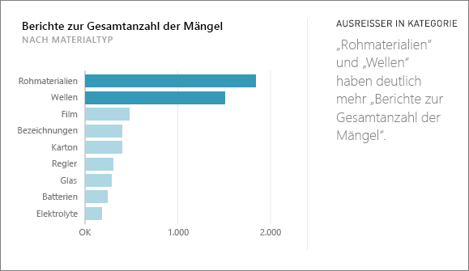
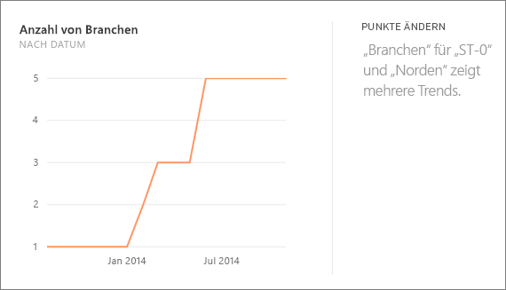
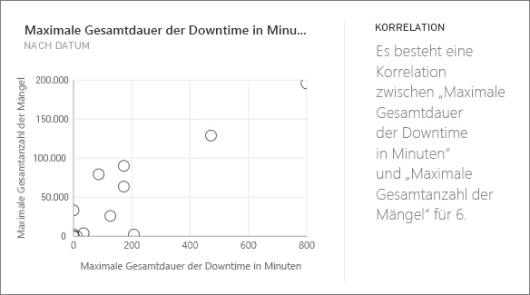
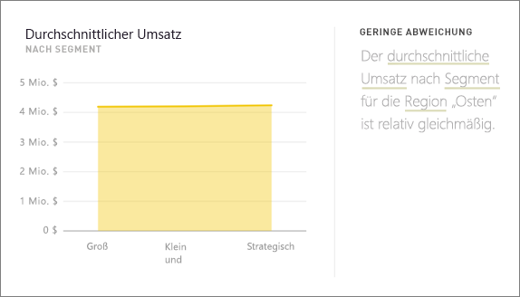
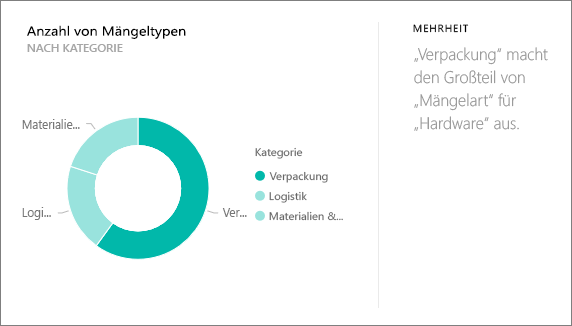
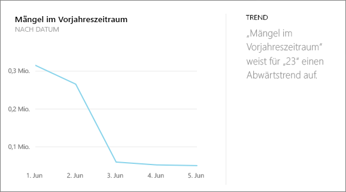
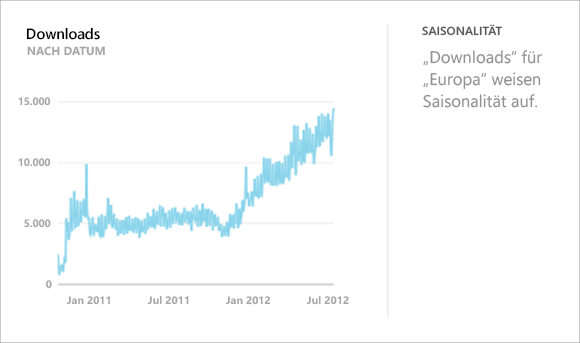
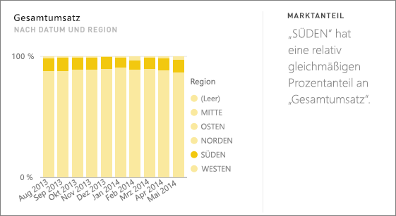
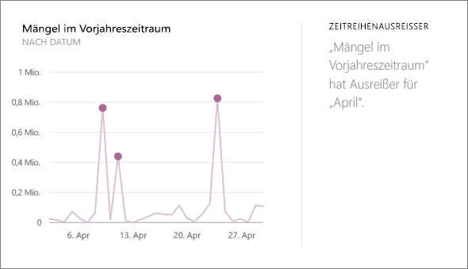

# Von Power BI unterstützte schnelle Einblicke
## Wie funktionieren schnelle Einblicke?
Power BI durchsucht schnell verschiedene Teilmengen des Datasets unter Verwendung eines hoch entwickelten Algorithmus, um potenziell interessante Einblicke zu gewinnen. Power BI untersucht in einer festgelegten Zeit möglichst große Mengen des Datasets.

Sie können schnelle Einblicke für ein Dataset oder eine Kachel ausführen (Verwandte Einblicke).   

## Nach welchen Typen von schnellen Einblicken kann gesucht werden?
Im Folgenden finden Sie einige der verwendeten Algorithmen:

## Kategorieausreißer (oben/unten)
Hebt die Fälle hervor, in denen für eine Messung im Modell ein oder zwei Elemente einer Dimension wesentlich größere Werte als andere Elemente der Dimension haben.  

## Änderungspunkte in einer Zeitreihe
Hebt hervor, wenn es signifikante Trendänderungen in einer Zeitreihe von Daten gibt.

## Korrelation
Erkennt Fälle, in denen mehrere Messungen eine Korrelation zwischen diesen Messungen zeigen, wenn diese an einer Dimension im Dataset dargestellt werden.

## Geringe Abweichung
Erkennt Fälle, in denen Datenpunkte nicht stark vom Mittelwert abweichen.

## Mehrheit (Hauptfaktoren)
Sucht nach Fällen, in denen eine Mehrheit eines Gesamtwerts beim Aufschlüsseln in eine andere Dimension einem einzelnen Faktor zugeordnet werden kann.  

## Allgemeine Trends in Zeitreihen
Entdeckt Trends nach oben oder unten in Zeitreihendaten.

## Saisonabhängigkeit in Zeitreihen
Sucht periodische Muster in Zeitreihendaten, z. B. wöchentliche, monatliche oder jährliche Saisonabhängigkeit.

## Stetiger Anteil
Hebt Fälle hervor, in denen eine Beziehung von übergeordneten und untergeordneten Elementen zwischen dem Anteil eines untergeordneten Werts in Bezug auf den Gesamtwert des übergeordneten Elements für eine kontinuierliche Variable vorhanden ist.

## Zeitreihenausreißer
Erkennt in Daten auf einer Zeitreihe, wenn bestimmte Datums- oder Zeitangaben mit sich deutlich von den übrigen Daten unterscheidenden Werten vorliegen.

## Nächste Schritte
[Schnelle Einblicke in Power BI](service-insights.md)

Wenn Sie ein Dataset besitzen, können Sie es [für Schnelleinblicke optimieren](service-insights-optimize.md).

Weitere Fragen? [Wenden Sie sich an die Power BI-Community](http://community.powerbi.com/)

