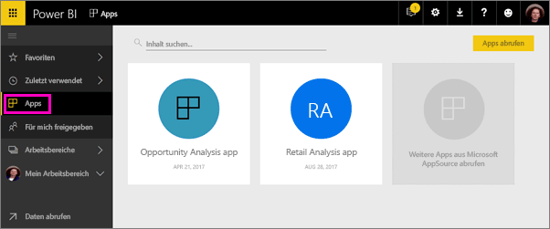
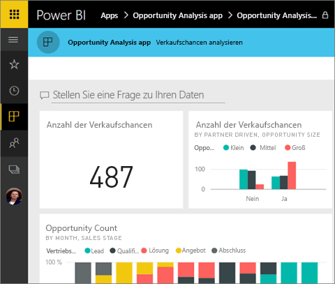
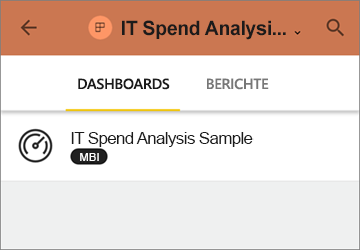
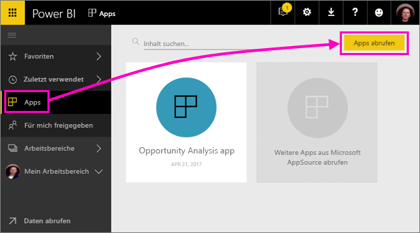
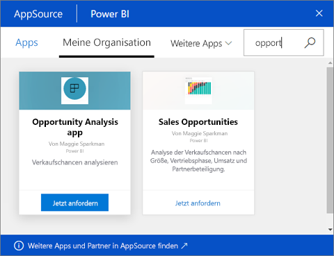
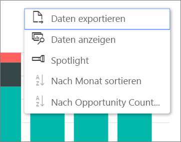

# Installieren und Verwenden von Apps mit Dashboards und Berichten in Power BI
In Power BI lassen sich zusammengehörige Dashboards und Berichte zu *Apps* zusammenfassen. Personen in Ihrer Organisation können Apps mit wichtigen Geschäftsinformationen erstellen und verteilen. [Externe Dienste](service-connect-to-services.md), die Sie u.U. bereits verwenden (wie Google Analytics und Microsoft Dynamics CRM), bieten ebenfalls Power BI-Apps. 

Apps lassen sich im Power BI-Dienst ([https://powerbi.com](https://powerbi.com)) und auf Ihrem Mobilgerät einfach finden und installieren. Nach dem Installieren einer App müssen Sie sich nicht mehr die Namen der vielen verschiedenen Dashboards merken, da sie alle zusammen in der App im Browser oder auf dem Mobilgerät versammelt sind.

In Apps sehen Sie bei jeder Veröffentlichung von Updates durch den Ersteller die Änderungen. Der Ersteller steuert außerdem die Häufigkeit der planmäßigen Datenaktualisierung. Sie müssen sich also nicht darum kümmern, auf dem aktuellen Stand zu bleiben. 

Planen Sie das Erstellen einer App? Weitere Informationen finden Sie unter [Erstellen und Veröffentlichen von Apps in Power BI](service-create-distribute-apps.md).

## Erhalten einer neuen App
Sie können Apps auf unterschiedliche Weise erhalten. Der Ersteller der App kann die App automatisch in Ihrem Power BI-Konto installieren lassen oder Ihnen einen direkten Link zur App senden, oder Sie können die App in AppSource suchen. Dort werden alle Apps angezeigt, auf die Sie Zugriff haben. In Power BI auf Ihrem Mobilgerät können Sie sie nur über einen Direktlink und nicht aus AppSource installieren. Wenn der Ersteller der App diese automatisch installieren lässt, wird sie in der Liste der Apps angezeigt.

### Installieren einer App über einen direkten Link
Die einfachste Möglichkeit, eine neue App selbst zu installieren, ist das Empfangen eines direkten Links vom Ersteller der App. Power BI erstellt einen Link für die Installation, den Ihnen der Ersteller senden kann.

**Auf Ihrem Computer** 

Wenn Sie auf den Link in der E-Mail klicken, wird der Power BI-Dienst ([https://powerbi.com](https://powerbi.com)) in einem Browser geöffnet. Sie bestätigen, dass Sie die App installieren möchten, und die Landing Page der App wird geöffnet.

**Auf Ihrem iOS- oder Android-Mobilgerät** 

Wenn Sie auf Ihrem Mobilgerät auf den Link in der E-Mail klicken, wird die App automatisch installiert, und die Inhaltsliste der App wird geöffnet. 

### Abrufen der App von Microsoft AppSource
Sie können auch in Microsoft AppSource Apps suchen und installieren, auf die Sie Zugriff haben. 

1. Wählen Sie **Apps**  > **Apps abrufen** aus. 
   
     
2. Sie können in AppSource unter **Meine Organisation** suchen, um die Ergebnisse einzugrenzen und die gewünschte App zu finden.
   
     
3. Wählen Sie **Jetzt anfordern** aus, um sie der Seite „Apps“ hinzuzufügen. 

## Interagieren mit Dashboards und Berichten in der App
Jetzt können Sie in der App die Daten in den Dashboards und Berichten untersuchen. Sie haben Zugriff auf alle standardmäßigen Power BI-Interaktionen wie Filtern, Hervorheben, Sortieren und Durchführen von Drilldowns. Informieren Sie sich über das [Interagieren mit Berichten in Power BI](service-reading-view-and-editing-view.md). 

Sie können vorgenommene Änderungen nicht speichern. Sie können jedoch jederzeit aus einer Tabelle oder einem sonstigen Visual in einem Bericht die [Daten in Excel exportieren](power-bi-visualization-export-data.md).

## Nächste Schritte
* [Erstellen und Veröffentlichen von Apps in Power BI](service-create-distribute-apps.md)
* [Power BI-Apps für externe Dienste](service-connect-to-services.md)
* Haben Sie Fragen? [Stellen Sie Ihre Frage in der Power BI-Community.](http://community.powerbi.com/)

